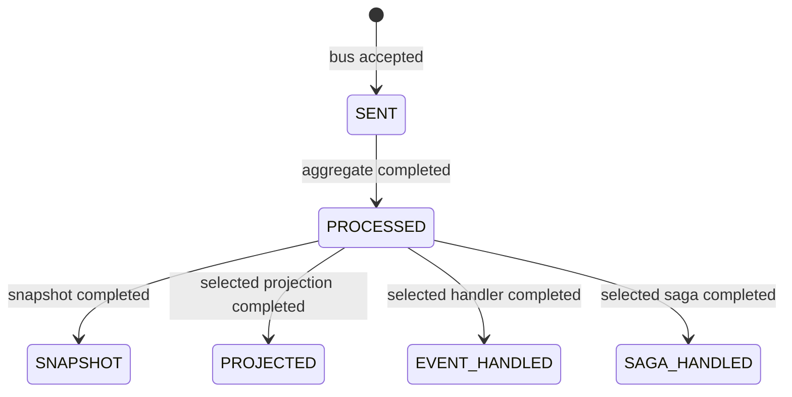

# HTTP 200 but the Query Is Empty: Stop Sleeping and Model Completion


In an asynchronous system, the important question is not whether an endpoint returned, but what the system promises at that moment.

An order command can return HTTP 200 while the details query still returns 404. Adding `sleep(1000)` treats a contract problem as a timing problem: command acceptance, aggregate processing, snapshot persistence, and projection completion are different facts.

## What Does HTTP 200 Mean?

Wow WebFlux extracts a wait plan and calls `CommandGateway.sendAndWait`; the requested stage therefore defines response completion.

| Stage | What it proves | What it does not prove | Typical use |
| --- | --- | --- | --- |
| `SENT` | the command bus accepted the command | aggregate processing | asynchronous acceptance |
| `PROCESSED` | the aggregate handled the command and stored its events | query-model update | domain operation completed |
| `SNAPSHOT` | snapshot processing completed | another projection updated; `version_offset` may skip a write | current-state reads with `strategy: all` |
| `PROJECTED` | the selected projection function completed | every projection completed | immediate read-after-write |
| `EVENT_HANDLED` | the selected event handler completed | every external side effect completed | one required handler boundary |
| `SAGA_HANDLED` | the selected saga handled the source event and accepted/sent its command | downstream aggregate completion or ACID commit | orchestration acceptance |

Sources: [`CommandStage`](https://github.com/Ahoo-Wang/Wow/blob/main/wow-core/src/main/kotlin/me/ahoo/wow/command/wait/CommandStage.kt), [`CommandHandler`](https://github.com/Ahoo-Wang/Wow/blob/main/wow-webflux/src/main/kotlin/me/ahoo/wow/webflux/route/command/CommandHandler.kt).

## Completion Branches After Aggregate Processing



The stages after `PROCESSED` are branches, not one mandatory linear pipeline. Wait only for the narrowest stage that proves the caller's business goal.

## Why a Fixed Delay Is Wrong


A fixed delay has two failure modes:

- when processing takes 100 ms, the remaining 900 ms is wasted;
- when processing takes longer than one second, the query is still stale.

An explicit wait target follows actual completion and can identify a specific projection, handler, or saga through `contextName`, `processorName`, and `functionName`.

```kotlin
val waitPlan = CommandWait.projected(
    waitCommandId = command.commandId,
    contextName = "order",
    processorName = "OrderProjector",
)

gateway.sendAndWait(command, waitPlan)
```

## Choose the Contract by Product Need

| Product need | Wait for | Avoid claiming |
| --- | --- | --- |
| accept work quickly | `SENT` | business rules already ran |
| confirm the domain decision | `PROCESSED` | the read model is current |
| return a queryable state snapshot | `SNAPSHOT` with `strategy: all` | unrelated projections completed |
| open a page that uses one projection | targeted `PROJECTED` | every consumer completed |
| require one saga step to accept output | targeted `SAGA_HANDLED` | the full distributed workflow committed |

Stronger waits couple endpoint latency and availability to more downstream work. They are not automatically better.

## Timeout and Retry

A timeout means the caller did not observe the target before its deadline. It does not prove that the command failed or was never processed.

Before retrying:

1. retain the same logical `requestId`;
2. query the authoritative state or command result when available;
3. inspect the last observed stage;
4. do not issue a new request ID merely because the caller timed out.

## Practical Completion Gate

- every write endpoint documents its wait stage and timeout;
- any function-targeted wait identifies the exact processor/function;
- the timeout path retains idempotency and returns an "outcome unknown" contract;
- application tests prove both normal completion and delayed/failed downstream processing;
- product flows wait only for the result they actually consume.

Continue with [Command Gateway](../guide/command-gateway.md), [Testing Wow Applications](../guide/application-testing.md), and [Troubleshooting](../guide/troubleshooting.md).
