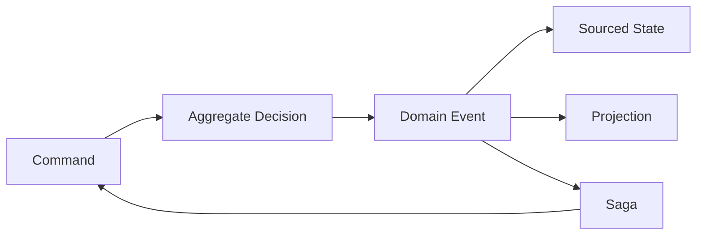

# Traditional CRUD vs Wow: From Shipping Endpoints to Shipping a Domain Model

A traditional order feature often requires a controller, DTOs, service, repository, SQL, transactions, event publication, retries, compensation, and integration-test setup. The business rule may be small while its surrounding glue keeps growing.

Wow moves reusable command, event-sourcing, projection, saga, and testing infrastructure into the framework so the application can organize work around business decisions.

## The Difference in One Table

| Dimension | Common CRUD layering | Wow |
| --- | --- | --- |
| Starting point | controller and service | aggregate, command, and invariant |
| API | handwritten route and DTO mapping | metadata-driven command/query routes |
| State change | update current rows | produce immutable domain events |
| Persistence | business code calls repositories/SQL | EventStore persists facts and sourcing rebuilds state |
| Read model | manually synchronized tables/indexes | projections and snapshot queries |
| Cross-aggregate flow | nested service calls | domain events and sagas |
| Domain tests | application context and database setup | `AggregateSpec` / `SagaSpec` |

This comparison describes a common CRUD style, not every traditional system. Architecture should still follow domain complexity and team constraints.

## Model as a Service

The model becomes the source of several capabilities:

- aggregate entry point and invariant boundary;
- generated command routes and OpenAPI metadata;
- event history and state reconstruction;
- projection and saga inputs;
- executable Given → When → Expect specifications.

The application still owns domain boundaries, event contracts, idempotency, authorization, and operations. Wow removes repeated infrastructure; it does not remove business decisions.

## Example: Cart Behavior

The repository's [`Cart`](https://github.com/Ahoo-Wang/Wow/blob/main/example/example-domain/src/main/kotlin/me/ahoo/wow/example/domain/cart/Cart.kt) handles `AddCartItem` by returning either `CartItemAdded` or `CartQuantityChanged`. It never edits the database directly.

[`CartState`](https://github.com/Ahoo-Wang/Wow/blob/main/example/example-domain/src/main/kotlin/me/ahoo/wow/example/domain/cart/CartState.kt) applies those events through sourcing functions. [`CartSaga`](https://github.com/Ahoo-Wang/Wow/blob/main/example/example-domain/src/main/kotlin/me/ahoo/wow/example/domain/cart/CartSaga.kt) reacts to `OrderCreated` and removes purchased products from the cart.

This keeps each concern explicit:

| Concern | Owner |
| --- | --- |
| accept/reject a command | command aggregate |
| change aggregate state | sourcing function |
| maintain a query model | projection |
| send another aggregate command | saga |
| recover failed asynchronous work | retry/compensation policy |

## Where Development Cost Drops

| Repeated cost | Wow mechanism |
| --- | --- |
| route/controller boilerplate | generated WebFlux/OpenAPI routes |
| state mutation and audit tables | domain events and EventStore |
| ad-hoc read-after-write sleep | explicit wait stages |
| repeated query synchronization | snapshots and projections |
| broad integration setup for every rule | aggregate and saga specifications |

The gain is largest when a domain has meaningful invariants, state history, several read models, or cross-aggregate workflows. For a simple CRUD resource with no valuable history or business rules, a conventional transaction may remain the better choice.

## What Wow Does Not Give Automatically

- correct aggregate boundaries;
- unlimited scalability;
- exactly-once external side effects;
- authentication and command authorization;
- production capacity, backup, recovery, or compliance evidence.

Those remain application responsibilities and are why [Production Best Practices](../guide/best-practices.md), [Application Testing](../guide/application-testing.md), and [Backup, Restore, and Replay](../guide/recovery.md) are part of the adoption path.

## A Practical Adoption Sequence

1. model one business decision as command → event → state;
2. prove it with `AggregateSpec`;
3. expose one real HTTP command and read the sourced state;
4. add a projection or saga only for an actual requirement;
5. replace in-memory adapters one boundary at a time;
6. prove restart, redelivery, authorization, and recovery before production.

Continue with the [Kotlin Order and Cart](../reference/example/order.md) walkthrough for the complete repository-backed example.
