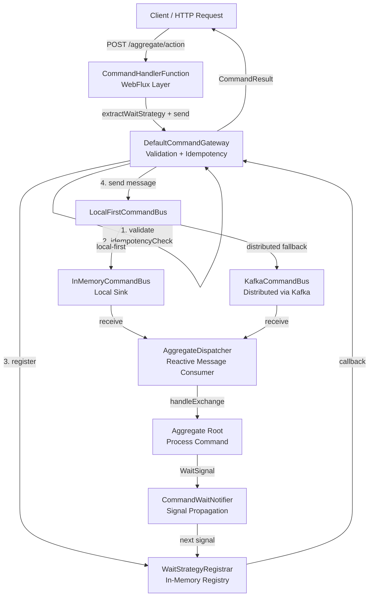
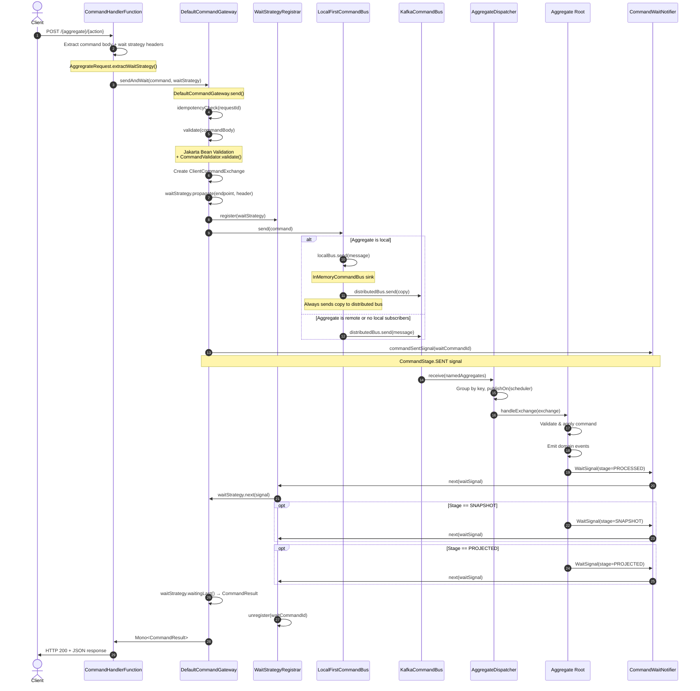
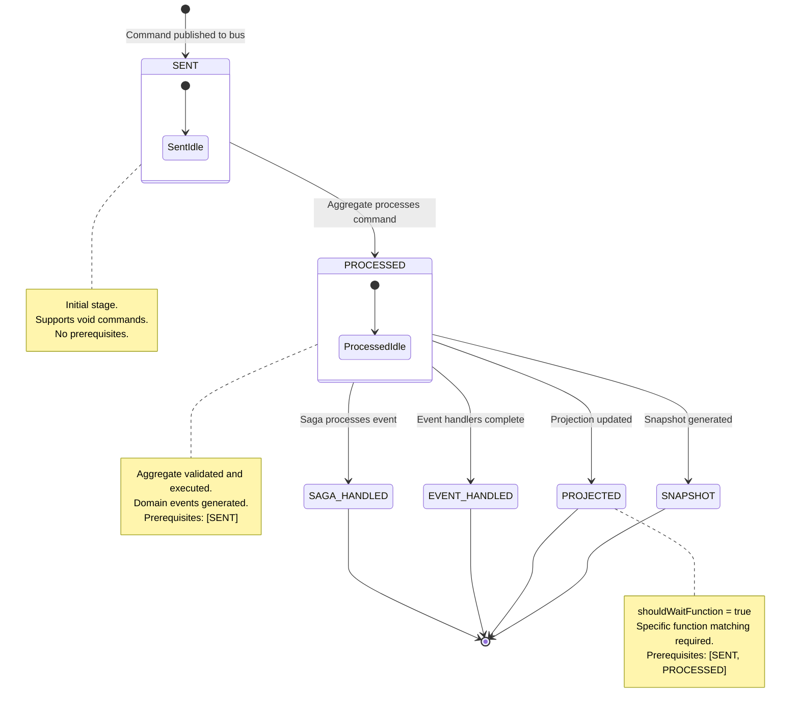
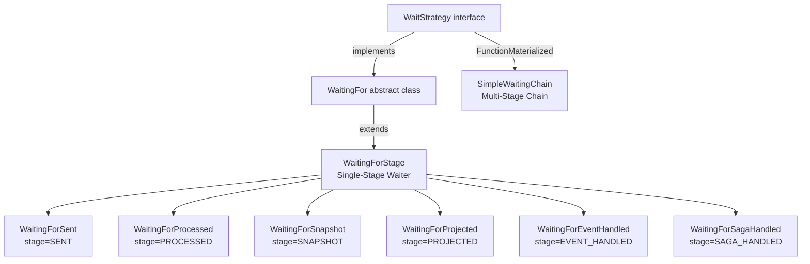

# Command Bus & Gateway

## Overview

The Command Bus and Command Gateway form the write-side backbone of the Wow CQRS architecture. Together they handle the complete lifecycle of a command: from arrival at the HTTP endpoint, through validation and idempotency checks, across the message bus to the target aggregate, and back to the caller with a processing result.

The flow can be summarized in five stages:

1. **Ingress** -- A `CommandHandlerFunction` in the WebFlux layer extracts the command body from an HTTP request and constructs a `CommandMessage`.
2. **Validation & Idempotency** -- The `DefaultCommandGateway` validates the command body via Jakarta Bean Validation and checks request-id uniqueness.
3. **Routing** -- The command is dispatched to a `CommandBus` (in-memory, local-first, or Kafka) which delivers it to the correct `AggregateDispatcher`.
4. **Processing** -- The aggregate root processes the command, emits domain events, and publishes a completion `WaitSignal`.
5. **Response** -- The `WaitStrategy` collects signals at the configured stage and returns a `CommandResult` to the caller.

::: tip Related Guide
For practical API usage examples (curl requests, convenience methods), see the [Command Gateway Guide](../../guide/command-gateway.md).
:::

## At-a-Glance

| Component | Responsibility | Key File | Source |
|---|---|---|---|
| `CommandMessage` | Encapsulates command body, aggregate ID, version, idempotency metadata | `wow-api/.../command/CommandMessage.kt` | [Source](https://github.com/Ahoo-Wang/Wow/blob/main/wow-api/src/main/kotlin/me/ahoo/wow/api/command/CommandMessage.kt#L53) |
| `CommandGateway` | High-level send API with validation, idempotency, wait strategies | `wow-core/.../command/CommandGateway.kt` | [Source](https://github.com/Ahoo-Wang/Wow/blob/main/wow-core/src/main/kotlin/me/ahoo/wow/command/CommandGateway.kt#L75) |
| `DefaultCommandGateway` | Concrete implementation of `CommandGateway` | `wow-core/.../command/DefaultCommandGateway.kt` | [Source](https://github.com/Ahoo-Wang/Wow/blob/main/wow-core/src/main/kotlin/me/ahoo/wow/command/DefaultCommandGateway.kt#L45) |
| `CommandBus` | Core message bus abstraction for routing commands | `wow-core/.../command/CommandBus.kt` | [Source](https://github.com/Ahoo-Wang/Wow/blob/main/wow-core/src/main/kotlin/me/ahoo/wow/command/CommandBus.kt#L36) |
| `InMemoryCommandBus` | Local in-memory bus using Reactor sinks (unicast) | `wow-core/.../command/InMemoryCommandBus.kt` | [Source](https://github.com/Ahoo-Wang/Wow/blob/main/wow-core/src/main/kotlin/me/ahoo/wow/command/InMemoryCommandBus.kt#L31) |
| `LocalFirstCommandBus` | Tries local bus first, falls back to distributed | `wow-core/.../command/LocalFirstCommandBus.kt` | [Source](https://github.com/Ahoo-Wang/Wow/blob/main/wow-core/src/main/kotlin/me/ahoo/wow/command/LocalFirstCommandBus.kt#L29) |
| `KafkaCommandBus` | Distributed command bus over Apache Kafka | `wow-kafka/.../KafkaCommandBus.kt` | [Source](https://github.com/Ahoo-Wang/Wow/blob/main/wow-kafka/src/main/kotlin/me/ahoo/wow/kafka/KafkaCommandBus.kt#L27) |
| `WaitStrategy` | Defines how long and what stage to wait for command results | `wow-core/.../command/wait/WaitStrategy.kt` | [Source](https://github.com/Ahoo-Wang/Wow/blob/main/wow-core/src/main/kotlin/me/ahoo/wow/command/wait/WaitStrategy.kt#L60) |
| `WaitingForStage` | Single-stage wait strategy (SENT, PROCESSED, SNAPSHOT, etc.) | `wow-core/.../command/wait/stage/WaitingForStage.kt` | [Source](https://github.com/Ahoo-Wang/Wow/blob/main/wow-core/src/main/kotlin/me/ahoo/wow/command/wait/stage/WaitingForStage.kt#L33) |
| `SimpleWaitingChain` | Multi-stage chain (e.g., SAGA_HANDLED then SNAPSHOT) | `wow-core/.../command/wait/chain/SimpleWaitingChain.kt` | [Source](https://github.com/Ahoo-Wang/Wow/blob/main/wow-core/src/main/kotlin/me/ahoo/wow/command/wait/chain/SimpleWaitingChain.kt#L36) |
| `CommandResult` | Immutable data class holding the final command processing outcome | `wow-core/.../command/CommandResult.kt` | [Source](https://github.com/Ahoo-Wang/Wow/blob/main/wow-core/src/main/kotlin/me/ahoo/wow/command/CommandResult.kt#L69) |
| `CommandHandlerFunction` | Spring WebFlux handler that bridges HTTP to `CommandGateway` | `wow-webflux/.../command/CommandHandlerFunction.kt` | [Source](https://github.com/Ahoo-Wang/Wow/blob/main/wow-webflux/src/main/kotlin/me/ahoo/wow/webflux/route/command/CommandHandlerFunction.kt#L39) |
| `AggregateDispatcher` | Reactive dispatcher that consumes messages from the bus per-aggregate | `wow-core/.../messaging/dispatcher/AggregateDispatcher.kt` | [Source](https://github.com/Ahoo-Wang/Wow/blob/main/wow-core/src/main/kotlin/me/ahoo/wow/messaging/dispatcher/AggregateDispatcher.kt#L80) |

## Architecture

The command infrastructure is built on a layered architecture that separates concerns between the API contract, the gateway (validation/idempotency), the message bus (transport), and the aggregate dispatcher (processing).

### Message Bus Hierarchy

The `MessageBus` interface defines the fundamental contract: `send` a message and `receive` messages for a set of named aggregates. It is specialized into three tiers:

| Bus Type | Interface | Used For | Source |
|---|---|---|---|
| **Local** | `LocalMessageBus` | Single-JVM, in-memory message passing via Reactor `Sinks` | [MessageBus.kt:64](https://github.com/Ahoo-Wang/Wow/blob/main/wow-core/src/main/kotlin/me/ahoo/wow/messaging/MessageBus.kt#L64) |
| **Distributed** | `DistributedMessageBus` | Cross-instance message passing (Kafka) | [MessageBus.kt:83](https://github.com/Ahoo-Wang/Wow/blob/main/wow-core/src/main/kotlin/me/ahoo/wow/messaging/MessageBus.kt#L83) |
| **Local-First** | `LocalFirstMessageBus` | Hybrid: local bus first, distributed fallback | [LocalFirstMessageBus.kt:99](https://github.com/Ahoo-Wang/Wow/blob/main/wow-core/src/main/kotlin/me/ahoo/wow/messaging/LocalFirstMessageBus.kt#L99) |

For the command domain specifically, `CommandBus` extends `MessageBus` with a fixed `TopicKind.COMMAND` and narrows the generic types:

- `LocalCommandBus` extends both `CommandBus` and `LocalMessageBus`.
- `DistributedCommandBus` extends both `CommandBus` and `DistributedMessageBus`.
- `LocalFirstCommandBus` extends `CommandBus` and uses `LocalFirstMessageBus` delegation, automatically disabling local-first for void commands.

### Component Architecture



<!-- Sources:
- CommandHandlerFunction: wow-webflux/src/main/kotlin/me/ahoo/wow/webflux/route/command/CommandHandlerFunction.kt:39-63
- DefaultCommandGateway: wow-core/src/main/kotlin/me/ahoo/wow/command/DefaultCommandGateway.kt:45-246
- LocalFirstCommandBus: wow-core/src/main/kotlin/me/ahoo/wow/command/LocalFirstCommandBus.kt:29-47
- InMemoryCommandBus: wow-core/src/main/kotlin/me/ahoo/wow/command/InMemoryCommandBus.kt:31-50
- KafkaCommandBus: wow-kafka/src/main/kotlin/me/ahoo/wow/kafka/KafkaCommandBus.kt:27-45
- AggregateDispatcher: wow-core/src/main/kotlin/me/ahoo/wow/messaging/dispatcher/AggregateDispatcher.kt:80-275
- WaitStrategyRegistrar: wow-core/src/main/kotlin/me/ahoo/wow/command/wait/WaitStrategyRegistrar.kt:24-101
-->

## Command Processing Chain

The following sequence diagram traces a command from its arrival as an HTTP request through every processing stage to the final `CommandResult`. Each step is annotated with the file and method responsible.



<!-- Sources:
- CommandHandler.handle(): wow-webflux/src/main/kotlin/me/ahoo/wow/webflux/route/command/CommandHandler.kt:26-60
- DefaultCommandGateway.send(): wow-core/src/main/kotlin/me/ahoo/wow/command/DefaultCommandGateway.kt:114-126
- DefaultCommandGateway.send(with waitStrategy): wow-core/src/main/kotlin/me/ahoo/wow/command/DefaultCommandGateway.kt:205-245
- LocalFirstCommandBus.send(): wow-core/src/main/kotlin/me/ahoo/wow/command/LocalFirstCommandBus.kt:41-46
- LocalFirstMessageBus.send(): wow-core/src/main/kotlin/me/ahoo/wow/messaging/LocalFirstMessageBus.kt:130-149
- AbstractKafkaBus.receive(): wow-kafka/src/main/kotlin/me/ahoo/wow/kafka/AbstractKafkaBus.kt:78-95
- AggregateDispatcher.start(): wow-core/src/main/kotlin/me/ahoo/wow/messaging/dispatcher/AggregateDispatcher.kt:163-173
-->

## Wait Strategy

The wait strategy is the mechanism that synchronizes the caller with the command processing outcome. In a CQRS system, commands and queries are separated -- the write side may be eventual-consistent. The wait strategy bridges this gap by allowing the caller to specify _how long_ and _up to which stage_ it wants to wait for a result.

### CommandStage State Machine

The `CommandStage` enum defines six processing milestones. Each stage declares its prerequisite stages via the `previous` property, forming a directed dependency graph.



<!-- Sources:
- CommandStage enum: wow-core/src/main/kotlin/me/ahoo/wow/command/wait/CommandStage.kt:25-123
- CommandStage.isPrevious(): wow-core/src/main/kotlin/me/ahoo/wow/command/wait/CommandStage.kt:120-122
- CommandStage.shouldNotify(): wow-core/src/main/kotlin/me/ahoo/wow/command/wait/CommandStage.kt:110-112
-->

### Wait Strategy Hierarchy



<!-- Sources:
- WaitStrategy interface: wow-core/src/main/kotlin/me/ahoo/wow/command/wait/WaitStrategy.kt:60-176
- WaitingFor abstract class: wow-core/src/main/kotlin/me/ahoo/wow/command/wait/WaitingFor.kt:33-132
- WaitingForStage: wow-core/src/main/kotlin/me/ahoo/wow/command/wait/stage/WaitingForStage.kt:33-155
- SimpleWaitingChain: wow-core/src/main/kotlin/me/ahoo/wow/command/wait/chain/SimpleWaitingChain.kt:36-107
- WaitingForSent: wow-core/src/main/kotlin/me/ahoo/wow/command/wait/stage/WaitingForSent.kt:25-32
- WaitingForProcessed: wow-core/src/main/kotlin/me/ahoo/wow/command/wait/stage/WaitingForProcessed.kt:25-30
-->

### Wait Stage Comparison

| Stage | Enum Value | Prerequisites | Returns When | Supports Void Commands | `shouldWaitFunction` | Typical Use Case | Source |
|---|---|---|---|---|---|---|---|
| `SENT` | `CommandStage.SENT` | none | Command accepted by bus/queue | Yes | No | Fire-and-forget; fastest response | [CommandStage.kt:32](https://github.com/Ahoo-Wang/Wow/blob/main/wow-core/src/main/kotlin/me/ahoo/wow/command/wait/CommandStage.kt#L32) |
| `PROCESSED` | `CommandStage.PROCESSED` | `[SENT]` | Aggregate finished executing | No | No | Default; balance of speed and consistency | [CommandStage.kt:40](https://github.com/Ahoo-Wang/Wow/blob/main/wow-core/src/main/kotlin/me/ahoo/wow/command/wait/CommandStage.kt#L40) |
| `SNAPSHOT` | `CommandStage.SNAPSHOT` | `[SENT, PROCESSED]` | Snapshot persisted | No | No | Cold-start performance; read-after-write | [CommandStage.kt:53](https://github.com/Ahoo-Wang/Wow/blob/main/wow-core/src/main/kotlin/me/ahoo/wow/command/wait/CommandStage.kt#L53) |
| `PROJECTED` | `CommandStage.PROJECTED` | `[SENT, PROCESSED]` | Projection (read model) updated | No | Yes | Read-model consistency; UI refresh | [CommandStage.kt:62](https://github.com/Ahoo-Wang/Wow/blob/main/wow-core/src/main/kotlin/me/ahoo/wow/command/wait/CommandStage.kt#L62) |
| `EVENT_HANDLED` | `CommandStage.EVENT_HANDLED` | `[SENT, PROCESSED]` | External event handlers complete | No | Yes | Side-effect processing; notifications | [CommandStage.kt:72](https://github.com/Ahoo-Wang/Wow/blob/main/wow-core/src/main/kotlin/me/ahoo/wow/command/wait/CommandStage.kt#L72) |
| `SAGA_HANDLED` | `CommandStage.SAGA_HANDLED` | `[SENT, PROCESSED]` | Saga finished processing events | No | Yes | Distributed transaction completion | [CommandStage.kt:83](https://github.com/Ahoo-Wang/Wow/blob/main/wow-core/src/main/kotlin/me/ahoo/wow/command/wait/CommandStage.kt#L83) |

Stages with `shouldWaitFunction = true` (`PROJECTED`, `EVENT_HANDLED`, `SAGA_HANDLED`) apply additional filtering: the `WaitStrategy.FunctionMaterialized.shouldNotify(signal)` method checks that the signal's function metadata matches the expected function name, context name, and processor name. This is critical when multiple projectors or event handlers operate on the same aggregate -- the wait strategy only completes when the _specific_ function has finished, not any arbitrary one.

### Waiting Chain

For scenarios where the caller needs to wait across multiple stages (e.g., wait for a Saga to finish _and then_ wait for a snapshot), the `SimpleWaitingChain` combines two stages:

1. **Primary stage**: Always `SAGA_HANDLED` with a specific function filter (e.g., `TransferSaga.onEvent`).
2. **Tail stage**: A second stage/function pair (e.g., `SNAPSHOT` of the target account) that completes after the primary stage.

This is configured via HTTP headers `Command-Wait-Stage: SAGA_HANDLED` combined with `Command-Wait-Tail-Stage: SNAPSHOT` and `Command-Wait-Tail-Processor: TransferSaga`.

## Command Gateway

### Interface

The `CommandGateway` interface, at [CommandGateway.kt:75](https://github.com/Ahoo-Wang/Wow/blob/main/wow-core/src/main/kotlin/me/ahoo/wow/command/CommandGateway.kt#L75), extends `CommandBus` and adds three API tiers:

| Method | Return Type | Behavior | Source |
|---|---|---|---|
| `send(command, waitStrategy)` | `Mono<ClientCommandExchange>` | Sends with wait strategy; returns exchange for custom tracking | [CommandGateway.kt:89](https://github.com/Ahoo-Wang/Wow/blob/main/wow-core/src/main/kotlin/me/ahoo/wow/command/CommandGateway.kt#L89) |
| `sendAndWait(command, waitStrategy)` | `Mono<CommandResult>` | Sends and blocks until final result; throws `CommandResultException` on failure | [CommandGateway.kt:127](https://github.com/Ahoo-Wang/Wow/blob/main/wow-core/src/main/kotlin/me/ahoo/wow/command/CommandGateway.kt#L127) |
| `sendAndWaitStream(command, waitStrategy)` | `Flux<CommandResult>` | Sends and streams all intermediate results as they arrive | [CommandGateway.kt:107](https://github.com/Ahoo-Wang/Wow/blob/main/wow-core/src/main/kotlin/me/ahoo/wow/command/CommandGateway.kt#L107) |

Convenience methods are provided for the three most common stages:

| Method | Equivalent Wait Stage | Source |
|---|---|---|
| `sendAndWaitForSent(command)` | `CommandStage.SENT` | [CommandGateway.kt:145](https://github.com/Ahoo-Wang/Wow/blob/main/wow-core/src/main/kotlin/me/ahoo/wow/command/CommandGateway.kt#L145) |
| `sendAndWaitForProcessed(command)` | `CommandStage.PROCESSED` | [CommandGateway.kt:160](https://github.com/Ahoo-Wang/Wow/blob/main/wow-core/src/main/kotlin/me/ahoo/wow/command/CommandGateway.kt#L160) |
| `sendAndWaitForSnapshot(command)` | `CommandStage.SNAPSHOT` | [CommandGateway.kt:176](https://github.com/Ahoo-Wang/Wow/blob/main/wow-core/src/main/kotlin/me/ahoo/wow/command/CommandGateway.kt#L176) |

### DefaultCommandGateway: Pre-Send Pipeline

The `DefaultCommandGateway` enforces a strict pre-send pipeline before the command reaches the bus:

1. **Idempotency check** -- Retrieves an `IdempotencyChecker` for the aggregate type and checks if the `requestId` has already been processed. If it has, a `DuplicateRequestIdException` is thrown immediately.

2. **Validation** -- Two-phase validation:
   - **Self-validation**: If the command body implements `CommandValidator`, its `validate()` method is called first. This allows domain-specific, programmatic validation.
   - **Jakarta Bean Validation**: The command body is validated against `@NotBlank`, `@Min`, `@Max`, and other Jakarta annotations via the configured `jakarta.validation.Validator`.

Both checks are implemented in the `check()` method at [DefaultCommandGateway.kt:99](https://github.com/Ahoo-Wang/Wow/blob/main/wow-core/src/main/kotlin/me/ahoo/wow/command/DefaultCommandGateway.kt#L99).

### DefaultCommandGateway: Post-Send Signal

After the command is accepted by the command bus, the gateway publishes a `CommandStage.SENT` wait signal via the `CommandWaitNotifier`. This signal is published regardless of success or failure -- if an error occurs during sending, the signal carries the error information.

For the overloaded `send(message)` (without explicit `WaitStrategy`), the gateway extracts a wait strategy from the message header (if one was propagated) and publishes the SENT signal. See [DefaultCommandGateway.kt:114-126](https://github.com/Ahoo-Wang/Wow/blob/main/wow-core/src/main/kotlin/me/ahoo/wow/command/DefaultCommandGateway.kt#L114).

## Command Bus Implementations

### InMemoryCommandBus

The simplest bus -- uses Reactor `Sinks.Many` (unicast, backpressure-buffered) to deliver commands within a single JVM. Each named aggregate gets its own sink, ensuring exactly-one consumer semantics. The sink supplier is configurable and defaults to unicast.

```kotlin
// Source: wow-core/src/main/kotlin/me/ahoo/wow/command/InMemoryCommandBus.kt:31-50
class InMemoryCommandBus(
    override val sinkSupplier: (NamedAggregate) -> Many<CommandMessage<*>> = {
        Sinks.unsafe().many().unicast().onBackpressureBuffer<CommandMessage<*>>().concurrent()
    }
) : InMemoryMessageBus<CommandMessage<*>, ServerCommandExchange<*>>(),
    LocalCommandBus
```

### KafkaCommandBus

The distributed command bus uses Apache Kafka as the transport layer. It extends `AbstractKafkaBus`, which handles serialization (JSON via `toJsonString`/`toObject`), topic routing, and consumer group management.

```kotlin
// Source: wow-kafka/src/main/kotlin/me/ahoo/wow/kafka/KafkaCommandBus.kt:27-45
class KafkaCommandBus(
    topicConverter: CommandTopicConverter = DefaultCommandTopicConverter(),
    senderOptions: SenderOptions<String, String>,
    receiverOptions: ReceiverOptions<String, String>,
    receiverOptionsCustomizer: ReceiverOptionsCustomizer = NoOpReceiverOptionsCustomizer
) : DistributedCommandBus, AbstractKafkaBus<CommandMessage<*>, ServerCommandExchange<*>>(...)
```

Key implementation details:
- Messages are serialized as JSON strings with the aggregate ID as the Kafka message key for partition ordering.
- Consumer groups are assigned per bounded context to isolate message streams.
- A default retry specification (`Retry.backoff(3, Duration.ofSeconds(10))`) is applied on receive errors.
- The `KafkaServerCommandExchange` wraps the Kafka `ReceiverOffset` for acknowledgment control.

### LocalFirstCommandBus: Minimizing Network IO

The `LocalFirstCommandBus` is the recommended configuration for production deployments. It wraps a `LocalCommandBus` (typically `InMemoryCommandBus`) and a `DistributedCommandBus` (typically `KafkaCommandBus`) with a **local-first routing strategy**:

1. If the aggregate is local **and** there are local subscribers, the command is first sent to the local bus, and a copy is always forwarded to the distributed bus.
2. If the local send fails, the local-first flag is cleared on the distributed copy so remote instances will process it.
3. If the aggregate is not local or has no local subscribers, the command goes only to the distributed bus.
4. Void commands automatically skip local-first routing since they require no response.

This design ensures that at-most-once processing within the local JVM and exactly-once processing across the cluster -- a core concern in CQRS systems where losing a command means losing a state transition.

## HTTP Integration (WebFlux)

### Request Processing Flow

The `CommandHandlerFunction` is a Spring WebFlux `HandlerFunction` that bridges HTTP requests to the `CommandGateway`:

1. **Body extraction**: Depending on whether the command has path variables or header variables, the body is extracted via `request.bodyToMono()` or a custom `CommandBodyExtractor`.

2. **Command message construction**: The `CommandMessageExtractor` builds a `CommandMessage` from the aggregate route metadata, the request headers, and the command body.

3. **Wait strategy extraction**: The `ServerRequest.extractWaitStrategy()` extension function reads the following HTTP headers:

| Header | Purpose | Default | Source |
|---|---|---|---|
| `Command-Wait-Stage` | The `CommandStage` to wait for | `PROCESSED` | [AggregateRequest.kt:112](https://github.com/Ahoo-Wang/Wow/blob/main/wow-webflux/src/main/kotlin/me/ahoo/wow/webflux/route/command/AggregateRequest.kt#L112) |
| `Command-Wait-Context` | Bounded context name for function filtering | current context | [AggregateRequest.kt:117](https://github.com/Ahoo-Wang/Wow/blob/main/wow-webflux/src/main/kotlin/me/ahoo/wow/webflux/route/command/AggregateRequest.kt#L117) |
| `Command-Wait-Processor` | Processor name for function filtering | (empty) | [AggregateRequest.kt:121](https://github.com/Ahoo-Wang/Wow/blob/main/wow-webflux/src/main/kotlin/me/ahoo/wow/webflux/route/command/AggregateRequest.kt#L121) |
| `Command-Wait-Function` | Function name for function filtering | (empty) | [AggregateRequest.kt:125](https://github.com/Ahoo-Wang/Wow/blob/main/wow-webflux/src/main/kotlin/me/ahoo/wow/webflux/route/command/AggregateRequest.kt#L125) |
| `Command-Wait-Tail-Stage` | Tail stage for `SimpleWaitingChain` | `null` | [AggregateRequest.kt:131](https://github.com/Ahoo-Wang/Wow/blob/main/wow-webflux/src/main/kotlin/me/ahoo/wow/webflux/route/command/AggregateRequest.kt#L131) |
| `Command-Wait-Tail-Context` | Tail context for chain | current context | [AggregateRequest.kt:137](https://github.com/Ahoo-Wang/Wow/blob/main/wow-webflux/src/main/kotlin/me/ahoo/wow/webflux/route/command/AggregateRequest.kt#L137) |
| `Command-Wait-Tail-Processor` | Tail processor for chain | (empty) | [AggregateRequest.kt:141](https://github.com/Ahoo-Wang/Wow/blob/main/wow-webflux/src/main/kotlin/me/ahoo/wow/webflux/route/command/AggregateRequest.kt#L141) |
| `Command-Wait-Tail-Function` | Tail function for chain | (empty) | [AggregateRequest.kt:145](https://github.com/Ahoo-Wang/Wow/blob/main/wow-webflux/src/main/kotlin/me/ahoo/wow/webflux/route/command/AggregateRequest.kt#L145) |
| `Command-Wait-Timeout` | Timeout in milliseconds | `30000` (30s) | [AggregateRequest.kt:104](https://github.com/Ahoo-Wang/Wow/blob/main/wow-webflux/src/main/kotlin/me/ahoo/wow/webflux/route/command/AggregateRequest.kt#L104) |
| `Command-Request-Id` | Request ID for idempotency | (generated) | [AggregateRequest.kt:48](https://github.com/Ahoo-Wang/Wow/blob/main/wow-webflux/src/main/kotlin/me/ahoo/wow/webflux/route/command/AggregateRequest.kt#L48) |
| `Command-Aggregate-Id` | Target aggregate instance ID | (from command body or path) | [AggregateRequest.kt:69](https://github.com/Ahoo-Wang/Wow/blob/main/wow-webflux/src/main/kotlin/me/ahoo/wow/webflux/route/command/AggregateRequest.kt#L69) |
| `Accept` | Response format (`text/event-stream` triggers SSE) | `application/json` | [AggregateRequest.kt:100](https://github.com/Ahoo-Wang/Wow/blob/main/wow-webflux/src/main/kotlin/me/ahoo/wow/webflux/route/command/AggregateRequest.kt#L100) |

4. **Dispatch**: If the `Accept` header is `text/event-stream`, `sendAndWaitStream` is used (SSE streaming); otherwise `sendAndWait` (single JSON response). A configurable timeout (default 30 seconds) is applied to the reactive stream.

### Command Route Generation

The `@CommandRoute` annotation on command classes instructs the KSP compiler (`wow-compiler`) to generate REST endpoint metadata at compile time:

```kotlin
// Source: wow-api/src/main/kotlin/me/ahoo/wow/api/annotation/CommandRoute.kt:59-155
@CommandRoute(
    action = "create",
    method = CommandRoute.Method.POST,
    appendIdPath = CommandRoute.AppendPath.NEVER,
    appendTenantPath = CommandRoute.AppendPath.ALWAYS
)
data class CreateOrderCommand(...)
// Generates: POST /orders/tenant/{tenantId}/create
```

The `@PathVariable` and `@HeaderVariable` sub-annotations map HTTP path segments and headers directly to command fields, enabling rich REST endpoint generation without boilerplate.

## Command Result

The `CommandResult` data class is the final output of command processing. It implements multiple interfaces to carry identification, error information, and function metadata.

| Property | Type | Description | Source |
|---|---|---|---|
| `id` | `String` | Unique result identifier | [CommandResult.kt:69](https://github.com/Ahoo-Wang/Wow/blob/main/wow-core/src/main/kotlin/me/ahoo/wow/command/CommandResult.kt#L69) |
| `waitCommandId` | `String` | The command ID the caller is waiting on | [CommandResult.kt:69](https://github.com/Ahoo-Wang/Wow/blob/main/wow-core/src/main/kotlin/me/ahoo/wow/command/CommandResult.kt#L69) |
| `stage` | `CommandStage` | Processing stage this result represents | [CommandResult.kt:69](https://github.com/Ahoo-Wang/Wow/blob/main/wow-core/src/main/kotlin/me/ahoo/wow/command/CommandResult.kt#L69) |
| `aggregateVersion` | `Int?` | `null` on gateway failure, current version on processor failure, new version on success | [CommandResult.kt:69](https://github.com/Ahoo-Wang/Wow/blob/main/wow-core/src/main/kotlin/me/ahoo/wow/command/CommandResult.kt#L69) |
| `errorCode` | `String` | `"Ok"` on success; error code on failure | [CommandResult.kt:69](https://github.com/Ahoo-Wang/Wow/blob/main/wow-core/src/main/kotlin/me/ahoo/wow/command/CommandResult.kt#L69) |
| `bindingErrors` | `List<BindingError>` | Jakarta validation constraint violations | [CommandResult.kt:69](https://github.com/Ahoo-Wang/Wow/blob/main/wow-core/src/main/kotlin/me/ahoo/wow/command/CommandResult.kt#L69) |
| `result` | `Map<String, Any>` | Additional key-value data from processing | [CommandResult.kt:69](https://github.com/Ahoo-Wang/Wow/blob/main/wow-core/src/main/kotlin/me/ahoo/wow/command/CommandResult.kt#L69) |

A `CommandResult` is created from a `WaitSignal` via the `toResult()` extension function, which maps signal fields to result fields and adds the `requestId` from the original command message.

## Error Handling

The command gateway produces three exception types organized by failure category:

| Exception | Thrown When | Contains | Source |
|---|---|---|---|
| `DuplicateRequestIdException` | A command with the same `requestId` was already processed | `aggregateId`, `requestId` | [CommandExceptions.kt:39](https://github.com/Ahoo-Wang/Wow/blob/main/wow-core/src/main/kotlin/me/ahoo/wow/command/CommandExceptions.kt#L39) |
| `CommandValidationException` | Jakarta Bean Validation or `CommandValidator.validate()` fails | `command` object, `bindingErrors` | [CommandExceptions.kt:90](https://github.com/Ahoo-Wang/Wow/blob/main/wow-core/src/main/kotlin/me/ahoo/wow/command/CommandExceptions.kt#L90) |
| `CommandResultException` | Command fails during aggregate processing | Full `CommandResult` with `errorCode`, `errorMsg`, `bindingErrors` | [CommandExceptions.kt:63](https://github.com/Ahoo-Wang/Wow/blob/main/wow-core/src/main/kotlin/me/ahoo/wow/command/CommandExceptions.kt#L63) |

The `sendAndWait` method at [DefaultCommandGateway.kt:166](https://github.com/Ahoo-Wang/Wow/blob/main/wow-core/src/main/kotlin/me/ahoo/wow/command/DefaultCommandGateway.kt#L166) checks `commandResult.succeeded` and throws `CommandResultException` if the result indicates failure. Errors during the pre-send phase (idempotency, validation) are surfaced directly. Errors during bus sending are wrapped into a `CommandResultException` at [DefaultCommandGateway.kt:236-244](https://github.com/Ahoo-Wang/Wow/blob/main/wow-core/src/main/kotlin/me/ahoo/wow/command/DefaultCommandGateway.kt#L236).

## Configuration

The following YAML configuration controls the command bus and gateway behavior:

```yaml
wow:
  command:
    bus:
      type: kafka                    # "in_memory" | "kafka"
      local-first:
        enabled: true                # Enable LocalFirst routing (default: true)
    idempotency:
      enabled: true                  # Enable request-id idempotency checking (default: true)
      bloom-filter:
        expected-insertions: 1000000 # Expected insertions for the Bloom filter
        ttl: PT60S                   # Time-to-live for idempotency entries (ISO-8601 duration)
        fpp: 0.00001                 # False positive probability for the Bloom filter
```

| Config Path | Type | Default | Description | Source Module |
|---|---|---|---|---|
| `wow.command.bus.type` | `String` | `kafka` | Command bus implementation: `in_memory` or `kafka` | `wow-spring-boot-starter` |
| `wow.command.bus.local-first.enabled` | `Boolean` | `true` | Whether to use `LocalFirstCommandBus` for local fallback | `wow-spring-boot-starter` |
| `wow.command.idempotency.enabled` | `Boolean` | `true` | Whether to check `requestId` for duplicates before sending | `wow-spring-boot-starter` |
| `wow.command.idempotency.bloom-filter.expected-insertions` | `Long` | `1000000` | Capacity planning for the Bloom filter used in idempotency checking | `wow-spring-boot-starter` |
| `wow.command.idempotency.bloom-filter.ttl` | `Duration` | `PT60S` | How long a `requestId` is remembered by the idempotency checker | `wow-spring-boot-starter` |
| `wow.command.idempotency.bloom-filter.fpp` | `Double` | `0.00001` | Acceptable false-positive probability (lower = more memory) | `wow-spring-boot-starter` |

## Related Pages

| Page | Description |
|---|---|
| [Command Gateway Guide](../../guide/command-gateway.md) | Practical API usage, curl examples, and error handling patterns |
| [Aggregate & Domain Events](./aggregate.md) | How commands are delivered to aggregates and turned into domain events |
| [Saga Orchestration](../saga/saga-orchestration.md) | How `SAGA_HANDLED` wait stage fits into distributed transaction flows |
| [Projection Processors](../projection/projection-processors.md) | How `PROJECTED` wait stage synchronizes with read model updates |
| [Spring Boot Integration](../integrations/spring-boot.md) | Auto-configuration of `CommandGateway`, `CommandBus`, and dispatchers |
| [Architecture Overview](./overview.md) | High-level system architecture and module graph |
