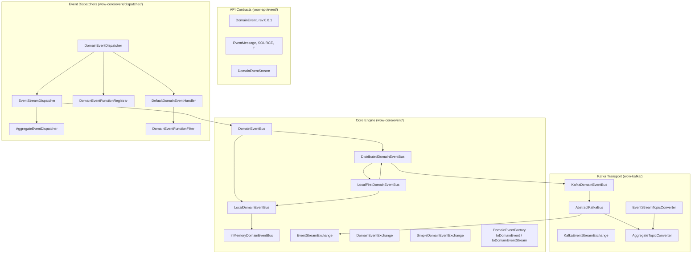
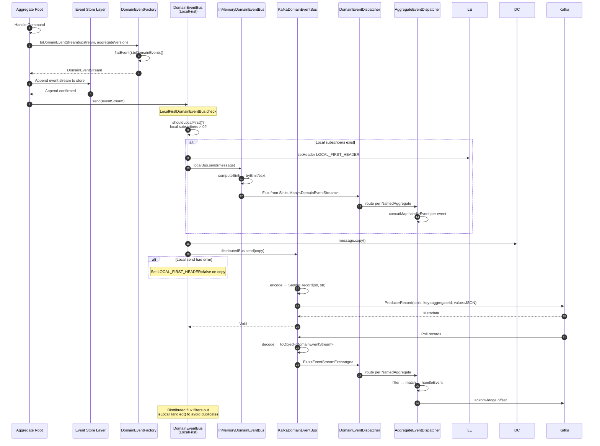
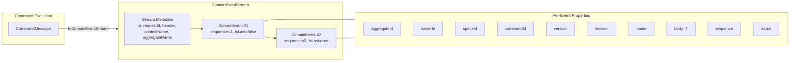
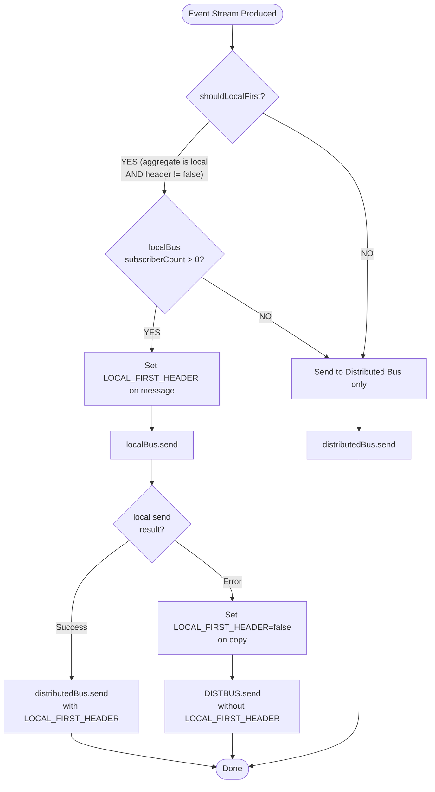
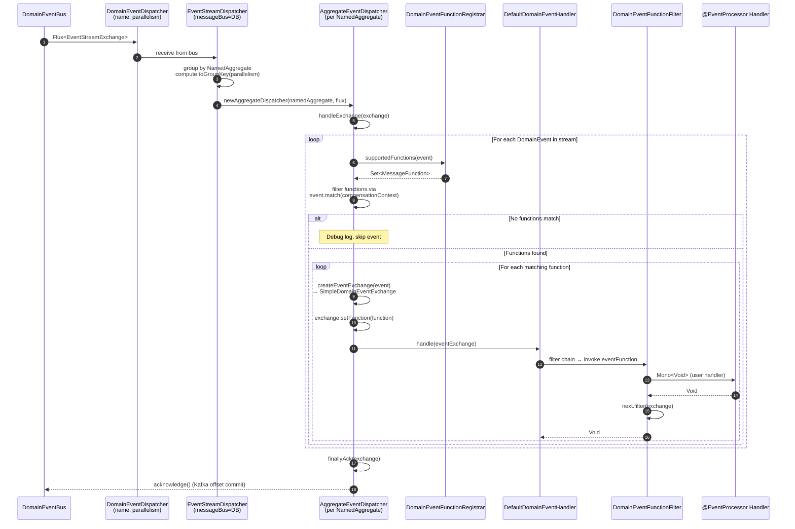

# Event Bus

The Event Bus is the central nervous system of Wow's event-driven architecture. It receives **domain event streams** from aggregates after they process commands and routes them to all interested consumers -- projections, sagas, event processors, and external systems. The bus guarantees **ordered delivery per aggregate ID** so that consumers always see events in the exact sequence they were produced.

## Architecture Overview

The Event Bus is built on a layered abstraction that decouples the **what** (domain event transport) from the **how** (in-memory, Kafka, Redis). Every bus implementation starts from the same base contract and gains capabilities as it moves from local to distributed.



<!-- Sources:
DomainEventBus.kt: wow-core/src/main/kotlin/me/ahoo/wow/event/DomainEventBus.kt:13-97
InMemoryDomainEventBus.kt: wow-core/src/main/kotlin/me/ahoo/wow/event/InMemoryDomainEventBus.kt:13-54
LocalFirstDomainEventBus.kt: wow-core/src/main/kotlin/me/ahoo/wow/event/LocalFirstDomainEventBus.kt:14-42
KafkaDomainEventBus.kt: wow-kafka/src/main/kotlin/me/ahoo/wow/kafka/KafkaDomainEventBus.kt:13-41
AbstractKafkaBus.kt: wow-kafka/src/main/kotlin/me/ahoo/wow/kafka/AbstractKafkaBus.kt:14-131
DomainEventDispatcher.kt: wow-core/src/main/kotlin/me/ahoo/wow/event/dispatcher/DomainEventDispatcher.kt:14-84
EventStreamDispatcher.kt: wow-core/src/main/kotlin/me/ahoo/wow/event/dispatcher/EventStreamDispatcher.kt:14-49
DomainEvent.kt: wow-api/src/main/kotlin/me/ahoo/wow/api/event/DomainEvent.kt:14-95
EventMessage.kt: wow-api/src/main/kotlin/me/ahoo/wow/api/event/EventMessage.kt:14-79
DomainEventStream.kt: wow-core/src/main/kotlin/me/ahoo/wow/event/DomainEventStream.kt:13-148
-->

The layered design allows the framework to use the **same bus contract** whether processing events locally (single JVM, zero network overhead) or in a distributed cluster (Kafka-backed, multi-node). The default deployment uses a `LocalFirstDomainEventBus` that combines both strategies.

## Core Interfaces

The Event Bus type hierarchy builds incrementally from a generic message bus to domain-event-specific contracts:

| Interface | Role | Extends | Source |
|---|---|---|---|
| `MessageBus<M, E>` | Base contract: `send()` and `receive()` | `AutoCloseable` | [MessageBus.kt:31-53](https://github.com/Ahoo-Wang/Wow/blob/main/wow-core/src/main/kotlin/me/ahoo/wow/messaging/MessageBus.kt#L31-L53) |
| `DomainEventBus` | Event bus for `DomainEventStream` payloads | `MessageBus`, `TopicKindCapable` | [DomainEventBus.kt:39-44](https://github.com/Ahoo-Wang/Wow/blob/main/wow-core/src/main/kotlin/me/ahoo/wow/event/DomainEventBus.kt#L39-L44) |
| `LocalDomainEventBus` | In-process bus with subscriber counting | `DomainEventBus`, `LocalMessageBus` | [DomainEventBus.kt:55-57](https://github.com/Ahoo-Wang/Wow/blob/main/wow-core/src/main/kotlin/me/ahoo/wow/event/DomainEventBus.kt#L55-L57) |
| `DistributedDomainEventBus` | Cross-process / cross-node bus | `DomainEventBus`, `DistributedMessageBus` | [DomainEventBus.kt:68-70](https://github.com/Ahoo-Wang/Wow/blob/main/wow-core/src/main/kotlin/me/ahoo/wow/event/DomainEventBus.kt#L68-L70) |

The `TopicKind` is always `TOPIC_KIND.EVENT_STREAM` for all domain event buses ([DomainEventBus.kt:42-43](https://github.com/Ahoo-Wang/Wow/blob/main/wow-core/src/main/kotlin/me/ahoo/wow/event/DomainEventBus.kt#L42-L43)), distinguishing them from command buses (`COMMAND`) and state event buses (`STATE`).

### NoOpDomainEventBus

For testing and scenarios where event publishing is intentionally disabled, the singleton `NoOpDomainEventBus` ([DomainEventBus.kt:81-97](https://github.com/Ahoo-Wang/Wow/blob/main/wow-core/src/main/kotlin/me/ahoo/wow/event/DomainEventBus.kt#L81-L97)) silently discards all sends and returns empty fluxes on receive.

## Event Publishing & Receiving Flow

The end-to-end flow from aggregate command processing through event delivery follows a publish-subscribe model with ordered per-aggregate delivery.



<!-- Sources:
DomainEventStreamFactory.kt: wow-core/src/main/kotlin/me/ahoo/wow/event/DomainEventStreamFactory.kt:79-114
LocalFirstMessageBus.kt: wow-core/src/main/kotlin/me/ahoo/wow/messaging/LocalFirstMessageBus.kt:99-171
InMemoryDomainEventBus.kt: wow-core/src/main/kotlin/me/ahoo/wow/event/InMemoryDomainEventBus.kt:13-54
AbstractKafkaBus.kt: wow-kafka/src/main/kotlin/me/ahoo/wow/kafka/AbstractKafkaBus.kt:52-95
AbstractAggregateEventDispatcher.kt: wow-core/src/main/kotlin/me/ahoo/wow/event/dispatcher/AbstractAggregateEventDispatcher.kt:49-139
KafkaEventStreamExchange.kt: wow-kafka/src/main/kotlin/me/ahoo/wow/kafka/KafkaEventStreamExchange.kt:14-32
-->

The sequence diagram reveals two critical design decisions:

1. **Local-first routing** (step 8--13): Events are delivered to in-process consumers **before** hitting the distributed bus. This gives projections and sagas running on the same node near-zero latency for event handling.

2. **Duplicate prevention** (final note): Distributed consumers check `isLocalHandled()` and skip events already processed locally, preventing double-processing when a node is both producer and consumer.

## Domain Event Stream

The `DomainEventStream` is the fundamental unit transported over the bus. It groups all domain events produced by a **single command execution** into one atomic payload.



<!-- Sources:
DomainEventStream.kt: wow-core/src/main/kotlin/me/ahoo/wow/event/DomainEventStream.kt:51-58
SimpleDomainEventStream.kt: wow-core/src/main/kotlin/me/ahoo/wow/event/DomainEventStream.kt:90-125
DomainEvent.kt: wow-api/src/main/kotlin/me/ahoo/wow/api/event/DomainEvent.kt:52-95
SimpleDomainEvent.kt: wow-core/src/main/kotlin/me/ahoo/wow/event/SimpleDomainEvent.kt:56-71
DomainEventStreamFactory.kt: wow-core/src/main/kotlin/me/ahoo/wow/event/DomainEventStreamFactory.kt:79-114
-->

| Property | Type | Description | Source |
|---|---|---|---|
| `id` | `String` | Globally unique stream ID (generated via `generateGlobalId()`) | [DomainEventStream.kt:91](https://github.com/Ahoo-Wang/Wow/blob/main/wow-core/src/main/kotlin/me/ahoo/wow/event/DomainEventStream.kt#L91) |
| `requestId` | `String` | Correlation ID linking stream to originating HTTP request | [DomainEventStream.kt:92](https://github.com/Ahoo-Wang/Wow/blob/main/wow-core/src/main/kotlin/me/ahoo/wow/event/DomainEventStream.kt#L92) |
| `header` | `Header` | Message header containing metadata and propagation flags | [DomainEventStream.kt:93](https://github.com/Ahoo-Wang/Wow/blob/main/wow-core/src/main/kotlin/me/ahoo/wow/event/DomainEventStream.kt#L93) |
| `body` | `List<DomainEvent<*>>` | Ordered list of domain events (must not be empty) | [DomainEventStream.kt:94](https://github.com/Ahoo-Wang/Wow/blob/main/wow-core/src/main/kotlin/me/ahoo/wow/event/DomainEventStream.kt#L94) |
| `aggregateId` | `AggregateId` | Derived from the first event's aggregate ID | [DomainEventStream.kt:97](https://github.com/Ahoo-Wang/Wow/blob/main/wow-core/src/main/kotlin/me/ahoo/wow/event/DomainEventStream.kt#L97) |
| `version` | `Int` | Aggregate version after applying this stream (from first event) | [DomainEventStream.kt:106](https://github.com/Ahoo-Wang/Wow/blob/main/wow-core/src/main/kotlin/me/ahoo/wow/event/DomainEventStream.kt#L106) |
| `size` | `Int` | Number of domain events in the stream | [DomainEventStream.kt:110](https://github.com/Ahoo-Wang/Wow/blob/main/wow-core/src/main/kotlin/me/ahoo/wow/event/DomainEventStream.kt#L110) |

Events within a stream are **sequentially numbered** starting from `DEFAULT_EVENT_SEQUENCE` (1). The `isLast` flag on each event signals whether the stream continues or concludes, enabling consumers to batch-complete processing when the final event arrives.

### Event Stream Factory

The `toDomainEventStream()` extension function creates a stream from command processing results. It flattens the output into individual events, assigns sequential IDs, and wraps them in a `SimpleDomainEventStream`:

<!-- Source: DomainEventStreamFactory.kt:79-114 -->
```kotlin
fun Any.toDomainEventStream(
    upstream: CommandMessage<*>,
    aggregateVersion: Int = Version.UNINITIALIZED_VERSION,
    ...
): DomainEventStream {
    val events = flatEvent().toDomainEvents(
        streamVersion = aggregateVersion + 1,
        aggregateId = upstream.aggregateId,
        command = upstream,
        ...
    )
    return SimpleDomainEventStream(
        id = generateGlobalId(),
        requestId = upstream.requestId,
        header = header,
        body = events,
    )
}
```

The `flatEvent()` ([DomainEventStreamFactory.kt:43-56](https://github.com/Ahoo-Wang/Wow/blob/main/wow-core/src/main/kotlin/me/ahoo/wow/event/DomainEventStreamFactory.kt#L43-L56)) normalizes single events, arrays, and iterables into a consistent `Iterable<Any>` before creating individual `DomainEvent` instances.

## Bus Implementations

Wow provides four concrete bus implementations covering the full spectrum from simple testing to production distributed clusters:

| Implementation | Class | Type | Use Case | Source |
|---|---|---|---|---|
| NoOp | `NoOpDomainEventBus` | Singleton | Testing, event publishing disabled | [DomainEventBus.kt:81-97](https://github.com/Ahoo-Wang/Wow/blob/main/wow-core/src/main/kotlin/me/ahoo/wow/event/DomainEventBus.kt#L81-L97) |
| InMemory | `InMemoryDomainEventBus` | `LocalDomainEventBus` | Single-process apps, unit tests | [InMemoryDomainEventBus.kt:38-54](https://github.com/Ahoo-Wang/Wow/blob/main/wow-core/src/main/kotlin/me/ahoo/wow/event/InMemoryDomainEventBus.kt#L38-L54) |
| Kafka | `KafkaDomainEventBus` | `DistributedDomainEventBus` | Multi-node production | [KafkaDomainEventBus.kt:22-41](https://github.com/Ahoo-Wang/Wow/blob/main/wow-kafka/src/main/kotlin/me/ahoo/wow/kafka/KafkaDomainEventBus.kt#L22-L41) |
| LocalFirst | `LocalFirstDomainEventBus` | `DomainEventBus` (hybrid) | Default production (combines InMemory + Kafka) | [LocalFirstDomainEventBus.kt:38-42](https://github.com/Ahoo-Wang/Wow/blob/main/wow-core/src/main/kotlin/me/ahoo/wow/event/LocalFirstDomainEventBus.kt#L38-L42) |

### Local-First Routing Strategy

The `LocalFirstDomainEventBus` is the **default production bus**. It implements a two-tier delivery strategy that optimizes for the common case where event consumers (projections, sagas) run in the same JVM as the aggregate.



<!-- Sources:
LocalFirstMessageBus.kt: wow-core/src/main/kotlin/me/ahoo/wow/messaging/LocalFirstMessageBus.kt:99-171
LocalFirstDomainEventBus.kt: wow-core/src/main/kotlin/me/ahoo/wow/event/LocalFirstDomainEventBus.kt:14-42
LocalFirstMessageBus.kt: wow-core/src/main/kotlin/me/ahoo/wow/messaging/LocalFirstMessageBus.kt:65-75 (shouldLocalFirst)
-->

The routing logic ([LocalFirstMessageBus.kt:130-149](https://github.com/Ahoo-Wang/Wow/blob/main/wow-core/src/main/kotlin/me/ahoo/wow/messaging/LocalFirstMessageBus.kt#L130-L149)) always sends a copy to the distributed bus **regardless** of local success or failure. This ensures other nodes always receive events, while local consumers benefit from sub-millisecond delivery via reactive sinks.

On the **receive side** ([LocalFirstMessageBus.kt:160-170](https://github.com/Ahoo-Wang/Wow/blob/main/wow-core/src/main/kotlin/me/ahoo/wow/messaging/LocalFirstMessageBus.kt#L160-L170)), the bus merges local and distributed fluxes, filtering out distributed events that were already processed locally via `isLocalHandled()`.

## Event Dispatcher Pipeline

Once the Event Bus delivers an `EventStreamExchange` to the dispatcher, a multi-stage pipeline processes each domain event through registered handler functions:



<!-- Sources:
DomainEventDispatcher.kt: wow-core/src/main/kotlin/me/ahoo/wow/event/dispatcher/DomainEventDispatcher.kt:44-84
EventStreamDispatcher.kt: wow-core/src/main/kotlin/me/ahoo/wow/event/dispatcher/EventStreamDispatcher.kt:27-49
AggregateEventDispatcher.kt: wow-core/src/main/kotlin/me/ahoo/wow/event/dispatcher/AggregateEventDispatcher.kt:53-80
AbstractAggregateEventDispatcher.kt: wow-core/src/main/kotlin/me/ahoo/wow/event/dispatcher/AbstractAggregateEventDispatcher.kt:49-139
DomainEventFunctionFilter.kt: wow-core/src/main/kotlin/me/ahoo/wow/event/dispatcher/DomainEventFunctionFilter.kt:42-71
DefaultDomainEventHandler: wow-core/src/main/kotlin/me/ahoo/wow/event/dispatcher/DomainEventHandler.kt:57-64
DomainEventFunctionRegistrar.kt: wow-core/src/main/kotlin/me/ahoo/wow/event/dispatcher/DomainEventFunctionRegistrar.kt:92-112
EventProcessorParser.kt: wow-core/src/main/kotlin/me/ahoo/wow/event/annotation/EventProcessorParser.kt:34-36
-->

### Dispatcher Components

| Component | Responsibility | Key Behavior | Source |
|---|---|---|---|
| `DomainEventDispatcher` | Top-level coordinator | Creates `EventStreamDispatcher` + `StateEventDispatcher`; starts/stops both | [DomainEventDispatcher.kt:44-84](https://github.com/Ahoo-Wang/Wow/blob/main/wow-core/src/main/kotlin/me/ahoo/wow/event/dispatcher/DomainEventDispatcher.kt#L44-L84) |
| `EventStreamDispatcher` | Routes event streams by aggregate | Groups flux by `NamedAggregate`, delegates to per-aggregate dispatchers | [EventStreamDispatcher.kt:27-49](https://github.com/Ahoo-Wang/Wow/blob/main/wow-core/src/main/kotlin/me/ahoo/wow/event/dispatcher/EventStreamDispatcher.kt#L27-L49) |
| `AggregateEventDispatcher` | Per-aggregate event processing | Iterates events in order via `concatMap`, applies function filtering | [AggregateEventDispatcher.kt:53-80](https://github.com/Ahoo-Wang/Wow/blob/main/wow-core/src/main/kotlin/me/ahoo/wow/event/dispatcher/AggregateEventDispatcher.kt#L53-L80) |
| `DomainEventFunctionRegistrar` | Registers event handler functions | Resolves `@EventProcessor` classes → `MessageFunction` set via annotation metadata | [DomainEventFunctionRegistrar.kt:92-112](https://github.com/Ahoo-Wang/Wow/blob/main/wow-core/src/main/kotlin/me/ahoo/wow/event/dispatcher/DomainEventFunctionRegistrar.kt#L92-L112) |
| `DefaultDomainEventHandler` | Filter chain executor | Runs `FilterChain<DomainEventExchange<*>>` with `LogResumeErrorHandler` | [DomainEventHandler.kt:57-64](https://github.com/Ahoo-Wang/Wow/blob/main/wow-core/src/main/kotlin/me/ahoo/wow/event/dispatcher/DomainEventHandler.kt#L57-L64) |
| `DomainEventFunctionFilter` | Invokes user handler function | Sets `ServiceProvider` on exchange, calls `eventFunction.invoke(exchange)` | [DomainEventFunctionFilter.kt:42-71](https://github.com/Ahoo-Wang/Wow/blob/main/wow-core/src/main/kotlin/me/ahoo/wow/event/dispatcher/DomainEventFunctionFilter.kt#L42-L71) |

The `CompositeEventDispatcher` ([CompositeEventDispatcher.kt:64-138](https://github.com/Ahoo-Wang/Wow/blob/main/wow-core/src/main/kotlin/me/ahoo/wow/event/dispatcher/CompositeEventDispatcher.kt#L64-L138)) combines an `EventStreamDispatcher` (for regular domain events) and a `StateEventDispatcher` (for state-change events), filtering functions by `FunctionKind.EVENT` and `FunctionKind.STATE_EVENT` respectively.

### Event Processor Annotation Metadata

When a class is annotated with `@EventProcessor`, the `EventProcessorParser` ([EventProcessorParser.kt:34-36](https://github.com/Ahoo-Wang/Wow/blob/main/wow-core/src/main/kotlin/me/ahoo/wow/event/annotation/EventProcessorParser.kt#L34-L36)) scans methods annotated with `@OnEvent` or `@OnStateEvent` and converts them into `MessageFunction` instances. These are registered in the `DomainEventFunctionRegistrar` so that the dispatcher can match incoming events to the correct handler.

Each `@OnEvent` annotation can optionally specify aggregate name filters (`vararg val value: String`) to limit which aggregates the handler receives events from ([OnEvent.kt:66-78](https://github.com/Ahoo-Wang/Wow/blob/main/wow-api/src/main/kotlin/me/ahoo/wow/api/annotation/OnEvent.kt#L66-L78)).

## Event Processor Lifecycle

Event processors follow a well-defined lifecycle managed by the dispatcher:

| Phase | Action | Details | Trigger |
|---|---|---|---|
| **Discovery** | `DomainEventFunctionRegistrar.resolveProcessor()` | Scans `@EventProcessor` classes, extracts `@OnEvent` methods, creates `MessageFunction` instances | Spring context refresh |
| **Registration** | `registerProcessor(processor)` | Registers each `MessageFunction` keyed by event type + aggregate name | After discovery |
| **Subscription** | `MessageBus.receive(namedAggregates)` | Subscribes to event streams for relevant aggregates | `MessageDispatcher.start()` |
| **Grouping** | `EventStreamDispatcher` groups by `NamedAggregate` | Routes events to per-aggregate schedulers | On each incoming batch |
| **Matching** | `supportedFunctions(event)` + `event.match()` | Finds registered functions that handle the given event type | Per event |
| **Invocation** | `DomainEventFunctionFilter.filter()` | Sets service provider, invokes handler via filter chain | Per event-to-function match |
| **Acknowledgment** | `finallyAck(exchange)` | Commits offset (Kafka) or marks processed (in-memory) | After all events in stream processed |
| **Shutdown** | `MessageDispatcher.stopGracefully()` | Waits for in-flight processing, closes subscriptions | Application shutdown |

## Kafka Integration

When deployed in a distributed environment, Wow uses Apache Kafka as the event bus transport. Each named aggregate maps to a dedicated Kafka topic:

### Topic Naming Convention

```
wow.{contextName}.{aggregateName}.event
```

For example, an "order" aggregate in the default context produces the topic `wow.order.event`.

The naming is controlled by `DefaultEventStreamTopicConverter` ([AggregateTopicConverter.kt:38-46](https://github.com/Ahoo-Wang/Wow/blob/main/wow-kafka/src/main/kotlin/me/ahoo/wow/kafka/AggregateTopicConverter.kt#L38-L46)), which prefixes the aggregate string representation with `wow.` (configurable via `wow.kafka.topic-prefix`).

### Message Serialization

`AbstractKafkaBus` ([AbstractKafkaBus.kt:39-131](https://github.com/Ahoo-Wang/Wow/blob/main/wow-kafka/src/main/kotlin/me/ahoo/wow/kafka/AbstractKafkaBus.kt#L39-L131)) handles serialization:

- **Key**: `message.aggregateId.id` (the aggregate's string ID) -- ensures ordering per aggregate within a partition
- **Value**: JSON serialization via `message.toJsonString()` / `toObject<DomainEventStream>`
- **Partition**: `null` (let Kafka assign by key hash, guaranteeing per-aggregate ordering)
- **Timestamp**: `message.createTime`

### Offset Acknowledgment

`KafkaEventStreamExchange` ([KafkaEventStreamExchange.kt:22-32](https://github.com/Ahoo-Wang/Wow/blob/main/wow-kafka/src/main/kotlin/me/ahoo/wow/kafka/KafkaEventStreamExchange.kt#L22-L32)) wraps the `ReceiverOffset` and calls `receiverOffset.acknowledge()` when the dispatcher's `finallyAck` completes. This ensures at-least-once delivery with manual offset commits.

### Kafka Configuration Properties

Configuration is managed by `KafkaProperties` ([KafkaProperties.kt:27-68](https://github.com/Ahoo-Wang/Wow/blob/main/wow-spring-boot-starter/src/main/kotlin/me/ahoo/wow/spring/boot/starter/kafka/KafkaProperties.kt#L27-L68)), bound to the `wow.kafka` prefix:

| Property | Type | Default | Description | Source |
|---|---|---|---|---|
| `wow.kafka.enabled` | `Boolean` | `true` | Enable Kafka integration | [KafkaProperties.kt:29](https://github.com/Ahoo-Wang/Wow/blob/main/wow-spring-boot-starter/src/main/kotlin/me/ahoo/wow/spring/boot/starter/kafka/KafkaProperties.kt#L29) |
| `wow.kafka.bootstrap-servers` | `List<String>` | **Required** | Kafka broker addresses | [KafkaProperties.kt:30](https://github.com/Ahoo-Wang/Wow/blob/main/wow-spring-boot-starter/src/main/kotlin/me/ahoo/wow/spring/boot/starter/kafka/KafkaProperties.kt#L30) |
| `wow.kafka.topic-prefix` | `String` | `wow.` | Prefix for all topic names | [KafkaProperties.kt:31](https://github.com/Ahoo-Wang/Wow/blob/main/wow-spring-boot-starter/src/main/kotlin/me/ahoo/wow/spring/boot/starter/kafka/KafkaProperties.kt#L31) |
| `wow.kafka.properties` | `Map<String,String>` | `{}` | Common Kafka client properties | [KafkaProperties.kt:35](https://github.com/Ahoo-Wang/Wow/blob/main/wow-spring-boot-starter/src/main/kotlin/me/ahoo/wow/spring/boot/starter/kafka/KafkaProperties.kt#L35) |
| `wow.kafka.producer` | `Map<String,String>` | `{}` | Producer-specific overrides | [KafkaProperties.kt:36](https://github.com/Ahoo-Wang/Wow/blob/main/wow-spring-boot-starter/src/main/kotlin/me/ahoo/wow/spring/boot/starter/kafka/KafkaProperties.kt#L36) |
| `wow.kafka.consumer` | `Map<String,String>` | `{}` | Consumer-specific overrides | [KafkaProperties.kt:37](https://github.com/Ahoo-Wang/Wow/blob/main/wow-spring-boot-starter/src/main/kotlin/me/ahoo/wow/spring/boot/starter/kafka/KafkaProperties.kt#L37) |

### Event Bus Configuration Properties

The event bus type is selected via `EventProperties` ([EventProperties.kt:21-30](https://github.com/Ahoo-Wang/Wow/blob/main/wow-spring-boot-starter/src/main/kotlin/me/ahoo/wow/spring/boot/starter/event/EventProperties.kt#L21-L30)):

| Property | Type | Default | Description |
|---|---|---|---|
| `wow.event.bus.type` | `BusType` | `kafka` | Event bus implementation (`kafka`, `redis`, `in_memory`, `no_op`) |
| `wow.event.bus.local-first.enabled` | `Boolean` | `true` | Enable `LocalFirstDomainEventBus` wrapping (in-memory + distributed) |

**YAML Example:**

```yaml
wow:
  event:
    bus:
      type: kafka
      local-first:
        enabled: true
  kafka:
    enabled: true
    bootstrap-servers:
      - localhost:9092
    topic-prefix: "wow."
    producer:
      acks: all
      retries: 3
    consumer:
      auto-offset-reset: earliest
```

## Spring Boot Auto-Configuration

The `KafkaAutoConfiguration` ([KafkaAutoConfiguration.kt:43-127](https://github.com/Ahoo-Wang/Wow/blob/main/wow-spring-boot-starter/src/main/kotlin/me/ahoo/wow/spring/boot/starter/kafka/KafkaAutoConfiguration.kt#L43-L127)) registers beans conditionally:

- `KafkaDomainEventBus` is created only when `wow.event.bus.type=kafka` (or default) and `wow.kafka.enabled=true`
- `DefaultEventStreamTopicConverter` uses the configured `topicPrefix`
- `ReceiverOptionsCustomizer` allows per-service overrides of Kafka consumer settings
- The bus is wired into `LocalFirstDomainEventBus` when `local-first.enabled=true`

## Event Upgrade Pipeline

When an event's `revision` does not match the current schema version, Wow's event upgrader system (in `wow-core/src/main/kotlin/me/ahoo/wow/event/upgrader/`) transparently migrates legacy event formats before they reach consumers. This ensures backward compatibility as domain models evolve without requiring consumer changes.

## Key Design Decisions

**Why ordered delivery per aggregate?** Using `aggregateId.id` as the Kafka partition key ([AbstractKafkaBus.kt:106](https://github.com/Ahoo-Wang/Wow/blob/main/wow-kafka/src/main/kotlin/me/ahoo/wow/kafka/AbstractKafkaBus.kt#L106)) guarantees that all events for a given aggregate instance arrive in the order they were produced. This is essential for projections that reconstruct aggregate state and sagas that depend on sequential business milestones.

**Why local-first by default?** The framework's primary optimization target is the case where the aggregate, its projections, and its sagas all run in the same JVM. `LocalFirstDomainEventBus` eliminates network round-trips for the 80% case while still ensuring distributed visibility.

**Why stream-based (not event-per-message)?** Transporting events as a `DomainEventStream` (all events from one command execution) rather than individual events reduces message overhead, preserves atomic context, and allows consumers to implement efficient batch completion logic via the `isLast` flag.

## Related Pages

| Page | Description |
|---|---|
| [Command Bus](../data/command-bus.md) | Command routing and dispatch architecture |
| [Event Store](../data/event-store.md) | How domain events are persisted and loaded |
| [Event Processor](../../guide/event-processor.md) | Creating and configuring event handlers |
| [Saga Processor](../../guide/saga.md) | Distributed transaction orchestration via events |
| [Kafka Configuration](../../reference/config/kafka.md) | Kafka connection and topic configuration |
| [Event Configuration](../../reference/config/event.md) | Event bus type and routing settings |
| [Architecture Overview](./overview.md) | High-level framework architecture |
| [CQRS Reference](../../reference/cqrs.md) | CQRS patterns in Wow |
