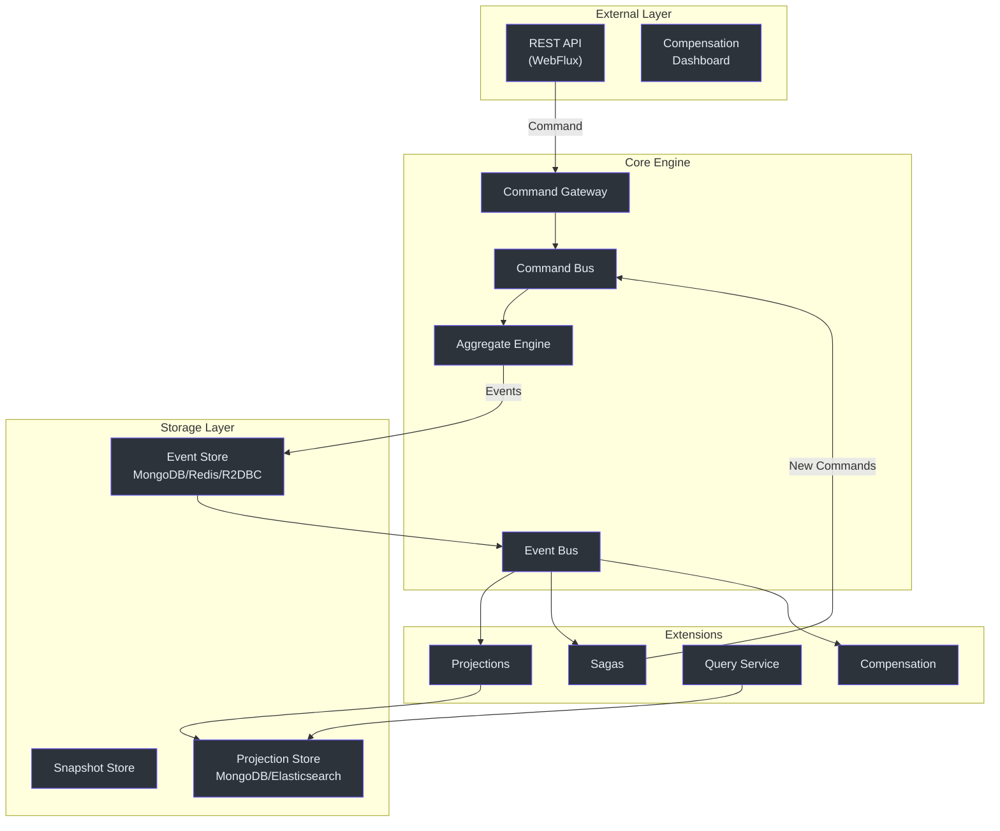

# Architecture Overview

This is a deep technical analysis of the Wow Framework's architecture. For a gentler introduction, see the [Architecture Guide](../../guide/architecture).

## The Core Insight

Wow's architecture is built around a single principle: **"Domain Model as a Service"**. Write your aggregate, and the framework handles everything else — command routing, event persistence, projection updates, and API generation.



<!-- Sources: wow-core/src/main/kotlin/me/ahoo/wow/, wow-spring-boot-starter/, settings.gradle.kts -->

## Module Dependency Graph

```
wow-api (pure API contracts)
  └─> wow-core (framework engine)
       ├─> wow-spring (Spring integration)
       │    └─> wow-spring-boot-starter (auto-configuration)
       ├─> wow-query (query model support)
       ├─> wow-kafka (command/event bus via Kafka)
       ├─> wow-mongo (event store + snapshot via MongoDB)
       ├─> wow-redis (event store + snapshot via Redis)
       ├─> wow-r2dbc (event store via R2DBC)
       ├─> wow-elasticsearch (projection via Elasticsearch)
       ├─> wow-webflux (Spring WebFlux integration)
       ├─> wow-opentelemetry (tracing/metrics)
       └─> wow-cosec (authorization)
```

## Key Design Decisions

| Decision | Rationale |
|----------|-----------|
| Reactive (Project Reactor) | Non-blocking I/O for maximum throughput |
| KSP over KAPT | Compile-time code generation, faster builds |
| Spring Boot auto-configuration | Zero-boilerplate setup |
| Pluggable event store | Swap backends without changing domain code |
| Given-When-Expect testing | Readable, maintainable test suite |
| Dark launch support | Feature flags for gradual rollouts |

## Related Pages

- [Command Bus](./command-bus) — Command routing and wait strategies
- [Event Bus](./event-bus) — Event distribution and processing
- [Aggregate Lifecycle](./aggregate-lifecycle) — Aggregate state flow
- [Event Store](../data/event-store) — Event persistence layer
- [Spring Boot Integration](../integrations/spring-boot) — Framework setup
