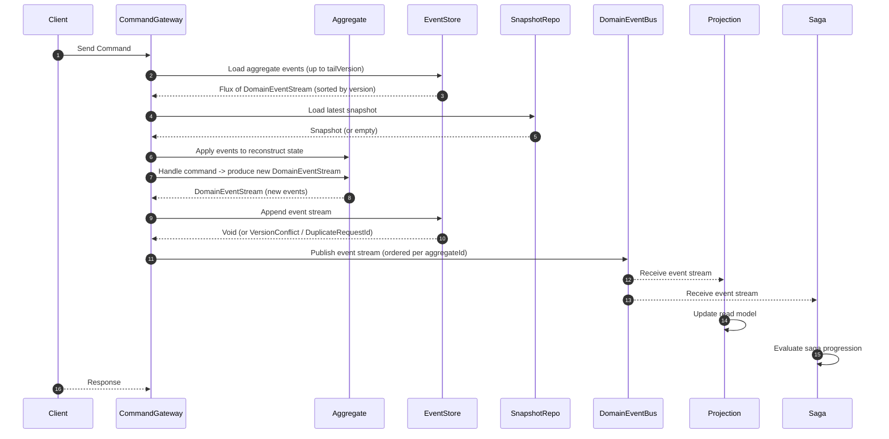
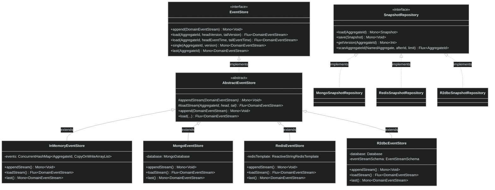
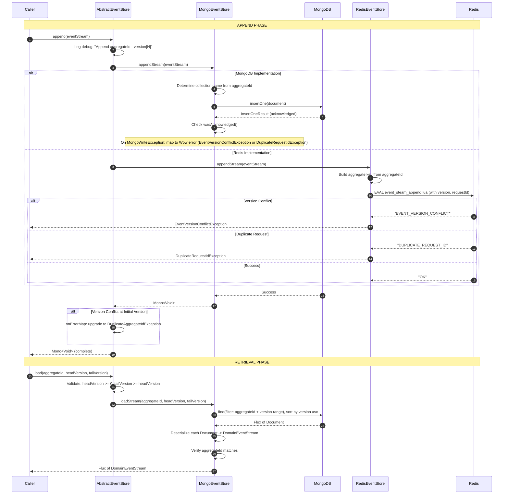
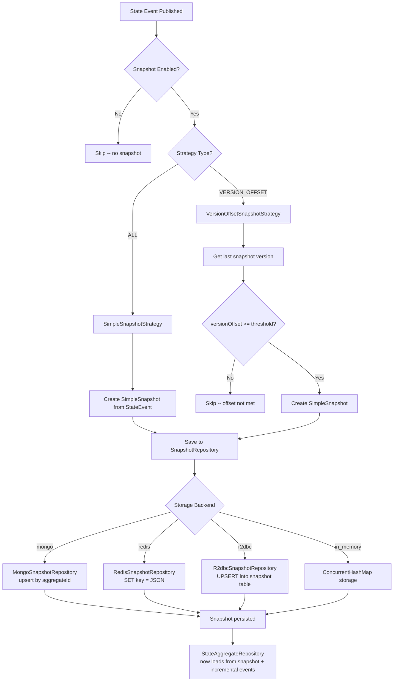
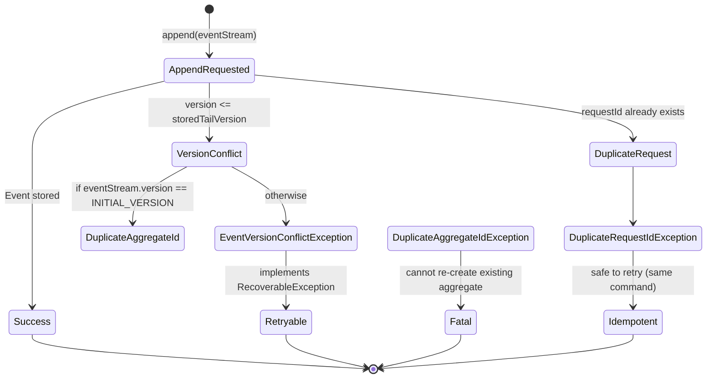

# Event Store

The Event Store is the persistence backbone of the Wow framework's event sourcing architecture. Unlike traditional CRUD databases that overwrite state and discard history, the event store acts as an **immutable, append-only ledger** of every business fact that has occurred in the system. Every state change -- an `OrderCreated`, an `ItemAdded`, a `PaymentProcessed` -- is recorded as a domain event stream and can never be modified or deleted.

This design enables three critical capabilities that traditional architectures cannot provide:

1. **Complete audit trail** -- every state transition is permanently recorded with causation metadata (who, when, what command)
2. **Temporal queries** -- reconstruct aggregate state as it existed at any point in time by replaying events up to a specific event timestamp or version
3. **Decoupled consumers** -- projections, sagas, and external systems independently subscribe to the same event stream without coupling to the aggregate's write path

The event store works in concert with [snapshots](../../../documentation/docs/en/guide/snapshot.md) to avoid replaying the entire history for long-lived aggregates, and integrates with the [Domain Event Bus](../messaging/event-bus.md) to publish events to distributed consumers.

## At-a-Glance

| Concept | Description | Source |
|---|---|---|
| `DomainEvent` | Immutable fact about a past business action within an aggregate, with sequence and revision metadata | [wow-api/.../DomainEvent.kt:52-95](https://github.com/Ahoo-Wang/Wow/blob/main/wow-api/src/main/kotlin/me/ahoo/wow/api/event/DomainEvent.kt#L52-L95) |
| `DomainEventStream` | An ordered batch of domain events produced by a single command execution (1:1 with commandId) | [wow-core/.../DomainEventStream.kt:51-125](https://github.com/Ahoo-Wang/Wow/blob/main/wow-core/src/main/kotlin/me/ahoo/wow/event/DomainEventStream.kt#L51-L125) |
| `EventStore` | Core interface for appending event streams and loading them by version/time range | [wow-core/.../EventStore.kt:27-98](https://github.com/Ahoo-Wang/Wow/blob/main/wow-core/src/main/kotlin/me/ahoo/wow/eventsourcing/EventStore.kt#L27-L98) |
| `AbstractEventStore` | Base class providing logging, validation, and error mapping for all implementations | [wow-core/.../AbstractEventStore.kt:26-140](https://github.com/Ahoo-Wang/Wow/blob/main/wow-core/src/main/kotlin/me/ahoo/wow/eventsourcing/AbstractEventStore.kt#L26-L140) |
| `SnapshotRepository` | Optimizes aggregate loading by providing versioned state checkpoints | [wow-core/.../SnapshotRepository.kt:27-58](https://github.com/Ahoo-Wang/Wow/blob/main/wow-core/src/main/kotlin/me/ahoo/wow/eventsourcing/snapshot/SnapshotRepository.kt#L27-L58) |
| `DomainEventBus` | Publishes event streams to local and distributed subscribers in order per aggregate | [wow-core/.../DomainEventBus.kt:39-97](https://github.com/Ahoo-Wang/Wow/blob/main/wow-core/src/main/kotlin/me/ahoo/wow/event/DomainEventBus.kt#L39-L97) |

## Event Sourcing Lifecycle

The following sequence diagram illustrates the complete lifecycle from command receipt through event persistence, bus publication, and downstream processing.



<!-- Sources:
  CommandGateway flow: wow-core/src/main/kotlin/me/ahoo/wow/command/ (CommandGateway.kt and related)
  EventStore.append: wow-core/src/main/kotlin/me/ahoo/wow/eventsourcing/EventStore.kt:27-43
  SnapshotRepository.load: wow-core/src/main/kotlin/me/ahoo/wow/eventsourcing/snapshot/SnapshotRepository.kt:36
  DomainEventBus.send: wow-core/src/main/kotlin/me/ahoo/wow/event/DomainEventBus.kt:39-44
  EventSourcingStateAggregateRepository: wow-core/src/main/kotlin/me/ahoo/wow/eventsourcing/EventSourcingStateAggregateRepository.kt:41-148
-->

### How State Reconstruction Works

The Wow framework does **not** store current aggregate state in a traditional database table. Instead, every aggregate's state is a **function of its event history**. The `EventSourcingStateAggregateRepository` implements this reconstruction:

1. **Snapshot-first loading**: When requesting the latest version (`tailVersion = Int.MAX_VALUE`), the repository first attempts to load from the snapshot repository. If a snapshot exists, it serves as the starting point for incremental replay (lines [74-89](https://github.com/Ahoo-Wang/Wow/blob/main/wow-core/src/main/kotlin/me/ahoo/wow/eventsourcing/EventSourcingStateAggregateRepository.kt#L74-L89)).
2. **Fresh aggregate creation**: If no snapshot exists or a non-latest version is requested, a new aggregate instance is created via the `StateAggregateFactory` (lines [88-89](https://github.com/Ahoo-Wang/Wow/blob/main/wow-core/src/main/kotlin/me/ahoo/wow/eventsourcing/EventSourcingStateAggregateRepository.kt#L88-L89)).
3. **Event application**: Events from the event store are replayed in version order, each calling `stateAggregate.onSourcing(it)` to mutate the in-memory state (lines [93-104](https://github.com/Ahoo-Wang/Wow/blob/main/wow-core/src/main/kotlin/me/ahoo/wow/eventsourcing/EventSourcingStateAggregateRepository.kt#L93-L104)).

Time-range loading works identically but iterates events with `createTime` in the specified window (lines [130-147](https://github.com/Ahoo-Wang/Wow/blob/main/wow-core/src/main/kotlin/me/ahoo/wow/eventsourcing/EventSourcingStateAggregateRepository.kt#L130-L147)).

### Idempotency and Concurrency

The event store enforces two critical invariants through unique indexes (or equivalent logic in each implementation):

| Guarantee | Mechanism | Exception |
|---|---|---|
| **No concurrent writes** | Unique index on `(aggregateId, version)` | `EventVersionConflictException` |
| **Idempotent command handling** | Unique index on `(aggregateId, requestId)` | `DuplicateRequestIdException` |
| **No duplicate aggregate creation** | `EventVersionConflictException` at initial version is upgraded | `DuplicateAggregateIdException` |

The `AbstractEventStore.append` method (lines [40-52](https://github.com/Ahoo-Wang/Wow/blob/main/wow-core/src/main/kotlin/me/ahoo/wow/eventsourcing/AbstractEventStore.kt#L40-L52)) maps a version conflict at the initial version to `DuplicateAggregateIdException`, distinguishing "aggregate already exists" from "concurrent modification".

## Event Store Architecture

The framework defines a clean interface hierarchy with multiple persistence backends. Every implementation extends `AbstractEventStore` which provides centralized logging, input validation, and error mapping.



<!-- Sources:
  EventStore: wow-core/src/main/kotlin/me/ahoo/wow/eventsourcing/EventStore.kt:27-98
  AbstractEventStore: wow-core/.../eventsourcing/AbstractEventStore.kt:26-140
  InMemoryEventStore: wow-core/.../eventsourcing/InMemoryEventStore.kt:30-127
  MongoEventStore: wow-mongo/.../MongoEventStore.kt:32-105
  RedisEventStore: wow-redis/.../RedisEventStore.kt:35-92
  R2dbcEventStore: wow-r2dbc/.../R2dbcEventStore.kt:34-160
  SnapshotRepository: wow-core/.../snapshot/SnapshotRepository.kt:27-58
  MongoSnapshotRepository: wow-mongo/.../MongoSnapshotRepository.kt:34-111
  RedisSnapshotRepository: wow-redis/.../RedisSnapshotRepository.kt:29-71
  R2dbcSnapshotRepository: wow-r2dbc/.../R2dbcSnapshotRepository.kt:34-169
-->

### Two-Layer Design

The `AbstractEventStore` applies the **template method pattern** to centralize cross-cutting concerns:

- **`append()`** (public, concrete): Logs the operation, delegates to `appendStream()`, and upgrades version-conflict exceptions for initial-version duplicates (lines [40-52](https://github.com/Ahoo-Wang/Wow/blob/main/wow-core/src/main/kotlin/me/ahoo/wow/eventsourcing/AbstractEventStore.kt#L40-L52)).
- **`load()` by version** (public, concrete): Validates that `headVersion >= 0` and `tailVersion >= headVersion`, then delegates to `loadStream()` (lines [73-88](https://github.com/Ahoo-Wang/Wow/blob/main/wow-core/src/main/kotlin/me/ahoo/wow/eventsourcing/AbstractEventStore.kt#L73-L88)).
- **`load()` by event time** (public, concrete): Validates that `tailEventTime >= headEventTime`, then delegates to `loadStream()` (lines [100-109](https://github.com/Ahoo-Wang/Wow/blob/main/wow-core/src/main/kotlin/me/ahoo/wow/eventsourcing/AbstractEventStore.kt#L100-L109)).
- **`appendStream()` / `loadStream()`** (protected, abstract): Each backend implements the storage-specific logic.

This design ensures that **every** implementation benefits from centralized validation and error handling without duplicating code.

## Event Storage and Retrieval Details

The following diagram shows the internal flow when a new event stream is appended and later retrieved.



<!-- Sources:
  AbstractEventStore.append: wow-core/.../eventsourcing/AbstractEventStore.kt:40-52
  AbstractEventStore.load: wow-core/.../eventsourcing/AbstractEventStore.kt:73-88
  MongoEventStore.appendStream: wow-mongo/.../MongoEventStore.kt:34-46
  MongoEventStore.loadStream: wow-mongo/.../MongoEventStore.kt:67-76
  RedisEventStore.appendStream: wow-redis/.../RedisEventStore.kt:44-65
  RedisEventStore.loadStream: wow-redis/.../RedisEventStore.kt:67-74
  R2dbcEventStore.appendStream: wow-r2dbc/.../R2dbcEventStore.kt:38-86
-->

### Storage Schema Per Implementation

Each event store backend organizes data differently:

**MongoDB** uses per-aggregate-type collections. The collection name is derived from the aggregate's context name and aggregate name (e.g., `order_event_stream`). Documents are indexed with a unique compound index on `(aggregate_id, version)` and another on `(aggregate_id, request_id)`, plus secondary indexes on `tenant_id` and `owner_id` for multi-tenancy queries (lines [51-69](https://github.com/Ahoo-Wang/Wow/blob/main/wow-mongo/src/main/kotlin/me/ahoo/wow/mongo/EventStreamSchemaInitializer.kt#L51-L69)).

**Redis** stores event streams in a **sorted set** keyed by aggregate ID. Each member is a JSON-serialized `DomainEventStream`, scored by version number. This enables efficient range queries by version using `ZRANGEBYSCORE`. Append operations use a Lua script (`event_steam_append.lua`) for atomicity -- checking version conflicts and duplicate request IDs in a single Redis transaction (lines [44-65](https://github.com/Ahoo-Wang/Wow/blob/main/wow-redis/src/main/kotlin/me/ahoo/wow/redis/eventsourcing/RedisEventStore.kt#L44-L65)). Time-range loading is not supported in the Redis implementation.

**R2DBC** uses a relational table per aggregate type (`<aggregateName>_event_stream`). The schema is generated with columns for `id`, `aggregate_id`, `tenant_id`, `owner_id`, `space_id`, `request_id`, `command_id`, `version`, `header`, `body`, `size`, and `create_time` (lines [47-53](https://github.com/Ahoo-Wang/Wow/blob/main/wow-r2dbc/src/main/kotlin/me/ahoo/wow/r2dbc/EventStreamSchema.kt#L47-L53)). Unique indexes on `(aggregate_id, version)` and `request_id` enforce the same invariants. The `ShardingEventStreamSchema` variant supports table sharding via `AggregateIdSharding` for horizontally scaled deployments.

## Snapshot Mechanism

Snapshots solve the fundamental performance problem of event sourcing: replaying every historical event for a long-lived aggregate becomes progressively slower. A snapshot is a serialized checkpoint of the aggregate's state at a specific version, allowing the framework to replay only events after the snapshot.



<!-- Sources:
  SnapshotStrategy: wow-core/.../snapshot/SnapshotStrategy.kt:30-53
  SimpleSnapshotStrategy: wow-core/.../snapshot/SimpleSnapshotStrategy.kt:25-39
  VersionOffsetSnapshotStrategy: wow-core/.../snapshot/VersionOffsetSnapshotStrategy.kt:34-65
  Snapshot interface: wow-core/.../snapshot/Snapshot.kt:25-41
  MongoSnapshotRepository.save: wow-mongo/.../MongoSnapshotRepository.kt:79-92
  RedisSnapshotRepository.save: wow-redis/.../RedisSnapshotRepository.kt:47-52
  R2dbcSnapshotRepository.save: wow-r2dbc/.../R2dbcSnapshotRepository.kt:115-141
  SnapshotProperties: wow-spring-boot-starter/.../snapshot/SnapshotProperties.kt:23-46
-->

### Snapshot Strategies

The framework provides three built-in strategies, selectable via configuration:

| Strategy | Class | Behavior | Use Case | Source |
|---|---|---|---|---|
| **NoOp** | `SnapshotStrategy.NoOp` | Never creates snapshots | Testing, aggregates with few events | [SnapshotStrategy.kt:44-52](https://github.com/Ahoo-Wang/Wow/blob/main/wow-core/src/main/kotlin/me/ahoo/wow/eventsourcing/snapshot/SnapshotStrategy.kt#L44-L52) |
| **All** | `SimpleSnapshotStrategy` | Snapshots **every** state event | Aggregates with expensive replay, strong consistency requirements | [SimpleSnapshotStrategy.kt:25-39](https://github.com/Ahoo-Wang/Wow/blob/main/wow-core/src/main/kotlin/me/ahoo/wow/eventsourcing/snapshot/SimpleSnapshotStrategy.kt#L25-L39) |
| **Version Offset** | `VersionOffsetSnapshotStrategy` | Snapshots when version difference >= threshold (default 5) | Balanced performance/storage trade-off (recommended for production) | [VersionOffsetSnapshotStrategy.kt:34-65](https://github.com/Ahoo-Wang/Wow/blob/main/wow-core/src/main/kotlin/me/ahoo/wow/eventsourcing/snapshot/VersionOffsetSnapshotStrategy.kt#L34-L65) |

The `VersionOffsetSnapshotStrategy` works by comparing the current event version against the last snapshot version for the aggregate. If `(event.version - lastSnapshotVersion) >= versionOffset`, a new snapshot is saved. The default offset of 5 means every 5 version increments trigger a snapshot (lines [49-64](https://github.com/Ahoo-Wang/Wow/blob/main/wow-core/src/main/kotlin/me/ahoo/wow/eventsourcing/snapshot/VersionOffsetSnapshotStrategy.kt#L49-L64)).

### Snapshot and Aggregate Loading

When the `EventSourcingStateAggregateRepository` loads an aggregate at the latest version:

1. It queries `SnapshotRepository.load<S>(aggregateId)` for the latest snapshot.
2. If a snapshot exists, the aggregate state is initialized from the snapshot's version.
3. Events from the event store are loaded starting from `expectedNextVersion` (snapshot version + 1) up to the requested tail version.
4. Only the incremental events are replayed, dramatically reducing I/O and CPU.
5. If no snapshot exists, all events from version 1 are loaded and replayed.

This mechanism transforms the loading cost from O(all events) to O(events since last snapshot), which is critical for aggregates with event histories spanning millions of events.

## Implementation Comparison

### Event Store Backends

| Feature | MongoDB | Redis | R2DBC | In-Memory |
|---|---|---|---|---|
| **Module** | `wow-mongo` | `wow-redis` | `wow-r2dbc` | `wow-core` |
| **Persistence** | Durable (disk) | Configurable (persist or cache) | Durable (disk, SQL) | Volatile (memory) |
| **Version range query** | Yes | Yes (sorted set ZRANGEBYSCORE) | Yes (SQL BETWEEN) | Yes (in-memory filter) |
| **Time range query** | Yes | **No** (UnsupportedOperationException) | Yes (SQL BETWEEN on create_time) | Yes (in-memory filter) |
| **Concurrency control** | Unique compound index | Lua script (atomic) | Unique SQL index | Synchronized map compute |
| **Idempotency** | Unique index on (aggregateId, requestId) | Lua script check | Unique SQL index on requestId | In-memory scan |
| **Sharding support** | Sharded collections | Redis cluster (hash slot) | `ShardingEventStreamSchema` | N/A |
| **Schema auto-init** | `EventStreamSchemaInitializer` | N/A (schema-less) | DDL via R2DBC migrations | N/A |
| **Production readiness** | High | Medium (data volume limits) | High | Dev/Test only |
| **Key class** | [MongoEventStore.kt:32](https://github.com/Ahoo-Wang/Wow/blob/main/wow-mongo/src/main/kotlin/me/ahoo/wow/mongo/MongoEventStore.kt#L32) | [RedisEventStore.kt:35](https://github.com/Ahoo-Wang/Wow/blob/main/wow-redis/src/main/kotlin/me/ahoo/wow/redis/eventsourcing/RedisEventStore.kt#L35) | [R2dbcEventStore.kt:34](https://github.com/Ahoo-Wang/Wow/blob/main/wow-r2dbc/src/main/kotlin/me/ahoo/wow/r2dbc/R2dbcEventStore.kt#L34) | [InMemoryEventStore.kt:30](https://github.com/Ahoo-Wang/Wow/blob/main/wow-core/src/main/kotlin/me/ahoo/wow/eventsourcing/InMemoryEventStore.kt#L30) |

### Snapshot Repository Backends

| Feature | MongoDB | Redis | R2DBC | In-Memory | NoOp |
|---|---|---|---|---|---|
| **Module** | `wow-mongo` | `wow-redis` | `wow-r2dbc` | `wow-core` | `wow-core` |
| **Save strategy** | `replaceOne` with `upsert=true` | `SET key` (overwrites) | SQL UPSERT | `ConcurrentHashMap.put` | No-op |
| **Version retrieval** | Projected query (version field only) | Deserialize full snapshot | SQL query (version column) | Deserialize full snapshot | Returns `UNINITIALIZED_VERSION` |
| **Aggregate scanning** | `find(gt afterId)` | Redis `SCAN` with key pattern | SQL query (aggregate_id > afterId) | N/A | Returns empty |
| **Key class** | [MongoSnapshotRepository.kt:34](https://github.com/Ahoo-Wang/Wow/blob/main/wow-mongo/src/main/kotlin/me/ahoo/wow/mongo/MongoSnapshotRepository.kt#L34) | [RedisSnapshotRepository.kt:29](https://github.com/Ahoo-Wang/Wow/blob/main/wow-redis/src/main/kotlin/me/ahoo/wow/redis/eventsourcing/RedisSnapshotRepository.kt#L29) | [R2dbcSnapshotRepository.kt:34](https://github.com/Ahoo-Wang/Wow/blob/main/wow-r2dbc/src/main/kotlin/me/ahoo/wow/r2dbc/R2dbcSnapshotRepository.kt#L34) | -- | [SnapshotRepository.kt:64](https://github.com/Ahoo-Wang/Wow/blob/main/wow-core/src/main/kotlin/me/ahoo/wow/eventsourcing/snapshot/SnapshotRepository.kt#L64) |

### Event Bus Backends (for event stream publication)

The event store **persists** events; the event bus **publishes** them to consumers. These are separate concerns with separate implementations:

| Bus | Type | Module | Key Class |
|---|---|---|---|
| `InMemoryDomainEventBus` | Local | `wow-core` | [InMemoryDomainEventBus.kt](https://github.com/Ahoo-Wang/Wow/blob/main/wow-core/src/main/kotlin/me/ahoo/wow/event/InMemoryDomainEventBus.kt) |
| `KafkaDomainEventBus` | Distributed | `wow-kafka` | [KafkaDomainEventBus.kt:22](https://github.com/Ahoo-Wang/Wow/blob/main/wow-kafka/src/main/kotlin/me/ahoo/wow/kafka/KafkaDomainEventBus.kt#L22) |
| `RedisDomainEventBus` | Distributed | `wow-redis` | [RedisDomainEventBus.kt](https://github.com/Ahoo-Wang/Wow/blob/main/wow-redis/src/main/kotlin/me/ahoo/wow/redis/bus/RedisDomainEventBus.kt) |
| `LocalFirstDomainEventBus` | Hybrid | `wow-core` | [LocalFirstDomainEventBus.kt:38](https://github.com/Ahoo-Wang/Wow/blob/main/wow-core/src/main/kotlin/me/ahoo/wow/event/LocalFirstDomainEventBus.kt#L38) |

The `LocalFirstDomainEventBus` is a hybrid that publishes locally first (for immediate projection updates) and then to the distributed bus (for cross-service consumers). This avoids Kafka latency for same-process consumers.

## Configuration Reference

All configuration is under the `wow.eventsourcing` prefix:

| Property | Type | Default | Description | Source |
|---|---|---|---|---|
| `wow.eventsourcing.store.storage` | `StorageType` | `mongo` | Event store backend (mongo, redis, r2dbc, in_memory) | [EventStoreProperties.kt:21](https://github.com/Ahoo-Wang/Wow/blob/main/wow-spring-boot-starter/src/main/kotlin/me/ahoo/wow/spring/boot/starter/eventsourcing/store/EventStoreProperties.kt#L21) |
| `wow.eventsourcing.snapshot.enabled` | `Boolean` | `true` | Enable snapshot mechanism | [SnapshotProperties.kt:25](https://github.com/Ahoo-Wang/Wow/blob/main/wow-spring-boot-starter/src/main/kotlin/me/ahoo/wow/spring/boot/starter/eventsourcing/snapshot/SnapshotProperties.kt#L25) |
| `wow.eventsourcing.snapshot.strategy` | `Strategy` | `all` | Snapshot trigger strategy (all, version_offset) | [SnapshotProperties.kt:26](https://github.com/Ahoo-Wang/Wow/blob/main/wow-spring-boot-starter/src/main/kotlin/me/ahoo/wow/spring/boot/starter/eventsourcing/snapshot/SnapshotProperties.kt#L26) |
| `wow.eventsourcing.snapshot.version-offset` | `Int` | `5` | Version gap threshold (only for version_offset strategy) | [SnapshotProperties.kt:27](https://github.com/Ahoo-Wang/Wow/blob/main/wow-spring-boot-starter/src/main/kotlin/me/ahoo/wow/spring/boot/starter/eventsourcing/snapshot/SnapshotProperties.kt#L27) |
| `wow.eventsourcing.snapshot.storage` | `StorageType` | `mongo` | Snapshot storage backend | [SnapshotProperties.kt:28](https://github.com/Ahoo-Wang/Wow/blob/main/wow-spring-boot-starter/src/main/kotlin/me/ahoo/wow/spring/boot/starter/eventsourcing/snapshot/SnapshotProperties.kt#L28) |

**Example -- production configuration with MongoDB event store and version-offset snapshots:**

```yaml
wow:
  eventsourcing:
    store:
      storage: mongo
    snapshot:
      enabled: true
      strategy: version_offset
      version-offset: 10
      storage: mongo
```

**Example -- development configuration with in-memory event store and snapshots disabled:**

```yaml
wow:
  eventsourcing:
    store:
      storage: in_memory
    snapshot:
      enabled: false
```

When `wow.eventsourcing.snapshot.enabled` is set to `false`, the `EventSourcingAutoConfiguration` registers a `NoOpSnapshotRepository` bean that always returns empty on load and does nothing on save (lines [28-35](https://github.com/Ahoo-Wang/Wow/blob/main/wow-spring-boot-starter/src/main/kotlin/me/ahoo/wow/spring/boot/starter/eventsourcing/EventSourcingAutoConfiguration.kt#L28-L35)).

### StorageType Enum Values

The `StorageType` enum defines all supported backends (lines [16-32](https://github.com/Ahoo-Wang/Wow/blob/main/wow-spring-boot-starter/src/main/kotlin/me/ahoo/wow/spring/boot/starter/eventsourcing/StorageType.kt#L16-L32)):

| Value | YAML String | Used For |
|---|---|---|
| `MONGO` | `mongo` | Event store, snapshot, prepare key |
| `REDIS` | `redis` | Event store, snapshot, prepare key |
| `R2DBC` | `r2dbc` | Event store, snapshot, prepare key |
| `ELASTICSEARCH` | `elasticsearch` | Snapshot only |
| `IN_MEMORY` | `in_memory` | Event store, snapshot (dev/test) |
| `DELAY` | `delay` | Specialized snapshot variant |

## Error Handling

The event store defines a hierarchy of typed exceptions for precise error handling:



<!-- Sources:
  EventVersionConflictException: wow-core/.../eventsourcing/EventSourcingExceptions.kt:30-40
  DuplicateAggregateIdException: wow-core/.../eventsourcing/EventSourcingExceptions.kt:49-57
  AbstractEventStore.append (error mapping): wow-core/.../eventsourcing/AbstractEventStore.kt:40-52
  DuplicateRequestIdException: wow-core/.../command/DuplicateRequestIdException.kt
-->

Key error characteristics:

- **`EventVersionConflictException`** implements `RecoverableException` -- the framework can safely retry by reloading the aggregate's latest version and reapplying the command (lines [33-39](https://github.com/Ahoo-Wang/Wow/blob/main/wow-core/src/main/kotlin/me/ahoo/wow/eventsourcing/EventSourcingExceptions.kt#L33-L39)).
- **`DuplicateRequestIdException`** means the exact same command was already processed -- this is a success case for idempotency, not an error.
- **`DuplicateAggregateIdException`** means an attempt was made to create an aggregate that already exists -- typically indicates a client-side ID collision or a bug.

## The `DomainEvent` and `EventMessage` Contracts

The `DomainEvent<T>` interface is the fundamental unit of state change in the framework hierarchy:

```kotlin
interface DomainEvent<T : Any> :
    EventMessage<DomainEvent<T>, T>, Named, Revision {
    override val aggregateId: AggregateId
    val sequence: Int  // defaults to 1, ordering within a stream
    override val revision: String  // schema version for compatibility
    val isLast: Boolean  // true for the last event in a stream
}
```
<!-- Source: wow-api/.../event/DomainEvent.kt:52-95 -->

The parent `EventMessage<SOURCE, T>` interface provides the full metadata contract:

| Capability | Interface | Purpose |
|---|---|---|
| Bounded context identity | `NamedBoundedContextMessage` | Tracks which bounded context produced the event |
| Command correlation | `CommandId` | Links event to the triggering command |
| Aggregate type | `NamedAggregate` | Identifies the aggregate type name |
| Version tracking | `Version` | Tracks aggregate version after applying |
| Instance identity | `AggregateIdCapable` | Identifies the specific aggregate instance |
| Ownership | `OwnerId` | Tracks who created/modified |
| Namespace | `SpaceIdCapable` | Supports tenant-level data layering |
<!-- Source: wow-api/.../event/EventMessage.kt:72-79 -->

This rich metadata enables the framework to route events correctly, enforce ordering, provide auditing, and support multi-tenant deployments -- all without requiring developers to manually manage these concerns.

## Best Practices

1. **Choose the right backend for your workload**: MongoDB and R2DBC are the recommended choices for production. MongoDB excels at schema flexibility and horizontal scaling (sharding). R2DBC is the natural choice if your organization already operates relational databases. Redis is suitable for high-throughput, lower-data-volume scenarios but does not support time-range queries.

2. **Enable snapshots for long-lived aggregates**: For aggregates that accumulate hundreds or thousands of events over their lifetime, set `wow.eventsourcing.snapshot.strategy` to `version_offset` with a reasonable offset (5-20 depending on your replay cost) to avoid linear degradation.

3. **Monitor version conflicts**: Occasional `EventVersionConflictException`s are normal in concurrent systems. However, a high frequency of conflicts indicates contention on a specific aggregate -- consider redesigning the aggregate boundary or adjusting business processes.

4. **Leverage request idempotency**: The `requestId` field guarantees that retrying a command does not produce duplicate events. This is essential for at-least-once delivery semantics in distributed messaging.

5. **Keep events immutable and declarative**: Domain events should represent simple facts ("Order was created with items X, Y, Z") rather than containing conditional logic. The aggregate's sourcing function simply overlays events onto state without branching, as described in the interface documentation (lines [29-31](https://github.com/Ahoo-Wang/Wow/blob/main/wow-api/src/main/kotlin/me/ahoo/wow/api/event/DomainEvent.kt#L29-L31)).

6. **Use In-Memory for testing only**: The `InMemoryEventStore` is thread-safe but volatile. Use it for unit tests and local development. Do not deploy to production.

## Related Pages

| Page | Description |
|---|---|
| [Snapshot](../../../documentation/docs/en/guide/snapshot.md) | Detailed guide on snapshot strategies and aggregate loading optimization |
| [Event Sourcing Configuration](../../../documentation/docs/en/reference/config/eventsourcing.md) | Complete reference for all event sourcing `application.yml` properties |
| [MongoDB Configuration](../../../documentation/docs/en/reference/config/mongo.md) | MongoDB-specific configuration (databases, auto-init, schema) |
| [Redis Configuration](../../../documentation/docs/en/reference/config/redis.md) | Redis-specific configuration |
| [R2DBC Configuration](../../../documentation/docs/en/reference/config/r2dbc.md) | R2DBC-specific configuration |
| [Command Gateway](../messaging/command-gateway.md) | How commands are routed through the event store to aggregates |
| [Projections](../read-models/projections.md) | How projections consume event streams to update read models |
| [Saga Orchestration](../../../documentation/docs/en/guide/saga.md) | How sagas react to events across aggregate boundaries |
| [Event Processor](../../../documentation/docs/en/guide/event-processor.md) | Event dispatch and handler registration |
| [Business Intelligence](../../../documentation/docs/en/guide/bi.md) | Leverage event streams for data analysis |
| [Architecture Overview](../architecture/overview.md) | High-level Wow framework architecture |
