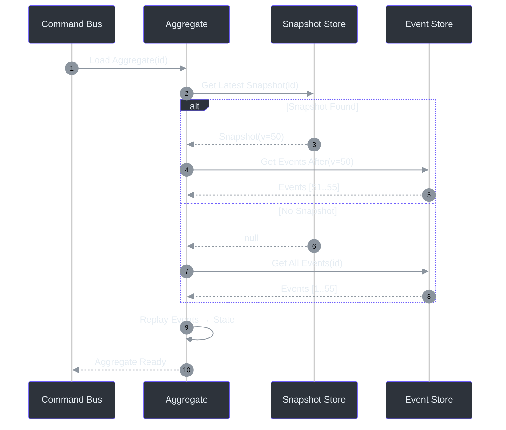
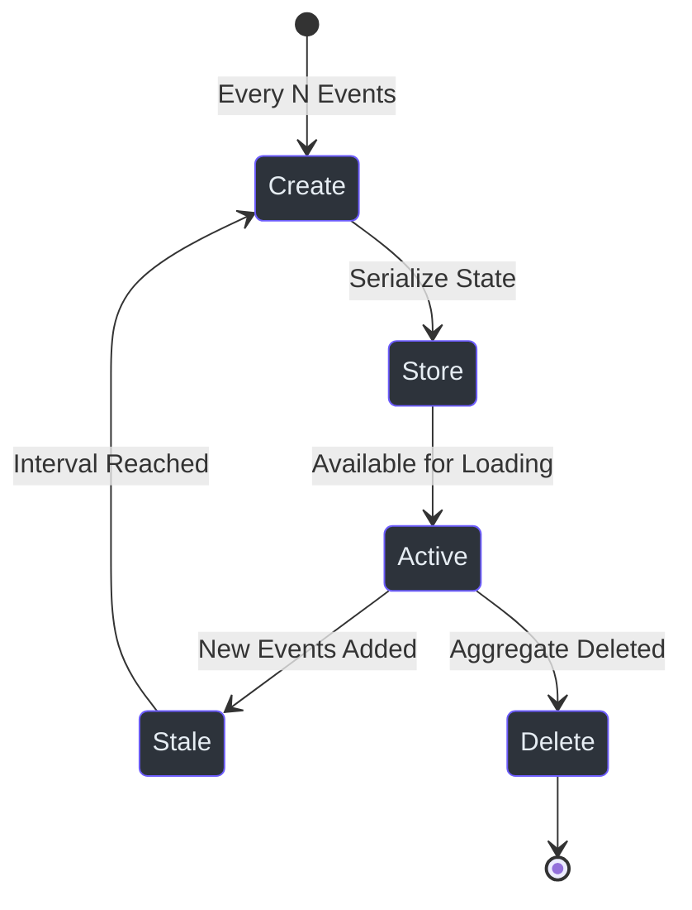

# Snapshot Store

The Snapshot Store optimizes aggregate loading by persisting aggregate state snapshots, avoiding the need to replay all historical events.

## Why Snapshots?

Without snapshots, loading an aggregate requires replaying ALL historical events. For long-lived aggregates with thousands of events, this becomes a performance bottleneck. Snapshots capture the aggregate state at a point in time, so only events after the snapshot need to be replayed.

<!-- Sources: wow-core/src/main/kotlin/me/ahoo/wow/event/snapshot/, wow-api/src/main/kotlin/me/ahoo/wow/api/event/snapshot/ -->

## Snapshot Lifecycle

<!-- Sources: wow-core/src/main/kotlin/me/ahoo/wow/event/snapshot/SnapshotHandler.kt -->

## Configuration

| Property | Default | Description |
|----------|---------|-------------|
| `wow.snapshot.enabled` | `false` | Enable snapshot store |
| `wow.snapshot.interval` | `100` | Events before new snapshot |
| `wow.snapshot.store.type` | Event store backend | Snapshot storage backend |

## Supported Backends

| Backend | Module | Status |
|---------|--------|--------|
| MongoDB | `wow-mongo` | Production-ready |
| Redis | `wow-redis` | Production-ready |
| R2DBC | `wow-r2dbc` | Production-ready |

## Performance Impact

Snapshots dramatically reduce load time for long-lived aggregates. With a snapshot interval of 50, an aggregate with 1000 events replays at most 49 events instead of all 1000 — a ~95% reduction.

## Related Pages

- [Event Store](./event-store) — Event persistence layer
- [Aggregate Lifecycle](../architecture/aggregate-lifecycle) — Loading and state flow
- [Configuration](../../guide/configuration) — Snapshot configuration
