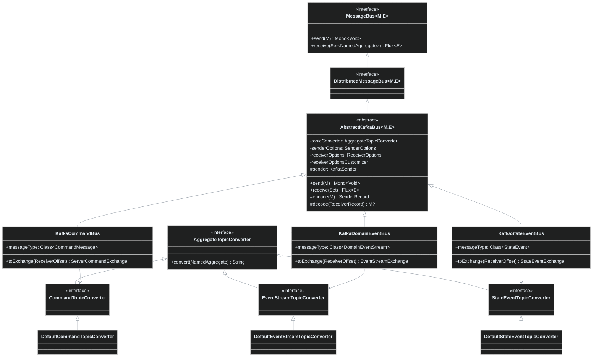
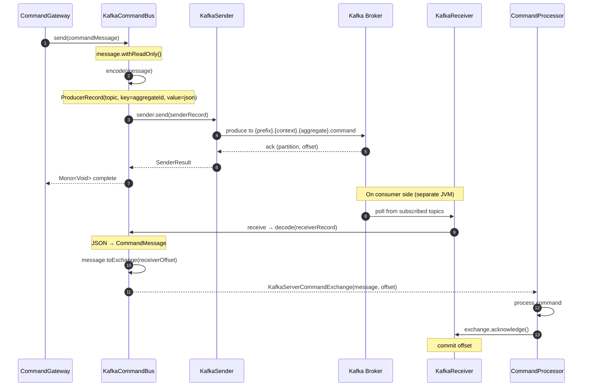
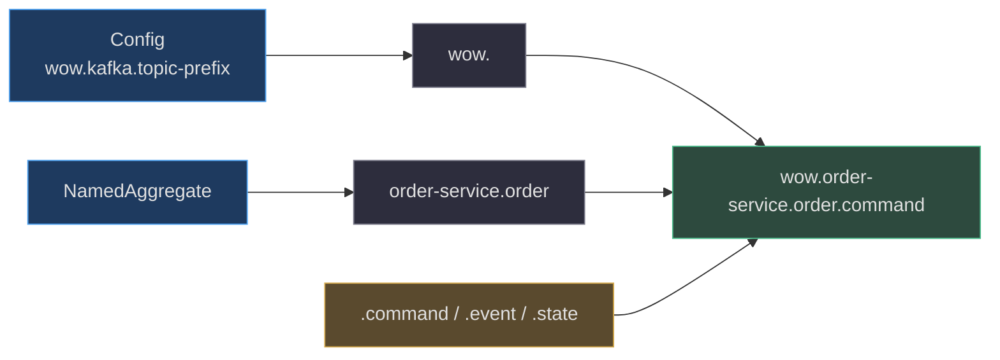
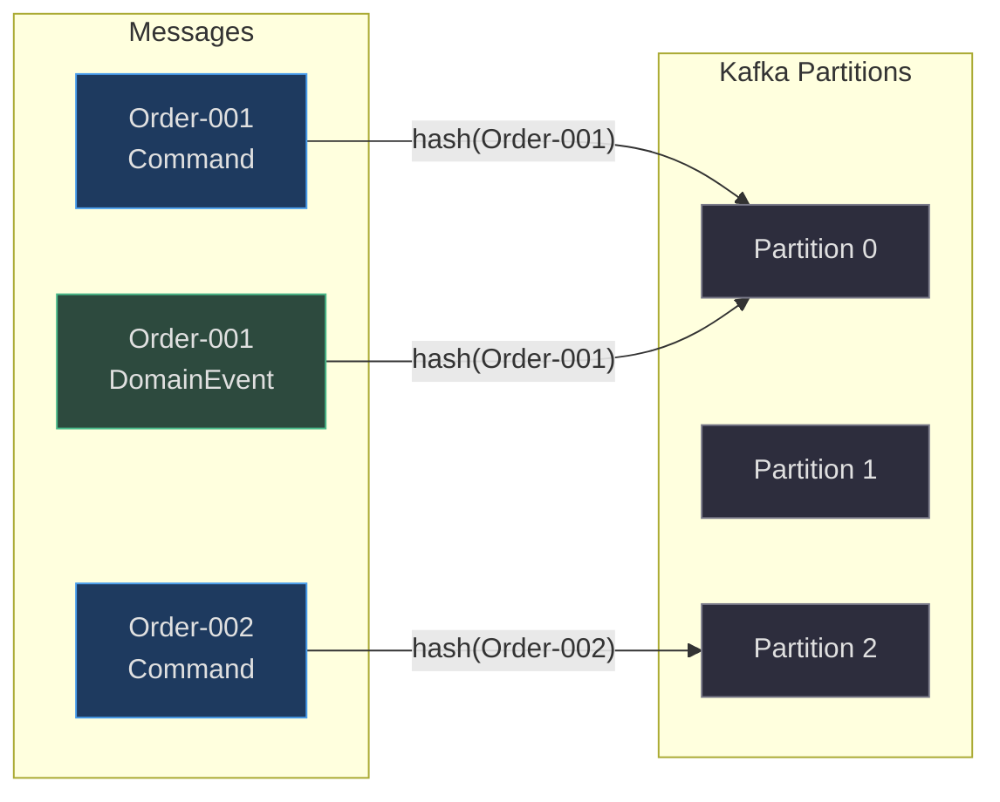
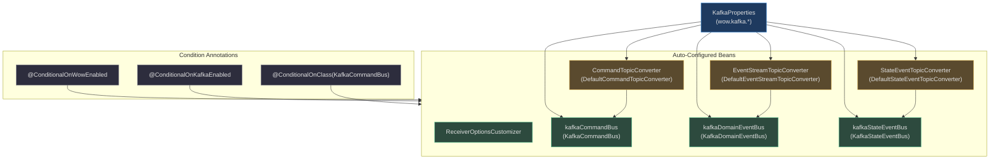

# Kafka Integration

Apache Kafka is the **default and recommended distributed message bus** implementation in the Wow framework. The `wow-kafka` module provides three concrete bus implementations -- `KafkaCommandBus`, `KafkaDomainEventBus`, and `KafkaStateEventBus` -- all built on top of a shared reactive pipeline powered by [reactor-kafka](https://projectreactor.io/docs/kafka/release/reference/).

This page is a deep-dive into the internals, configuration, and operational mechanics of the Kafka integration. For a high-level extension guide, see [Kafka Extension Guide](../../../documentation/docs/en/guide/extensions/kafka.md). For configuration reference, see [Kafka Configuration](../../reference/config/kafka.md).

---

## At-a-Glance Summary

| Aspect | Detail | Source |
|---|---|---|
| **Module** | `wow-kafka` | [build.gradle.kts](https://github.com/Ahoo-Wang/Wow/blob/main/wow-kafka/build.gradle.kts) |
| **Dependency** | `me.ahoo.wow:wow-kafka` | [build.gradle.kts:2](https://github.com/Ahoo-Wang/Wow/blob/main/wow-kafka/build.gradle.kts#L2) |
| **Transports** | `reactor-kafka` (reactive wrapper over Apache Kafka client) | [build.gradle.kts:3](https://github.com/Ahoo-Wang/Wow/blob/main/wow-kafka/build.gradle.kts#L3) |
| **Bus implementations** | `KafkaCommandBus`, `KafkaDomainEventBus`, `KafkaStateEventBus` | [KafkaCommandBus.kt:27](https://github.com/Ahoo-Wang/Wow/blob/main/wow-kafka/src/main/kotlin/me/ahoo/wow/kafka/KafkaCommandBus.kt#L27), [KafkaDomainEventBus.kt:22](https://github.com/Ahoo-Wang/Wow/blob/main/wow-kafka/src/main/kotlin/me/ahoo/wow/kafka/KafkaDomainEventBus.kt#L22), [KafkaStateEventBus.kt:22](https://github.com/Ahoo-Wang/Wow/blob/main/wow-kafka/src/main/kotlin/me/ahoo/wow/kafka/KafkaStateEventBus.kt#L22) |
| **Auto-configuration** | `KafkaAutoConfiguration` | [KafkaAutoConfiguration.kt:48](https://github.com/Ahoo-Wang/Wow/blob/main/wow-spring-boot-starter/src/main/kotlin/me/ahoo/wow/spring/boot/starter/kafka/KafkaAutoConfiguration.kt#L48) |
| **Config prefix** | `wow.kafka` | [KafkaProperties.kt:40](https://github.com/Ahoo-Wang/Wow/blob/main/wow-spring-boot-starter/src/main/kotlin/me/ahoo/wow/spring/boot/starter/kafka/KafkaProperties.kt#L40) |
| **Default bus type** | `kafka` | [BusProperties.kt:22](https://github.com/Ahoo-Wang/Wow/blob/main/wow-spring-boot-starter/src/main/kotlin/me/ahoo/wow/spring/boot/starter/BusProperties.kt#L22) |
| **Enabled by default** | `wow.kafka.enabled = true` | [KafkaProperties.kt:29](https://github.com/Ahoo-Wang/Wow/blob/main/wow-spring-boot-starter/src/main/kotlin/me/ahoo/wow/spring/boot/starter/kafka/KafkaProperties.kt#L29) |

---

## Architecture Overview

### Class Hierarchy

All three Kafka bus implementations extend `AbstractKafkaBus`, which itself implements the `DistributedMessageBus` interface. Each bus specializes in one message type, producing and consuming from dedicated Kafka topics.



<!-- Sources: wow-kafka/AbstractKafkaBus.kt, wow-kafka/KafkaCommandBus.kt, wow-kafka/KafkaDomainEventBus.kt, wow-kafka/KafkaStateEventBus.kt, wow-kafka/AggregateTopicConverter.kt, wow-core/command/CommandBus.kt, wow-core/event/DomainEventBus.kt, wow-core/eventsourcing/state/StateEventBus.kt -->

The `AbstractKafkaBus` base class centralizes the entire reactive send/receive pipeline using `reactor-kafka`. It wraps a `KafkaSender` for producing messages and configures a `KafkaReceiver` per subscription for consuming them. Each concrete subclass only needs to declare its `messageType` (used for JSON deserialization) and a `toExchange` factory method that constructs the acknowledgment-bearing exchange object.

### Three Buses, Three Topic Kinds

| Bus | Core Interface | Message Type | Exchange Type | Topic Suffix | Source |
|---|---|---|---|---|---|
| `KafkaCommandBus` | `DistributedCommandBus` | `CommandMessage<*>` | `KafkaServerCommandExchange` | `.command` | [KafkaCommandBus.kt:27-45](https://github.com/Ahoo-Wang/Wow/blob/main/wow-kafka/src/main/kotlin/me/ahoo/wow/kafka/KafkaCommandBus.kt#L27-L45) |
| `KafkaDomainEventBus` | `DistributedDomainEventBus` | `DomainEventStream` | `KafkaEventStreamExchange` | `.event` | [KafkaDomainEventBus.kt:22-41](https://github.com/Ahoo-Wang/Wow/blob/main/wow-kafka/src/main/kotlin/me/ahoo/wow/kafka/KafkaDomainEventBus.kt#L22-L41) |
| `KafkaStateEventBus` | `DistributedStateEventBus` | `StateEvent<*>` | `KafkaStateEventExchange` | `.state` | [KafkaStateEventBus.kt:22-41](https://github.com/Ahoo-Wang/Wow/blob/main/wow-kafka/src/main/kotlin/me/ahoo/wow/kafka/KafkaStateEventBus.kt#L22-L41) |

---

## End-to-End Message Flow

The following sequence diagram traces the lifecycle of a command through the Kafka bus, from the `CommandGateway` through Kafka to the `CommandProcessor` on the receiving end. Domain events and state events follow an identical pattern with their respective topic converters and exchange types.



<!-- Sources: wow-kafka/AbstractKafkaBus.kt:52-95 (send/receive methods), wow-kafka/KafkaServerCommandExchange.kt:22-32 (acknowledge), wow-kafka/KafkaCommandBus.kt:27-45 (toExchange) -->

Key behavioral characteristics visible in the flow:

1. **Non-blocking reactive pipeline**: Both `send` and `receive` return reactive types (`Mono<Void>`, `Flux<E>`) -- the sender never blocks.
2. **Read-only marking**: Every message is marked read-only before serialization at [AbstractKafkaBus.kt:57](https://github.com/Ahoo-Wang/Wow/blob/main/wow-kafka/src/main/kotlin/me/ahoo/wow/kafka/AbstractKafkaBus.kt#L57), preventing accidental mutation.
3. **Partition key is aggregate ID**: The record key is always set to `message.aggregateId.id` at [AbstractKafkaBus.kt:106](https://github.com/Ahoo-Wang/Wow/blob/main/wow-kafka/src/main/kotlin/me/ahoo/wow/kafka/AbstractKafkaBus.kt#L106), guaranteeing ordered processing per aggregate.
4. **Manual offset management**: Offsets are acknowledged explicitly via `exchange.acknowledge()` rather than auto-committed, giving the processor full control over at-least-once delivery semantics. Auto-commit is deliberately disabled.

---

## Topic Naming and Partitioning

### Topic Naming Convention

Topics are derived from three components: the configurable **prefix**, the **named aggregate** (context + aggregate name), and a **fixed suffix** per bus type. This is implemented by the three default `AggregateTopicConverter` implementations.

<!-- Source: AggregateTopicConverter.kt -->



<!-- Sources: wow-kafka/AggregateTopicConverter.kt:28-55 (DefaultCommandTopicConverter, DefaultEventStreamTopicConverter, DefaultStateEventTopicConverter) -->

| Converter Class | Suffix | Implements | Source |
|---|---|---|---|
| `DefaultCommandTopicConverter` | `command` | `CommandTopicConverter` | [AggregateTopicConverter.kt:28-36](https://github.com/Ahoo-Wang/Wow/blob/main/wow-kafka/src/main/kotlin/me/ahoo/wow/kafka/AggregateTopicConverter.kt#L28-L36) |
| `DefaultEventStreamTopicConverter` | `event` | `EventStreamTopicConverter` | [AggregateTopicConverter.kt:38-46](https://github.com/Ahoo-Wang/Wow/blob/main/wow-kafka/src/main/kotlin/me/ahoo/wow/kafka/AggregateTopicConverter.kt#L38-L46) |
| `DefaultStateEventTopicConverter` | `state` | `StateEventTopicConverter` | [AggregateTopicConverter.kt:48-56](https://github.com/Ahoo-Wang/Wow/blob/main/wow-kafka/src/main/kotlin/me/ahoo/wow/kafka/AggregateTopicConverter.kt#L48-L56) |

The topic prefix defaults to `"wow."` (the `Wow.WOW_PREFIX` constant defined at [Wow.kt:37](https://github.com/Ahoo-Wang/Wow/blob/main/wow-api/src/main/kotlin/me/ahoo/wow/api/Wow.kt#L37)), but can be customized for multi-tenant or multi-environment deployments.

### Partitioning Strategy

The framework uses the aggregate root ID as the Kafka partition key. This means all messages (commands, events, state events) for a given aggregate instance land on the same partition, guaranteeing strict total ordering per aggregate.



<!-- Sources: wow-kafka/AbstractKafkaBus.kt:97-111 (encode method, key = aggregateId.id) -->

This design is foundational for Event Sourcing: events must be consumed in publish-order to reconstruct aggregate state correctly. The partition key enforcement at the broker level makes this resilient across consumer rebalances.

---

## Configuration

### Configuration Properties

All Kafka configuration is centralized in the `KafkaProperties` class, bound under the `wow.kafka` prefix.

<!-- Source: wow-spring-boot-starter/kafka/KafkaProperties.kt -->

| Property | Type | Default | Required | Description | Source |
|---|---|---|---|---|---|
| `wow.kafka.enabled` | `Boolean` | `true` | No | Master switch to enable/disable Kafka integration | [KafkaProperties.kt:29](https://github.com/Ahoo-Wang/Wow/blob/main/wow-spring-boot-starter/src/main/kotlin/me/ahoo/wow/spring/boot/starter/kafka/KafkaProperties.kt#L29) |
| `wow.kafka.bootstrap-servers` | `List<String>` | -- | **Yes** | Comma-separated list of Kafka broker addresses | [KafkaProperties.kt:30](https://github.com/Ahoo-Wang/Wow/blob/main/wow-spring-boot-starter/src/main/kotlin/me/ahoo/wow/spring/boot/starter/kafka/KafkaProperties.kt#L30) |
| `wow.kafka.topic-prefix` | `String` | `"wow."` | No | Prefix prepended to all auto-created topic names | [KafkaProperties.kt:31](https://github.com/Ahoo-Wang/Wow/blob/main/wow-spring-boot-starter/src/main/kotlin/me/ahoo/wow/spring/boot/starter/kafka/KafkaProperties.kt#L31) |
| `wow.kafka.properties` | `Map<String, String>` | `{}` | No | Common properties applied to both producer and consumer | [KafkaProperties.kt:35](https://github.com/Ahoo-Wang/Wow/blob/main/wow-spring-boot-starter/src/main/kotlin/me/ahoo/wow/spring/boot/starter/kafka/KafkaProperties.kt#L35) |
| `wow.kafka.producer` | `Map<String, String>` | `{}` | No | Producer-specific Kafka client properties | [KafkaProperties.kt:36](https://github.com/Ahoo-Wang/Wow/blob/main/wow-spring-boot-starter/src/main/kotlin/me/ahoo/wow/spring/boot/starter/kafka/KafkaProperties.kt#L36) |
| `wow.kafka.consumer` | `Map<String, String>` | `{}` | No | Consumer-specific Kafka client properties | [KafkaProperties.kt:37](https://github.com/Ahoo-Wang/Wow/blob/main/wow-spring-boot-starter/src/main/kotlin/me/ahoo/wow/spring/boot/starter/kafka/KafkaProperties.kt#L37) |

### How SenderOptions and ReceiverOptions Are Built

The `KafkaProperties` class provides two builder methods that merge the common `properties` map with the type-specific `producer` or `consumer` maps:

- `buildSenderOptions()` -- merges `properties` + `producer`, auto-sets `KEY_SERIALIZER_CLASS_CONFIG` and `VALUE_SERIALIZER_CLASS_CONFIG` to `StringSerializer` at [KafkaProperties.kt:47-56](https://github.com/Ahoo-Wang/Wow/blob/main/wow-spring-boot-starter/src/main/kotlin/me/ahoo/wow/spring/boot/starter/kafka/KafkaProperties.kt#L47-L56).
- `buildReceiverOptions()` -- merges `properties` + `consumer`, auto-sets deserializers to `StringDeserializer` at [KafkaProperties.kt:58-67](https://github.com/Ahoo-Wang/Wow/blob/main/wow-spring-boot-starter/src/main/kotlin/me/ahoo/wow/spring/boot/starter/kafka/KafkaProperties.kt#L58-L67).

All serialization is performed at the application layer as JSON strings (via `message.toJsonString()` in [AbstractKafkaBus.kt:108](https://github.com/Ahoo-Wang/Wow/blob/main/wow-kafka/src/main/kotlin/me/ahoo/wow/kafka/AbstractKafkaBus.kt#L108)), so the Kafka client only needs to transport raw strings. This avoids coupling the broker to any domain-specific serialization format.

### Bus Type Selection

Each bus (command, domain event, state event) can independently select its implementation via the `*.bus.type` property. Kafka is the **default** for all three, as defined in `BusProperties`:

<!-- Source: wow-spring-boot-starter/BusProperties.kt -->

| Property | Default | Source |
|---|---|---|
| `wow.command.bus.type` | `kafka` | [BusProperties.kt:22](https://github.com/Ahoo-Wang/Wow/blob/main/wow-spring-boot-starter/src/main/kotlin/me/ahoo/wow/spring/boot/starter/BusProperties.kt#L22) |
| `wow.event.bus.type` | `kafka` | via `BusProperties` |
| `wow.eventsourcing.state.bus.type` | `kafka` | via `BusProperties` |

Valid values are: `kafka`, `redis`, `in_memory`, `no_op` -- defined in the `BusType` enum at [BusProperties.kt:33-45](https://github.com/Ahoo-Wang/Wow/blob/main/wow-spring-boot-starter/src/main/kotlin/me/ahoo/wow/spring/boot/starter/BusProperties.kt#L33-L45).

### Receiver Retry Policy

When a `KafkaReceiver` encounters a transient error during polling, it retries up to **3 times with a 10-second backoff** before propagating the error:

```kotlin
// Source: wow-kafka/KafkaCommandBus.kt:25
internal val DEFAULT_RECEIVE_RETRY_SPEC: RetryBackoffSpec = Retry.backoff(3, Duration.ofSeconds(10))
```

This is applied at [AbstractKafkaBus.kt:89](https://github.com/Ahoo-Wang/Wow/blob/main/wow-kafka/src/main/kotlin/me/ahoo/wow/kafka/AbstractKafkaBus.kt#L89) via `.retryWhen(DEFAULT_RECEIVE_RETRY_SPEC)`.

---

## Auto-Configuration

The `KafkaAutoConfiguration` class wires all beans when Kafka is enabled and the `wow-kafka` module is on the classpath.

### Bean Wiring

<!-- Source: wow-spring-boot-starter/kafka/KafkaAutoConfiguration.kt -->



<!-- Sources: wow-spring-boot-starter/kafka/KafkaAutoConfiguration.kt:43-127, wow-spring-boot-starter/kafka/ConditionalOnKafkaEnabled.kt:19-24, wow-spring-boot-starter/kafka/KafkaProperties.kt:27-68 -->

Each bus bean is guarded by a `@ConditionalOnProperty` check against the corresponding `*.bus.type` property. This means you can selectively disable Kafka for specific message types:

```yaml
wow:
  command:
    bus:
      type: kafka       # Commands via Kafka (default)
  event:
    bus:
      type: in_memory   # Domain events locally only
  eventsourcing:
    state:
      bus:
        type: kafka     # State events via Kafka
```

### ConditionalOnKafkaEnabled

The custom `@ConditionalOnKafkaEnabled` annotation is a focused composition that enables/disables the entire `KafkaAutoConfiguration` class. It checks `wow.kafka.enabled = true` (matching if missing), defined at [ConditionalOnKafkaEnabled.kt:19-24](https://github.com/Ahoo-Wang/Wow/blob/main/wow-spring-boot-starter/src/main/kotlin/me/ahoo/wow/spring/boot/starter/kafka/ConditionalOnKafkaEnabled.kt#L19-L24).

### ReceiverOptionsCustomizer

The `ReceiverOptionsCustomizer` interface allows injecting custom behavior into the `KafkaReceiver` creation pipeline. Each concrete bus accepts an optional customizer, and the auto-configuration registers a `NoOpReceiverOptionsCustomizer` as the default. Flow-based customizers can also be provided via Reactor's `ContextView` mechanism ([ReceiverOptionsCustomizer.kt:31-37](https://github.com/Ahoo-Wang/Wow/blob/main/wow-kafka/src/main/kotlin/me/ahoo/wow/kafka/ReceiverOptionsCustomizer.kt#L31-L37)).

---

## Consumer Groups

Each processor corresponds to an independent Kafka consumer group. The group ID is derived from the Reactor `ContextView` via the `getReceiverGroup()` extension function:

```
{contextName}.{processorName}
```

For example: `order-service.OrderProjectionProcessor`.

This is set at [AbstractKafkaBus.kt:81-84](https://github.com/Ahoo-Wang/Wow/blob/main/wow-kafka/src/main/kotlin/me/ahoo/wow/kafka/AbstractKafkaBus.kt#L81-L84), where the `ConsumerConfig.GROUP_ID_CONFIG` property is dynamically injected into the `ReceiverOptions` based on the current processing context. This ensures each processor instance independently tracks its own offset, enabling parallel consumption across processor types while maintaining ordering within each consumer group.

---

## Installation

### Gradle (Kotlin DSL)

```kotlin
// Source: wow-kafka/build.gradle.kts
implementation("me.ahoo.wow:wow-kafka")
```

### Gradle (Groovy DSL)

```groovy
implementation 'me.ahoo.wow:wow-kafka'
```

### Maven

```xml
<dependency>
    <groupId>me.ahoo.wow</groupId>
    <artifactId>wow-kafka</artifactId>
    <version>${wow.version}</version>
</dependency>
```

### Spring Boot Starter Feature Variant

When using `wow-spring-boot-starter`, the Kafka integration is included as an optional feature capability (`kafka-support`). Add it explicitly if the starter is used without the full dependency set:

```kotlin
implementation("me.ahoo.wow:wow-spring-boot-starter")
implementation("me.ahoo.wow:wow-kafka")
```

---

## Deployment Examples

### Minimal Production Configuration

```yaml
# Source: wow-spring-boot-starter/kafka/KafkaProperties.kt

wow:
  kafka:
    enabled: true
    bootstrap-servers:
      - kafka-broker-1:9092
      - kafka-broker-2:9092
      - kafka-broker-3:9092
    topic-prefix: 'wow.'
    producer:
      acks: all
      retries: 3
      compression.type: lz4
      enable.idempotence: true
    consumer:
      enable.auto.commit: false
      auto.offset.reset: earliest
```

### Complete Configuration with Security

```yaml
wow:
  command:
    bus:
      type: kafka
      local-first:
        enabled: true
  event:
    bus:
      type: kafka
      local-first:
        enabled: true
  eventsourcing:
    state:
      bus:
        type: kafka
        local-first:
          enabled: true
  kafka:
    enabled: true
    bootstrap-servers:
      - kafka-0:9092
      - kafka-1:9092
      - kafka-2:9092
    topic-prefix: 'wow.'
    properties:
      security.protocol: SASL_SSL
      sasl.mechanism: PLAIN
      sasl.jaas.config: 'org.apache.kafka.common.security.plain.PlainLoginModule required username="wow-client" password="secret";'
    producer:
      acks: all
      retries: 3
      batch.size: 16384
      linger.ms: 5
      compression.type: lz4
      enable.idempotence: true
      max.in.flight.requests.per.connection: 5
    consumer:
      fetch.min.bytes: 1024
      fetch.max.wait.ms: 500
      max.poll.records: 500
      enable.auto.commit: false
      session.timeout.ms: 30000
      heartbeat.interval.ms: 10000
      auto.offset.reset: earliest
```

### Development/Testing Configuration

For local development using Docker Compose with a single-node Kafka:

```yaml
wow:
  kafka:
    bootstrap-servers:
      - localhost:9092
    topic-prefix: 'dev.wow.'
    producer:
      acks: 1
      retries: 1
    consumer:
      auto.offset.reset: latest
      session.timeout.ms: 10000
```

---

## Key Design Decisions

This section explains the "why" behind several architectural choices in the Kafka integration.

### 1. String Serialization at the Kafka Layer

The Kafka client always uses `StringSerializer`/`StringDeserializer` ([KafkaProperties.kt:50-51, 61-62](https://github.com/Ahoo-Wang/Wow/blob/main/wow-spring-boot-starter/src/main/kotlin/me/ahoo/wow/spring/boot/starter/kafka/KafkaProperties.kt#L50-L62)). Domain objects are serialized to JSON strings by the application (`message.toJsonString()` at [AbstractKafkaBus.kt:108](https://github.com/Ahoo-Wang/Wow/blob/main/wow-kafka/src/main/kotlin/me/ahoo/wow/kafka/AbstractKafkaBus.kt#L108)) before being handed to the producer. This decouples the Kafka wire format from the domain serialization format -- you can change serialization strategies without touching Kafka configuration.

### 2. Read-Only Message Protection

Before serialization, each message is marked as read-only via `message.withReadOnly()` at [AbstractKafkaBus.kt:57](https://github.com/Ahoo-Wang/Wow/blob/main/wow-kafka/src/main/kotlin/me/ahoo/wow/kafka/AbstractKafkaBus.kt#L57). This prevents accidental mutation of message state during transmission, a critical invariant for Event Sourcing where events must be immutable.

### 3. Manual Offset Acknowledgment

Auto-commit is disabled by the framework. Instead, each `Exchange` implementation (`KafkaServerCommandExchange`, `KafkaEventStreamExchange`, `KafkaStateEventExchange`) wraps a `ReceiverOffset` and exposes an `acknowledge()` method. The processor calls this after successful processing, giving full control over at-least-once semantics. If processing fails, the offset is not acknowledged and the message is re-delivered.

### 4. Correlation Metadata for Send Feedback

When sending, each `SenderRecord` carries a `Sinks.Empty<Void>` as correlation metadata ([AbstractKafkaBus.kt:110](https://github.com/Ahoo-Wang/Wow/blob/main/wow-kafka/src/main/kotlin/me/ahoo/wow/kafka/AbstractKafkaBus.kt#L110)). The send result is either an error-emit or an empty-completion, providing back-pressure-aware send confirmation to the caller.

---

## Monitoring and Observability

While Kafka broker metrics (consumer lag, request rate, ISR) should be monitored at the infrastructure level, the Wow framework contributes several application-level signals:

| Signal | Source | What It Reveals |
|---|---|---|
| Send errors | `doOnNext` in [AbstractKafkaBus.kt:60-67](https://github.com/Ahoo-Wang/Wow/blob/main/wow-kafka/src/main/kotlin/me/ahoo/wow/kafka/AbstractKafkaBus.kt#L60-L67) | Kafka broker unavailability, topic creation issues |
| Decode errors | `decode()` in [AbstractKafkaBus.kt:114-122](https://github.com/Ahoo-Wang/Wow/blob/main/wow-kafka/src/main/kotlin/me/ahoo/wow/kafka/AbstractKafkaBus.kt#L114-L122) | Schema/version mismatch, corrupted messages |
| Receiver retry | `DEFAULT_RECEIVE_RETRY_SPEC` at [KafkaCommandBus.kt:25](https://github.com/Ahoo-Wang/Wow/blob/main/wow-kafka/src/main/kotlin/me/ahoo/wow/kafka/KafkaCommandBus.kt#L25) | Transient broker/network failures |
| Close events | `close()` in [AbstractKafkaBus.kt:125-130](https://github.com/Ahoo-Wang/Wow/blob/main/wow-kafka/src/main/kotlin/me/ahoo/wow/kafka/AbstractKafkaBus.kt#L125-L130) | Graceful shutdown coverage |

For detailed metrics integration, see the [Observability guide](../../../documentation/docs/en/guide/advanced/observability.md) and [OpenTelemetry Extension](../../../documentation/docs/en/guide/extensions/opentelemetry.md).

---

## Troubleshooting

### Connection Timeout

**Symptom**: `org.apache.kafka.common.errors.TimeoutException: Failed to update metadata`

**Causes and solutions**:
- Verify `wow.kafka.bootstrap-servers` addresses are reachable from the application host.
- Check network connectivity and firewall rules between the application and Kafka brokers.
- Confirm the Kafka broker process is running and listening on the configured ports.

### Unknown Topic or Partition

**Symptom**: `org.apache.kafka.common.errors.UnknownTopicOrPartitionException`

**Solutions**:
- Ensure the Kafka broker has `auto.create.topics.enable=true` (default), or pre-create the required topics manually.
- Verify the `topic-prefix` configuration matches the expected topic names.
- Check that the application's Kafka principal has `CREATE` and `DESCRIBE` permissions on the target topics.

### Frequent Consumer Rebalancing

**Symptom**: Consumer groups experience repeated rebalances, causing processing pauses.

**Solutions**:
- Increase `session.timeout.ms` and `heartbeat.interval.ms` in the consumer configuration.
- Reduce `max.poll.records` to shorten the time between polls.
- Ensure message processing time is consistently below `max.poll.interval.ms` (default 5 minutes).
- Verify that each processor instance has a unique `group.id` derived from its context and processor name.

### Message Decoding Failures

**Symptom**: Error logs from `decode()` showing `Failed to decode ReceiverRecord`

**Solutions**:
- Verify all producers and consumers are running the same version of `wow-kafka` and domain model classes.
- Check that the domain event or command class has not been modified in a backward-incompatible way.
- Use schema evolution strategies (see [Schema Extension](../../../documentation/docs/en/guide/advanced/schema.md)) for production deployments.

---

## Best Practices

1. **Enable LocalFirst mode**: The `local-first` bus configuration (enabled by default at [BusProperties.kt:22](https://github.com/Ahoo-Wang/Wow/blob/main/wow-spring-boot-starter/src/main/kotlin/me/ahoo/wow/spring/boot/starter/BusProperties.kt#L22)) routes messages locally within the same JVM when the handler is co-located, reducing Kafka round-trips for intra-service communication.

2. **Enable idempotent producer**: Set `enable.idempotence: true` in the producer configuration to guarantee exactly-once delivery at the producer level, preventing duplicate messages during retry scenarios.

3. **Use compression**: Enable `compression.type: lz4` in the producer configuration to reduce network bandwidth and storage overhead. LZ4 offers an excellent balance of compression ratio and CPU cost.

4. **Match partition count to topology**: Configure the number of Kafka partitions based on the expected consumer parallelism. Since ordering is per-partition (per aggregate ID), a higher partition count increases parallelism but does not affect ordering guarantees.

5. **Monitor consumer lag**: Track consumer group lag as a primary health metric. Lag exceeding the business SLA threshold indicates processing bottlenecks that need investigation.

6. **Test with Testcontainers**: The `wow-kafka` test dependencies include `testcontainers-kafka`. Use `wow-tck` (Technology Compatibility Kit) tests as a reference for integration testing patterns.

7. **Customize the topic prefix per environment**: Use distinct `topic-prefix` values for development, staging, and production to isolate message streams (e.g., `dev.wow.`, `staging.wow.`, `wow.`).

---

## Related Pages

| Page | Description |
|---|---|
| [Kafka Extension Guide](../../../documentation/docs/en/guide/extensions/kafka.md) | High-level extension overview and basic configuration |
| [Kafka Configuration Reference](../../reference/config/kafka.md) | Complete property reference for `wow.kafka.*` |
| [Spring Boot Starter Extension](../../../documentation/docs/en/guide/extensions/spring-boot-starter.md) | Auto-configuration and feature variants |
| [Command Bus Architecture](../../../documentation/docs/en/guide/command-gateway.md) | Command gateway and wait strategies |
| [Domain Event Bus](../../../documentation/docs/en/guide/event-processor.md) | Event processing pipeline |
| [State Event Bus (Event Sourcing)](../../../documentation/docs/en/reference/config/eventsourcing.md) | State event configuration reference |
| [Observability Guide](../../../documentation/docs/en/guide/advanced/observability.md) | Monitoring and tracing integration |
| [Redis Integration](redis.md) | Alternative bus implementation using Redis Streams |
| [Configuration Overview](../../../documentation/docs/en/guide/configuration.md) | Framework configuration principles |
