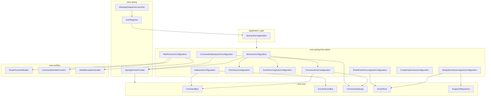
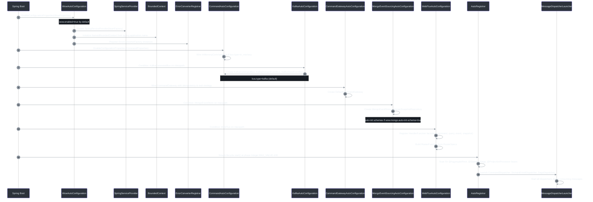
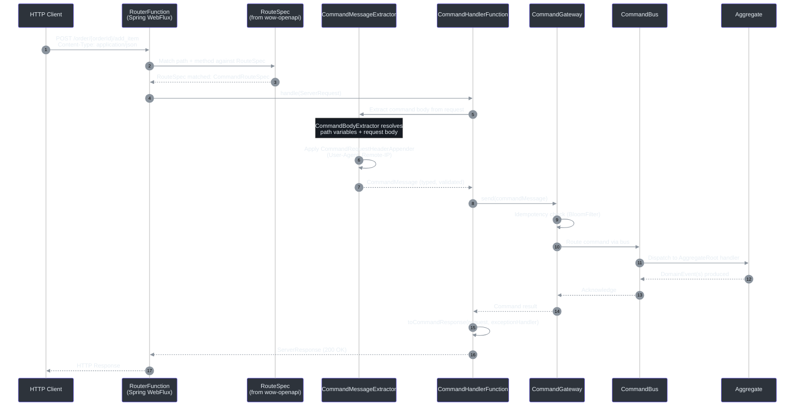

# Spring Boot Integration

The Wow framework provides first-class Spring Boot integration through two core modules: `wow-spring` (Spring context bridging) and `wow-spring-boot-starter` (auto-configuration with Gradle feature capabilities). Together they enable automatic bean wiring, lifecycle-aware message dispatcher management, and declarative REST APIs via [WebFlux routing](#webflux-command-endpoint-flow).

## Integration Philosophy

Wow's Spring Boot integration follows three design principles:

1. **Convention over configuration** -- All framework components auto-wire based on classpath detection and sensible defaults. You only configure what you need to override.
2. **Gradual capability adoption** -- Each subsystem (Kafka, MongoDB, Redis, WebFlux, etc.) is a separate Gradle feature capability. Add only what your service requires.
3. **Spring-native lifecycle** -- Dispatchers implement `SmartLifecycle` for graceful start/stop within the Spring ApplicationContext. The framework respects `@ConditionalOnMissingBean` so you can override any default bean without disabling auto-configuration.

## Architecture Overview

The integration spans three layers: the **Spring bridge** (`wow-spring`), the **auto-configuration engine** (`wow-spring-boot-starter`), and the **WebFlux presentation** layer (`wow-webflux`).



<!-- Sources: WowAutoConfiguration.kt:37-72, CommandAutoConfiguration.kt:38-100, EventAutoConfiguration.kt:34-82, EventSourcingAutoConfiguration.kt:24-36, CommandGatewayAutoConfiguration.kt:46-145, KafkaAutoConfiguration.kt:43-127, MongoEventSourcingAutoConfiguration.kt:47-162, RedisEventSourcingAutoConfiguration.kt:39-75, WebFluxAutoConfiguration.kt:94-582, CompensationAutoConfiguration.kt:27-56, SpringServiceProvider.kt:24-62, AutoRegistrar.kt:28-71, MessageDispatcherLauncher.kt:21-43 -->

## Feature Capabilities

The starter uses Gradle feature variants to declare **optional dependency groups**. You add each capability to your build file based on what your service requires -- unneeded dependencies are never on the classpath.

| Capability | Feature Key | Module Brought In | What It Provides | Source |
|---|---|---|---|---|
| **Kafka** | `kafka-support` | `wow-kafka` | `KafkaCommandBus`, `KafkaDomainEventBus`, `KafkaStateEventBus` | [build.gradle.kts:22-25](https://github.com/Ahoo-Wang/Wow/blob/main/wow-spring-boot-starter/build.gradle.kts#L22-L25) |
| **MongoDB** | `mongo-support` | `wow-mongo` | `MongoEventStore`, `MongoSnapshotRepository`, query service factories | [build.gradle.kts:6-9](https://github.com/Ahoo-Wang/Wow/blob/main/wow-spring-boot-starter/build.gradle.kts#L6-L9) |
| **Redis** | `redis-support` | `wow-redis` | `RedisEventStore`, `RedisSnapshotRepository`, `RedisMessageBus` | [build.gradle.kts:14-17](https://github.com/Ahoo-Wang/Wow/blob/main/wow-spring-boot-starter/build.gradle.kts#L14-L17) |
| **R2DBC** | `r2dbc-support` | `wow-r2dbc` | R2DBC-based `EventStore` and `SnapshotRepository` | [build.gradle.kts:10-13](https://github.com/Ahoo-Wang/Wow/blob/main/wow-spring-boot-starter/build.gradle.kts#L10-L13) |
| **Elasticsearch** | `elasticsearch-support` | `wow-elasticsearch` | Elasticsearch-backed projections | [build.gradle.kts:32-35](https://github.com/Ahoo-Wang/Wow/blob/main/wow-spring-boot-starter/build.gradle.kts#L32-L35) |
| **WebFlux** | `webflux-support` | `wow-webflux` | `RouterFunction`-based command endpoints, wait strategies, global error handling | [build.gradle.kts:27-30](https://github.com/Ahoo-Wang/Wow/blob/main/wow-spring-boot-starter/build.gradle.kts#L27-L30) |
| **OpenTelemetry** | `opentelemetry-support` | `wow-opentelemetry` | Distributed tracing and metrics via OpenTelemetry | [build.gradle.kts:36-39](https://github.com/Ahoo-Wang/Wow/blob/main/wow-spring-boot-starter/build.gradle.kts#L36-L39) |
| **OpenAPI** | `openapi-support` | `wow-openapi` | Automatic OpenAPI spec generation from command/event metadata | [build.gradle.kts:40-43](https://github.com/Ahoo-Wang/Wow/blob/main/wow-spring-boot-starter/build.gradle.kts#L40-L43) |
| **CoSec** | `cosec-support` | `wow-cosec` | Authorization via CoSec policy engine | [build.gradle.kts:44-47](https://github.com/Ahoo-Wang/Wow/blob/main/wow-spring-boot-starter/build.gradle.kts#L44-L47) |
| **Mock** | `mock-support` | `wow-mock` | In-memory test doubles for all stores | [build.gradle.kts:18-21](https://github.com/Ahoo-Wang/Wow/blob/main/wow-spring-boot-starter/build.gradle.kts#L18-L21) |

### Usage in Gradle

To add a capability in your Gradle build, declare it as a `capability` dependency:

```kotlin
// build.gradle.kts
dependencies {
    implementation("me.ahoo.wow:wow-spring-boot-starter")
    implementation("me.ahoo.wow:wow-spring-boot-starter") {
        capabilities {
            requireCapability("me.ahoo.wow:mongo-support")
            requireCapability("me.ahoo.wow:kafka-support")
            requireCapability("me.ahoo.wow:webflux-support")
        }
    }
}
```

## Auto-Configuration Sequence

The auto-configuration process follows Spring Boot's standard lifecycle but adds Wow-specific wiring steps: service provider registration, bounded context initialization, bus wiring based on config, and dispatcher launch ordering.



<!-- Sources: WowAutoConfiguration.kt:37-72, ConditionalOnWowEnabled.kt:19-27, CommandAutoConfiguration.kt:38-100, KafkaAutoConfiguration.kt:43-127, CommandGatewayAutoConfiguration.kt:46-145, MongoEventSourcingAutoConfiguration.kt:47-162, WebFluxAutoConfiguration.kt:94-582, AutoRegistrar.kt:28-71, MessageDispatcherLauncher.kt:21-43 -->

## Core Auto-Configuration (`WowAutoConfiguration`)

The central auto-configuration class, annotated with `@AutoConfiguration` and guarded by `@ConditionalOnWowEnabled`, registers the three foundation beans every Wow service needs.

| Bean | Type | Role | Source |
|---|---|---|---|
| `serviceProvider` | `SpringServiceProvider` | Bridges Spring's `BeanFactory` with Wow's `ServiceProvider` IOC abstraction | [WowAutoConfiguration.kt:47-51](https://github.com/Ahoo-Wang/Wow/blob/main/wow-spring-boot-starter/src/main/kotlin/me/ahoo/wow/spring/boot/starter/WowAutoConfiguration.kt#L47-L51) |
| `wowCurrentBoundedContext` | `MaterializedNamedBoundedContext` | Derives the context name from `wow.context-name` or `spring.application.name` and sets the global `CurrentBoundedContext` | [WowAutoConfiguration.kt:53-61](https://github.com/Ahoo-Wang/Wow/blob/main/wow-spring-boot-starter/src/main/kotlin/me/ahoo/wow/spring/boot/starter/WowAutoConfiguration.kt#L53-L61) |
| `errorConverterRegistrar` | `ErrorConverterRegistrar` | Collects all `ErrorConverterFactory` beans (sorted by `@Order`) and registers them globally | [WowAutoConfiguration.kt:63-71](https://github.com/Ahoo-Wang/Wow/blob/main/wow-spring-boot-starter/src/main/kotlin/me/ahoo/wow/spring/boot/starter/WowAutoConfiguration.kt#L63-L71) |

### How `SpringServiceProvider` Bridges to Spring

The `SpringServiceProvider` wraps a `ConfigurableBeanFactory` and translates Wow's IOC abstraction directly into Spring bean lookups. Service registration becomes `registerSingleton`, and service retrieval delegates to `getBeanProvider` with Kotlin `KType` to Spring `ResolvableType` conversion.

<!-- Source: SpringServiceProvider.kt:24-62 -->

```kotlin
// Core lookup: KType -> ResolvableType -> BeanProvider.getIfAvailable()
override fun <S : Any> getService(serviceType: KType): S? {
    val resolvableType = ResolvableType.forType(serviceType.javaType)
    return delegate.getBeanProvider<S>(resolvableType).getIfAvailable()
}
```

This design means Wow framework code never depends on Spring APIs directly -- it always resolves dependencies through the abstract `ServiceProvider` interface, which in production is backed by the Spring context.

### The `@ConditionalOnWowEnabled` Gate

A single meta-annotation gates all Wow auto-configuration classes. It checks `wow.enabled` (default: `true`) and acts as a master kill switch.

<!-- Source: ConditionalOnWowEnabled.kt:19-27 -->

```kotlin
@ConditionalOnProperty(
    value = [ConditionalOnWowEnabled.ENABLED_KEY],  // "wow.enabled"
    matchIfMissing = true,
    havingValue = "true",
)
annotation class ConditionalOnWowEnabled
```

Setting `wow.enabled=false` disables the entire framework in the current application context -- useful for integration test scenarios where you need a minimal Spring context.

## Bus Architecture and Local-First Optimization

Wow supports four bus types, each selectable via `wow.command.bus.type` and `wow.event.bus.type`. The bus architecture includes a **Local-First** optimization layer that routes messages to an in-memory bus when source and target are in the same JVM.

| Bus Type | Config Value | Behavior | Source |
|---|---|---|---|
| **Kafka** | `kafka` (default) | Distributed bus via Kafka topics; uses `KafkaCommandBus`, `KafkaDomainEventBus`, `KafkaStateEventBus` | [BusProperties.kt:21-46](https://github.com/Ahoo-Wang/Wow/blob/main/wow-spring-boot-starter/src/main/kotlin/me/ahoo/wow/spring/boot/starter/BusProperties.kt#L21-L46) |
| **Redis** | `redis` | Distributed bus via Redis pub/sub | [BusProperties.kt:34](https://github.com/Ahoo-Wang/Wow/blob/main/wow-spring-boot-starter/src/main/kotlin/me/ahoo/wow/spring/boot/starter/BusProperties.kt#L34) |
| **In-Memory** | `in_memory` | Local-only bus; no external messaging dependency | [BusProperties.kt:35](https://github.com/Ahoo-Wang/Wow/blob/main/wow-spring-boot-starter/src/main/kotlin/me/ahoo/wow/spring/boot/starter/BusProperties.kt#L35) |
| **No-Op** | `no_op` | Silently discards all events; useful for event-only testing | [BusProperties.kt:36](https://github.com/Ahoo-Wang/Wow/blob/main/wow-spring-boot-starter/src/main/kotlin/me/ahoo/wow/spring/boot/starter/BusProperties.kt#L36) |

### How Local-First Works

When `local-first.enabled=true` (the default), the auto-configuration creates a `LocalFirstCommandBus` (and equivalent for events) that wraps both a `LocalCommandBus` (in-memory) and a `DistributedCommandBus` (e.g., Kafka). The local-first bus tries the local bus first; messages that can be handled locally never leave the JVM.

<!-- Source: CommandAutoConfiguration.kt:60-69 -->

```kotlin
@Bean
@Primary
@ConditionalOnBean(value = [LocalCommandBus::class, DistributedCommandBus::class])
@ConditionalOnCommandLocalFirstEnabled
fun localFirstCommandBus(
    localBus: LocalCommandBus,
    distributedBus: DistributedCommandBus
): LocalFirstCommandBus {
    return LocalFirstCommandBus(distributedBus, localBus)
}
```

This optimization is critical for performance because a single service often handles its own commands (aggregate state mutation). Without local-first, every command would round-trip through an external broker even when the handler is co-located.

## Storage Type Selection

Event store and snapshot storage are independently configurable. The framework supports multiple storage backends, selected via `wow.eventsourcing.store.storage` and `wow.eventsourcing.snapshot.storage`.

| Storage Type | Config Value | EventStore Backend | Snapshot Backend | Source |
|---|---|---|---|---|
| **MongoDB** | `mongo` (default) | `MongoEventStore` | `MongoSnapshotRepository` | [StorageType.kt:26-27](https://github.com/Ahoo-Wang/Wow/blob/main/wow-spring-boot-starter/src/main/kotlin/me/ahoo/wow/spring/boot/starter/eventsourcing/StorageType.kt#L26-L27) |
| **Redis** | `redis` | `RedisEventStore` | `RedisSnapshotRepository` | [StorageType.kt:27](https://github.com/Ahoo-Wang/Wow/blob/main/wow-spring-boot-starter/src/main/kotlin/me/ahoo/wow/spring/boot/starter/eventsourcing/StorageType.kt#L27) |
| **R2DBC** | `r2dbc` | R2DBC `EventStore` | R2DBC `SnapshotRepository` | [StorageType.kt:28](https://github.com/Ahoo-Wang/Wow/blob/main/wow-spring-boot-starter/src/main/kotlin/me/ahoo/wow/spring/boot/starter/eventsourcing/StorageType.kt#L28) |
| **In-Memory** | `in_memory` | `InMemoryEventStore` | N/A (testing only) | [StorageType.kt:30](https://github.com/Ahoo-Wang/Wow/blob/main/wow-spring-boot-starter/src/main/kotlin/me/ahoo/wow/spring/boot/starter/eventsourcing/StorageType.kt#L30) |
| **Elasticsearch** | `elasticsearch` | N/A | Elasticsearch-backed snapshots | [StorageType.kt:29](https://github.com/Ahoo-Wang/Wow/blob/main/wow-spring-boot-starter/src/main/kotlin/me/ahoo/wow/spring/boot/starter/eventsourcing/StorageType.kt#L29) |

Each storage auto-configuration uses `@ConditionalOnProperty` to activate only when its storage type is selected, so only the needed backend bean is created.

## Snapshot Strategy Configuration

Snapshots reduce event replay overhead by periodically persisting aggregate state. The configuration controls both the trigger strategy and the version offset.

| Property | Type | Default | Description | Source |
|---|---|---|---|---|
| `wow.eventsourcing.snapshot.enabled` | `Boolean` | `true` | Master switch; `false` uses `NoOpSnapshotRepository` | [SnapshotProperties.kt:23-35](https://github.com/Ahoo-Wang/Wow/blob/main/wow-spring-boot-starter/src/main/kotlin/me/ahoo/wow/spring/boot/starter/eventsourcing/snapshot/SnapshotProperties.kt#L23-L35) |
| `wow.eventsourcing.snapshot.strategy` | `Strategy` | `all` | `all` = snapshot after every event; `version_offset` = snapshot after N version increments | [SnapshotProperties.kt:26](https://github.com/Ahoo-Wang/Wow/blob/main/wow-spring-boot-starter/src/main/kotlin/me/ahoo/wow/spring/boot/starter/eventsourcing/snapshot/SnapshotProperties.kt#L26) |
| `wow.eventsourcing.snapshot.version-offset` | `Int` | `5` | Number of versions between snapshots when strategy is `version_offset` | [SnapshotProperties.kt:27](https://github.com/Ahoo-Wang/Wow/blob/main/wow-spring-boot-starter/src/main/kotlin/me/ahoo/wow/spring/boot/starter/eventsourcing/snapshot/SnapshotProperties.kt#L27) |
| `wow.eventsourcing.snapshot.storage` | `StorageType` | `mongo` | Backend for snapshot persistence | [SnapshotProperties.kt:28](https://github.com/Ahoo-Wang/Wow/blob/main/wow-spring-boot-starter/src/main/kotlin/me/ahoo/wow/spring/boot/starter/eventsourcing/snapshot/SnapshotProperties.kt#L28) |

## Configuration Properties Reference

All configuration uses the `wow.*` prefix. Each subsystem has its own nested namespace.

### Core Properties (`wow.*`)

| Property | Type | Default | Description | Source |
|---|---|---|---|---|
| `wow.enabled` | `Boolean` | `true` | Master enable/disable for the entire framework | [WowProperties.kt:24-30](https://github.com/Ahoo-Wang/Wow/blob/main/wow-spring-boot-starter/src/main/kotlin/me/ahoo/wow/spring/boot/starter/WowProperties.kt#L24-L30) |
| `wow.context-name` | `String` | `${spring.application.name}` | Bounded context name; falls back to Spring's application name | [WowProperties.kt:27](https://github.com/Ahoo-Wang/Wow/blob/main/wow-spring-boot-starter/src/main/kotlin/me/ahoo/wow/spring/boot/starter/WowProperties.kt#L27) |
| `wow.shutdown-timeout` | `Duration` | `60s` | Graceful shutdown timeout for all dispatchers | [WowProperties.kt:29](https://github.com/Ahoo-Wang/Wow/blob/main/wow-spring-boot-starter/src/main/kotlin/me/ahoo/wow/spring/boot/starter/WowProperties.kt#L29) |

### Command Properties (`wow.command.*`)

| Property | Type | Default | Description | Source |
|---|---|---|---|---|
| `wow.command.bus.type` | `BusType` | `kafka` | Command bus type (`kafka`, `redis`, `in_memory`, `no_op`) | [BusProperties.kt:21-22](https://github.com/Ahoo-Wang/Wow/blob/main/wow-spring-boot-starter/src/main/kotlin/me/ahoo/wow/spring/boot/starter/BusProperties.kt#L21-L22) |
| `wow.command.bus.local-first.enabled` | `Boolean` | `true` | Enable Local-First optimization for commands | [BusProperties.kt:31](https://github.com/Ahoo-Wang/Wow/blob/main/wow-spring-boot-starter/src/main/kotlin/me/ahoo/wow/spring/boot/starter/BusProperties.kt#L31) |
| `wow.command.idempotency.enabled` | `Boolean` | `true` | Enable Bloom-filter based idempotency checking | [CommandProperties.kt:36-49](https://github.com/Ahoo-Wang/Wow/blob/main/wow-spring-boot-starter/src/main/kotlin/me/ahoo/wow/spring/boot/starter/command/CommandProperties.kt#L36-L49) |
| `wow.command.idempotency.bloom-filter.ttl` | `Duration` | `PT1M` | Time-to-live for Bloom filter entries | [CommandProperties.kt:45](https://github.com/Ahoo-Wang/Wow/blob/main/wow-spring-boot-starter/src/main/kotlin/me/ahoo/wow/spring/boot/starter/command/CommandProperties.kt#L45) |
| `wow.command.idempotency.bloom-filter.expected-insertions` | `Long` | `1000000` | Expected number of unique command IDs | [CommandProperties.kt:46](https://github.com/Ahoo-Wang/Wow/blob/main/wow-spring-boot-starter/src/main/kotlin/me/ahoo/wow/spring/boot/starter/command/CommandProperties.kt#L46) |
| `wow.command.idempotency.bloom-filter.fpp` | `Double` | `0.00001` | False positive probability (0.001%) | [CommandProperties.kt:47](https://github.com/Ahoo-Wang/Wow/blob/main/wow-spring-boot-starter/src/main/kotlin/me/ahoo/wow/spring/boot/starter/command/CommandProperties.kt#L47) |

### Event Properties (`wow.event.*`)

| Property | Type | Default | Description | Source |
|---|---|---|---|---|
| `wow.event.bus.type` | `BusType` | `kafka` | Event bus type | [EventProperties.kt:21-30](https://github.com/Ahoo-Wang/Wow/blob/main/wow-spring-boot-starter/src/main/kotlin/me/ahoo/wow/spring/boot/starter/event/EventProperties.kt#L21-L30) |
| `wow.event.bus.local-first.enabled` | `Boolean` | `true` | Enable Local-First optimization for events | [BusProperties.kt:31](https://github.com/Ahoo-Wang/Wow/blob/main/wow-spring-boot-starter/src/main/kotlin/me/ahoo/wow/spring/boot/starter/BusProperties.kt#L31) |

### Kafka Properties (`wow.kafka.*`)

| Property | Type | Default | Description | Source |
|---|---|---|---|---|
| `wow.kafka.enabled` | `Boolean` | `true` | Enable Kafka auto-configuration | [KafkaProperties.kt:27-38](https://github.com/Ahoo-Wang/Wow/blob/main/wow-spring-boot-starter/src/main/kotlin/me/ahoo/wow/spring/boot/starter/kafka/KafkaProperties.kt#L27-L38) |
| `wow.kafka.bootstrap-servers` | `List<String>` | -- | Kafka bootstrap server addresses (required) | [KafkaProperties.kt:30](https://github.com/Ahoo-Wang/Wow/blob/main/wow-spring-boot-starter/src/main/kotlin/me/ahoo/wow/spring/boot/starter/kafka/KafkaProperties.kt#L30) |
| `wow.kafka.topic-prefix` | `String` | `wow.` | Prefix for all Kafka topic names | [KafkaProperties.kt:31](https://github.com/Ahoo-Wang/Wow/blob/main/wow-spring-boot-starter/src/main/kotlin/me/ahoo/wow/spring/boot/starter/kafka/KafkaProperties.kt#L31) |
| `wow.kafka.properties` | `Map<String,String>` | `{}` | Common properties applied to both producer and consumer | [KafkaProperties.kt:35](https://github.com/Ahoo-Wang/Wow/blob/main/wow-spring-boot-starter/src/main/kotlin/me/ahoo/wow/spring/boot/starter/kafka/KafkaProperties.kt#L35) |
| `wow.kafka.producer` | `Map<String,String>` | `{}` | Producer-specific properties | [KafkaProperties.kt:36](https://github.com/Ahoo-Wang/Wow/blob/main/wow-spring-boot-starter/src/main/kotlin/me/ahoo/wow/spring/boot/starter/kafka/KafkaProperties.kt#L36) |
| `wow.kafka.consumer` | `Map<String,String>` | `{}` | Consumer-specific properties | [KafkaProperties.kt:37](https://github.com/Ahoo-Wang/Wow/blob/main/wow-spring-boot-starter/src/main/kotlin/me/ahoo/wow/spring/boot/starter/kafka/KafkaProperties.kt#L37) |

### MongoDB Properties (`wow.mongo.*`)

| Property | Type | Default | Description | Source |
|---|---|---|---|---|
| `wow.mongo.enabled` | `Boolean` | `true` | Enable MongoDB auto-configuration | [MongoProperties.kt:21-32](https://github.com/Ahoo-Wang/Wow/blob/main/wow-spring-boot-starter/src/main/kotlin/me/ahoo/wow/spring/boot/starter/mongo/MongoProperties.kt#L21-L32) |
| `wow.mongo.auto-init-schema` | `Boolean` | `true` | Auto-create MongoDB collections and indexes on startup | [MongoProperties.kt:24](https://github.com/Ahoo-Wang/Wow/blob/main/wow-spring-boot-starter/src/main/kotlin/me/ahoo/wow/spring/boot/starter/mongo/MongoProperties.kt#L24) |
| `wow.mongo.event-stream-database` | `String` | Spring Data MongoDB DB | Database name for event streams | [MongoProperties.kt:25](https://github.com/Ahoo-Wang/Wow/blob/main/wow-spring-boot-starter/src/main/kotlin/me/ahoo/wow/spring/boot/starter/mongo/MongoProperties.kt#L25) |
| `wow.mongo.snapshot-database` | `String` | Spring Data MongoDB DB | Database name for snapshots | [MongoProperties.kt:26](https://github.com/Ahoo-Wang/Wow/blob/main/wow-spring-boot-starter/src/main/kotlin/me/ahoo/wow/spring/boot/starter/mongo/MongoProperties.kt#L26) |
| `wow.mongo.prepare-database` | `String` | Spring Data MongoDB DB | Database name for prepare keys | [MongoProperties.kt:27](https://github.com/Ahoo-Wang/Wow/blob/main/wow-spring-boot-starter/src/main/kotlin/me/ahoo/wow/spring/boot/starter/mongo/MongoProperties.kt#L27) |

### WebFlux Properties (`wow.webflux.*`)

| Property | Type | Default | Description | Source |
|---|---|---|---|---|
| `wow.webflux.enabled` | `Boolean` | `true` | Enable WebFlux auto-configuration | [WebFluxProperties.kt:22-37](https://github.com/Ahoo-Wang/Wow/blob/main/wow-spring-boot-starter/src/main/kotlin/me/ahoo/wow/spring/boot/starter/webflux/WebFluxProperties.kt#L22-L37) |
| `wow.webflux.global-error.enabled` | `Boolean` | `true` | Enable global error handler (`GlobalExceptionHandler`) | [WebFluxProperties.kt:33-36](https://github.com/Ahoo-Wang/Wow/blob/main/wow-spring-boot-starter/src/main/kotlin/me/ahoo/wow/spring/boot/starter/webflux/WebFluxProperties.kt#L33-L36) |
| `wow.webflux.command.request.appender.agent.enabled` | `Boolean` | `true` | Append User-Agent header to command messages | [WebFluxAutoConfiguration.kt:163-170](https://github.com/Ahoo-Wang/Wow/blob/main/wow-spring-boot-starter/src/main/kotlin/me/ahoo/wow/spring/boot/starter/webflux/WebFluxAutoConfiguration.kt#L163-L170) |
| `wow.webflux.command.request.appender.ip.enabled` | `Boolean` | `true` | Append caller IP header to command messages | [WebFluxAutoConfiguration.kt:172-180](https://github.com/Ahoo-Wang/Wow/blob/main/wow-spring-boot-starter/src/main/kotlin/me/ahoo/wow/spring/boot/starter/webflux/WebFluxAutoConfiguration.kt#L172-L180) |

## WebFlux Command Endpoint Flow

When the server module includes `webflux-support`, Wow automatically generates REST API endpoints for every command defined in the domain. The flow from HTTP request to command dispatch involves a pipeline of extractors, handlers, and a `RouterFunction` built from compiled route specifications.



<!-- Sources: RouterFunctionBuilder.kt:29-56, CommandHandlerFunction.kt:39-63, CommandHandlerFunction.kt:65-85, CommandMessageExtractor (wow-webflux/route/command/extractor/), CommandRequestHeaderAppender (wow-webflux/route/command/appender/), WebFluxAutoConfiguration.kt:94-582 -->

### Route Handler Function Factories

`WebFluxAutoConfiguration` registers over **25** `RouteHandlerFunctionFactory` beans, each responsible for a specific endpoint type. Below is the complete catalogue.

| Factory Bean | Supported Spec | Purpose | Source |
|---|---|---|---|
| `commandHandlerFunctionFactory` | `CommandRouteSpec` | Standard command dispatch | [WebFluxAutoConfiguration.kt:461-474](https://github.com/Ahoo-Wang/Wow/blob/main/wow-spring-boot-starter/src/main/kotlin/me/ahoo/wow/spring/boot/starter/webflux/WebFluxAutoConfiguration.kt#L461-L474) |
| `commandFacadeHandlerFunctionFactory` | `CommandRouteSpec` | Facade-style command dispatch | [WebFluxAutoConfiguration.kt:205-218](https://github.com/Ahoo-Wang/Wow/blob/main/wow-spring-boot-starter/src/main/kotlin/me/ahoo/wow/spring/boot/starter/webflux/WebFluxAutoConfiguration.kt#L205-L218) |
| `loadAggregateHandlerFunctionFactory` | `AggregateRouteSpec` | Load aggregate by ID | [WebFluxAutoConfiguration.kt:221-231](https://github.com/Ahoo-Wang/Wow/blob/main/wow-spring-boot-starter/src/main/kotlin/me/ahoo/wow/spring/boot/starter/webflux/WebFluxAutoConfiguration.kt#L221-L231) |
| `loadVersionedAggregateHandlerFunctionFactory` | `AggregateRouteSpec` | Load aggregate at a specific version | [WebFluxAutoConfiguration.kt:234-244](https://github.com/Ahoo-Wang/Wow/blob/main/wow-spring-boot-starter/src/main/kotlin/me/ahoo/wow/spring/boot/starter/webflux/WebFluxAutoConfiguration.kt#L234-L244) |
| `loadTimeBasedAggregateHandlerFunctionFactory` | `AggregateRouteSpec` | Load aggregate at a point in time | [WebFluxAutoConfiguration.kt:247-257](https://github.com/Ahoo-Wang/Wow/blob/main/wow-spring-boot-starter/src/main/kotlin/me/ahoo/wow/spring/boot/starter/webflux/WebFluxAutoConfiguration.kt#L247-L257) |
| `aggregateTracingHandlerFunctionFactory` | `AggregateRouteSpec` | Trace aggregate's event history | [WebFluxAutoConfiguration.kt:260-272](https://github.com/Ahoo-Wang/Wow/blob/main/wow-spring-boot-starter/src/main/kotlin/me/ahoo/wow/spring/boot/starter/webflux/WebFluxAutoConfiguration.kt#L260-L272) |
| `loadEventStreamHandlerFunctionFactory` | `EventStreamRouteSpec` | Load raw event stream | [WebFluxAutoConfiguration.kt:477-487](https://github.com/Ahoo-Wang/Wow/blob/main/wow-spring-boot-starter/src/main/kotlin/me/ahoo/wow/spring/boot/starter/webflux/WebFluxAutoConfiguration.kt#L477-L487) |

### RouterFunction Construction

The `RouterFunctionBuilder` iterates over all `RouteSpec` instances (generated by `wow-openapi` from KSP metadata) and converts each into a Spring WebFlux `RouterFunction` predicate-to-handler mapping.

<!-- Source: RouterFunctionBuilder.kt:29-56 -->

```kotlin
fun build(): RouterFunction<ServerResponse> {
    val routerFunctionBuilder = RouterFunctions.route()
    for (routeSpec in routerSpecs) {
        val requestPredicate = RequestPredicates.path(routeSpec.path)
            .and(RequestPredicates.method(HttpMethod.valueOf(routeSpec.method)))
            .and(RequestPredicates.accept(*acceptMediaTypes))
        val factory = routeHandlerFunctionRegistrar.getFactory(routeSpec)
        val handlerFunction = factory.create(routeSpec)
        routerFunctionBuilder.route(requestPredicate, handlerFunction)
    }
    return routerFunctionBuilder.build()
}
```

## SmartLifecycle: Graceful Startup and Shutdown

Wow's message dispatchers implement Spring's `SmartLifecycle` interface through `MessageDispatcherLauncher`, ensuring they start after all beans are wired and stop gracefully before the context shuts down.

<!-- Source: MessageDispatcherLauncher.kt:21-43 -->

The startup sequence uses an ordered phase approach:
- **`AutoRegistrar`** runs at `DEFAULT_PHASE - 100` (earlier than normal). It scans the context for annotated beans (`@AggregateRoot`, `@StatelessSaga`, `@ProjectionProcessor`) and registers them as message handlers.
- **`MessageDispatcherLauncher`** runs at the default phase. Once all registrars complete, each launcher calls `messageDispatcher.start()` to begin consuming messages from the bus.

On shutdown, `messageDispatcher.stop(shutdownTimeout)` is called with the configured timeout (default 60 seconds), giving in-flight messages time to complete.

## Application Configuration Examples

### Full Production Setup (Kafka + MongoDB + WebFlux)

```yaml
spring:
  application:
    name: order-service
  data:
    mongodb:
      uri: mongodb://localhost:27017/order_db

wow:
  enabled: true
  context-name: order-service
  shutdown-timeout: 60s
  command:
    bus:
      type: kafka
      local-first:
        enabled: true
    idempotency:
      enabled: true
      bloom-filter:
        ttl: PT1M
        expected-insertions: 1000000
        fpp: 0.00001
  event:
    bus:
      type: kafka
      local-first:
        enabled: true
  eventsourcing:
    store:
      storage: mongo
    snapshot:
      enabled: true
      strategy: version_offset
      version-offset: 5
      storage: mongo
    state:
      bus:
        type: kafka
        local-first:
          enabled: true
  kafka:
    bootstrap-servers: localhost:9092
    topic-prefix: 'wow.'
    consumer:
      group.id: order-service
      auto.offset.reset: earliest
  mongo:
    enabled: true
    auto-init-schema: true
  webflux:
    enabled: true
    global-error:
      enabled: true
```

### Development Setup (In-Memory + No Kafka)

```yaml
spring:
  application:
    name: order-service-dev

wow:
  enabled: true
  context-name: order-service
  command:
    bus:
      type: in_memory
  event:
    bus:
      type: in_memory
  eventsourcing:
    store:
      storage: in_memory
    snapshot:
      enabled: false
  kafka:
    enabled: false
  mongo:
    enabled: false
```

### Multi-Module Project Structure

In a typical Wow project, the Spring Boot starter lives in the server module along with the capability dependencies for the chosen infrastructure.

```
my-project/
├── my-project-api/          # Commands, events, query models (wow-api)
├── my-project-domain/       # Aggregates, sagas, projections (wow-core + wow-compiler)
├── my-project-server/       # Spring Boot entry point + infrastructure
│   ├── build.gradle.kts
│   └── src/main/resources/
│       └── application.yml
└── build.gradle.kts
```

<!-- Source: build.gradle.kts (root wow-spring-boot-starter) -->

**Server module `build.gradle.kts`:**

```kotlin
plugins {
    id("org.springframework.boot")
    kotlin("plugin.spring")
}

dependencies {
    implementation(project(":my-project-domain"))
    implementation("me.ahoo.wow:wow-spring-boot-starter")

    // Add only the capabilities you need:
    implementation("me.ahoo.wow:wow-spring-boot-starter") {
        capabilities {
            requireCapability("me.ahoo.wow:mongo-support")
            requireCapability("me.ahoo.wow:kafka-support")
            requireCapability("me.ahoo.wow:webflux-support")
        }
    }
}
```

## Customization Patterns

### Override Default Beans

Any auto-configured bean can be replaced by declaring your own. Use `@ConditionalOnMissingBean` in the auto-configuration as your guarantee:

```kotlin
@Configuration
class CustomWowConfiguration {

    @Bean
    @Primary
    fun customCommandGateway(
        commandWaitEndpoint: CommandWaitEndpoint,
        commandBus: CommandBus,
        validator: Validator,
        idempotencyCheckerProvider: AggregateIdempotencyCheckerProvider,
        waitStrategyRegistrar: WaitStrategyRegistrar,
        commandWaitNotifier: CommandWaitNotifier
    ): CommandGateway {
        // Custom implementation -- replaces DefaultCommandGateway
        return CustomCommandGateway(
            commandWaitEndpoint, commandBus, validator,
            idempotencyCheckerProvider, waitStrategyRegistrar, commandWaitNotifier
        )
    }
}
```

### Disable a Feature Capability

Each capability has an `enabled` property. Set it to `false` in `application.yml`:

```yaml
wow:
  kafka:
    enabled: false       # Kafka bus disabled
  mongo:
    enabled: false       # MongoDB stores disabled
  webflux:
    enabled: false       # No REST endpoints registered
```

## Related Pages

| Page | Description |
|---|---|
| [Configuration Reference](../../reference/config/basic.md) | Public configuration property reference |
| [WebFlux Extension](../../guide/extensions/webflux.md) | WebFlux route registration and wait strategies |
| [Spring Boot Starter Guide](../../guide/extensions/spring-boot-starter.md) | Getting started with the starter module |
| [Command Bus Architecture](../architecture/command-bus.md) | Deep dive into command routing and dispatching |
| [Event Sourcing Architecture](../architecture/event-sourcing.md) | How event stores and snapshots work |
| [Saga Orchestration](../architecture/saga.md) | Distributed transaction management |
