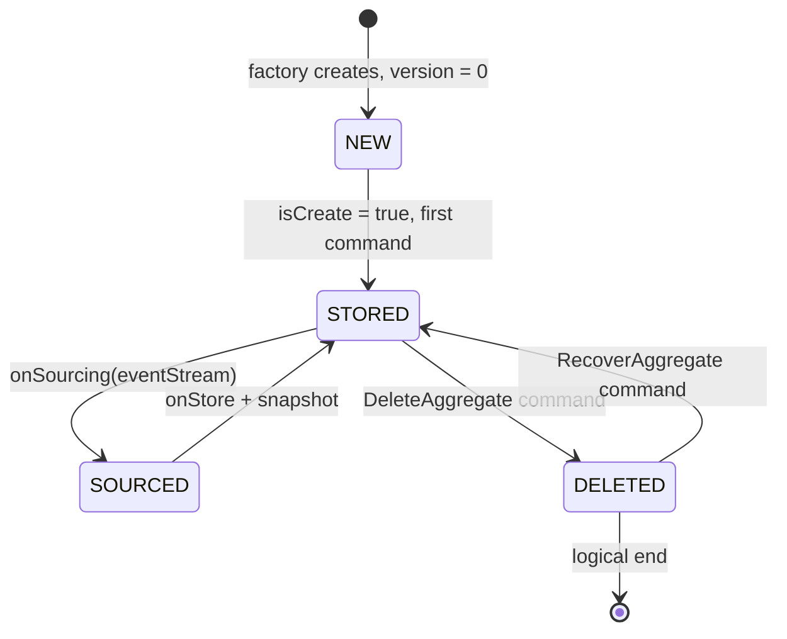
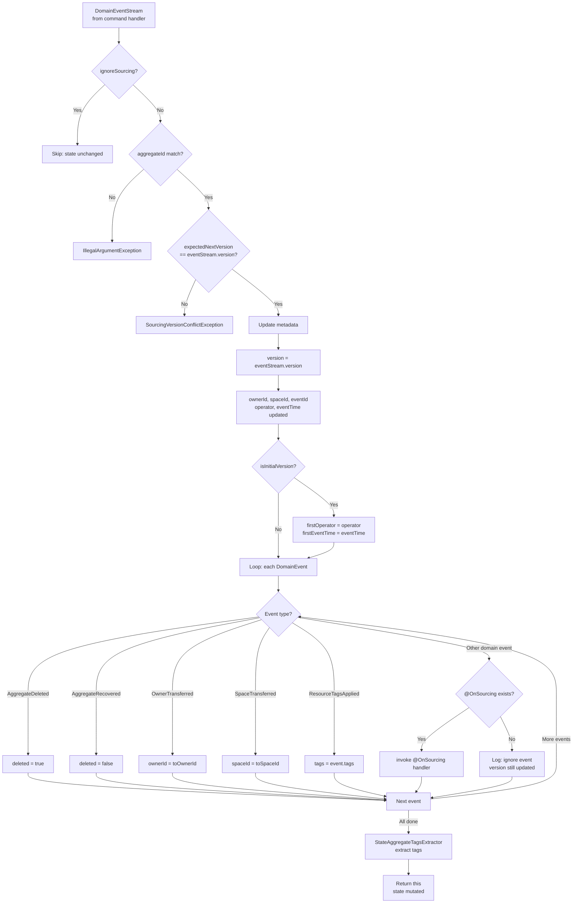
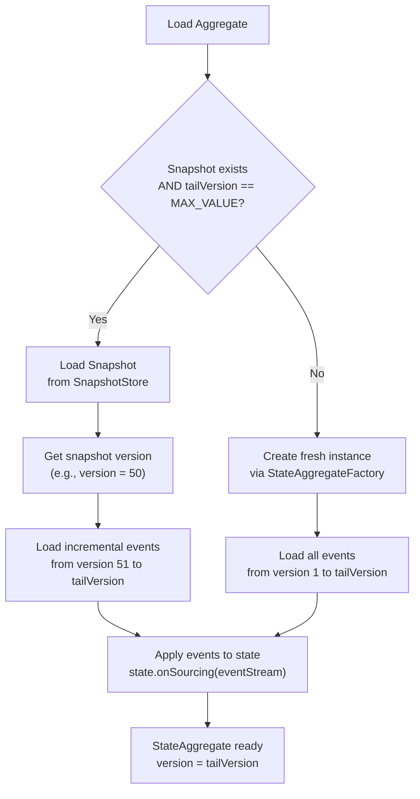

# Aggregate Lifecycle

The aggregate is the central domain object in the Wow Framework. Its lifecycle governs how commands are received, events are sourced, state is mutated, and how aggregates are created, soft-deleted, and recovered. Every aggregate in Wow follows a well-defined state machine backed by deterministic event sourcing and optimistic concurrency control.

**Why this matters**: Understanding the aggregate lifecycle is essential for designing correct domain models. Every command handler you write, every `@OnSourcing` method you implement, and every business rule you enforce operates within a specific phase of this lifecycle. Misunderstanding it leads to race conditions, stale state, or incorrect event ordering.

## At-a-Glance Summary

| Phase | Key Interfaces / Classes | What Happens | Source |
|---|---|---|---|
| **Creation** | `CommandMessage.isCreate`, `@CreateAggregate`, `StateAggregateFactory` | A new aggregate is instantiated with version 0, ready for its first command | [CommandMessage.kt:105](https://github.com/Ahoo-Wang/Wow/blob/main/wow-api/src/main/kotlin/me/ahoo/wow/api/command/CommandMessage.kt#L105) |
| **Command Validation** | `SimpleCommandAggregate.process()`, `CommandState.STORED` | Version, ownership, and initialization checks happen before any handler runs | [SimpleCommandAggregate.kt:82-138](https://github.com/Ahoo-Wang/Wow/blob/main/wow-core/src/main/kotlin/me/ahoo/wow/modeling/command/SimpleCommandAggregate.kt#L82-L138) |
| **Command Execution** | `@OnCommand`, `CommandFunction.invoke()` | Business logic runs, producing domain events | [OnCommand.kt:69-87](https://github.com/Ahoo-Wang/Wow/blob/main/wow-api/src/main/kotlin/me/ahoo/wow/api/annotation/OnCommand.kt#L69-L87) |
| **Event Sourcing** | `@OnSourcing`, `CommandState.onSourcing()`, `SimpleStateAggregate.onSourcing()` | Events are applied to aggregate state deterministically | [OnSourcing.kt:55-59](https://github.com/Ahoo-Wang/Wow/blob/main/wow-api/src/main/kotlin/me/ahoo/wow/api/annotation/OnSourcing.kt#L55-L59) |
| **Event Persistence** | `EventStore.append()`, `CommandState.onStore()` | Events are atomically committed with version conflict checks | [CommandAggregate.kt:76-83](https://github.com/Ahoo-Wang/Wow/blob/main/wow-core/src/main/kotlin/me/ahoo/wow/modeling/command/CommandAggregate.kt#L76-L83) |
| **Deletion** | `DefaultDeleteAggregate`, `AggregateDeleted`, `DeletedCapable.deleted` | Soft-delete via `DefaultAggregateDeleted` event; no hard delete | [DefaultDeleteAggregateFunction.kt:33-46](https://github.com/Ahoo-Wang/Wow/blob/main/wow-core/src/main/kotlin/me/ahoo/wow/modeling/command/DefaultDeleteAggregateFunction.kt#L33-L46) |
| **Recovery** | `DefaultRecoverAggregate`, `AggregateRecovered` | Restores a soft-deleted aggregate to active state | [DefaultRecoverAggregateFunction.kt:33-46](https://github.com/Ahoo-Wang/Wow/blob/main/wow-core/src/main/kotlin/me/ahoo/wow/modeling/command/DefaultRecoverAggregateFunction.kt#L33-L46) |

## High-Level Lifecycle State Machine

The aggregate lifecycle spans from creation through active command processing to optional deletion and recovery. The following state diagram captures the complete lifecycle.



<!-- Sources: wow-core/src/main/kotlin/me/ahoo/wow/modeling/command/CommandAggregate.kt:41-118, wow-core/src/main/kotlin/me/ahoo/wow/modeling/command/SimpleCommandAggregate.kt:66, wow-api/src/main/kotlin/me/ahoo/wow/api/Version.kt:41-68, wow-api/src/main/kotlin/me/ahoo/wow/api/modeling/DeletedCapable.kt:25-32 -->

## Phase 1: Aggregate Creation

An aggregate begins its life when a **creation command** arrives. Creation commands are distinguished from modification commands by the `isCreate` flag on `CommandMessage`.

### How the Framework Decides to Create vs. Load

The `RetryableAggregateProcessor` ([RetryableAggregateProcessor.kt:54-72](https://github.com/Ahoo-Wang/Wow/blob/main/wow-core/src/main/kotlin/me/ahoo/wow/modeling/command/RetryableAggregateProcessor.kt#L54-L72)) makes the critical branching decision:

```kotlin
val stateAggregateMono = if (exchange.message.isCreate) {
    aggregateFactory.createAsMono(aggregateMetadata.state, exchange.message.aggregateId)
} else {
    stateAggregateRepository.load(aggregateId, aggregateMetadata.state)
}
```

<!-- Source: wow-core/src/main/kotlin/me/ahoo/wow/modeling/command/RetryableAggregateProcessor.kt:55-59 -->

| Condition | Action | Initial Version |
|---|---|---|
| `isCreate = true` | `StateAggregateFactory.createAsMono()` creates a fresh instance | `0` (`UNINITIALIZED_VERSION`) |
| `isCreate = false` | `StateAggregateRepository.load()` loads from snapshot/event store | `>= 0` (reconstructed from events) |

### Creation Command Annotation

Commands intended to create aggregates should be annotated with `@CreateAggregate`. This annotation marks the command as an initialization command that establishes the aggregate's initial state.

```kotlin
@CreateAggregate
data class CreateUserCommand(
    @AggregateId
    val userId: String,
    val email: String,
    val name: String
)
```

<!-- Source: wow-api/src/main/kotlin/me/ahoo/wow/api/annotation/CreateAggregate.kt:30-56 -->

### Example: Order Creation from the Example Project

The example `Order` aggregate demonstrates a creation command handler. When `CreateOrder` arrives, the handler validates business rules, returns an `OrderCreated` event, and sets the command result.

```kotlin
fun onCommand(
    command: CommandMessage<CreateOrder>,
    @Name("createOrderSpec") specification: CreateOrderSpec,
    commandResultAccessor: CommandResultAccessor
): Mono<OrderCreated> {
    val createOrder = command.body
    require(createOrder.items.isNotEmpty()) {
        "items can not be empty."
    }
    return Flux
        .fromIterable(createOrder.items)
        .flatMap(specification::require)
        .then(
            OrderCreated(
                orderId = command.aggregateId.id,
                items = createOrder.items.map { /* ... */ },
                address = createOrder.address,
                fromCart = createOrder.fromCart,
            ).toMono().doOnNext { orderCreated ->
                commandResultAccessor.setCommandResult(
                    OrderState::totalAmount.name,
                    orderCreated.items.sumOf { it.totalPrice }
                )
            }
        )
}
```

<!-- Source: example/example-domain/src/main/kotlin/me/ahoo/wow/example/domain/order/Order.kt:106-138 -->

Key points about creation handlers:
- The aggregate is in its initial state (version = 0), so there is no existing state to validate against — only command field validation applies.
- The handler can be either synchronous (returning the event directly) or reactive (returning `Mono`).
- External services (like `CreateOrderSpec`) can be injected into the handler method via `@Name` qualifiers.

## Phase 2: Command Processing Cycle

Once an aggregate exists (either newly created or loaded from the event store), it enters the **command processing cycle**. This is the heart of the aggregate lifecycle where commands are validated, executed, sourced, and persisted.

### Command Processing Sequence

The following sequence diagram shows the complete flow from command arrival through event persistence, using the `SimpleCommandAggregate.process()` method as the primary reference.

```mermaid
sequenceDiagram
%%{init: {'theme': 'dark', 'themeVariables': {'primaryColor': '#2d333b', 'primaryTextColor': '#e6edf3', 'primaryBorderColor': '#6d5dfc', 'lineColor': '#8b949e', 'noteBkgColor': '#161b22', 'noteTextColor': '#e6edf3', 'actorBkg': '#2d333b', 'actorBorder': '#6d5dfc', 'actorTextColor': '#e6edf3', 'signalColor': '#8b949e', 'signalTextColor': '#e6edf3', 'labelBoxBkgColor': '#2d333b', 'labelBoxBorderColor': '#6d5dfc', 'labelTextColor': '#e6edf3', 'loopTextColor': '#e6edf3', 'activationBorderColor': '#6d5dfc', 'activationBkgColor': '#1a1f2e'}}}%%
    autonumber
    participant RAP as RetryableAggregateProcessor
    participant SCA as SimpleCommandAggregate
    participant SA as StateAggregate
    participant CF as CommandFunction
    participant EF as ErrorFunction
    participant ES as EventStore
    participant EB as EventBus

    RAP->>SCA: process(exchange)

    Note over SCA: Set processor function<br>Set aggregate version on exchange

    rect rgb(22, 27, 34)
        Note over SCA: === Pre-Execution Validations ===

        SCA->>SCA: Check aggregateVersion matches<br>(optimistic concurrency)
        alt version mismatch
            SCA-->>RAP: CommandExpectVersionConflictException
        end

        SCA->>SCA: Check initialized || isCreate || allowCreate
        alt not initialized and not a create command
            SCA-->>RAP: NotFoundResourceException
        end

        SCA->>SCA: Check ownerId matches<br>(if command.ownerId is not blank)
        alt owner mismatch
            SCA-->>RAP: IllegalAccessOwnerAggregateException
        end

        SCA->>SCA: Check spaceId matches<br>(if command.spaceId is not blank)
        alt space mismatch
            SCA-->>RAP: IllegalAccessSpaceAggregateException
        end

        SCA->>SCA: Assert CommandState == STORED
        alt not STORED
            SCA-->>RAP: IllegalStateException
        end

        SCA->>SCA: If RecoverAggregate, check state.deleted == true
        SCA->>SCA: Else if state.deleted == true
        alt deleted aggregate
            SCA-->>RAP: IllegalAccessDeletedAggregateException
        end
    end

    Note over SCA: === Command Execution ===

    SCA->>CF: invoke(exchange)
    CF-->>SCA: DomainEventStream (from command handler)

    Note over SCA: === Event Sourcing (State Mutation) ===

    SCA->>SA: commandState.onSourcing(state, eventStream)
    SA->>SA: Validate aggregateId match
    SA->>SA: Validate expectedVersion match
    alt version conflict
        SA-->>SCA: SourcingVersionConflictException
    end
    SA->>SA: Update metadata<br>(version, ownerId, eventId, operator, eventTime)
    loop Each DomainEvent in eventStream
        SA->>SA: Apply event to state<br>(AggregateDeleted? deleted = true<br> AggregateRecovered? deleted = false<br> OwnerTransferred? ownerId = ...<br> or registered @OnSourcing function)
    end
    SA-->>SCA: CommandState.SOURCED

    Note over SCA: === Event Persistence ===

    SCA->>ES: commandState.onStore(eventStore, eventStream)
    ES->>ES: Atomic append with version check
    alt version conflict at store
        ES-->>SCA: EventVersionConflictException<br>commandState = EXPIRED
    end
    ES-->>SCA: CommandState.STORED

    SCA-->>RAP: DomainEventStream (success)

    Note over RAP: Event published to EventBus<br>for projections, sagas, handlers

    rect rgb(22, 27, 34)
        Note over SCA: === Error Handling (on failure) ===
        SCA->>EF: errorResume: invoke error function
        EF-->>SCA: (handle or re-throw)
    end

```



<!-- Sources: wow-core/src/main/kotlin/me/ahoo/wow/modeling/command/SimpleCommandAggregate.kt:82-138, wow-core/src/main/kotlin/me/ahoo/wow/modeling/command/RetryableAggregateProcessor.kt:54-72, wow-core/src/main/kotlin/me/ahoo/wow/modeling/state/SimpleStateAggregate.kt:96-141, wow-core/src/main/kotlin/me/ahoo/wow/modeling/command/CommandAggregate.kt:65-118 -->

### Validation Gates (Pre-Execution)

Before any command handler runs, `SimpleCommandAggregate.process()` runs six sequential validation gates:

| # | Validation | What It Checks | Failure Exception | Source |
|---|---|---|---|---|
| 1 | **Version check** | `command.aggregateVersion == current version` (optimistic concurrency) | `CommandExpectVersionConflictException` | [SimpleCommandAggregate.kt:92-98](https://github.com/Ahoo-Wang/Wow/blob/main/wow-core/src/main/kotlin/me/ahoo/wow/modeling/command/SimpleCommandAggregate.kt#L92-L98) |
| 2 | **Initialization check** | `initialized \|\| isCreate \|\| allowCreate` | `NotFoundResourceException` | [SimpleCommandAggregate.kt:99-101](https://github.com/Ahoo-Wang/Wow/blob/main/wow-core/src/main/kotlin/me/ahoo/wow/modeling/command/SimpleCommandAggregate.kt#L99-L101) |
| 3 | **Owner check** | `command.ownerId == state.ownerId` (multi-tenancy) | `IllegalAccessOwnerAggregateException` | [SimpleCommandAggregate.kt:102-104](https://github.com/Ahoo-Wang/Wow/blob/main/wow-core/src/main/kotlin/me/ahoo/wow/modeling/command/SimpleCommandAggregate.kt#L102-L104) |
| 4 | **Space check** | `command.spaceId == state.spaceId` (multi-tenancy) | `IllegalAccessSpaceAggregateException` | [SimpleCommandAggregate.kt:105-107](https://github.com/Ahoo-Wang/Wow/blob/main/wow-core/src/main/kotlin/me/ahoo/wow/modeling/command/SimpleCommandAggregate.kt#L105-L107) |
| 5 | **CommandState check** | `commandState == STORED` (serial processing) | `IllegalStateException` | [SimpleCommandAggregate.kt:108-110](https://github.com/Ahoo-Wang/Wow/blob/main/wow-core/src/main/kotlin/me/ahoo/wow/modeling/command/SimpleCommandAggregate.kt#L108-L110) |
| 6 | **Delete check** | Not deleted OR is `RecoverAggregate` command | `IllegalAccessDeletedAggregateException` | [SimpleCommandAggregate.kt:111-119](https://github.com/Ahoo-Wang/Wow/blob/main/wow-core/src/main/kotlin/me/ahoo/wow/modeling/command/SimpleCommandAggregate.kt#L111-L119) |

### The CommandState Enum: Serial Processing Guarantee

The `CommandState` enum ensures **serial command processing per aggregate instance**. Only one command at a time can transition through the STORED -> SOURCED -> STORED cycle.

| State | Permitted Transition | Behavior | Source |
|---|---|---|---|
| `STORED` | `onSourcing(eventStream)` -> `SOURCED` | Applies events to state aggregate | [CommandAggregate.kt:66-74](https://github.com/Ahoo-Wang/Wow/blob/main/wow-core/src/main/kotlin/me/ahoo/wow/modeling/command/CommandAggregate.kt#L66-L74) |
| `SOURCED` | `onStore(eventStore, eventStream)` -> `STORED` | Atomically appends events to event store | [CommandAggregate.kt:75-83](https://github.com/Ahoo-Wang/Wow/blob/main/wow-core/src/main/kotlin/me/ahoo/wow/modeling/command/CommandAggregate.kt#L75-L83) |
| `EXPIRED` | (none) | Terminal state after unrecoverable error; no further operations | [CommandAggregate.kt:84-85](https://github.com/Ahoo-Wang/Wow/blob/main/wow-core/src/main/kotlin/me/ahoo/wow/modeling/command/CommandAggregate.kt#L84-L85) |

This design means that if a second command for the same aggregate arrives while the first is in `SOURCED`, it will fail with `IllegalStateException`. This is the framework's built-in protection against concurrent modification.

### Business Rule Execution

After passing all validation gates, the `CommandFunction` corresponding to the command type is looked up and invoked. Command handlers have one clear responsibility: **validate business rules and return domain events**. They must never directly modify aggregate state.

Example from the `Order` aggregate — a payment command handler that returns multiple events:

```kotlin
fun onCommand(payOrder: PayOrder): Iterable<*> {
    if (OrderStatus.CREATED != state.status) {
        return listOf(
            OrderPayDuplicated(
                paymentId = payOrder.paymentId,
                errorMsg = "The current order[${state.id}] status[${state.status}] cannot pay order.",
            ),
        )
    }
    val currentPayable = state.payable
    if (currentPayable >= payOrder.amount) {
        return listOf(OrderPaid(payOrder.amount, currentPayable == payOrder.amount))
    }
    val overPay = payOrder.amount - currentPayable
    val orderPaid = OrderPaid(currentPayable, true)
    val overPaid = OrderOverPaid(payOrder.paymentId, overPay)
    return listOf(orderPaid, overPaid)
}
```

<!-- Source: example/example-domain/src/main/kotlin/me/ahoo/wow/example/domain/order/Order.kt:184-216 -->

Key patterns shown above:
- **State guards**: The handler checks `state.status` to gate operations (can only pay if `CREATED`).
- **Multiple events**: A single command can produce multiple domain events (e.g., `OrderPaid` + `OrderOverPaid`). Events are published in the order they appear in the returned collection.
- **Idempotency**: Duplicate payments return an `OrderPayDuplicated` event rather than throwing an error, allowing downstream compensation.

## Phase 3: Event Sourcing and State Mutation

After the command handler produces events, the framework enters the **event sourcing phase**. This is where events are deterministically applied to the aggregate state.

### How Event Sourcing Works

The `SimpleStateAggregate.onSourcing()` method orchestrates this phase:



<!-- Sources: wow-core/src/main/kotlin/me/ahoo/wow/modeling/state/SimpleStateAggregate.kt:96-141, wow-core/src/main/kotlin/me/ahoo/wow/modeling/state/SimpleStateAggregate.kt:157-182 -->

### The @OnSourcing Annotation

`@OnSourcing` marks methods that apply domain events to aggregate state. These methods are the **only** place where aggregate state should be mutated, and they must be:

- **Deterministic**: Given the same event, always produce the same state result.
- **Side-effect-free**: No external system calls (no HTTP, no database writes, no message publishing).
- **Applied in order**: Events are applied sequentially in the order they were produced.

Example from the example project's `OrderState`:

```kotlin
class OrderState(val id: String) : StatusCapable<OrderStatus> {

    lateinit var items: List<OrderItem> private set
    lateinit var address: ShippingAddress private set
    var totalAmount: BigDecimal = BigDecimal.ZERO private set
    var paidAmount: BigDecimal = BigDecimal.ZERO private set
    override var status = OrderStatus.CREATED private set

    val payable: BigDecimal
        get() = totalAmount.minus(paidAmount)

    fun onSourcing(orderCreated: OrderCreated) {
        address = orderCreated.address
        items = orderCreated.items
        totalAmount = orderCreated.items
            .map { it.totalPrice }
            .reduce { totalPrice, moneyToAdd -> totalPrice + moneyToAdd }
        status = OrderStatus.CREATED
    }

    fun onSourcing(addressChanged: AddressChanged) {
        address = addressChanged.shippingAddress
    }

    private fun onSourcing(orderPaid: OrderPaid) {
        paidAmount = paidAmount.plus(orderPaid.amount)
        if (orderPaid.paid) {
            status = OrderStatus.PAID
        }
    }

    fun onSourcing(orderShipped: OrderShipped) {
        status = OrderStatus.SHIPPED
    }

    fun onSourcing(orderReceived: OrderReceived) {
        status = OrderStatus.RECEIVED
    }
}
```

<!-- Source: example/example-domain/src/main/kotlin/me/ahoo/wow/example/domain/order/OrderState.kt:40-118 -->

### Built-in Special Events

The `SimpleStateAggregate` automatically handles several special event types without requiring explicit `@OnSourcing` methods:

| Special Event | Effect on State | Source |
|---|---|---|
| `AggregateDeleted` | Sets `deleted = true` | [SimpleStateAggregate.kt:159-161](https://github.com/Ahoo-Wang/Wow/blob/main/wow-core/src/main/kotlin/me/ahoo/wow/modeling/state/SimpleStateAggregate.kt#L159-L161) |
| `AggregateRecovered` | Sets `deleted = false` | [SimpleStateAggregate.kt:162-164](https://github.com/Ahoo-Wang/Wow/blob/main/wow-core/src/main/kotlin/me/ahoo/wow/modeling/state/SimpleStateAggregate.kt#L162-L164) |
| `OwnerTransferred` | Updates `ownerId` | [SimpleStateAggregate.kt:165-167](https://github.com/Ahoo-Wang/Wow/blob/main/wow-core/src/main/kotlin/me/ahoo/wow/modeling/state/SimpleStateAggregate.kt#L165-L167) |
| `SpaceTransferred` | Updates `spaceId` | [SimpleStateAggregate.kt:168-170](https://github.com/Ahoo-Wang/Wow/blob/main/wow-core/src/main/kotlin/me/ahoo/wow/modeling/state/SimpleStateAggregate.kt#L168-L170) |
| `ResourceTagsApplied` | Updates `tags` (ABAC) | [SimpleStateAggregate.kt:171-173](https://github.com/Ahoo-Wang/Wow/blob/main/wow-core/src/main/kotlin/me/ahoo/wow/modeling/state/SimpleStateAggregate.kt#L171-L173) |

### Missing @OnSourcing: A Graceful Default

If an event has no matching `@OnSourcing` handler, the framework **does not throw an error**. Instead, it logs a debug message and still updates the aggregate version to the event's version. This is documented in `StateAggregate.kt`:

```kotlin
/**
 * When the aggregate does not find a matching `onSourcing` method,
 * it does not consider this a fault; the event is ignored,
 * but the aggregate version is updated to the domain event's version.
 */
```

<!-- Source: wow-core/src/main/kotlin/me/ahoo/wow/modeling/state/StateAggregate.kt:28-30 -->

This design choice is deliberate: it allows aggregates to evolve over time by adding new `@OnSourcing` handlers for future events without breaking replay of historical events that predate the handler.

## Phase 4: Event Persistence and Snapshot

After events are sourced into state, the `CommandState.onStore()` method atomically persists the event stream to the `EventStore`. On success, the `CommandState` returns to `STORED` (ready for the next command). On failure, it becomes `EXPIRED`.

### The Relationship Between State Mutability and Persistence

By setting `private set` on state properties and only mutating them via `@OnSourcing` methods, the `OrderState` class enforces the Event Sourcing principle: **state is only mutated by applying events**. The command handler's role is to produce the right events; the `@OnSourcing` methods apply them to state.

| Component | Can Mutate State? | Role |
|---|---|---|
| `@OnCommand` handler | No | Produce domain events |
| `@OnSourcing` handler | Yes (only place) | Apply events to state |
| `@OnEvent` handler | No | React to events (projections, sagas) |
| External code | No | N/A |

## Phase 5: Aggregate Loading and Replay

When an existing aggregate receives a non-create command, the framework must load (or reconstruct) its current state before processing. The `EventSourcingStateAggregateRepository` orchestrates this loading.

### State Rebuild Strategy



<!-- Sources: wow-core/src/main/kotlin/me/ahoo/wow/eventsourcing/EventSourcingStateAggregateRepository.kt:41-148, wow-core/src/main/kotlin/me/ahoo/wow/eventsourcing/EventStoreStateAggregateRepository.kt:33-105 -->

The loading process follows two strategies based on whether a snapshot exists:

| Strategy | Trigger | How It Works |
|---|---|---|
| **Snapshot-based** | `tailVersion == Int.MAX_VALUE` AND snapshot exists | Load snapshot, then replay only incremental events from `snapshot.version + 1` |
| **Full replay** | No snapshot exists | Create fresh instance, replay all events from version 1 |

Snapshots dramatically improve performance for long-lived aggregates by avoiding the need to replay hundreds or thousands of historical events. The snapshot stores the aggregate state at a specific version, so only events after that version need to be replayed.

### Point-in-Time Reconstruction

The `EventSourcingStateAggregateRepository` also supports loading an aggregate **as it existed at a specific point in time**:

```kotlin
// Load aggregate as it was 1 day ago
val eventTime = System.currentTimeMillis() - 86400000L
val historicalState = repository.load(
    aggregateId,
    metadata,
    tailEventTime = eventTime
).block()
```

<!-- Source: wow-core/src/main/kotlin/me/ahoo/wow/eventsourcing/EventSourcingStateAggregateRepository.kt:130-147 -->

This enables temporal queries, audit trails, and debugging of past state without maintaining separate historical snapshots.

## Phase 6: Deletion and Recovery

Wow implements **soft deletion** for aggregates. When an aggregate is deleted, it is not physically removed from the store; instead, it is marked as deleted (`deleted = true`), and all subsequent non-recovery commands are rejected.

### How Deletion Works

1. **Command**: A client sends `DefaultDeleteAggregate` (or a custom `DeleteAggregate` command).
2. **Built-in handler**: `DefaultDeleteAggregateFunction` processes it automatically, returning a `DefaultAggregateDeleted` event.
3. **Event sourcing**: `SimpleStateAggregate.sourcing()` sets `deleted = true`.
4. **Guard**: Subsequent commands (except `RecoverAggregate`) are rejected with `IllegalAccessDeletedAggregateException`.

```kotlin
// The DefaultDeleteAggregate is automatically routed as:
// DELETE /{resourceName}/{aggregateId}
@Summary("Delete aggregate")
@CommandRoute(action = "", method = CommandRoute.Method.DELETE, appendIdPath = CommandRoute.AppendPath.ALWAYS)
object DefaultDeleteAggregate : DeleteAggregate
```

<!-- Source: wow-api/src/main/kotlin/me/ahoo/wow/api/command/DeleteAggregate.kt:55-57 -->

### How Recovery Works

1. **Command**: A client sends `DefaultRecoverAggregate` (or a custom `RecoverAggregate` command).
2. **Pre-check**: `SimpleCommandAggregate.process()` validates that the aggregate is currently deleted.
3. **Built-in handler**: `DefaultRecoverAggregateFunction` returns a `DefaultAggregateRecovered` event.
4. **Event sourcing**: `SimpleStateAggregate.sourcing()` sets `deleted = false`.
5. **Result**: The aggregate is active again and can process commands normally.

```kotlin
// The DefaultRecoverAggregate is automatically routed as:
// PUT /{resourceName}/{aggregateId}/recover
@Summary("Recover deleted aggregate")
@CommandRoute(action = "recover", method = CommandRoute.Method.PUT, appendIdPath = CommandRoute.AppendPath.ALWAYS)
object DefaultRecoverAggregate : RecoverAggregate
```

<!-- Source: wow-api/src/main/kotlin/me/ahoo/wow/api/command/RecoverAggregate.kt:56-58 -->

| Operation | Command | Event | State Change | Route |
|---|---|---|---|---|
| **Delete** | `DefaultDeleteAggregate` | `DefaultAggregateDeleted` | `deleted = true` | `DELETE /{resource}/{id}` |
| **Recover** | `DefaultRecoverAggregate` | `DefaultAggregateRecovered` | `deleted = false` | `PUT /{resource}/{id}/recover` |

### Deleted Aggregate Guard Logic

The validation logic in `SimpleCommandAggregate.process()` ensures correct behavior around deletion:

```
if (command is RecoverAggregate) {
    check(state.deleted)  // Must be deleted to recover
} else if (state.deleted) {
    throw IllegalAccessDeletedAggregateException  // Cannot operate on deleted aggregate
}
```

<!-- Source: wow-core/src/main/kotlin/me/ahoo/wow/modeling/command/SimpleCommandAggregate.kt:111-119 -->

## Error Handling in the Lifecycle

### Error Functions (@OnError)

Aggregates can define error handlers via methods that handle exceptions thrown during command processing. These are registered by method naming convention (`onError`) and can:

- Log error details
- Decide whether to suppress or propagate the error
- Publish compensation events

```kotlin
fun onError(
    createOrder: CreateOrder,
    throwable: Throwable,
    eventStream: DomainEventStream?,
): Mono<Void> {
    log.error("onError - [{}]", createOrder, throwable)
    return Mono.empty()
}
```

<!-- Source: example/example-domain/src/main/kotlin/me/ahoo/wow/example/domain/order/Order.kt:140-148 -->

### Retryable Processing

The `RetryableAggregateProcessor` wraps every aggregate processor with a retry strategy that retries up to 3 times with a 500 ms backoff, but only for **recoverable** errors:

```kotlin
private val retryStrategy: Retry = Retry.backoff(MAX_RETRIES, MIN_BACKOFF)
    .filter {
        it.recoverable == RecoverableType.RECOVERABLE
    }.doBeforeRetry {
        log.warn(it.failure()) {
            "[BeforeRetry] $aggregateId totalRetries[${it.totalRetries()}]."
        }
    }
```

<!-- Source: wow-core/src/main/kotlin/me/ahoo/wow/modeling/command/RetryableAggregateProcessor.kt:45-52 -->

### The EXPIRED State

When an unrecoverable error occurs during event persistence (`commandState.onStore`), the command state is set to `EXPIRED`:

```kotlin
commandState.onStore(eventStore, eventStream)
    .doOnNext { commandState = it }
    .doOnError { commandState = CommandState.EXPIRED }
    .thenReturn(eventStream)
```

<!-- Source: wow-core/src/main/kotlin/me/ahoo/wow/modeling/command/SimpleCommandAggregate.kt:134-136 -->

In the `EXPIRED` state, the aggregate cannot process any further commands. This is a terminal state indicating that the aggregate instance has encountered an unrecoverable consistency problem and requires manual intervention.

## Version Lifecycle

Version tracking is fundamental to the aggregate lifecycle. The `Version` interface defines the version semantics:

| Constant | Value | Meaning | Source |
|---|---|---|---|
| `UNINITIALIZED_VERSION` | `0` | Aggregate has just been created, no events applied yet | [Version.kt:47](https://github.com/Ahoo-Wang/Wow/blob/main/wow-api/src/main/kotlin/me/ahoo/wow/api/Version.kt#L47) |
| `INITIAL_VERSION` | `1` | First event has been applied; aggregate is initialized | [Version.kt:53](https://github.com/Ahoo-Wang/Wow/blob/main/wow-api/src/main/kotlin/me/ahoo/wow/api/Version.kt#L53) |
| `initialized` | `version > 0` | Computed property: true if aggregate has any events | [Version.kt:59-62](https://github.com/Ahoo-Wang/Wow/blob/main/wow-api/src/main/kotlin/me/ahoo/wow/api/Version.kt#L59-L62) |
| `isInitialVersion` | `version == 1` | Computed property: true if exactly at the first event | [Version.kt:64-67](https://github.com/Ahoo-Wang/Wow/blob/main/wow-api/src/main/kotlin/me/ahoo/wow/api/Version.kt#L64-L67) |
| `expectedNextVersion` | `version + 1` | The version the next event should carry | [ReadOnlyStateAggregate.kt:90-91](https://github.com/Ahoo-Wang/Wow/blob/main/wow-core/src/main/kotlin/me/ahoo/wow/modeling/state/ReadOnlyStateAggregate.kt#L90-L91) |

Version progression through the lifecycle:

```
Creation -> version=0 -> first event -> version=1 -> event N -> version=N
```

### Optimistic Concurrency Control

Every command can optionally carry an `aggregateVersion` (from `CommandMessage.aggregateVersion`). If specified, the framework validates that the current aggregate version matches the expected version **before** processing the command:

```kotlin
if (message.aggregateVersion != null && message.aggregateVersion != version) {
    return@defer CommandExpectVersionConflictException(
        command = message,
        expectVersion = message.aggregateVersion!!,
        actualVersion = version,
    ).toMono()
}
```

<!-- Source: wow-core/src/main/kotlin/me/ahoo/wow/modeling/command/SimpleCommandAggregate.kt:92-98 -->

This pattern (optimistic concurrency control / optimistic locking) ensures that no two clients can modify the same aggregate concurrently without one of them detecting the conflict.

## Aggregate Routing

The `@AggregateRoute` annotation configures how the aggregate is exposed via REST APIs and how ownership is managed:

```kotlin
@AggregateRoot
@AggregateRoute(
    resourceName = "sales-order",
    spaced = true,
    owner = AggregateRoute.Owner.ALWAYS
)
class Order(private val state: OrderState) {
```

<!-- Source: example/example-domain/src/main/kotlin/me/ahoo/wow/example/domain/order/Order.kt:55-56 -->

| Attribute | Description | Source |
|---|---|---|
| `resourceName` | Custom API path segment (default: lowercased class name) | [AggregateRoute.kt:60](https://github.com/Ahoo-Wang/Wow/blob/main/wow-api/src/main/kotlin/me/ahoo/wow/api/annotation/AggregateRoute.kt#L60) |
| `enabled` | Whether API routes are generated (default: `true`) | [AggregateRoute.kt:61](https://github.com/Ahoo-Wang/Wow/blob/main/wow-api/src/main/kotlin/me/ahoo/wow/api/annotation/AggregateRoute.kt#L61) |
| `spaced` | Whether to space-separate the resource name in URL paths | [AggregateRoute.kt:62](https://github.com/Ahoo-Wang/Wow/blob/main/wow-api/src/main/kotlin/me/ahoo/wow/api/annotation/AggregateRoute.kt#L62) |
| `owner` | Ownership policy: `NEVER`, `ALWAYS`, or `AGGREGATE_ID` | [AggregateRoute.kt:63](https://github.com/Ahoo-Wang/Wow/blob/main/wow-api/src/main/kotlin/me/ahoo/wow/api/annotation/AggregateRoute.kt#L63) |

The `AggregateRoute.Owner.ALWAYS` setting on the `Order` aggregate ensures that every command must carry an owner ID, and it is validated against the aggregate's `ownerId` during the pre-execution checks (gate #3).

## Key Design Principles

1. **Serial command processing**: The `CommandState` STORED/SOURCED cycle ensures only one command processes per aggregate at a time. This eliminates race conditions at the framework level. |
2. **Deterministic event sourcing**: `@OnSourcing` handlers must be pure functions. Given the same event history, the same state must result every time. |
3. **Soft deletion**: Aggregates are never physically removed. The `deleted` flag prevents operations while preserving the full event history for audit and recovery. |
4. **Optimistic concurrency**: Version checks at both the command (client-specified) and event store (server-enforced) levels prevent lost updates. |
5. **Graceful missing handler**: Events without matching `@OnSourcing` handlers are silently skipped (with version update), enabling forward-compatible state evolution. |
6. **Separation of concerns**: Command handlers produce events; sourcing handlers apply events to state. These are distinct phases in the lifecycle, not a single step.

## Related Pages

| Page | Description |
|---|---|
| [Architecture Overview](./architecture) | Overall Wow Framework architecture and module hierarchy |
| [Command Gateway](../command-gateway) | Sending commands, wait plans, and command stages |
| [Event Sourcing](../eventstore) | Event store, snapshots, and full replay mechanics |
| [Domain Modeling](../modeling) | Designing aggregates, commands, events, and state classes |
| [Saga Orchestration](../saga) | Distributed transaction support via sagas |
| [Configuration Reference: Event Sourcing](../../reference/config/core) | Event sourcing configuration properties |
| [Configuration Reference: Snapshot](../../reference/config/core) | Snapshot store configuration |
| [Testing](../test-suite) | AggregateSpec and Given-When-Expect testing DSL |
