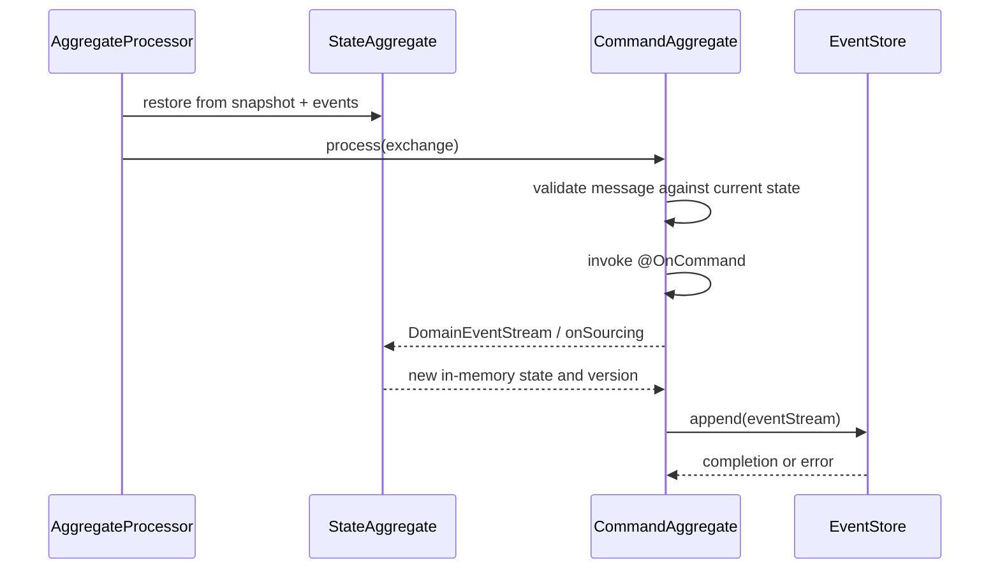
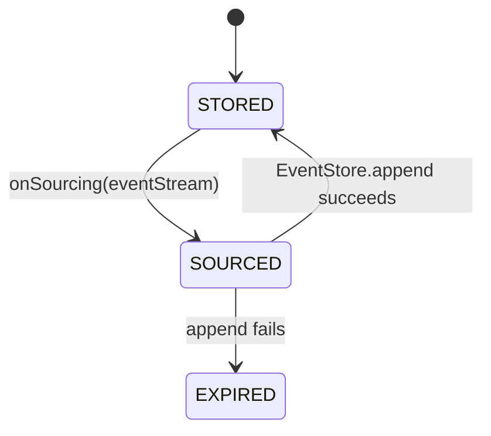

# Aggregate Lifecycle

Wow represents an aggregate with two cooperating objects: `CommandAggregate` reads current state and makes business decisions, while `StateAggregate` changes state only by sourcing events. Both participate in one command attempt, but event history in EventStore remains the persistent fact.

See [Aggregate Modeling](../modeling.md) for domain-type patterns. This page explains runtime lifecycle only.

## Create or restore state

`RetryableAggregateProcessor` obtains a fresh aggregate object for each processing attempt:

- a create command asks `StateAggregateFactory` for uninitialized state;
- other commands load state through `StateAggregateRepository`;
- the event-sourcing repository loads a snapshot first, then events from `snapshot.version + 1`; without a snapshot it replays from the initial version.

A snapshot is a restoration starting point. Its absence does not change EventStore's authority. See [Snapshots](../snapshot.md).

## One command attempt


```mermaid
sequenceDiagram
    participant Processor as AggregateProcessor
    participant State as StateAggregate
    participant Command as CommandAggregate
    participant Store as EventStore

    Processor->>State: restore from snapshot + events
    Processor->>Command: process(exchange)
    Command->>Command: validate message against current state
    Command->>Command: invoke @OnCommand
    Command-->>State: DomainEventStream / onSourcing
    State-->>Command: new in-memory state and version
    Command->>Store: append(eventStream)
    Store-->>Command: completion or error
```

Before invoking the command function, `SimpleCommandAggregate` checks:

1. an optional `aggregateVersion` against the current version;
2. whether a non-create, non-allow-create command targets initialized state;
3. non-blank `ownerId` and `spaceId` against current state;
4. whether a normal command targets deleted state, or a recovery command targets non-deleted state;
5. whether metadata contains a function for the command type.

These are core public processing boundaries. They do not replace business invariants inside the command function.

## CommandState machine


```mermaid
stateDiagram-v2
    [*] --> STORED
    STORED --> SOURCED: onSourcing(eventStream)
    SOURCED --> STORED: EventStore.append succeeds
    SOURCED --> EXPIRED: append fails
```

| State | Meaning |
| --- | --- |
| `STORED` | This aggregate object may source a new event stream |
| `SOURCED` | New events have changed in-memory state and await EventStore append |
| `EXPIRED` | This object cannot continue; a retry must load or create a new object |

New events are applied to in-memory state before persistence. If append fails, the object enters `EXPIRED`; the unpersisted in-memory state must not be reused.

The current `RetryableAggregateProcessor` rebuilds the aggregate and retries only errors marked `RECOVERABLE`, using an implementation-fixed maximum of 3 retries and a 500 ms minimum backoff. This is not a general retry promise for EventStore or application side effects. External handlers still need their own idempotency and compensation design.

## StateAggregate sourcing rules

`SimpleStateAggregate.onSourcing` checks the complete `AggregateId` and expected next version, updates aggregate metadata, then invokes matching `@OnSourcing` functions in event-stream order.

| Condition | Behavior |
| --- | --- |
| AggregateId differs | Reject the event stream |
| Stream version is not `expectedNextVersion` | Throw `SourcingVersionConflictException` |
| An event has no matching sourcing function | Ignore that event body while still advancing the stream version |
| The stream is marked `ignoreSourcing` | Do not change state or version |
| Built-in owner/space/delete/recover/tag events | Update the corresponding framework metadata |

Advancing the version without a sourcing function allows events that do not affect current state to keep history continuous. It can also hide a missing state transition, so event-evolution and replay tests must assert final business invariants.

## Delete and recover

Deletion is state metadata, not history deletion:

- `AggregateDeleted` sets `deleted` to true;
- deleted aggregates reject normal commands;
- `RecoverAggregate` is valid only for deleted state;
- `AggregateRecovered` clears the deletion flag.

Recovery does not undo events before deletion. Read and authorization rules still need an explicit policy for deleted state.

## Concurrency and ordering

The default dispatcher maps the same aggregate ID to the same processing group and runs that group serially. EventStore append then applies its version constraint at the persistent boundary. Do not treat in-process scheduling as a cross-instance global lock, or treat a version-conflict retry as idempotency for external side effects.

Use `aggregateVersion` when the caller needs compare-and-set behavior. If command execution already contains a non-repeatable external operation, reconsider that operation's ownership instead of relying on automatic retry.

## Where failures occur

| Failure point | Are new events persisted? | Direction |
| --- | --- | --- |
| Load/replay | No | Repair history, type resolution, or storage reads |
| Command validation/function | No | Return input/domain error; an optional error function must still propagate or explicitly take ownership |
| EventStore append | Not confirmed by this attempt | Only recoverable errors enter core retry; each retry reloads |
| Domain/state event send | Events may already be appended | Follow command-filter, Bus, and recovery policy; appended history cannot be rolled back |
| Projection/Saga/event handler | Yes | Recover with idempotency, retry, compensation, or replay |

See [Command Gateway wait plans](../command-gateway.md#wait-plans) for visibility at these boundaries.

## Verification and source

```bash
./gradlew :wow-core:test --tests "me.ahoo.wow.modeling.command.SimpleCommandAggregateProcessingTest"
./gradlew :wow-core:test --tests "me.ahoo.wow.modeling.command.RetryableAggregateProcessorTest"
./gradlew :wow-core:test --tests "me.ahoo.wow.modeling.state.SimpleStateAggregateSourcingTest"
```

- [`SimpleCommandAggregate`](https://github.com/Ahoo-Wang/Wow/blob/main/wow-core/src/main/kotlin/me/ahoo/wow/modeling/command/SimpleCommandAggregate.kt)
- [`RetryableAggregateProcessor`](https://github.com/Ahoo-Wang/Wow/blob/main/wow-core/src/main/kotlin/me/ahoo/wow/modeling/command/RetryableAggregateProcessor.kt)
- [`SimpleStateAggregate`](https://github.com/Ahoo-Wang/Wow/blob/main/wow-core/src/main/kotlin/me/ahoo/wow/modeling/state/SimpleStateAggregate.kt)
- [`EventSourcingStateAggregateRepository`](https://github.com/Ahoo-Wang/Wow/blob/main/wow-core/src/main/kotlin/me/ahoo/wow/eventsourcing/EventSourcingStateAggregateRepository.kt)
