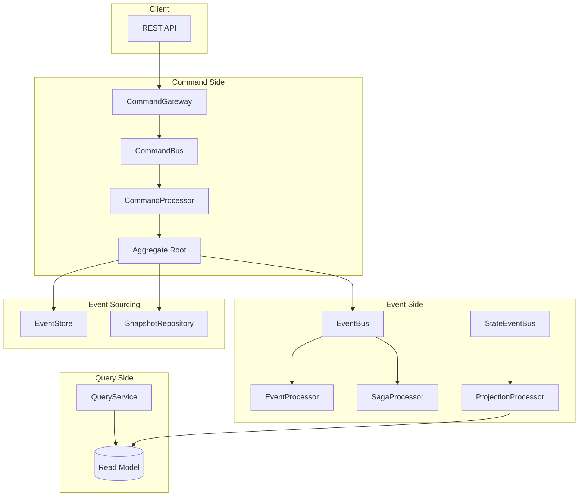
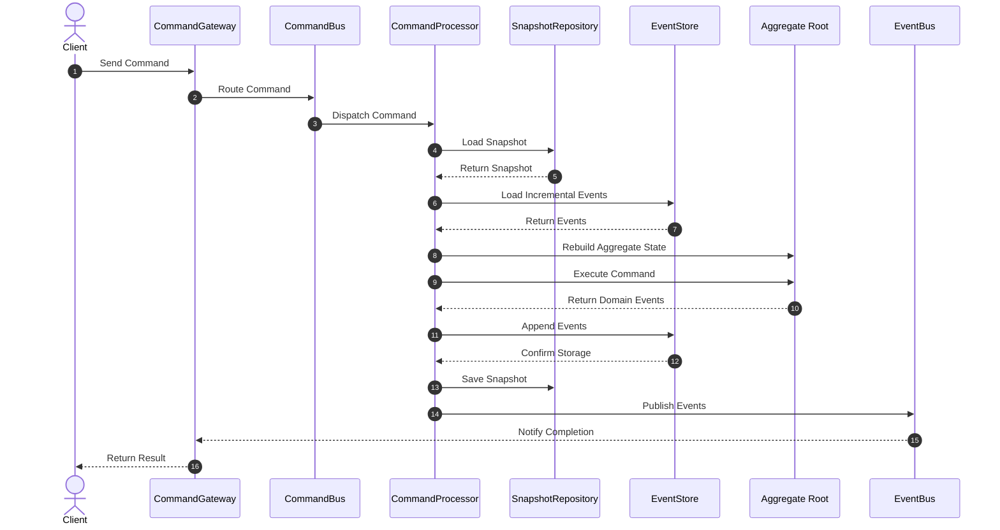
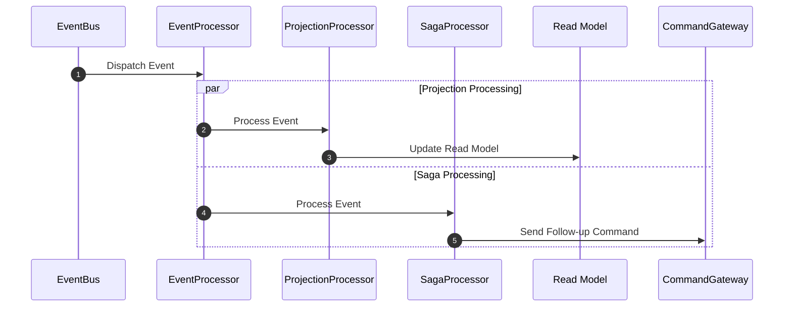
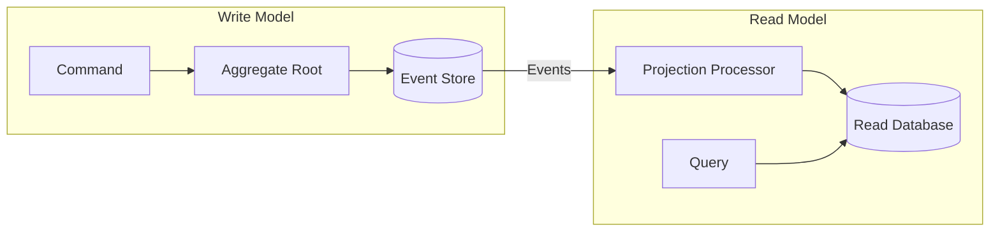
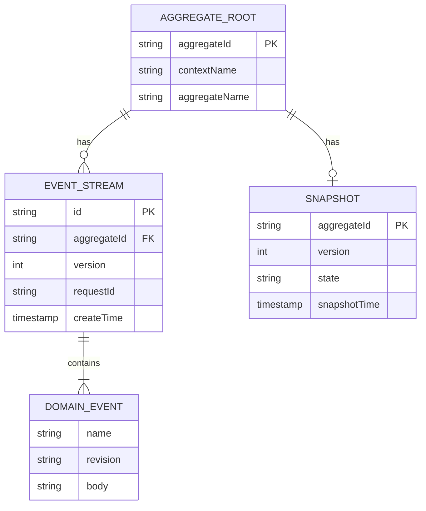
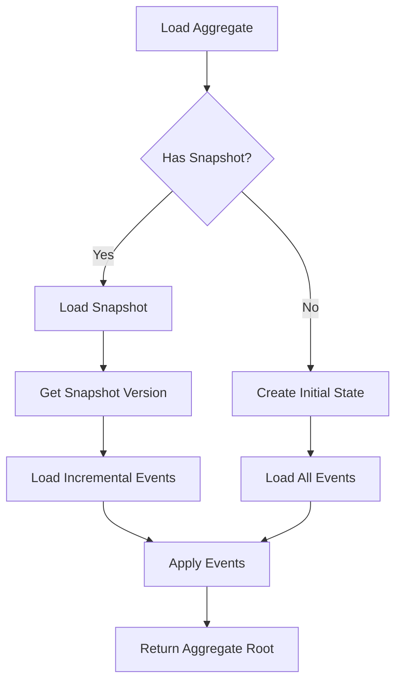

# Architecture

This document provides a detailed introduction to the overall architecture design, core component relationships, and processing flows of the Wow framework.

## Overall Architecture

## Core Components

### Component Relationship Diagram

### Component Description

| Component | Responsibility | Interface |
|------|------|------|
| CommandGateway | Command entry point, supports wait strategies | `CommandGateway` |
| CommandBus | Command transport channel | `CommandBus` |
| CommandProcessor | Command processing, loads aggregate root and executes | `CommandProcessor` |
| EventStore | Event persistent storage | `EventStore` |
| SnapshotRepository | Snapshot storage, optimizes aggregate loading | `SnapshotRepository` |
| EventBus | Domain event transport channel | `EventBus` |
| StateEventBus | State event transport channel | `StateEventBus` |
| EventProcessor | Event processor base class | `EventProcessor` |
| ProjectionProcessor | Projection processing, updates read model | `ProjectionProcessor` |
| SagaProcessor | Saga orchestration, handles distributed transactions | `SagaProcessor` |
| QueryService | Query service, reads from read model | `QueryService` |

## Command Processing Flow

### Flow Description

1. **Command Sending**: Client sends command through CommandGateway
2. **Command Routing**: CommandBus routes to corresponding processor based on aggregate type
3. **Aggregate Loading**: Rebuild aggregate state from snapshot and event store
4. **Command Execution**: Aggregate root processes command, produces domain events
5. **Event Persistence**: Events appended to EventStore
6. **Snapshot Saving**: Save snapshot based on strategy
7. **Event Publishing**: Domain events published to EventBus

## Event Processing Flow

## CQRS Architecture Implementation

The Wow framework implements a complete CQRS (Command Query Responsibility Segregation) architecture:

### Write Model Responsibilities

- Process business commands
- Execute business rule validation
- Produce domain events
- Maintain transactional consistency

### Read Model Responsibilities

- Respond to query requests
- Provide optimized data views
- Support complex query conditions
- Eventual consistency

## Event Sourcing Implementation

### Event Storage Structure

### State Rebuild Flow

## Extension Points

The Wow framework provides rich extension points:

| Extension Point | Description | Use Case |
|--------|------|---------|
| `CommandBus` | Command bus implementation | Custom message transport |
| `EventBus` | Event bus implementation | Custom event distribution |
| `EventStore` | Event store implementation | Custom storage backend |
| `SnapshotRepository` | Snapshot storage implementation | Custom snapshot strategy |
| `IdGenerator` | ID generator | Custom ID format |
| `WaitStrategy` | Wait strategy | Custom synchronization mechanism |

## Design Principles

### Single Responsibility

Each component is responsible for only one concern, complex functionality is achieved through composition.

### Dependency Inversion

Core modules depend on abstract interfaces, concrete implementations are provided through extension modules.

### Open-Closed Principle

Through extension point mechanism, extend functionality without modifying core code.

### Event-Driven

System is decoupled through events, supporting asynchronous processing and eventual consistency.