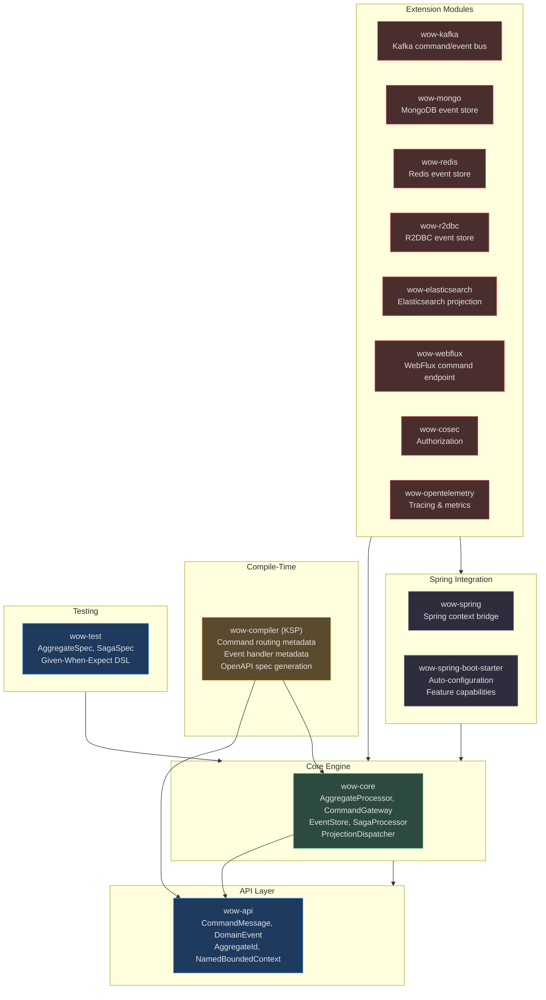
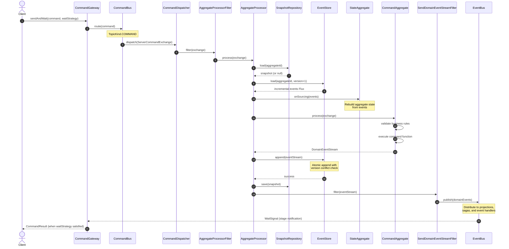
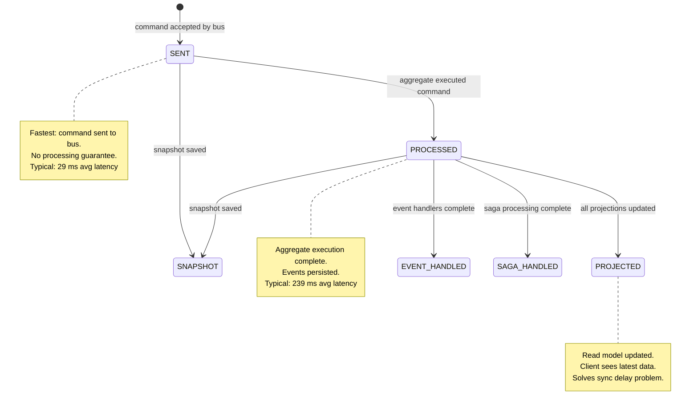
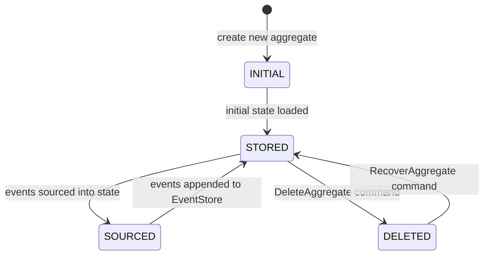
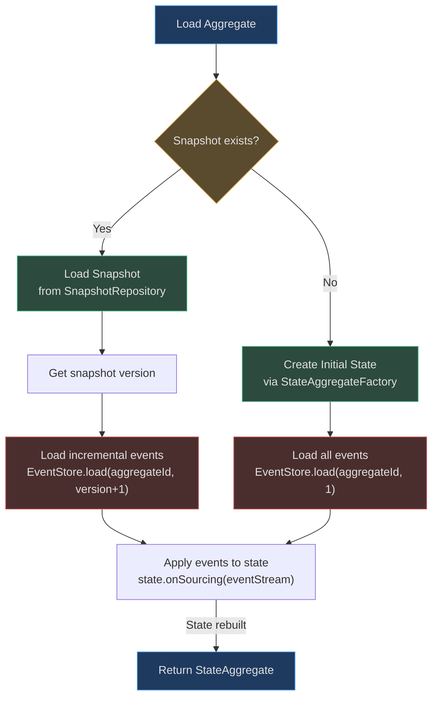
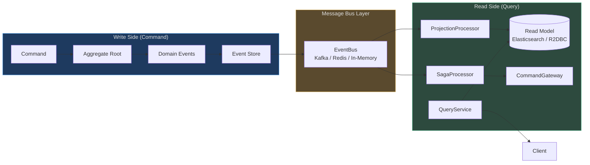

# Architecture Overview

The Wow Framework is a modular, layered architecture built on four foundational paradigms: **Domain-Driven Design**, **CQRS**, **Event Sourcing**, and **Reactive Programming**. Every component from the API contracts down to the storage backends is designed for non-blocking I/O, horizontal scalability, and clean separation of concerns.

Wow's architecture is built around a single core principle: **"Domain Model as a Service"**. Write your aggregate, and the framework handles everything else -- command routing, event persistence, projection updates, and API generation. Developers write only the domain model, and the framework automatically provides command routing, event persistence, projection pipelines, OpenAPI endpoints, and distributed saga orchestration. The result is a system where business logic lives in pure, testable aggregates, while infrastructure concerns are handled by pluggable extension modules.

## At-a-Glance Summary

| Component | Responsibility | Key Artifact | Source |
|---|---|---|---|
| **wow-api** | Pure API contracts: `CommandMessage`, `DomainEvent`, `AggregateId`, `NamedBoundedContext` | `wow-api` module | [Wow.kt:26-45](https://github.com/Ahoo-Wang/Wow/blob/main/wow-api/src/main/kotlin/me/ahoo/wow/api/Wow.kt#L26-L45) |
| **wow-core** | Framework engine: aggregates, command bus, event store, projections, sagas, serialization | `wow-core` module | [CommandGateway.kt:75-178](https://github.com/Ahoo-Wang/Wow/blob/main/wow-core/src/main/kotlin/me/ahoo/wow/command/CommandGateway.kt#L75-L178) |
| **wow-spring** | Spring Framework integration layer | `wow-spring` module | [settings.gradle.kts:32](https://github.com/Ahoo-Wang/Wow/blob/main/settings.gradle.kts#L32) |
| **wow-spring-boot-starter** | Auto-configuration with feature capabilities (Mongo, Kafka, Redis, R2DBC, etc.) | `wow-spring-boot-starter` module | [AggregateAutoConfiguration.kt:50-156](https://github.com/Ahoo-Wang/Wow/blob/main/wow-spring-boot-starter/src/main/kotlin/me/ahoo/wow/spring/boot/starter/modeling/AggregateAutoConfiguration.kt#L50-L156) |
| **wow-compiler** | KSP processor: generates command routing, event metadata, OpenAPI specs at compile time | `wow-compiler` module | [settings.gradle.kts:26](https://github.com/Ahoo-Wang/Wow/blob/main/settings.gradle.kts#L26) |
| **wow-test** | Unit testing DSL: `AggregateSpec` / `SagaSpec` with Given-When-Expect pattern | `test/wow-test` | [settings.gradle.kts:44-45](https://github.com/Ahoo-Wang/Wow/blob/main/settings.gradle.kts#L44-L45) |
| **wow-kafka** | Command/event bus implementation via Apache Kafka | `wow-kafka` module | [settings.gradle.kts:27](https://github.com/Ahoo-Wang/Wow/blob/main/settings.gradle.kts#L27) |
| **wow-mongo / wow-redis / wow-r2dbc** | Event store and snapshot store backends | `wow-mongo`, `wow-redis`, `wow-r2dbc` modules | [settings.gradle.kts:28-30](https://github.com/Ahoo-Wang/Wow/blob/main/settings.gradle.kts#L28-L30) |
| **wow-elasticsearch** | Projection (read model) storage via Elasticsearch | `wow-elasticsearch` module | [settings.gradle.kts:31](https://github.com/Ahoo-Wang/Wow/blob/main/settings.gradle.kts#L31) |
| **wow-opentelemetry** | End-to-end tracing and observability | `wow-opentelemetry` module | [settings.gradle.kts:35](https://github.com/Ahoo-Wang/Wow/blob/main/settings.gradle.kts#L35) |
| **wow-cosec** | Authorization and access control | `wow-cosec` module | [settings.gradle.kts:40](https://github.com/Ahoo-Wang/Wow/blob/main/settings.gradle.kts#L40) |
| **wow-webflux** | Spring WebFlux integration: auto-registers command route handler functions | `wow-webflux` module | [settings.gradle.kts:33](https://github.com/Ahoo-Wang/Wow/blob/main/settings.gradle.kts#L33) |

## Module Dependency Graph

The framework follows strict layered architecture where each module has a clear dependency direction. The `wow-api` module sits at the root, defining pure contracts with zero external dependencies, while infrastructure modules at the leaf level provide concrete implementations.

```mermaid
flowchart TB
    subgraph API["API Layer<br>"]
        A1["wow-api<br>CommandMessage, DomainEvent<br>AggregateId, NamedBoundedContext"]
    end

    subgraph CORE["Core Engine"]
        C1["wow-core<br>AggregateProcessor, CommandGateway<br>EventStore, SagaProcessor<br>ProjectionDispatcher"]
    end

    subgraph COMPILE["Compile-Time"]
        K1["wow-compiler (KSP)<br>Command routing metadata<br>Event handler metadata<br>OpenAPI spec generation"]
    end

    subgraph EXT["Extension Modules"]
        E1["wow-kafka<br>Kafka command/event bus"]
        E2["wow-mongo<br>MongoDB event store"]
        E3["wow-redis<br>Redis event store"]
        E4["wow-r2dbc<br>R2DBC event store"]
        E5["wow-elasticsearch<br>Elasticsearch projection"]
        E6["wow-webflux<br>WebFlux command endpoint"]
        E7["wow-cosec<br>Authorization"]
        E8["wow-opentelemetry<br>Tracing & metrics"]
    end

    subgraph SPRING["Spring Integration"]
        S1["wow-spring<br>Spring context bridge"]
        S2["wow-spring-boot-starter<br>Auto-configuration<br>Feature capabilities"]
    end

    subgraph TEST["Testing"]
        T1["wow-test<br>AggregateSpec, SagaSpec<br>Given-When-Expect DSL"]
    end

    C1 --> A1
    K1 --> A1
    K1 --> C1
    CORE --> API
    EXT --> CORE
    SPRING --> CORE
    EXT --> SPRING
    TEST --> CORE

    style A1 fill:#1e3a5f,stroke:#4a9eed,color:#e0e0e0
    style C1 fill:#2d4a3e,stroke:#4aba8a,color:#e0e0e0
    style K1 fill:#5a4a2e,stroke:#d4a84b,color:#e0e0e0
    style E1 fill:#4a2e2e,stroke:#d45b5b,color:#e0e0e0
    style E2 fill:#4a2e2e,stroke:#d45b5b,color:#e0e0e0
    style E3 fill:#4a2e2e,stroke:#d45b5b,color:#e0e0e0
    style E4 fill:#4a2e2e,stroke:#d45b5b,color:#e0e0e0
    style E5 fill:#4a2e2e,stroke:#d45b5b,color:#e0e0e0
    style E6 fill:#4a2e2e,stroke:#d45b5b,color:#e0e0e0
    style E7 fill:#4a2e2e,stroke:#d45b5b,color:#e0e0e0
    style E8 fill:#4a2e2e,stroke:#d45b5b,color:#e0e0e0
    style S1 fill:#2d2d3d,stroke:#7a7a8a,color:#e0e0e0
    style S2 fill:#2d2d3d,stroke:#7a7a8a,color:#e0e0e0
    style T1 fill:#1e3a5f,stroke:#4a9eed,color:#e0e0e0
```

<!-- Sources: settings.gradle.kts:19-63, wow-api/src/main/kotlin/me/ahoo/wow/api/Wow.kt:26-45 -->

## Module Hierarchy

The module hierarchy is defined in [settings.gradle.kts:19-63](https://github.com/Ahoo-Wang/Wow/blob/main/settings.gradle.kts#L19-L63). Every module depends only on modules above it in the hierarchy, ensuring no circular dependencies.

### Layer Breakdown

| Layer | Modules | Description | Source |
|---|---|---|---|
| **API Contracts** | `wow-api`, `wow-openapi` | Pure Kotlin interfaces and data classes. Zero framework dependencies. Defines `CommandMessage`, `DomainEvent`, `AggregateId`, `WaitStrategy`, etc. | [wow-api](https://github.com/Ahoo-Wang/Wow/blob/main/wow-api/src/main/kotlin/me/ahoo/wow/api/Wow.kt) |
| **Core Engine** | `wow-core` | Aggregate processing, command bus, event store abstraction, saga processing, projection dispatch, serialization. All reactive (Project Reactor). | [wow-core](https://github.com/Ahoo-Wang/Wow/blob/main/wow-core/src/main/kotlin/me/ahoo/wow/command/CommandGateway.kt) |
| **Compile-Time** | `wow-compiler` | KSP processor. Generates command routing tables, event handler metadata, and OpenAPI specs from annotations at compile time. | [settings.gradle.kts:26](https://github.com/Ahoo-Wang/Wow/blob/main/settings.gradle.kts#L26) |
| **Spring Integration** | `wow-spring`, `wow-spring-boot-starter` | Bridges the core engine into Spring's `ApplicationContext`. The starter provides auto-configuration with Gradle feature variants for optional capabilities. | [WowAutoConfiguration.kt](https://github.com/Ahoo-Wang/Wow/blob/main/wow-spring-boot-starter/src/main/kotlin/me/ahoo/wow/spring/boot/starter/WowAutoConfiguration.kt) |
| **Infrastructure** | `wow-kafka`, `wow-mongo`, `wow-redis`, `wow-r2dbc`, `wow-elasticsearch`, `wow-webflux` | Concrete implementations of core abstractions. Pluggable via classpath detection. | [settings.gradle.kts:27-34](https://github.com/Ahoo-Wang/Wow/blob/main/settings.gradle.kts#L27-L34) |
| **Observability** | `wow-opentelemetry` | End-to-end tracing, metrics, and logging integration via OpenTelemetry. | [settings.gradle.kts:35](https://github.com/Ahoo-Wang/Wow/blob/main/settings.gradle.kts#L35) |
| **Security** | `wow-cosec` | Command/query authorization with policy-based access control. | [settings.gradle.kts:40](https://github.com/Ahoo-Wang/Wow/blob/main/settings.gradle.kts#L40) |
| **Testing** | `wow-test`, `wow-tck`, `wow-mock` | Aggregate and saga testing DSL; Technology Compatibility Kit for integration tests; in-memory mock implementations. | [settings.gradle.kts:44-49](https://github.com/Ahoo-Wang/Wow/blob/main/settings.gradle.kts#L44-L49) |
| **Compensation** | `wow-compensation-api`, `wow-compensation-core`, `wow-compensation-domain`, `wow-compensation-server` | Event compensation subsystem with dashboard for monitoring and retrying failed events. | [settings.gradle.kts:56-63](https://github.com/Ahoo-Wang/Wow/blob/main/settings.gradle.kts#L56-L63) |

### Design Principles Enforced by Module Separation

1. **Dependency Inversion**: Core modules depend on abstractions (`CommandBus`, `EventStore`, `SnapshotRepository`), not concrete implementations. Infrastructure modules provide the implementations and are discovered at runtime via Spring's `@ConditionalOnClass` auto-configuration.
2. **Open-Closed Principle**: New storage backends or message transports can be added as new modules without touching core code.
3. **Single Responsibility**: Each module has exactly one reason to change. `wow-mongo` handles MongoDB event storage; `wow-kafka` handles Kafka message transport; they never overlap.

### Key Design Decisions

| Decision | Rationale |
|----------|-----------|
| Reactive (Project Reactor) | Non-blocking I/O for maximum throughput |
| KSP over KAPT | Compile-time code generation, faster builds |
| Spring Boot auto-configuration | Zero-boilerplate setup |
| Pluggable event store | Swap backends without changing domain code |
| Given-When-Expect testing | Readable, maintainable test suite |
| Dark launch support | Feature flags for gradual rollouts |

## Command Processing Flow

The command processing flow is the central nervous system of the Wow Framework. It coordinates command routing, aggregate loading, business rule validation, event persistence, snapshot creation, and event publication through a reactive pipeline.

```mermaid
sequenceDiagram
    autonumber
    actor Client
    participant CG as CommandGateway
    participant CB as CommandBus
    participant CD as CommandDispatcher
    participant AF as AggregateProcessorFilter
    participant AP as AggregateProcessor
    participant SR as SnapshotRepository
    participant ES as EventStore
    participant SA as StateAggregate
    participant CA as CommandAggregate
    participant SF as SendDomainEventStreamFilter
    participant EB as EventBus

    Client->>CG: sendAndWait(command, waitStrategy)
    CG->>CB: route(command)
    Note over CB: TopicKind.COMMAND
    CB->>CD: dispatch(ServerCommandExchange)
    CD->>AF: filter(exchange)
    AF->>AP: process(exchange)

    AP->>SR: load(aggregateId)
    SR-->>AP: snapshot (or null)
    AP->>ES: load(aggregateId, version+1)
    ES-->>AP: incremental events Flux
    AP->>SA: onSourcing(events)
    Note over SA: Rebuild aggregate state<br>from events
    AP->>CA: process(exchange)
    CA->>CA: validate business rules
    CA->>CA: execute command function
    CA-->>AP: DomainEventStream

    AP->>ES: append(eventStream)
    Note over ES: Atomic append with<br>version conflict check
    ES-->>AP: success
    AP->>SR: save(snapshot)
    AP->>SF: filter(eventStream)
    SF->>EB: publish(domainEvents)
    Note over EB: Distribute to projections,<br>sagas, and event handlers

    EB-->>CG: WaitSignal (stage notification)
    CG-->>Client: CommandResult (when waitStrategy satisfied)
```

<!-- Sources: wow-core/src/main/kotlin/me/ahoo/wow/command/CommandGateway.kt:75-178, wow-core/src/main/kotlin/me/ahoo/wow/command/CommandBus.kt:36-41, wow-core/src/main/kotlin/me/ahoo/wow/modeling/command/AggregateProcessor.kt:32-49, wow-core/src/main/kotlin/me/ahoo/wow/modeling/command/SimpleCommandAggregate.kt:43-80, wow-spring-boot-starter/src/main/kotlin/me/ahoo/wow/spring/boot/starter/modeling/AggregateAutoConfiguration.kt:50-156 -->

### Step-by-Step Flow Description

| Step | Component | Action | Source |
|---|---|---|---|
| 1 | **Client** | Sends a command with a `WaitStrategy` specifying how long to wait and at what stage | [CommandGateway.kt:89-91](https://github.com/Ahoo-Wang/Wow/blob/main/wow-core/src/main/kotlin/me/ahoo/wow/command/CommandGateway.kt#L89-L91) |
| 2 | **CommandGateway** | Entry point implementing `CommandBus`. Routes command to the appropriate handler based on aggregate type | [CommandGateway.kt:75](https://github.com/Ahoo-Wang/Wow/blob/main/wow-core/src/main/kotlin/me/ahoo/wow/command/CommandGateway.kt#L75) |
| 3 | **CommandDispatcher** | Bridges the command bus to the aggregate processor filter chain; configured in `AggregateAutoConfiguration` | [AggregateAutoConfiguration.kt:138-149](https://github.com/Ahoo-Wang/Wow/blob/main/wow-spring-boot-starter/src/main/kotlin/me/ahoo/wow/spring/boot/starter/modeling/AggregateAutoConfiguration.kt#L138-L149) |
| 4 | **AggregateProcessorFilter** | Constructs an `AggregateProcessor` for the target aggregate, handling sharding and retry logic | [AggregateAutoConfiguration.kt:91-96](https://github.com/Ahoo-Wang/Wow/blob/main/wow-spring-boot-starter/src/main/kotlin/me/ahoo/wow/spring/boot/starter/modeling/AggregateAutoConfiguration.kt#L91-L96) |
| 5 | **Snapshot + Event Loading** | Loads the latest snapshot, then replays incremental events from the `EventStore` to rebuild current state | [EventSourcingStateAggregateRepository.kt:41-60](https://github.com/Ahoo-Wang/Wow/blob/main/wow-core/src/main/kotlin/me/ahoo/wow/eventsourcing/EventSourcingStateAggregateRepository.kt#L41-L60) |
| 6 | **Business Rule Execution** | The aggregate root (`CommandAggregate`) validates invariants and executes the command handler function | [SimpleCommandAggregate.kt:68-79](https://github.com/Ahoo-Wang/Wow/blob/main/wow-core/src/main/kotlin/me/ahoo/wow/modeling/command/SimpleCommandAggregate.kt#L68-L79) |
| 7 | **Event Persistence** | `EventStore.append()` atomically writes the event stream, enforcing optimistic concurrency via version checks | [EventStore.kt:38-43](https://github.com/Ahoo-Wang/Wow/blob/main/wow-core/src/main/kotlin/me/ahoo/wow/eventsourcing/EventStore.kt#L38-L43) |
| 8 | **Snapshot + Publish** | After persistence, a snapshot is saved and domain events are published to the `EventBus` for downstream processing | [AggregateAutoConfiguration.kt:100-106](https://github.com/Ahoo-Wang/Wow/blob/main/wow-spring-boot-starter/src/main/kotlin/me/ahoo/wow/spring/boot/starter/modeling/AggregateAutoConfiguration.kt#L100-L106) |

### Wait Strategies and Command Stages

The `CommandGateway` supports waiting for the command to reach specific processing stages before returning to the client. This is critical for solving the read-write synchronization delay problem inherent in CQRS architectures.

```mermaid
stateDiagram-v2
    [*] --> SENT : command accepted by bus
    SENT --> PROCESSED : aggregate executed command
    SENT --> SNAPSHOT : snapshot saved
    PROCESSED --> SNAPSHOT : snapshot saved
    PROCESSED --> PROJECTED : all projections updated
    PROCESSED --> EVENT_HANDLED : event handlers complete
    PROCESSED --> SAGA_HANDLED : saga processing complete

    note right of SENT
        Fastest: command sent to bus.
        No processing guarantee.
        Typical: 29 ms avg latency
    end note

    note right of PROCESSED
        Aggregate execution complete.
        Events persisted.
        Typical: 239 ms avg latency
    end note

    note right of PROJECTED
        Read model updated.
        Client sees latest data.
        Solves sync delay problem.
    end note

```

<!-- Sources: wow-core/src/main/kotlin/me/ahoo/wow/command/wait/CommandStage.kt:25-123, wow-core/src/main/kotlin/me/ahoo/wow/command/wait/WaitStrategy.kt -->

Each stage in `CommandStage` is defined as an enum with explicit prerequisite dependencies:

| Stage | Prerequisites | Waits for Functions | Typical Use Case | Source |
|---|---|---|---|---|
| `SENT` | (none) | No | Fire-and-forget commands; maximum throughput | [CommandStage.kt:33](https://github.com/Ahoo-Wang/Wow/blob/main/wow-core/src/main/kotlin/me/ahoo/wow/command/wait/CommandStage.kt#L33) |
| `PROCESSED` | `SENT` | No | Ensure aggregate has processed the command | [CommandStage.kt:43](https://github.com/Ahoo-Wang/Wow/blob/main/wow-core/src/main/kotlin/me/ahoo/wow/command/wait/CommandStage.kt#L43) |
| `SNAPSHOT` | `SENT`, `PROCESSED` | No | Ensure snapshot has been created after processing | [CommandStage.kt:52](https://github.com/Ahoo-Wang/Wow/blob/main/wow-core/src/main/kotlin/me/ahoo/wow/command/wait/CommandStage.kt#L52) |
| `PROJECTED` | `SENT`, `PROCESSED` | Yes | Read model updated; solves sync delay problem | [CommandStage.kt:63](https://github.com/Ahoo-Wang/Wow/blob/main/wow-core/src/main/kotlin/me/ahoo/wow/command/wait/CommandStage.kt#L63) |
| `EVENT_HANDLED` | `SENT`, `PROCESSED` | Yes | External event handlers have processed the events | [CommandStage.kt:73](https://github.com/Ahoo-Wang/Wow/blob/main/wow-core/src/main/kotlin/me/ahoo/wow/command/wait/CommandStage.kt#L73) |
| `SAGA_HANDLED` | `SENT`, `PROCESSED` | Yes | Saga orchestrators have completed processing | [CommandStage.kt:84](https://github.com/Ahoo-Wang/Wow/blob/main/wow-core/src/main/kotlin/me/ahoo/wow/command/wait/CommandStage.kt#L84) |

## Aggregate Lifecycle

The aggregate root is the heart of domain logic in the Wow Framework. It follows a well-defined state machine that governs how commands are processed, events are sourced, and state transitions occur.

### Aggregate State Machine

```mermaid
stateDiagram-v2
    [*] --> INITIAL : create new aggregate
    INITIAL --> STORED : initial state loaded
    STORED --> SOURCED : events sourced into state
    SOURCED --> STORED : events appended to EventStore
    STORED --> DELETED : DeleteAggregate command
    DELETED --> STORED : RecoverAggregate command
```

<!-- Sources: wow-core/src/main/kotlin/me/ahoo/wow/modeling/command/CommandAggregate.kt:41-118, wow-core/src/main/kotlin/me/ahoo/wow/modeling/command/SimpleCommandAggregate.kt:43-80 -->

### CommandState Enum

The `CommandState` enum ([CommandAggregate.kt:65-118](https://github.com/Ahoo-Wang/Wow/blob/main/wow-core/src/main/kotlin/me/ahoo/wow/modeling/command/CommandAggregate.kt#L65-L118)) governs the lifecycle of command processing within an aggregate:

| State | Valid Operations | Description | Source |
|---|---|---|---|
| `STORED` | `onSourcing(eventStream)` | The aggregate is ready to source events. This is the entry point for each command processing cycle. | [CommandAggregate.kt:66-74](https://github.com/Ahoo-Wang/Wow/blob/main/wow-core/src/main/kotlin/me/ahoo/wow/modeling/command/CommandAggregate.kt#L66-L74) |
| `SOURCED` | `onStore(eventStore, eventStream)` | Events have been applied to the state aggregate. The event stream is ready to be persisted. | [CommandAggregate.kt:75-83](https://github.com/Ahoo-Wang/Wow/blob/main/wow-core/src/main/kotlin/me/ahoo/wow/modeling/command/CommandAggregate.kt#L75-L83) |
| `EXPIRED` | (none) | Terminal state. No further operations are supported. | [CommandAggregate.kt:84-85](https://github.com/Ahoo-Wang/Wow/blob/main/wow-core/src/main/kotlin/me/ahoo/wow/modeling/command/CommandAggregate.kt#L84-L85) |

### Key Lifecycle Rules

1. **Commands can only be processed in `STORED` state**: The aggregate transitions to `SOURCED` after sourcing events, then back to `STORED` after persisting. This ensures serial command processing per aggregate instance, preventing race conditions, as documented in [AggregateProcessor.kt:41-43](https://github.com/Ahoo-Wang/Wow/blob/main/wow-core/src/main/kotlin/me/ahoo/wow/modeling/command/AggregateProcessor.kt#L41-L43).
2. **Delete and Recover are built-in commands**: `DefaultDeleteAggregate` transitions the aggregate to a deleted state, while `DefaultRecoverAggregate` restores it. Attempting operations on a deleted aggregate throws `IllegalAccessDeletedAggregateException`.
3. **Optimistic concurrency**: The `EventStore.append()` method rejects writes when a version conflict is detected, ensuring that only one concurrent write can succeed per aggregate.

## Event Sourcing Architecture

Wow implements a full event sourcing pattern where the aggregate state is derived from the ordered sequence of domain events rather than being directly persisted as a row in a relational database.

### State Rebuild Strategy

```mermaid
flowchart TD
    A["Load Aggregate"] --> B{"Snapshot exists?"}
    B -->|"Yes"| C["Load Snapshot<br>from SnapshotRepository"]
    B -->|"No"| D["Create Initial State<br>via StateAggregateFactory"]
    C --> E["Get snapshot version"]
    E --> F["Load incremental events<br>EventStore.load(aggregateId, version+1)"]
    D --> G["Load all events<br>EventStore.load(aggregateId, 1)"]
    F --> H["Apply events to state<br>state.onSourcing(eventStream)"]
    G --> H
    H -- "State rebuilt" --> I["Return StateAggregate"]

    style A fill:#1e3a5f,stroke:#4a9eed,color:#e0e0e0
    style B fill:#5a4a2e,stroke:#d4a84b,color:#e0e0e0
    style C fill:#2d4a3e,stroke:#4aba8a,color:#e0e0e0
    style D fill:#2d4a3e,stroke:#4aba8a,color:#e0e0e0
    style F fill:#4a2e2e,stroke:#d45b5b,color:#e0e0e0
    style G fill:#4a2e2e,stroke:#d45b5b,color:#e0e0e0
    style I fill:#1e3a5f,stroke:#4a9eed,color:#e0e0e0
```

<!-- Sources: wow-core/src/main/kotlin/me/ahoo/wow/eventsourcing/EventSourcingStateAggregateRepository.kt:31-39, wow-core/src/main/kotlin/me/ahoo/wow/eventsourcing/EventStore.kt:27-98 -->

The `EventSourcingStateAggregateRepository` orchestrates this flow. Its loading process works as follows:

1. For the latest version (tailVersion = `Int.MAX_VALUE`), it first attempts to load from the `SnapshotRepository`.
2. If no snapshot exists, it creates a new aggregate instance via `StateAggregateFactory`.
3. Events from the `EventStore` are applied sequentially starting from the aggregate's expected next version.

This approach enables point-in-time state reconstruction: by specifying a `tailVersion` or `tailEventTime`, the repository can rebuild the aggregate state as it existed at any historical point.

### Event Store Interface

The `EventStore` interface ([EventStore.kt:27-98](https://github.com/Ahoo-Wang/Wow/blob/main/wow-core/src/main/kotlin/me/ahoo/wow/eventsourcing/EventStore.kt#L27-L98)) defines the contract for event persistence:

| Method | Description | Concurrency Guarantees |
|---|---|---|
| `append(eventStream)` | Atomically appends a domain event stream | Throws `EventVersionConflictException` on version conflict; `DuplicateAggregateIdException` for duplicate IDs; `DuplicateRequestIdException` for duplicate requests |
| `load(aggregateId, headVersion, tailVersion)` | Loads event streams within version range (inclusive) | Returns `Flux` for reactive streaming |
| `load(aggregateId, headEventTime, tailEventTime)` | Loads event streams within time range (inclusive) | Returns `Flux` for reactive streaming |
| `single(aggregateId, version)` | Loads a single event stream at a specific version | Convenience method using `load()` |
| `last(aggregateId)` | Loads the most recent event stream | Used for tail version lookup |

## Extension Points and Pluggability

The Wow Framework follows the **Strategy Pattern** throughout: every infrastructure concern is defined as an interface in `wow-core`, with concrete implementations in extension modules. Spring's auto-configuration wires the appropriate implementation at startup based on classpath availability.

### Core Extension Interfaces

| Extension Point | Interface | Purpose | Implementations | Source |
|---|---|---|---|---|
| **Command Bus** | `CommandBus` / `DistributedCommandBus` | Routes commands to aggregate processors | `InMemoryCommandBus`, `LocalFirstCommandBus`, Kafka-backed | [CommandBus.kt:36-69](https://github.com/Ahoo-Wang/Wow/blob/main/wow-core/src/main/kotlin/me/ahoo/wow/command/CommandBus.kt#L36-L69) |
| **Event Bus** | `EventBus` / `DomainEventBus` | Distributes domain events to projections, sagas, and handlers | `InMemoryEventBus`, Kafka-backed, Redis-backed | [settings.gradle.kts:27](https://github.com/Ahoo-Wang/Wow/blob/main/settings.gradle.kts#L27) |
| **Event Store** | `EventStore` | Persistent storage of event streams | MongoDB, Redis, R2DBC (PostgreSQL/MySQL/MariaDB) | [EventStore.kt:27](https://github.com/Ahoo-Wang/Wow/blob/main/wow-core/src/main/kotlin/me/ahoo/wow/eventsourcing/EventStore.kt#L27) |
| **Snapshot Repository** | `SnapshotRepository` | Snapshot storage for aggregate performance optimization | MongoDB, Redis, R2DBC | [settings.gradle.kts:28-30](https://github.com/Ahoo-Wang/Wow/blob/main/settings.gradle.kts#L28-L30) |
| **Wait Strategy** | `WaitStrategy` | Controls command response timing | `WaitingForSent`, `WaitingForProcessed`, `WaitingForProjected`, etc. | [CommandStage.kt:25-123](https://github.com/Ahoo-Wang/Wow/blob/main/wow-core/src/main/kotlin/me/ahoo/wow/command/wait/CommandStage.kt#L25-L123) |
| **ID Generator** | `IdGenerator` (via CosId) | Generates globally unique aggregate IDs | Snowflake, segment, etc. (via CosId integration) | `me.ahoo.cosid` |
| **Serialization** | `MessageSerializer` | JSON serialization with type metadata | Jackson-based `JsonSerializer` | [wow-core serialization](https://github.com/Ahoo-Wang/Wow/tree/main/wow-core/src/main/kotlin/me/ahoo/wow/serialization) |

### Spring Boot Auto-Configuration Structure

The `wow-spring-boot-starter` module uses Gradle feature variants to declare optional capabilities, ensuring that you only depend on what you need. Key auto-configuration classes include:

| Auto-Configuration Class | Condition | Wires | Source |
|---|---|---|---|
| `WowAutoConfiguration` | `@ConditionalOnWowEnabled` | `ServiceProvider`, `NamedBoundedContext`, `ErrorConverterRegistrar` | [WowAutoConfiguration.kt:37-72](https://github.com/Ahoo-Wang/Wow/blob/main/wow-spring-boot-starter/src/main/kotlin/me/ahoo/wow/spring/boot/starter/WowAutoConfiguration.kt#L37-L72) |
| `AggregateAutoConfiguration` | `@ConditionalOnWowEnabled` | `StateAggregateFactory`, `StateAggregateRepository`, `CommandAggregateFactory`, `AggregateProcessorFactory`, `CommandDispatcher`, filter chain | [AggregateAutoConfiguration.kt:50-156](https://github.com/Ahoo-Wang/Wow/blob/main/wow-spring-boot-starter/src/main/kotlin/me/ahoo/wow/spring/boot/starter/modeling/AggregateAutoConfiguration.kt#L50-L156) |
| `EventAutoConfiguration` | `@ConditionalOnWowEnabled` | Event bus, event dispatcher, event processor registry | [EventAutoConfiguration.kt](https://github.com/Ahoo-Wang/Wow/blob/main/wow-spring-boot-starter/src/main/kotlin/me/ahoo/wow/spring/boot/starter/event/EventAutoConfiguration.kt) |
| `KafkaAutoConfiguration` | `@ConditionalOnKafkaEnabled` | Kafka command bus, Kafka event bus | [KafkaAutoConfiguration.kt](https://github.com/Ahoo-Wang/Wow/blob/main/wow-spring-boot-starter/src/main/kotlin/me/ahoo/wow/spring/boot/starter/kafka/KafkaAutoConfiguration.kt) |
| `MongoEventSourcingAutoConfiguration` | `@ConditionalOnMongoEnabled` | MongoDB event store, MongoDB snapshot repository | [MongoEventSourcingAutoConfiguration.kt](https://github.com/Ahoo-Wang/Wow/blob/main/wow-spring-boot-starter/src/main/kotlin/me/ahoo/wow/spring/boot/starter/mongo/MongoEventSourcingAutoConfiguration.kt) |
| `WebFluxAutoConfiguration` | `@ConditionalOnWebfluxEnabled` | Command routing handler functions, OpenAPI endpoints | [WebFluxAutoConfiguration.kt](https://github.com/Ahoo-Wang/Wow/blob/main/wow-spring-boot-starter/src/main/kotlin/me/ahoo/wow/spring/boot/starter/webflux/WebFluxAutoConfiguration.kt) |

## CQRS Separation in Action

The CQRS pattern is embedded at every level of the architecture:

```mermaid
flowchart LR
    subgraph WRITE["Write Side (Command)"]
        CMD["Command"] --> AR["Aggregate Root"]
        AR --> EVT["Domain Events"]
        EVT --> ES["Event Store"]
    end

    subgraph BUS["Message Bus Layer"]
        EB["EventBus<br>Kafka / Redis / In-Memory"]
    end

    subgraph READ["Read Side (Query)"]
        PP["ProjectionProcessor"] --> RM[("Read Model<br>Elasticsearch / R2DBC")]
        SP["SagaProcessor"] --> CG["CommandGateway"]
        QS["QueryService"] --> RM
    end

    ES --> EB
    EB --> PP
    EB --> SP
    QS --> Client

    style WRITE fill:#1e3a5f,stroke:#4a9eed,color:#e0e0e0
    style BUS fill:#5a4a2e,stroke:#d4a84b,color:#e0e0e0
    style READ fill:#2d4a3e,stroke:#4aba8a,color:#e0e0e0
```

<!-- Sources: wow-core/src/main/kotlin/me/ahoo/wow/projection/ProjectionDispatcher.kt, wow-core/src/main/kotlin/me/ahoo/wow/saga/stateless/StatelessSagaHandler.kt -->

### Write Side Responsibilities

- Accepts commands via `CommandGateway`
- Validates business rules within the aggregate root
- Produces domain events that represent state changes
- Maintains strong transactional consistency via atomic event store appends

### Read Side Responsibilities

- Subscribes to domain events via the `EventBus`
- Projections transform events into optimized read models (Elasticsearch indices, SQL views)
- Sagas react to events by sending follow-up commands, enabling distributed transaction orchestration
- Query services read from purpose-built read models, not the event store

### The Bridge: State Events

Between the write and read sides, Wow introduces **state events** (`StateEvent`). After command processing, the framework publishes the full current state of the aggregate as an event. This enables:
- **Projections** that rebuild read models from complete state snapshots rather than incremental deltas
- **Business Intelligence** pipelines that consume aggregate states directly into data warehouses
- **Cache warming** via [CoCache](../config/cocache) for ultra-low-latency query services

## Compile-Time Code Generation (wow-compiler)

The `wow-compiler` module is a KSP processor that eliminates boilerplate and runtime reflection. At compile time, it:

1. **Scans** `@CommandRoute`, `@OnEvent`, `@OnStateEvent`, and other Wow annotations
2. **Generates** command routing tables, event handler registries, and function metadata
3. **Produces** OpenAPI specifications from command and event models

This compile-time approach means:
- No runtime annotation scanning overhead
- Faster startup time
- Type-safe command routing verified at build time

The compiler integrates with `wow-openapi` to automatically generate OpenAPI specs, and with `wow-schema` to produce JSON Schema definitions for commands and events.

## Performance Characteristics

The architectural choices of the Wow Framework directly enable its performance profile. Key design decisions that impact performance:

1. **Reactive (non-blocking) pipelines**: `Mono` and `Flux` throughout ensure no thread blocking, enabling high concurrency under load.
2. **Snapshot optimization**: `SnapshotRepository` avoids replaying the full event history on every aggregate load.
3. **Local-first routing**: `LocalFirstCommandBus` routes commands to local aggregate processors first, falling back to distributed routing only when necessary.
4. **Wait strategy flexibility**: `SENT` wait mode achieves 59,000+ TPS for fire-and-forget scenarios, while `PROCESSED` mode trades throughput for stronger consistency guarantees at 18,000+ TPS.

## Related Pages

| Page | Description |
|---|---|
| [Introduction](./introduction) | Overview of Wow framework features and value proposition |
| [Domain Modeling](./modeling) | How to design aggregate roots, commands, and events |
| [Command Gateway](../command-gateway) | Deep-dive into command sending and wait strategies |
| [Event Sourcing](./event-sourcing) | Event store, snapshots, and state rebuild mechanics |
| [Saga Orchestration](./saga) | Distributed transaction support via sagas |
| [Projections](./projection) | Building and updating read models |
| [Testing](./testing) | AggregateSpec and SagaSpec testing DSL |
| [Spring Boot Integration](../reference/spring-boot) | Auto-configuration details and property reference |
| [CoCache](../config/cocache) | Projection caching for query performance |
| [Observability](../reference/observability) | OpenTelemetry tracing and metrics |
