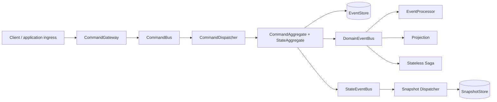

# Architecture Overview

Wow expresses a business write as **command → aggregate decision → domain event → sourced state**. The framework connects that path to messaging, storage, waiting, and derived processing. The application still owns business boundaries, event semantics, external side effects, and operational evidence. That is the technical boundary of “Domain Model as a Service” from the [Introduction](../introduction.md), not a promise that everything outside the domain class is automatically correct.

This is a mechanism explanation. Use [Configuration](../configuration.md), the [Spring Boot Starter](../extensions/spring-boot-starter.md), and the [Command Gateway](../command-gateway.md) to select capabilities, configure backends, and send commands.

## Layers and ownership

| Layer | Main modules | Owns | Does not own |
| --- | --- | --- | --- |
| Public contracts | `wow-api` | Commands, events, aggregate identity, annotations, and other public models | Runtime scheduling or backend implementations |
| Core runtime | `wow-core` | CommandGateway, aggregate processing, event sourcing, dispatchers, waiting, serialization, and Runtime | Spring bean discovery or a concrete broker/storage |
| Compile time | `wow-compiler` | Wow metadata, aggregate metadata accessors, and query-property constants derived from annotations | Runtime routing or the OpenAPI document itself |
| Container integration | `wow-spring`, `wow-spring-boot-starter` | Spring lifecycle bridge, conditional assembly, component discovery, and capability composition | Business rules or backend-native operations |
| Adapters | `wow-kafka`, `wow-mongo`, `wow-redis`, `wow-elasticsearch`, and others | Concrete Bus, EventStore, SnapshotStore, and query implementations | Redefining core public semantics |
| Verification | `wow-test`, `wow-tck` | Domain test DSL and adapter contract tests | Replacing real recovery, capacity, or failure evidence |

Dependencies flow from public contracts to the core, with Spring and adapters completing composition. A new backend should implement an existing narrow interface and retain its native consistency, acknowledgement, redelivery, and recovery semantics in the adapter instead of reproducing infrastructure in the domain model.

## Runtime component view

```mermaid
flowchart LR
    Client[Client / application ingress] --> Gateway[CommandGateway]
    Gateway --> CommandBus[CommandBus]
    CommandBus --> CommandDispatcher[CommandDispatcher]
    CommandDispatcher --> Aggregate[CommandAggregate + StateAggregate]
    Aggregate --> EventStore[(EventStore)]
    Aggregate --> DomainBus[DomainEventBus]
    Aggregate --> StateBus[StateEventBus]
    DomainBus --> EventProcessor[EventProcessor]
    DomainBus --> Projection[Projection]
    DomainBus --> Saga[Stateless Saga]
    StateBus --> Snapshot[Snapshot Dispatcher]
    Snapshot --> SnapshotStore[(SnapshotStore)]
```

Three ownership categories matter:

- `EventStore` holds authoritative event history. A stream becomes recovery input only after append succeeds.
- `SnapshotStore` and projections hold derived data. They can be rebuilt and do not replace event history.
- A Bus transports messages. Delivery, acknowledgement, retention, and redelivery strength depend on the selected implementation and configuration.

See [Data Flow](./data-flow.md) for the stage-by-stage path and [Aggregate Lifecycle](./aggregate-lifecycle.md) for aggregate-internal transitions.

## Write and read boundaries

The write side protects invariants within one aggregate boundary: restore current state, invoke the command function, source the new events, and append the event stream. The read side is served by projections, snapshots, or other derived models. Completing the write does not automatically mean an arbitrary read model is current.

The caller selects an observable completion point with a wait plan:

| Stage | What it proves | What it does not prove |
| --- | --- | --- |
| `SENT` | The CommandBus send operation completed | The aggregate ran |
| `PROCESSED` | The command filter chain completed successfully; the current default chain includes aggregate processing, event append, and domain/state event sends | Snapshot, projection, event processor, or Saga completion |
| `SNAPSHOT` | The targeted snapshot processing completed | Any projection completed |
| `PROJECTED` / `EVENT_HANDLED` / `SAGA_HANDLED` | The selected downstream function completed | Global consistency across external systems |

The [Command Gateway wait-plan section](../command-gateway.md#wait-plans) owns exact target selection and failure results; this page does not duplicate call examples.

## Ordering and concurrency boundary

Default dispatchers map messages by aggregate ID into a finite set of groups. A group is processed serially while different groups may run concurrently. An `AggregateSchedulerSupplier` caches a Reactor Scheduler per named aggregate. The supported scope is therefore that the same aggregate ID maps to the same group within the same dispatcher instance. It does not establish global order across processes, buses, handler functions, or external systems.

Concurrent writes still pass through EventStore version constraints. Scheduling reduces contention inside one instance; append rejects conflicting persistent writes. These are different controls. Backend redelivery also does not make an external side effect idempotent.

See [Aggregate Scheduler](./aggregate-scheduler.md), [Event Bus](./event-bus.md), and [Event Store](../eventstore.md).

## Lifecycle boundary

`WowRuntime` is the single high-level owner of runtime components. Every component is prepared before any component starts. Graceful shutdown observes a continuous quiet period, closes global admission, quiesces component intake, and cleans up in reverse order. Fatal component failures and the global deadline enter the same whole-runtime termination path.

Spring adapts that ownership through one `WowRuntimeLifecycle`. A runtime component must not have a competing Spring lifecycle or destroy owner. See [Runtime Lifecycle](./runtime-lifecycle.md) for the complete contract.

## Compile-time and runtime responsibilities

KSP reads declarations such as `@BoundedContext` and `@AggregateRoot`, then produces packaged metadata and Kotlin constants. Runtime and interface modules consume those outputs to assemble aggregate discovery, routes, schemas, or OpenAPI. If KSP output is absent, the runtime does not reconstruct the complete contract from this documentation.

See [Compiler](./compiler.md) for generated artifacts, paths, and checks. [Serialization](./serialization.md) and [Event Evolution](./event-evolution.md) own wire format and persisted-event changes.

## Extension checklist

1. Keep public models in `wow-api`, runtime behavior in `wow-core`, and concrete backends in their adapters.
2. Do not introduce blocking calls into reactive command or event paths.
3. Decide whether `WowRuntime` owns the new component; if it does, keep one lifecycle owner.
4. Verify source, binary, and wire impact separately; compilation does not prove historical-data compatibility.
5. State only the ordering, retry, idempotency, and acknowledgement scope proven by implementation and tests.
6. Verify adapters with their TCK/integration tests, then gather real-environment recovery and operational evidence.

## Fact sources

- [`wow-api`](https://github.com/Ahoo-Wang/Wow/tree/main/wow-api/src/main/kotlin/me/ahoo/wow/api)
- [`wow-core`](https://github.com/Ahoo-Wang/Wow/tree/main/wow-core/src/main/kotlin/me/ahoo/wow)
- [`wow-compiler`](https://github.com/Ahoo-Wang/Wow/tree/main/wow-compiler/src/main/kotlin/me/ahoo/wow/compiler)
- [`Architecture.svg`](https://github.com/Ahoo-Wang/Wow/blob/main/document/design/assets/Architecture.svg)

## Continue reading

- [Core Concepts](../core-concepts.md): stable vocabulary and value flow
- [Module Dependencies](./module-dependencies.md): exact capabilities and Gradle boundaries
- [Production Best Practices](../best-practices.md): turn component boundaries into release evidence
