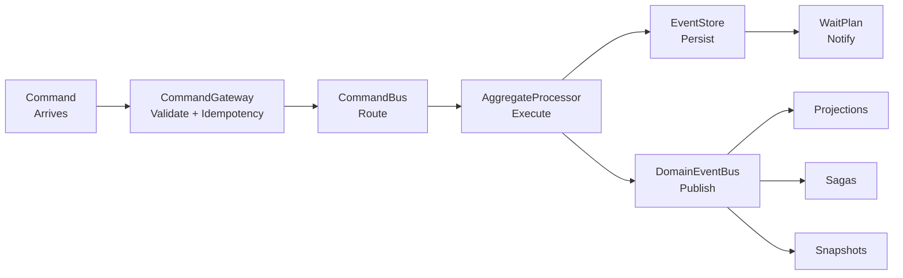
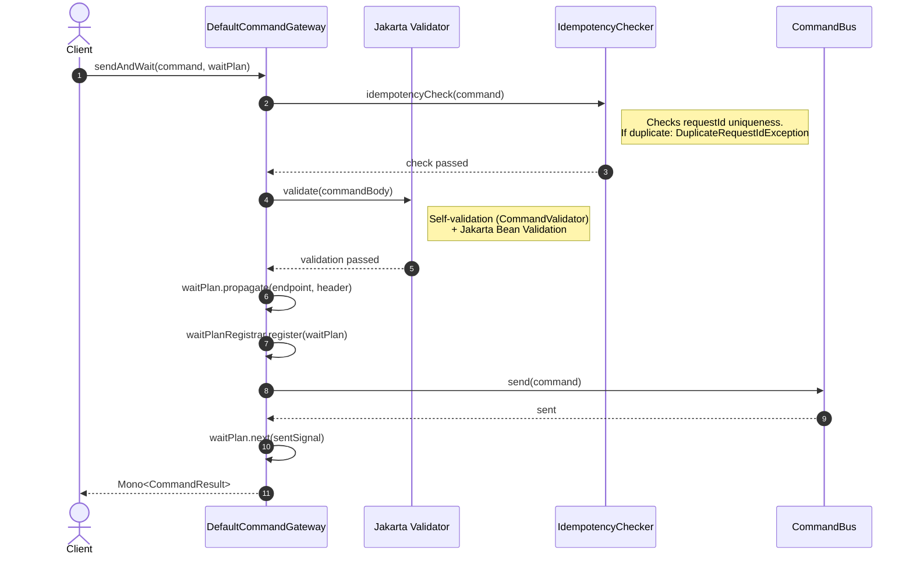
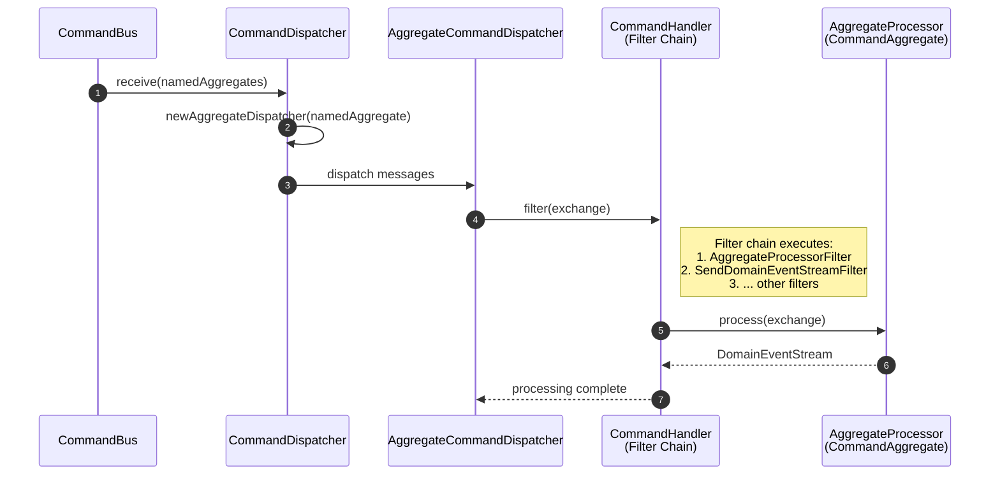
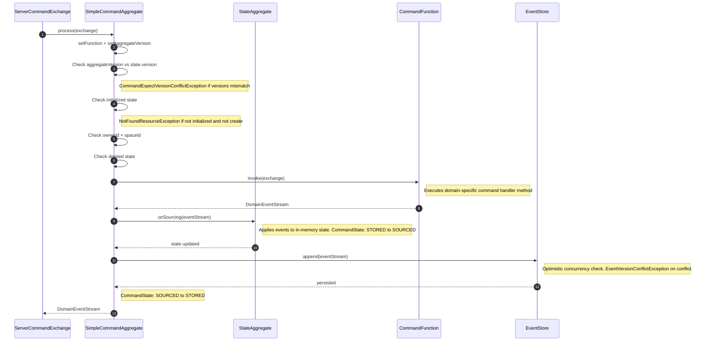
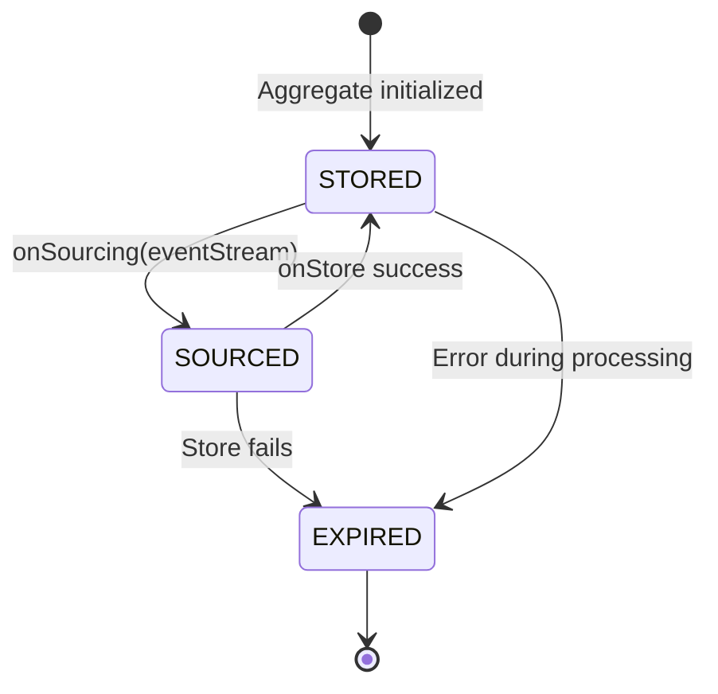
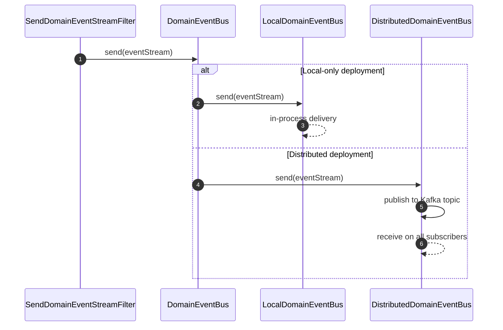
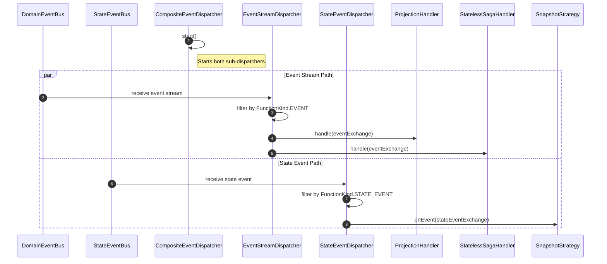
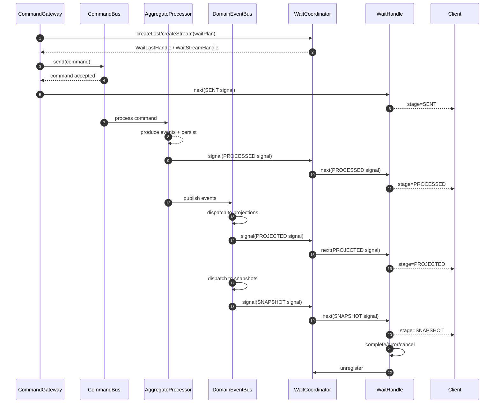
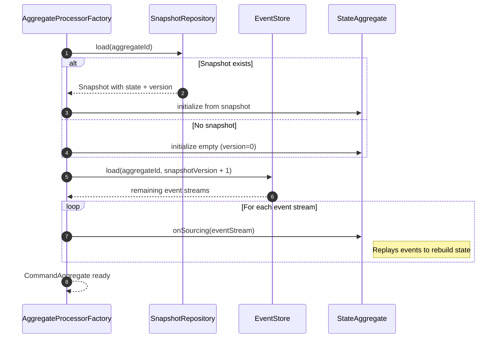
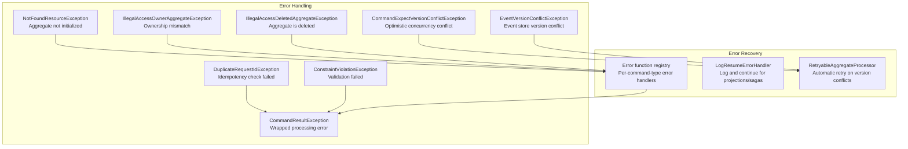

# Data Flow

This page traces the complete lifecycle of data as it flows through the Wow framework, from the moment a command arrives at the gateway to the point where projections, sagas, and snapshots have been updated.

## High-Level Pipeline

<!-- Sources:
  wow-core/src/main/kotlin/me/ahoo/wow/command/DefaultCommandGateway.kt
  wow-core/src/main/kotlin/me/ahoo/wow/command/CommandBus.kt
  wow-core/src/main/kotlin/me/ahoo/wow/modeling/command/AggregateProcessor.kt
  wow-core/src/main/kotlin/me/ahoo/wow/eventsourcing/EventStore.kt
  wow-core/src/main/kotlin/me/ahoo/wow/event/DomainEventBus.kt
-->

## Phase 1: Command Arrival and Gateway Processing

The journey begins when a client sends a command through the `CommandGateway`. This can happen via a WebFlux endpoint or by calling the gateway directly.

<!-- Sources:
  wow-core/src/main/kotlin/me/ahoo/wow/command/DefaultCommandGateway.kt:45
  wow-core/src/main/kotlin/me/ahoo/wow/command/DefaultCommandGateway.kt:62
  wow-core/src/main/kotlin/me/ahoo/wow/command/DefaultCommandGateway.kt:77
  wow-core/src/main/kotlin/me/ahoo/wow/command/DefaultCommandGateway.kt:99
  wow-core/src/main/kotlin/me/ahoo/wow/command/DefaultCommandGateway.kt:205
-->

### Validation

The `DefaultCommandGateway` performs two levels of validation:

1. **Self-validation**: If the command body implements `CommandValidator`, its `validate()` method is called first. [[wow-core/src/main/kotlin/me/ahoo/wow/command/DefaultCommandGateway.kt:62](https://github.com/Ahoo-Wang/Wow/blob/main/wow-core/src/main/kotlin/me/ahoo/wow/command/DefaultCommandGateway.kt#L62)]

2. **Bean validation**: The Jakarta `Validator` checks all constraint annotations (`@NotNull`, `@Size`, etc.). [[wow-core/src/main/kotlin/me/ahoo/wow/command/DefaultCommandGateway.kt:66](https://github.com/Ahoo-Wang/Wow/blob/main/wow-core/src/main/kotlin/me/ahoo/wow/command/DefaultCommandGateway.kt#L66)]

### Idempotency Check

Before sending, the gateway checks whether the command's `requestId` has already been processed for this aggregate. The `AggregateIdempotencyCheckerProvider` provides per-aggregate checkers. If a duplicate is detected, `DuplicateRequestIdException` is thrown. [[wow-core/src/main/kotlin/me/ahoo/wow/command/DefaultCommandGateway.kt:77](https://github.com/Ahoo-Wang/Wow/blob/main/wow-core/src/main/kotlin/me/ahoo/wow/command/DefaultCommandGateway.kt#L77)]

### Wait Plan Registration

If a wait plan is provided, the gateway:
1. Propagates the wait endpoint into the command message header
2. Registers a `WaitHandle` with `WaitCoordinator` for signal routing
3. Sets up cleanup on completion (success, error, or cancel)

[[wow-core/src/main/kotlin/me/ahoo/wow/command/DefaultCommandGateway.kt:217](https://github.com/Ahoo-Wang/Wow/blob/main/wow-core/src/main/kotlin/me/ahoo/wow/command/DefaultCommandGateway.kt#L217)]

## Phase 2: Command Dispatching

The command bus routes the command to the appropriate `AggregateProcessor`. The `CommandDispatcher` subscribes to the command bus and creates per-aggregate dispatchers:

<!-- Sources:
  wow-core/src/main/kotlin/me/ahoo/wow/modeling/command/dispatcher/CommandDispatcher.kt
  wow-core/src/main/kotlin/me/ahoo/wow/modeling/command/dispatcher/SendDomainEventStreamFilter.kt
-->

### CommandDispatcher

The `CommandDispatcher` subscribes to the `CommandBus` for all locally registered aggregates. It creates an `AggregateCommandDispatcher` per aggregate type, ensuring that commands for the same aggregate ID are processed sequentially through the `AggregateScheduler`. [[wow-core/src/main/kotlin/me/ahoo/wow/modeling/command/dispatcher/CommandDispatcher.kt:34](https://github.com/Ahoo-Wang/Wow/blob/main/wow-core/src/main/kotlin/me/ahoo/wow/modeling/command/dispatcher/CommandDispatcher.kt#L34)]

### Filter Chain

The command handler uses a filter chain pattern. Two key filters in the chain:

1. **AggregateProcessorFilter** — invokes the `AggregateProcessor.process()` method
2. **SendDomainEventStreamFilter** — publishes the resulting `DomainEventStream` to the `DomainEventBus`

[[wow-core/src/main/kotlin/me/ahoo/wow/modeling/command/dispatcher/SendDomainEventStreamFilter.kt:26](https://github.com/Ahoo-Wang/Wow/blob/main/wow-core/src/main/kotlin/me/ahoo/wow/modeling/command/dispatcher/SendDomainEventStreamFilter.kt#L26)]

## Phase 3: Aggregate Processing

This is the core of the write side. The `CommandAggregate` processes the command and produces domain events.

<!-- Sources:
  wow-core/src/main/kotlin/me/ahoo/wow/modeling/command/SimpleCommandAggregate.kt:43
  wow-core/src/main/kotlin/me/ahoo/wow/modeling/command/CommandAggregate.kt:41
  wow-core/src/main/kotlin/me/ahoo/wow/modeling/state/StateAggregate.kt:31
  wow-core/src/main/kotlin/me/ahoo/wow/eventsourcing/EventStore.kt:27
-->

### Pre-Processing Checks

The `SimpleCommandAggregate` performs several validation checks before executing the command function:

1. **Version conflict check** — If the command carries an expected `aggregateVersion`, it must match the current state version. [[wow-core/src/main/kotlin/me/ahoo/wow/modeling/command/SimpleCommandAggregate.kt:92](https://github.com/Ahoo-Wang/Wow/blob/main/wow-core/src/main/kotlin/me/ahoo/wow/modeling/command/SimpleCommandAggregate.kt#L92)]

2. **Initialization check** — Non-create commands are rejected if the aggregate has not been initialized. [[wow-core/src/main/kotlin/me/ahoo/wow/modeling/command/SimpleCommandAggregate.kt:99](https://github.com/Ahoo-Wang/Wow/blob/main/wow-core/src/main/kotlin/me/ahoo/wow/modeling/command/SimpleCommandAggregate.kt#L99)]

3. **Ownership check** — If the command specifies an `ownerId`, it must match the aggregate's owner. [[wow-core/src/main/kotlin/me/ahoo/wow/modeling/command/SimpleCommandAggregate.kt:102](https://github.com/Ahoo-Wang/Wow/blob/main/wow-core/src/main/kotlin/me/ahoo/wow/modeling/command/SimpleCommandAggregate.kt#L102)]

4. **Deletion check** — Commands (except `RecoverAggregate`) are rejected if the aggregate is in a deleted state. [[wow-core/src/main/kotlin/me/ahoo/wow/modeling/command/SimpleCommandAggregate.kt:111](https://github.com/Ahoo-Wang/Wow/blob/main/wow-core/src/main/kotlin/me/ahoo/wow/modeling/command/SimpleCommandAggregate.kt#L111)]

### CommandState Machine

The `CommandState` enum manages the processing lifecycle:

<!-- Sources:
  wow-core/src/main/kotlin/me/ahoo/wow/modeling/command/CommandAggregate.kt:65
-->

[[wow-core/src/main/kotlin/me/ahoo/wow/modeling/command/CommandAggregate.kt:65](https://github.com/Ahoo-Wang/Wow/blob/main/wow-core/src/main/kotlin/me/ahoo/wow/modeling/command/CommandAggregate.kt#L65)]

### Event Sourcing on State

After the command function produces a `DomainEventStream`, the events are applied to the `StateAggregate` via `onSourcing()`. This updates the in-memory state before the events are persisted. If no matching sourcing method is found, the event is silently ignored (but the version number is still updated). [[wow-core/src/main/kotlin/me/ahoo/wow/modeling/state/StateAggregate.kt:31](https://github.com/Ahoo-Wang/Wow/blob/main/wow-core/src/main/kotlin/me/ahoo/wow/modeling/state/StateAggregate.kt#L31)]

### Event Persistence

Events are persisted to the `EventStore` via `append()`. This operation is atomic and enforces:

- **Version ordering** — the event version must equal `expectedNextVersion` (current version + 1)
- **Aggregate ID uniqueness** — the first event for a new aggregate must use a unique aggregate ID
- **Request ID deduplication** — prevents the same command from producing events twice

[[wow-core/src/main/kotlin/me/ahoo/wow/eventsourcing/EventStore.kt:38](https://github.com/Ahoo-Wang/Wow/blob/main/wow-core/src/main/kotlin/me/ahoo/wow/eventsourcing/EventStore.kt#L38)]

## Phase 4: Event Publishing

After the event stream is persisted, the `SendDomainEventStreamFilter` publishes it to the `DomainEventBus`:

<!-- Sources:
  wow-core/src/main/kotlin/me/ahoo/wow/modeling/command/dispatcher/SendDomainEventStreamFilter.kt:33
  wow-core/src/main/kotlin/me/ahoo/wow/event/DomainEventBus.kt:39
-->

The `DomainEventBus` interface supports two topologies:

- **LocalDomainEventBus** — in-process event delivery for single-instance deployments
- **DistributedDomainEventBus** — cross-process delivery via Kafka for distributed deployments

[[wow-core/src/main/kotlin/me/ahoo/wow/event/DomainEventBus.kt:55](https://github.com/Ahoo-Wang/Wow/blob/main/wow-core/src/main/kotlin/me/ahoo/wow/event/DomainEventBus.kt#L55)]

## Phase 5: Event Dispatching to Handlers

The `DomainEventDispatcher` receives events from the bus and dispatches them to registered handlers. It uses a **composite pattern** that separates event stream dispatching from state event dispatching:

<!-- Sources:
  wow-core/src/main/kotlin/me/ahoo/wow/event/dispatcher/DomainEventDispatcher.kt:44
  wow-core/src/main/kotlin/me/ahoo/wow/event/dispatcher/CompositeEventDispatcher.kt:64
  wow-core/src/main/kotlin/me/ahoo/wow/event/dispatcher/EventStreamDispatcher.kt:27
  wow-core/src/main/kotlin/me/ahoo/wow/event/dispatcher/StateEventDispatcher.kt:27
  wow-core/src/main/kotlin/me/ahoo/wow/projection/ProjectionHandler.kt:27
  wow-core/src/main/kotlin/me/ahoo/wow/saga/stateless/StatelessSagaHandler.kt:27
  wow-core/src/main/kotlin/me/ahoo/wow/eventsourcing/snapshot/SnapshotStrategy.kt:30
-->

### CompositeEventDispatcher

The `CompositeEventDispatcher` manages two parallel sub-dispatchers:

1. **EventStreamDispatcher** — subscribes to `DomainEventBus`, dispatches to handlers with `FunctionKind.EVENT` (projections and sagas)
2. **StateEventDispatcher** — subscribes to `StateEventBus`, dispatches to handlers with `FunctionKind.STATE_EVENT` (snapshot strategies)

Both sub-dispatchers use `AggregateSchedulerSupplier` to ensure per-aggregate ordering guarantees. Events for the same aggregate ID are always processed sequentially, even across different handler types. [[wow-core/src/main/kotlin/me/ahoo/wow/event/dispatcher/CompositeEventDispatcher.kt:96](https://github.com/Ahoo-Wang/Wow/blob/main/wow-core/src/main/kotlin/me/ahoo/wow/event/dispatcher/CompositeEventDispatcher.kt#L96)]

### Projection Processing

Projections receive domain events and update read models. The `DefaultProjectionHandler` uses a filter chain with `LogResumeErrorHandler` for fault tolerance — if a projection fails, the error is logged and processing continues with the next event. [[wow-core/src/main/kotlin/me/ahoo/wow/projection/ProjectionHandler.kt:36](https://github.com/Ahoo-Wang/Wow/blob/main/wow-core/src/main/kotlin/me/ahoo/wow/projection/ProjectionHandler.kt#L36)]

### Saga Processing

Stateless sagas receive domain events and can produce new commands. The `DefaultStatelessSagaHandler` also uses a filter chain pattern. Sagas coordinate long-running business processes across aggregate boundaries without maintaining their own state. [[wow-core/src/main/kotlin/me/ahoo/wow/saga/stateless/StatelessSagaHandler.kt:36](https://github.com/Ahoo-Wang/Wow/blob/main/wow-core/src/main/kotlin/me/ahoo/wow/saga/stateless/StatelessSagaHandler.kt#L36)]

### Snapshot Creation

The snapshot strategy evaluates state events and creates snapshots when criteria are met:

- **SimpleSnapshotStrategy** — creates a snapshot after every event
- **VersionOffsetSnapshotStrategy** — creates a snapshot at configurable version intervals

[[wow-core/src/main/kotlin/me/ahoo/wow/eventsourcing/snapshot/SimpleSnapshotStrategy.kt:25](https://github.com/Ahoo-Wang/Wow/blob/main/wow-core/src/main/kotlin/me/ahoo/wow/eventsourcing/snapshot/SimpleSnapshotStrategy.kt#L25)]

## Phase 6: Wait Plan Notification

After the command has been processed, the registered wait handle receives signals at each processing stage:

<!-- Sources:
  wow-core/src/main/kotlin/me/ahoo/wow/command/DefaultCommandGateway.kt:217-280
  wow-core/src/main/kotlin/me/ahoo/wow/command/wait/WaitCoordinator.kt:18-72
  wow-core/src/main/kotlin/me/ahoo/wow/command/wait/WaitHandle.kt:22-223
-->

### Wait Stages

The `WaitPlan` supports waiting at different processing stages:

| Stage | Meaning |
|-------|---------|
| `SENT` | Command accepted by the `CommandBus` |
| `PROCESSED` | Command executed by the aggregate, events persisted |
| `PROJECTED` | Projections have processed the events |
| `SNAPSHOT` | Snapshot has been created |

The `CommandWait` factory creates `WaitPlan` instances for each stage:

- `CommandWait.sent(commandId)` — wait until the command is sent
- `CommandWait.processed(commandId)` — wait until events are persisted
- `CommandWait.snapshot(commandId)` — wait until snapshot is created

[[wow-core/src/main/kotlin/me/ahoo/wow/command/CommandGateway.kt:145](https://github.com/Ahoo-Wang/Wow/blob/main/wow-core/src/main/kotlin/me/ahoo/wow/command/CommandGateway.kt#L145)]

### Signal Routing

When a downstream processor (projection, saga, snapshot) completes, it sends a `WaitSignal` through the `CommandWaitNotifier`. The `WaitCoordinator` looks up the registered `WaitHandle` by `waitCommandId` and forwards the signal to the handle. The handle owns a `WaitState` state machine: `StageWaitState` reduces single-stage waits, while `ChainWaitState` tracks the saga chain tail and replays pending tail signals once the main chain signal confirms the tail command IDs. [[WaitCoordinator.kt:62](https://github.com/Ahoo-Wang/Wow/blob/main/wow-core/src/main/kotlin/me/ahoo/wow/command/wait/WaitCoordinator.kt#L62)] [[WaitState.kt:56](https://github.com/Ahoo-Wang/Wow/blob/main/wow-core/src/main/kotlin/me/ahoo/wow/command/wait/WaitState.kt#L56)] [[ChainWaitState.kt:143](https://github.com/Ahoo-Wang/Wow/blob/main/wow-core/src/main/kotlin/me/ahoo/wow/command/wait/chain/ChainWaitState.kt#L143)]

## Aggregate Loading (Read Path)

When an aggregate needs to be loaded for a new command, the framework reconstructs its state:

<!-- Sources:
  wow-core/src/main/kotlin/me/ahoo/wow/eventsourcing/EventStoreStateAggregateRepository.kt
  wow-core/src/main/kotlin/me/ahoo/wow/eventsourcing/snapshot/SnapshotRepository.kt:27
  wow-core/src/main/kotlin/me/ahoo/wow/modeling/state/StateAggregate.kt:31
-->

The loading process:

1. **Load snapshot** — If a snapshot exists for the aggregate, start from that state and version
2. **Load remaining events** — Fetch all events after the snapshot version from the `EventStore`
3. **Replay events** — Apply each event stream to the `StateAggregate` via `onSourcing()`

The `EventStore.load()` method supports loading by version range or time range, and defaults to loading all events from version 1. [[wow-core/src/main/kotlin/me/ahoo/wow/eventsourcing/EventStore.kt:54](https://github.com/Ahoo-Wang/Wow/blob/main/wow-core/src/main/kotlin/me/ahoo/wow/eventsourcing/EventStore.kt#L54)]

## Error Handling

The data flow includes error handling at every phase:

<!-- Sources:
  wow-core/src/main/kotlin/me/ahoo/wow/modeling/command/SimpleCommandAggregate.kt:150
  wow-core/src/main/kotlin/me/ahoo/wow/projection/ProjectionHandler.kt:36
  wow-core/src/main/kotlin/me/ahoo/wow/modeling/command/RetryableAggregateProcessor.kt
-->

### Error Functions

The `SimpleCommandAggregate` supports per-command-type error functions. If an error function is registered for the command type, it is invoked when processing fails, allowing the aggregate to produce compensating events. [[wow-core/src/main/kotlin/me/ahoo/wow/modeling/command/SimpleCommandAggregate.kt:150](https://github.com/Ahoo-Wang/Wow/blob/main/wow-core/src/main/kotlin/me/ahoo/wow/modeling/command/SimpleCommandAggregate.kt#L150)]

### Projection/Saga Error Recovery

Projections and sagas use `LogResumeErrorHandler` — errors are logged but processing continues with the next event. This ensures that a failing projection does not block other handlers.

## Related Pages

- [Architecture Overview](./overview) — layered architecture and CQRS patterns
- [Module Dependencies](./module-dependencies) — detailed module dependency graph
