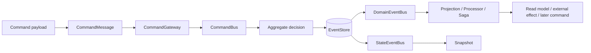

# Data Flow

This page keeps only the cross-capability view. Each authoritative capability page owns its complete sequence, state machine, and procedures.

## Overview

```mermaid
flowchart LR
    Input[Command payload] --> Message[CommandMessage]
    Message --> Gateway[CommandGateway]
    Gateway --> CommandBus[CommandBus]
    CommandBus --> Aggregate[Aggregate decision]
    Aggregate --> Store[(EventStore)]
    Store --> DomainBus[DomainEventBus]
    Store --> StateBus[StateEventBus]
    DomainBus --> Consumers[Projection / Processor / Saga]
    StateBus --> Snapshot[Snapshot]
    Consumers --> Query[Read model / external effect / later command]
```

## Capability Handoffs

| Handoff | Upstream delivers | Downstream owns | Authoritative pages |
| --- | --- | --- | --- |
| Command ingress | Command payload, target aggregate, request identity, and wait target | Validate and send a `CommandMessage` | [Define Commands](../command/definition.md), [Send Commands](../command/sending.md) |
| Aggregate decision | Current sourced state and a command | Check invariants and produce domain events | [Aggregate and Invariants](../domain/aggregate.md), [Aggregate Lifecycle](../domain/lifecycle.md) |
| Authoritative history | Ordered `DomainEventStream` | Append under version constraints and support restoration | [Event Sourcing](../domain/event-sourcing.md) |
| Event collaboration | Persisted domain events and state events | Dispatch to Processors, Sagas, Projections, and Snapshots | [Event Dispatch Pipeline](../event/dispatch.md), [Events and Collaboration](../event/) |
| Derived processing | Matching event-function invocation | Complete a side effect, later command, projection, or snapshot | [Event Processor](../event/processor.md), [Saga](../event/saga.md), [Snapshots](../domain/snapshot.md) |
| Caller observation | Stage signals from each processing chain | Select the earliest sufficient stage and handle unknown outcomes | [Completion Semantics](../command/completion.md), [Failures and Idempotency](../command/reliability.md) |

A failure after EventStore append cannot roll back committed history. Transport redelivery, idempotency, event compensation, or replay owns later recovery; see [Event Dispatch Pipeline](../event/dispatch.md) and [Event Compensation](../event/compensation.md) for the exact boundaries.

## Read Paths

Aggregate-state reads and projection reads have different purposes:

- aggregate restoration reads snapshots plus EventStore for the next business decision;
- query APIs read projections, snapshots, or another query store for users.

A projection may still be stale immediately after `PROCESSED`. Target the exact `PROJECTED` function to observe completion of its returned reactive chain instead of sleeping for a fixed interval, then execute the actual query to prove visibility. Work outside that chain, caches, replicas, and unrelated query pipelines remain separate evidence. See [Projection](../projection.md) and [Query](../query.md).

## Cross-Capability Failure Location

| Observation | Enter the authoritative page |
| --- | --- |
| No `SENT` | [Send Commands](../command/sending.md) and [Command Transport](../command/internals/transport.md) |
| `SENT` but no `PROCESSED` | [Command Processing Pipeline](../command/internals/pipeline.md) and [Failures and Idempotency](../command/reliability.md) |
| `PROCESSED` but no `SNAPSHOT` | [Snapshots](../domain/snapshot.md) and [Event Dispatch Pipeline](../event/dispatch.md) |
| `PROCESSED` but no downstream function stage | [Events and Collaboration](../event/) and [Event Compensation](../event/compensation.md) |
| Wait timeout followed by changed state | [Completion Semantics](../command/completion.md) and [Failures and Idempotency](../command/reliability.md) |

See [Troubleshooting](../troubleshooting.md) for production diagnosis and [Observability](./observability.md) for metric and trace mapping.
