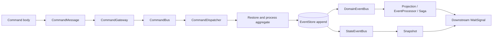

# Data Flow

This page connects Wow components into one end-to-end path and identifies what each completion stage actually proves. Follow the task-specific guides to send commands, configure backends, or implement handlers instead of repeating setup here.

## Overview


```mermaid
flowchart LR
    Input[Command body] --> Message[CommandMessage]
    Message --> Gateway[CommandGateway]
    Gateway --> CommandBus[CommandBus]
    CommandBus --> Dispatcher[CommandDispatcher]
    Dispatcher --> Aggregate[Restore and process aggregate]
    Aggregate --> Store[(EventStore append)]
    Store --> DomainBus[DomainEventBus]
    Store --> StateBus[StateEventBus]
    DomainBus --> Consumers[Projection / EventProcessor / Saga]
    StateBus --> Snapshot[Snapshot]
    Consumers --> Signals[Downstream WaitSignal]
    Snapshot --> Signals
```

## 1. Build and send a command

The application converts a command body into `CommandMessage`. The envelope carries command ID, request ID, complete AggregateId, optional expected version, and headers. If no aggregate ID is supplied, the command factory can select an aggregate generator from metadata. Message-ID generation is a separate path; see [ID Generator](./id-generator.md).

Before sending, `DefaultCommandGateway` runs the command's `CommandValidator`, Jakarta Bean Validation, and request-ID precheck. That precheck covers only the configured `AggregateIdempotencyChecker`; the persistent EventStore boundary still owns final concurrent/duplicate write constraints.

When waiting is requested, the gateway registers the wait handle before sending so a fast signal cannot precede subscription. See [Command Gateway](../command-gateway.md) for APIs and target selection.

## 2. CommandBus and dispatcher admission

Completion of CommandBus `send` can produce `SENT`. It means only that the selected bus send operation completed, not that the aggregate ran.

The runtime-owned `CommandDispatcher` installs subscriptions during startup preparation and opens processing in `start`. Each exchange requests a runtime activity before entering a processing group. Once shutdown admission closes, a message that cannot obtain a lease does not enter aggregate processing.

The dispatcher creates a child dispatcher per named aggregate, then maps aggregate IDs into groups. One group is serial while different groups may run concurrently; this is not a cross-process global lock.

## 3. Restore and execute the aggregate

For a non-create command, the state repository:

1. loads the latest usable snapshot or creates initial state;
2. loads EventStore streams from the next version;
3. invokes `StateAggregate.onSourcing` in stream order;
4. creates `CommandAggregate` and invokes the command function.

The command function reads current state, checks business invariants, and returns event bodies. `SimpleCommandAggregate` first sources the new stream into in-memory state and then invokes `EventStore.append`. The stream becomes authoritative history only after append succeeds. See [Aggregate Lifecycle](./aggregate-lifecycle.md).

## 4. Publish after append

The default command filter chain continues after aggregate processing:

```text
EventStore append
  → DomainEventBus.send(eventStream)
  → StateEventBus.send(stateEvent) when state is initialized
  → ProcessedNotifierFilter emits PROCESSED after the full chain succeeds
```

`SendStateEventFilter` applies its current error-resume policy to send failures, so results must be interpreted with the configured filters and logs. One Bus call does not prove every downstream receiver accepted the message.

After EventStore append, a Bus, projection, Saga, or external-handler failure cannot roll back history. Recovery ownership moves to redelivery, idempotency, compensation, or replay.

## 5. Downstream dispatch

DomainEventBus streams reach separate dispatchers:

- Projection updates a query model and may emit `PROJECTED`;
- EventProcessor runs application side effects and may emit `EVENT_HANDLED`;
- Stateless Saga sends a later command and may emit `SAGA_HANDLED`.

StateEventBus combines the event stream with current sourced state. Snapshot Dispatcher saves or skips a snapshot according to strategy and emits `SNAPSHOT`.

Each function-level wait target tracks only selected functions. Other consumers may still be running, failing, or lagging.

## 6. Wait stages

| Stage | Completed on the current path | Not proven |
| --- | --- | --- |
| `SENT` | CommandBus send | Aggregate execution or event append |
| `PROCESSED` | Successful command filter chain, including aggregate processing/append and the current domain/state event-send filters | Snapshot, Projection, EventProcessor, or Saga function completion |
| `SNAPSHOT` | Selected snapshot processing chain | Query projection completion |
| `PROJECTED` | Selected projection function | Other projections or external systems |
| `EVENT_HANDLED` | Selected event-handler function | Other functions |
| `SAGA_HANDLED` | Selected Saga function | Any stage of the tail command sent by the Saga; chain waiting must be explicit |

`CommandWaitNotifier` routes WaitSignals to the current handle. A timeout means the target was not satisfied within the deadline. It does not mean the command definitely failed or no event was appended. Reconcile with request ID, command result, or authoritative state after timeout.

## 7. Read paths

Aggregate-state reads and projection reads have different purposes:

- aggregate restoration reads snapshots plus EventStore for the next business decision;
- query APIs read projections, snapshots, or another query store for users.

A projection may still be stale immediately after `PROCESSED`. If the user contract requires the read model, wait for the exact `PROJECTED` target instead of sleeping for a fixed interval. See [Projection](../projection.md) and [Query](../query.md).

## Failure-location table

| Observation | Check first |
| --- | --- |
| No `SENT` | Gateway validation, request-ID precheck, CommandBus send |
| `SENT` but no `PROCESSED` | Dispatcher admission, aggregate restore/validation, EventStore append, domain/state event send |
| `PROCESSED` but no `SNAPSHOT` | StateEventBus, Snapshot Dispatcher, strategy, and SnapshotStore |
| `PROCESSED` but no `PROJECTED` | DomainEventBus, target-function matching, projection storage, and compensation |
| Wait timeout followed by changed state | Signal routing, wait target/timeout, and reconciliation with authoritative result |

See [Troubleshooting](../troubleshooting.md) for production diagnosis and [Observability](./observability.md) for metric/trace mapping.

## Source entry points

- [`DefaultCommandGateway`](https://github.com/Ahoo-Wang/Wow/blob/main/wow-core/src/main/kotlin/me/ahoo/wow/command/DefaultCommandGateway.kt)
- [`CommandDispatcher`](https://github.com/Ahoo-Wang/Wow/blob/main/wow-core/src/main/kotlin/me/ahoo/wow/modeling/command/dispatcher/CommandDispatcher.kt)
- [`SimpleCommandAggregate`](https://github.com/Ahoo-Wang/Wow/blob/main/wow-core/src/main/kotlin/me/ahoo/wow/modeling/command/SimpleCommandAggregate.kt)
- [`SendDomainEventStreamFilter`](https://github.com/Ahoo-Wang/Wow/blob/main/wow-core/src/main/kotlin/me/ahoo/wow/modeling/command/dispatcher/SendDomainEventStreamFilter.kt)
- [`SendStateEventFilter`](https://github.com/Ahoo-Wang/Wow/blob/main/wow-core/src/main/kotlin/me/ahoo/wow/eventsourcing/state/SendStateEventFilter.kt)
- [`NotifierFilters`](https://github.com/Ahoo-Wang/Wow/blob/main/wow-core/src/main/kotlin/me/ahoo/wow/command/wait/NotifierFilters.kt)
