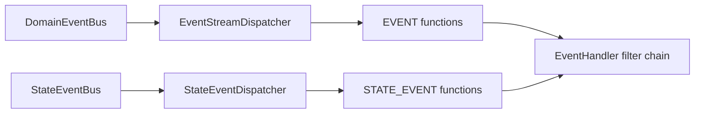

# Event Bus

Wow uses two event channels for different messages:

| Channel | Message | Typical consumers |
| --- | --- | --- |
| `DomainEventBus` | `DomainEventStream`, the event batch from one command | EventProcessor, Projection, Stateless Saga |
| `StateEventBus` | `StateEvent`, an event stream plus sourced state | Snapshot and handlers that need current state |

Both implement `MessageBus`, but their topic kinds, serialized forms, subscriptions, and recovery policies are independent. Configuring DomainEventBus does not configure StateEventBus or prove the snapshot path.

## Public transport contract

```kotlin
interface MessageBus<M, E> : AutoCloseable {
    fun send(message: M): Mono<Void>
    fun receive(subscription: MessageSubscription): Flux<E>
    fun receiver(subscription: MessageSubscription): MessageReceiver<E>
    fun runtimeReceiver(subscription: MessageSubscription): MessageReceiver<E>
}
```

The implementation defines what completion of `send` means. Acceptance by an in-memory sink, a Kafka producer send, and a Redis write are different acknowledgement levels. The public interface does not promise durability, exactly-once processing, or handler completion; interpret the result through the selected adapter contract.

`runtimeReceiver` adds readiness and processing-open/close boundaries so a dispatcher participates in `WowRuntime` startup and activity admission. A custom consumer should use ordinary `receiver` unless it implements the same protocol.

## Local, distributed, and local-first

### In-memory

`InMemoryDomainEventBus` and `InMemoryStateEventBus` maintain a Reactor multicast sink per named aggregate. They are suitable for single-process verification and do not persist messages. Ordinary `send` completes and drops the message when no subscriber exists.

### Distributed

`DistributedDomainEventBus` and `DistributedStateEventBus` are type boundaries for cross-process adapters. Partitioning, acknowledgements, redelivery, and retention in Kafka, Redis, or another implementation belong to that extension and backend configuration.

### Local-first

Local-first first attempts to deliver a message copy to routable runtime receivers in this process, then sends another copy to the distributed bus. The distributed message is marked locally handled only after every targeted local receiver has acquired a runtime activity and confirmed admission. Otherwise it remains eligible for distributed processing.

This receipt proves **admission**, not handler success. A terminal pipeline failure after admission follows runtime failure semantics and does not retroactively reroute that message to the distributed bus. A raw sink subscriber count is not a receipt.

## Event dispatch



`CompositeEventDispatcher` owns two child dispatchers and shares one `AggregateSchedulerSupplier`:

- EventStreamDispatcher selects only `FunctionKind.EVENT`;
- StateEventDispatcher selects only `FunctionKind.STATE_EVENT`;
- events inside one stream are processed with `concatMap`;
- multiple functions matching one event are invoked with `flatMap`, so function order must not be inferred.

Function selection also applies aggregate, event-type, and compensation matching. An event with no matching function is ignored by that dispatcher; it is not deleted from EventStore.

## Ordering and concurrency

Default `AggregateDispatcher` hashes `aggregateId.id` to calculate a group key. Exchanges in one group are serial while different groups may run concurrently. Schedulers are cached per named aggregate, not allocated as one thread per aggregate instance.

Any ordering statement must retain all of this scope: the same dispatcher instance, the same group key, and an upstream source that emits in the expected order. Core scheduling does not establish:

- global order across dispatchers or processes;
- order between different handler functions;
- exactly-once handling after broker redelivery;
- ordered commit in an external system.

For an order-sensitive external write, persist the source aggregate ID/version and detect duplicates and gaps at the target. See [Aggregate Scheduler](./aggregate-scheduler.md).

## Acknowledgement, errors, and recovery

An EventStream exchange executes `finallyAck` after its in-stream event processing terminates. The adapter decides whether that ack settles an in-memory ticket, Kafka offset, or another backend action. Handler failure happens after the source event has been persisted and cannot roll back EventStore.

| Responsibility | Owner |
| --- | --- |
| Short-lived execution retry | Handler filters and their configuration |
| Persistent failure record/operator recovery | Compensation module |
| External side-effect deduplication | Application and target system |
| Broker offsets, pending work, retention | Bus adapter and platform |
| Historical event replay | EventStore and application recovery process |

Bus redelivery is not a substitute for application idempotency. See [Event Processor](../event-processor.md) for handler patterns and [Event Compensation](../event-compensation.md) for persistent recovery.

## Lifecycle

A dispatcher subscribes and awaits transport readiness in `prepare`, then opens demand/processing in `start`. Shutdown revokes logical processing admission before physical source cancellation; exchanges that already hold activities remain part of runtime drain.

`CompositeEventDispatcher` ultimately disposes the Scheduler it owns. Child dispatchers receive a borrowed view and cannot close it twice. See [Runtime Lifecycle](./runtime-lifecycle.md).

## Verification and source

```bash
./gradlew :wow-core:contractTest --tests "me.ahoo.wow.event.InMemoryDomainEventBusTest"
./gradlew :wow-core:test --tests "me.ahoo.wow.event.dispatcher.CompositeEventDispatcherLifecycleTest"
```

- [`DomainEventBus`](https://github.com/Ahoo-Wang/Wow/blob/main/wow-core/src/main/kotlin/me/ahoo/wow/event/DomainEventBus.kt)
- [`StateEventBus`](https://github.com/Ahoo-Wang/Wow/blob/main/wow-core/src/main/kotlin/me/ahoo/wow/eventsourcing/state/StateEventBus.kt)
- [`LocalFirstMessageBus`](https://github.com/Ahoo-Wang/Wow/blob/main/wow-core/src/main/kotlin/me/ahoo/wow/messaging/LocalFirstMessageBus.kt)
- [`CompositeEventDispatcher`](https://github.com/Ahoo-Wang/Wow/blob/main/wow-core/src/main/kotlin/me/ahoo/wow/event/dispatcher/CompositeEventDispatcher.kt)
- [Kafka Extension](../extensions/kafka.md) / [Redis Extension](../extensions/redis.md): concrete transport contracts
