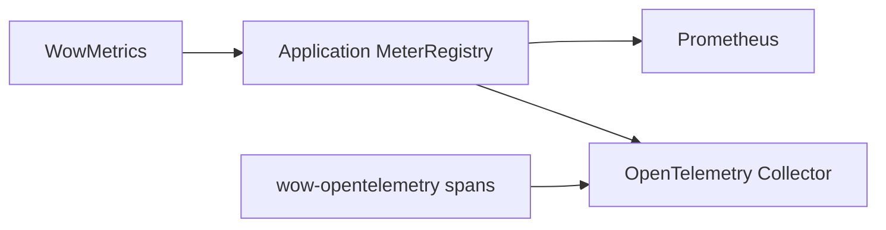

# Metrics

Wow records framework semantic metrics with Micrometer. Each `WowMetrics` instance is bound to
one `MeterRegistry`. Spring Boot uses the registry from the current ApplicationContext; Wow does
not depend on Micrometer's global registry or share enablement across application contexts.

## Automatic setup

With `wow-spring-boot-starter`, the application only needs to provide a `MeterRegistry` bean. A
typical setup adds Actuator and one registry implementation:

```kotlin
implementation("org.springframework.boot:spring-boot-starter-actuator")
runtimeOnly("io.micrometer:micrometer-registry-prometheus")
```

No Wow configuration is required to enable metrics; `wow.metrics.enabled` defaults to `true`.
For OTLP with the current Spring Boot 4.1.0 baseline, replace the Prometheus registry with
`spring-boot-opentelemetry` and `micrometer-registry-otlp`; then `OTEL_SERVICE_NAME` and
`OTEL_EXPORTER_OTLP_ENDPOINT` are sufficient for the default exporter path. See the complete
[Observability Configuration](/reference/config/observability#exporting-metrics-via-otlp-opentelemetry-collector).

If `wow.metrics.enabled=false`, or no `MeterRegistry` exists in the context, Wow uses
`WowMetrics.NONE` and keeps the compact, uninstrumented reactive path.

## Unified metric model

| Meter | Type | Meaning |
|---|---|---|
| `wow.operation` | Timer | Duration, outcome, and exception of finite operations |
| `wow.operation.items` | DistributionSummary | Number of items emitted by finite Flux operations |
| `wow.stream.active` | LongTaskTimer | Active subscriptions to long-lived receive streams |
| `wow.stream.messages` | Counter | Messages received from receive streams |
| `wow.stream.terminations` | Counter | Receive-stream completion, error, or cancellation |

Every semantic meter uses the same low-cardinality base tags:

| Tag | Meaning |
|---|---|
| `component` | Stable component type such as `command_bus`, `event_store`, or `projection_handler` |
| `operation` | Stable operation such as `send`, `receive`, `append`, or `handle` |
| `context` | Bounded context, or `none` when unavailable |
| `aggregate` | Aggregate name, or `multiple` for multi-aggregate subscriptions |
| `message` | Command or event name, or `none` when not applicable |
| `processor` | Event processor or dispatcher name |
| `source` | Spring bean name, storage binding name, or an explicitly supplied source |
| `subscriber` | Receiver group, overridden by the dispatcher name in Reactor Context |

Terminal meters also contain `outcome=success|error|cancelled` and `exception`. Wow does not
export high-cardinality aggregate IDs or dispatcher group keys.

The main component and operation mappings are:

| `component` | `operation` |
|---|---|
| `command_bus`, `domain_event_bus`, `state_event_bus` | `send`, `send_if_subscribed`, `receive` |
| `event_store` | `append`, `load_by_version`, `load_by_time`, `exists_request_id`, `last`, `scan_aggregate_id` |
| `snapshot_store` | `load`, `get_version`, `save` |
| `command_handler`, `domain_event_handler`, `projection_handler`, `stateless_saga_handler`, `snapshot_handler` | `handle` |
| `snapshot_strategy` | `on_event` |
| `dispatcher` | `handle` |

`RoutingEventStore` and `RoutingSnapshotStore` are metric-transparent. Only the selected physical
leaf store records an operation, preventing double-counting of routed calls.

## Storage batch metrics

MongoDB and Elasticsearch batching paths reuse the same `WowMetrics` registry:

| Meter | Type | Main tags |
|---|---|---|
| `wow.batch.admission.rejected` | Counter | `coordinator`, `reason` |
| `wow.batch.queue.wait` | Timer | `coordinator`, `lane` |
| `wow.batch.write` | Timer | `coordinator`, `lane`, `window`, `outcome` |
| `wow.batch.write.items` | DistributionSummary | `coordinator`, `lane`, `window`, `outcome`, `kind` |
| `wow.batch.coordinator.failed` | Counter | `coordinator` |
| `wow.batch.close` | Timer | `coordinator`, `outcome` |

These meters appear only after a batching-enabled store performs the corresponding operation.

## Non-Spring setup

`wow-core` exposes the Micrometer contract directly. Create one instance and use it to decorate
every bus, store, or handler that should record semantic component metrics. A constructor-level
`metrics` argument instruments only the behavior owned by that component; it does not recursively
decorate its collaborators:

```kotlin
val registry: MeterRegistry = SimpleMeterRegistry()
val metrics = WowMetrics(registry)

val meteredCommandBus = commandBus.metered(
    metrics = metrics,
    source = "command-bus",
)
val meteredCommandHandler = commandHandler.metered(
    metrics = metrics,
    source = "command-handler",
)

val eventStore: EventStore = MongoEventStore(
    database = database,
    batchOptions = MongoEventStoreBatchOptions(enabled = true),
    metrics = metrics, // Batch lifecycle metrics.
).metered(
    metrics = metrics, // EventStore operation metrics.
    source = "primary-event-store",
)

val dispatcher = CommandDispatcher(
    commandBus = meteredCommandBus,
    commandHandler = meteredCommandHandler,
    metrics = metrics,
)
```

The `MongoEventStore` constructor receives `WowMetrics` for its internal batch lifecycle. The
`metered` decorator records the `EventStore` operations listed above. Passing the same instance to
both layers keeps all meters in one registry without double-counting an operation.

Finite operations and long-lived streams can use the unified model directly:

```kotlin
val descriptor = MetricDescriptor(
    component = "integration",
    operation = "pull",
    source = "partner-api",
)

val result = metrics.operation(client.pull(), descriptor)
val messages = metrics.stream(receiver.messages(), descriptor)
```

These APIs use Reactor `tap(SignalListenerFactory)` and do not call the deprecated
`Mono.metrics()` or `Flux.metrics()` operators.

## Migrating from the legacy metrics API

The unified model does not provide a compatibility layer for legacy APIs or meter names. Migrate
using the following mapping:

| Legacy approach | Replacement |
|---|---|
| `Metrics.metrizable()` or `.metrizable()` | Create a shared `WowMetrics(registry)`, then call `.metered(metrics, source)` |
| `Metrics.configureEnabled(...)` or the non-Spring system-property switch | Use `wow.metrics.enabled` with Spring; explicitly choose `WowMetrics(registry)` or `WowMetrics.NONE` without Spring |
| Micrometer global registry | Pass one explicit `MeterRegistry` per application or runtime |
| Reactor sequence meters such as `*.flow.duration` and `*.onNext.delay` | Query `wow.operation` / `wow.operation.items` for finite work and `wow.stream.*` for long-lived receive streams |

Legacy meters do not have a one-to-one rename. Rewrite dashboards, recording rules, and alerts
around tags such as `component`, `operation`, and `outcome`; retain the previous application
version as the rollback path until the monitoring cutover is complete.

## Prometheus and OTLP export

Wow writes only to the application's selected `MeterRegistry`; that registry controls export:



For OTLP with the current Spring Boot 4.1.0 baseline, add `spring-boot-opentelemetry` and
`micrometer-registry-otlp`, then set
`OTEL_SERVICE_NAME` and the shared
`OTEL_EXPORTER_OTLP_ENDPOINT`, normally an OTLP/HTTP Collector endpoint on port `4318`. Spring Boot
maps the endpoint to its `OtlpMeterRegistry`; no manual registry bean or metrics YAML is required.
`wow-opentelemetry` instruments tracing and does not turn Micrometer meters into spans, although
metrics and traces can use the same environment and Collector.

See [Observability Configuration](/reference/config/observability) for complete setup and
verification steps.

## Troubleshooting

When metrics are missing, verify in order:

1. `wow.metrics.enabled` is not disabled;
2. the expected `MeterRegistry` bean exists in the ApplicationContext;
3. real traffic exercised the relevant component;
4. the Actuator `metrics` endpoint is temporarily exposed and
   `/actuator/metrics/wow.operation` is visible;
5. batching is enabled when checking `wow.batch.*`;
6. for OTLP, wait one export `step` and confirm that the Collector actually received data.

<!-- Sources: wow-core/src/main/kotlin/me/ahoo/wow/metrics/WowMetrics.kt, wow-core/src/main/kotlin/me/ahoo/wow/metrics/MetricDescriptor.kt, wow-core/src/main/kotlin/me/ahoo/wow/infra/batch/BatchMetrics.kt, wow-spring-boot-starter/src/main/kotlin/me/ahoo/wow/spring/boot/starter/metrics/MetricsAutoConfiguration.kt -->
