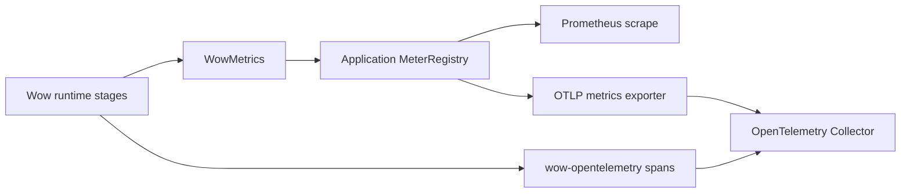

# Metrics

Wow records framework work with Micrometer. `WowMetrics` is instance-scoped: one instance writes to one
`MeterRegistry`, and `WowMetrics.NONE` leaves the Reactor publisher unchanged. This makes a metric an observation of
one runtime path, not proof that an event was durably stored, a projection is current, or production traffic was
admitted.

## Automatic setup

With `wow-spring-boot-starter`, provide an application `MeterRegistry`:

```kotlin
implementation("org.springframework.boot:spring-boot-starter-actuator")
runtimeOnly("io.micrometer:micrometer-registry-prometheus")
```

`wow.metrics.enabled` defaults to `true`. Auto-configuration creates `WowMetrics` from the current
ApplicationContext registry, decorates buses, physical stores, snapshot strategies and handlers, and supplies the
same instance to dispatcher and batch instrumentation.
When the property is `false`, the highest-priority enablement processor also replaces a custom `WowMetrics` bean with
`WowMetrics.NONE`; when no registry exists, the default bean is `NONE` as well.

Routing stores are transparent. Their selected `EventStoreBinding` or `SnapshotStoreBinding` is decorated so one
physical call produces one metric. An already `Metered` decorator chain is not wrapped again.

## Unified metric model

Five meter IDs describe finite work and long-lived receive streams:

| Meter | Type | Runtime meaning |
|---|---|---|
| `wow.operation` | Timer | One finite `Mono` or `Flux` from subscription to termination |
| `wow.operation.items` | DistributionSummary | Elements emitted by a finite `Flux` operation |
| `wow.stream.active` | LongTaskTimer | Active long-lived receiver subscriptions |
| `wow.stream.messages` | Counter | Messages emitted by receiver subscriptions |
| `wow.stream.terminations` | Counter | Receiver completion, error, or cancellation |

All five use the bounded identity tags `component`, `operation`, `context`, `aggregate`, `message`, `processor`,
`source`, and `subscriber`. Terminal meters add `outcome=success|error|cancelled` and `exception`; unavailable values
are `none`, and a multi-aggregate subscription uses `multiple`. Aggregate IDs, request IDs, and trace IDs are
deliberately absent because they are high-cardinality trace or log fields.

Read the tags as a pipeline map:

| Runtime stage | `component` / representative `operation` | What a signal proves |
|---|---|---|
| Command intake and publication | `command_bus` / `receive`, `send`, `send_if_subscribed` | The bus publisher terminated with the recorded outcome |
| Aggregate execution | `command_handler` / `handle` | The command handler publisher terminated |
| Event persistence | `event_store` / `append`, `load_by_version`, `load_by_time`, `last` | The selected store operation terminated; only backend acknowledgement establishes durability |
| Event publication and intake | `domain_event_bus`, `state_event_bus` / `send`, `receive` | A bus boundary was exercised |
| Downstream processing | `domain_event_handler`, `projection_handler`, `stateless_saga_handler`, `snapshot_handler` / `handle` | That handler publisher terminated, not that every subscriber caught up |
| Snapshot work | `snapshot_strategy` / `on_event`; `snapshot_store` / `load`, `get_version`, `save` | Strategy or physical snapshot-store work terminated |

For diagnosis, correlate a metric window with a Wow trace using stable fields such as context, aggregate, message,
and processor. Metric tags intentionally do not carry the trace ID.

## Storage batch metrics

Batch-enabled MongoDB and Elasticsearch stores use the same `WowMetrics` registry:

| Meter | Type | Tags |
|---|---|---|
| `wow.batch.admission.rejected` | Counter | `coordinator`, `reason` |
| `wow.batch.queue.wait` | Timer | `coordinator`, `lane` |
| `wow.batch.write` | Timer | `coordinator`, `lane`, `window`, `outcome` |
| `wow.batch.write.items` | DistributionSummary | write tags plus `kind=buffered|written|failed` |
| `wow.batch.coordinator.failed` | Counter | `coordinator` |
| `wow.batch.close` | Timer | `coordinator`, `outcome` |

These series do not exist until the corresponding batch path runs. A rejected admission or failed item is an
operational signal; confirm the caller error and backend state before retrying to avoid duplicate writes.

## Non-Spring setup

Create one explicit registry boundary, then decorate only the components owned by that runtime:

```kotlin
val metrics = WowMetrics(SimpleMeterRegistry())

val meteredBus = commandBus.metered(metrics, "command-bus")
val meteredStore = eventStore.metered(metrics, "primary-event-store")
val meteredHandler = commandHandler.metered(metrics, "command-handler")
```

For custom finite work or a long-lived stream, use the same descriptor contract:

```kotlin
val descriptor = MetricDescriptor(
    component = "partner_client",
    operation = "pull",
    source = "inventory-api",
)

val response = metrics.operation(client.pull(), descriptor)
val messages = metrics.stream(receiver.messages(), descriptor)
```

The APIs use Reactor `tap`; they neither block nor configure a global Micrometer registry.

## Migrating from the legacy metrics API

The unified model is a dashboard migration, not a meter rename:

| Legacy contract | Current contract |
|---|---|
| `Metrics.metrizable()` / `.metrizable()` | Shared `WowMetrics(registry)` plus `.metered(metrics, source)` |
| Process/global enablement | `wow.metrics.enabled` in Spring, or explicit `WowMetrics` versus `WowMetrics.NONE` |
| Global Micrometer registry | Application/runtime-owned `MeterRegistry` |
| Reactor sequence series | `wow.operation*` for finite work and `wow.stream.*` for receivers |

Run old and new dashboards side by side during the release window. Prove equivalent traffic coverage before deleting
old alerts; a successful local scrape validates names and tags only, not production thresholds or alert routing.

## Prometheus and OTLP export

Wow writes to the application registry; the registry owns export:



Prometheus converts dotted Micrometer IDs to its naming convention, for example `wow.operation` to series such as
`wow_operation_seconds_count`. OTLP uses Micrometer's OTLP registry; `wow-opentelemetry` creates traces and does not
export Micrometer meters. See [Observability Configuration](/reference/config/observability) for exact dependencies
and environment variables.

## Troubleshooting

Check missing evidence in this order:

1. confirm `wow.metrics.enabled` is not `false` and the intended ApplicationContext has a `MeterRegistry`;
2. drive the exact runtime stage, then inspect `/actuator/metrics/wow.operation` or the relevant `wow.batch.*` ID;
3. check `component`, `operation`, `source`, `outcome`, and `exception` rather than looking for aggregate IDs;
4. for Prometheus, verify a successful scrape and the exported series name;
5. for OTLP, wait at least one export step and verify Collector receipt;
6. separately prove backend state, projection lag, alert delivery, and production admission.

<!-- Sources: wow-core/src/main/kotlin/me/ahoo/wow/metrics/WowMetrics.kt, MetricDescriptor.kt,
MetricDecoratorFactory.kt, wow-core/src/main/kotlin/me/ahoo/wow/infra/batch/BatchMetrics.kt,
wow-spring-boot-starter/src/main/kotlin/me/ahoo/wow/spring/boot/starter/metrics/ -->
