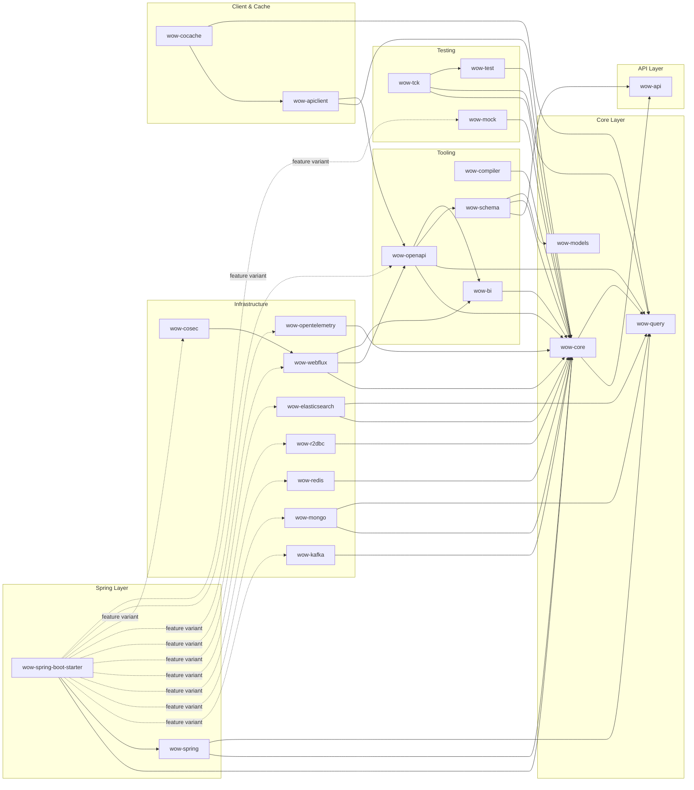
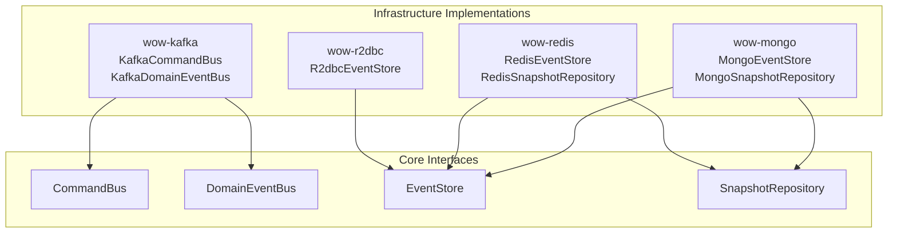
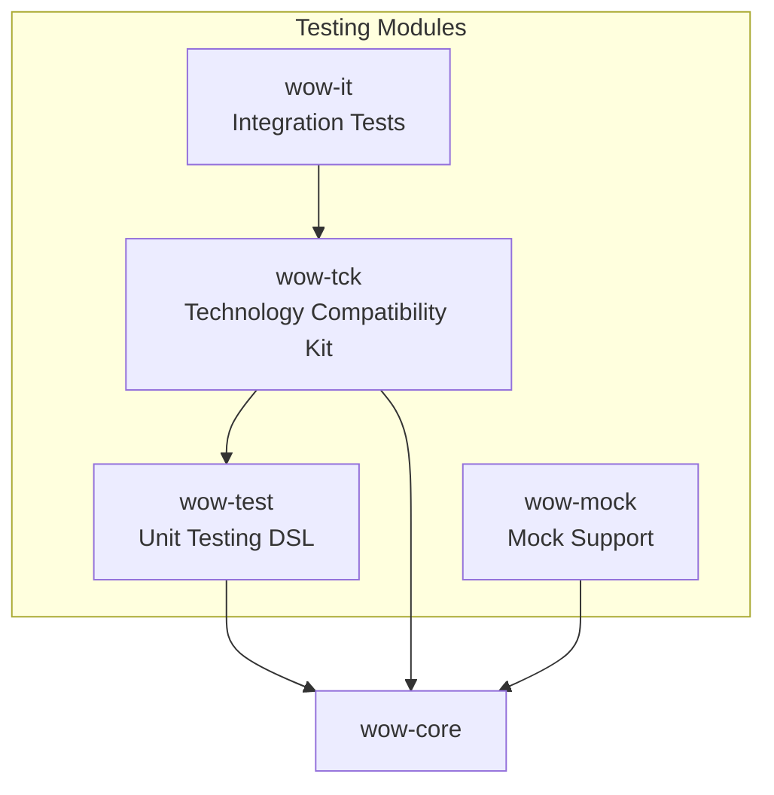

# Module Dependencies

The Wow framework is composed of over 20 Gradle modules, each with a single, well-defined responsibility. This page maps out every module, its dependencies, and how they relate to one another.

## Module Overview Table

| Module | Layer | Description |
|--------|-------|-------------|
| `wow-api` | API | Pure contracts: `CommandMessage`, `DomainEvent`, `AggregateId`, naming types. Zero dependencies. |
| `wow-core` | Core | Framework engine: aggregates, command bus, event sourcing, projections, sagas, wait strategies. |
| `wow-spring` | Spring | Spring `ApplicationContext` bridge, bean registration. |
| `wow-spring-boot-starter` | Spring | Auto-configuration with Gradle feature variants for optional infrastructure. |
| `wow-kafka` | Infra | Distributed `CommandBus` and `DomainEventBus` via Apache Kafka. |
| `wow-mongo` | Infra | `EventStore`, `SnapshotRepository`, projection storage via MongoDB. |
| `wow-redis` | Infra | `EventStore` and `SnapshotRepository` via Redis / Lettuce. |
| `wow-r2dbc` | Infra | `EventStore` via R2DBC (MariaDB, PostgreSQL). |
| `wow-elasticsearch` | Infra | Projection indexing via Elasticsearch. |
| `wow-webflux` | Infra | Spring WebFlux command endpoint integration. |
| `wow-opentelemetry` | Infra | Distributed tracing and metrics via OpenTelemetry. |
| `wow-cosec` | Infra | ABAC authorization via CoSec. |
| `wow-compiler` | Tooling | KSP processor — generates command routing, event handling metadata, OpenAPI specs at compile time. |
| `wow-test` | Testing | Unit testing DSL: `AggregateSpec`, `SagaSpec`, Given-When-Expect pattern. |
| `wow-tck` | Testing | Technology Compatibility Kit — integration tests with Testcontainers. |
| `wow-mock` | Testing | Mock support module. |
| `wow-query` | Query | Query model support types and interfaces. |
| `wow-schema` | Tooling | JSON Schema generation from Wow command/event models. |
| `wow-openapi` | Tooling | OpenAPI specification generation. |
| `wow-bi` | Tooling | BI sync script generator. |
| `wow-models` | Domain | Shared domain model abstractions. |
| `wow-cocache` | Caching | CoCache-based projection caching. |
| `wow-apiclient` | Client | RESTful API client using CoApi. |

## Dependency Graph

The following diagram shows the primary dependency relationships between modules. Arrows point from a module to its dependencies (i.e., `A --> B` means `A` depends on `B`).



<!-- Sources:
  settings.gradle.kts (all module includes)
  wow-api/build.gradle.kts
  wow-core/build.gradle.kts
  wow-spring/build.gradle.kts
  wow-spring-boot-starter/build.gradle.kts
  wow-kafka/build.gradle.kts
  wow-mongo/build.gradle.kts
  wow-redis/build.gradle.kts
  wow-r2dbc/build.gradle.kts
  wow-elasticsearch/build.gradle.kts
  wow-webflux/build.gradle.kts
  wow-opentelemetry/build.gradle.kts
  wow-cosec/build.gradle.kts
  wow-compiler/build.gradle.kts
  wow-schema/build.gradle.kts
  wow-openapi/build.gradle.kts
  wow-bi/build.gradle.kts
  wow-cocache/build.gradle.kts
  wow-apiclient/build.gradle.kts
  wow-query/build.gradle.kts
  test/wow-test/build.gradle.kts
  test/wow-tck/build.gradle.kts
  test/wow-mock/build.gradle.kts
  wow-models/build.gradle.kts
-->

## Module Details

### API Layer

#### wow-api

The foundation module with **zero external dependencies** beyond optional annotations. It defines all contracts used across the framework.

```kotlin
// wow-api/build.gradle.kts
dependencies {
    compileOnly("com.fasterxml.jackson.core:jackson-annotations")
    compileOnly("io.swagger.core.v3:swagger-annotations-jakarta")
    compileOnly("org.springframework:spring-context")
}
```

[[wow-api/build.gradle.kts](https://github.com/Ahoo-Wang/Wow/blob/main/wow-api/build.gradle.kts)]

Key types: `CommandMessage`, `DomainEvent`, `AggregateId`, `NamedAggregate`, `Wow` (namespace constants), `Header`, `Message`, `TopicKind`.

### Core Layer

#### wow-core

The engine room of the framework. Depends on `wow-api` plus reactive infrastructure.

```kotlin
dependencies {
    api(project(":wow-api"))
    api("io.projectreactor:reactor-core")
    api("tools.jackson.core:jackson-databind")
    api("jakarta.validation:jakarta.validation-api")
    // ... and more
}
```

[[wow-core/build.gradle.kts](https://github.com/Ahoo-Wang/Wow/blob/main/wow-core/build.gradle.kts)]

Contains: `CommandGateway`, `CommandBus`, `EventStore`, `DomainEventBus`, `StateAggregate`, `CommandAggregate`, `ProjectionHandler`, `StatelessSagaHandler`, `WaitStrategy`, snapshot infrastructure, and the filter chain framework.

#### wow-query

Query model support types and interfaces. Depends on `wow-core`.

[[wow-query/build.gradle.kts](https://github.com/Ahoo-Wang/Wow/blob/main/wow-query/build.gradle.kts)]

#### wow-models

Shared domain model abstractions. Uses `wow-api` and `wow-compiler` (KSP) for annotation processing.

```kotlin
ksp(project(":wow-compiler"))
```

[[wow-models/build.gradle.kts](https://github.com/Ahoo-Wang/Wow/blob/main/wow-models/build.gradle.kts)]

### Spring Layer

#### wow-spring

Bridges `wow-core` into Spring's `ApplicationContext`. Depends on `wow-core` and `wow-query`.

[[wow-spring/build.gradle.kts](https://github.com/Ahoo-Wang/Wow/blob/main/wow-spring/build.gradle.kts)]

#### wow-spring-boot-starter

The one-stop auto-configuration module. Uses **Gradle feature variants** to declare optional capabilities:

```kotlin
java {
    registerFeature("mongoSupport") { capability(group, "mongo-support", version) }
    registerFeature("redisSupport") { capability(group, "redis-support", version) }
    registerFeature("kafkaSupport") { capability(group, "kafka-support", version) }
    registerFeature("webfluxSupport") { capability(group, "webflux-support", version) }
    registerFeature("elasticsearchSupport") { capability(group, "elasticsearch-support", version) }
    registerFeature("opentelemetrySupport") { capability(group, "opentelemetry-support", version) }
    registerFeature("openapiSupport") { capability(group, "openapi-support", version) }
    registerFeature("cosecSupport") { capability(group, "cosec-support", version) }
}
```

[[wow-spring-boot-starter/build.gradle.kts:6](https://github.com/Ahoo-Wang/Wow/blob/main/wow-spring-boot-starter/build.gradle.kts#L6)]

Feature variants allow consumers to declare only the infrastructure they need:

```kotlin
// Consumer's build.gradle.kts
implementation("me.ahoo.wow:wow-spring-boot-starter")
implementation("me.ahoo.wow:wow-spring-boot-starter") {
    capabilities { requireCapability("me.ahoo.wow:mongo-support") }
    capabilities { requireCapability("me.ahoo.wow:kafka-support") }
}
```

### Infrastructure Modules

Each infrastructure module provides a concrete implementation of one or more core interfaces:



<!-- Sources:
  wow-kafka/build.gradle.kts
  wow-mongo/build.gradle.kts
  wow-redis/build.gradle.kts
  wow-r2dbc/build.gradle.kts
-->

| Module | Implements | External Dependency |
|--------|-----------|-------------------|
| `wow-kafka` | `DistributedCommandBus`, `DistributedDomainEventBus` | `reactor-kafka` |
| `wow-mongo` | `EventStore`, `SnapshotRepository` | `mongodb-driver-reactivestreams` |
| `wow-redis` | `EventStore`, `SnapshotRepository` | `spring-data-redis`, `lettuce-core` |
| `wow-r2dbc` | `EventStore` | `r2dbc-spi`, `r2dbc-pool`, `r2dbc-proxy` |
| `wow-elasticsearch` | Projection storage | `spring-data-elasticsearch` |
| `wow-webflux` | Command endpoints | `spring-webflux` |
| `wow-opentelemetry` | Tracing &amp; metrics | `opentelemetry-instrumentation-api` |
| `wow-cosec` | Authorization | (depends on wow-webflux) |

### Tooling Modules

#### wow-compiler

A **KSP (Kotlin Symbol Processing)** processor that runs at compile time to generate:

- Command routing metadata
- Event handling function registration
- OpenAPI specification fragments

```kotlin
dependencies {
    implementation(project(":wow-core"))
    implementation(libs.ksp.symbol.processing.api)
}
```

[[wow-compiler/build.gradle.kts](https://github.com/Ahoo-Wang/Wow/blob/main/wow-compiler/build.gradle.kts)]

Domain projects apply it via `ksp(project(":wow-compiler"))` in their build script.

#### wow-schema

Generates JSON Schema from Wow command/event models using `jsonschema-generator` with Jackson, Jakarta Validation, and Swagger modules.

[[wow-schema/build.gradle.kts](https://github.com/Ahoo-Wang/Wow/blob/main/wow-schema/build.gradle.kts)]

#### wow-openapi

Generates OpenAPI specifications from Wow domain models. Depends on `wow-core`, `wow-query`, `wow-schema`, and `wow-bi`.

[[wow-openapi/build.gradle.kts](https://github.com/Ahoo-Wang/Wow/blob/main/wow-openapi/build.gradle.kts)]

#### wow-bi

BI sync script generator. A lightweight module that depends only on `wow-core`.

[[wow-bi/build.gradle.kts](https://github.com/Ahoo-Wang/Wow/blob/main/wow-bi/build.gradle.kts)]

### Testing Modules



<!-- Sources:
  test/wow-test/build.gradle.kts
  test/wow-tck/build.gradle.kts
  test/wow-mock/build.gradle.kts
-->

| Module | Purpose | Key Dependencies |
|--------|---------|-----------------|
| `wow-test` | `AggregateSpec`/`AggregateVerifier`, `SagaSpec`/`SagaVerifier`, Given-When-Expect DSL | `wow-core`, `reactor-test`, `fluent-assert-core`, `hibernate-validator` |
| `wow-tck` | Integration tests with Testcontainers (Kafka, MongoDB, Elasticsearch) | `wow-test`, `wow-query`, Testcontainers |
| `wow-mock` | Mock infrastructure support | `wow-core` |
| `wow-it` | End-to-end integration tests | `wow-tck` |

### Client &amp; Caching Modules

#### wow-apiclient

RESTful API client built on CoApi. Generates type-safe client interfaces from OpenAPI specs.

```kotlin
dependencies {
    api(project(":wow-core"))
    api(project(":wow-openapi"))
    api("io.projectreactor:reactor-core")
    implementation("me.ahoo.coapi:coapi-api")
}
```

[[wow-apiclient/build.gradle.kts](https://github.com/Ahoo-Wang/Wow/blob/main/wow-apiclient/build.gradle.kts)]

#### wow-cocache

CoCache-based projection caching layer. Depends on `wow-apiclient` and `wow-query`.

[[wow-cocache/build.gradle.kts](https://github.com/Ahoo-Wang/Wow/blob/main/wow-cocache/build.gradle.kts)]

## Feature Variant Matrix

The `wow-spring-boot-starter` module declares the following optional feature capabilities. Each feature pulls in its corresponding infrastructure module:

| Feature Capability | Module Pulled In | Spring Boot Starter |
|-------------------|-----------------|---------------------|
| `mongo-support` | `wow-mongo` | `spring-boot-starter-data-mongodb-reactive` |
| `redis-support` | `wow-redis` | `spring-boot-starter-data-redis-reactive` |
| `r2dbc-support` | `wow-r2dbc` | `spring-boot-starter-r2dbc` |
| `kafka-support` | `wow-kafka` | (via reactor-kafka) |
| `webflux-support` | `wow-webflux` | (via spring-webflux) |
| `elasticsearch-support` | `wow-elasticsearch` | `spring-boot-starter-elasticsearch` |
| `opentelemetry-support` | `wow-opentelemetry` | (via otel instrumentation) |
| `openapi-support` | `wow-openapi` | `springdoc-openapi-starter-common` |
| `cosec-support` | `wow-cosec` | (via wow-cosec) |
| `mock-support` | `wow-mock` | (testing only) |

[[wow-spring-boot-starter/build.gradle.kts:6](https://github.com/Ahoo-Wang/Wow/blob/main/wow-spring-boot-starter/build.gradle.kts#L6)]

## Build Configuration

All modules are registered in the root [`settings.gradle.kts`](https://github.com/Ahoo-Wang/Wow/blob/main/settings.gradle.kts):

```kotlin
include(":wow-api")
include(":wow-core")
include(":wow-spring")
include(":wow-spring-boot-starter")
include(":wow-kafka")
include(":wow-mongo")
// ... see settings.gradle.kts for the complete list
```

The `wow-dependencies` module acts as a centralized BOM/platform for all third-party dependency versions, ensuring version consistency across the project.

## Related Pages

- [Architecture Overview](./overview) — high-level architecture and CQRS patterns
- [Data Flow](./data-flow) — step-by-step trace through the command and event pipeline
