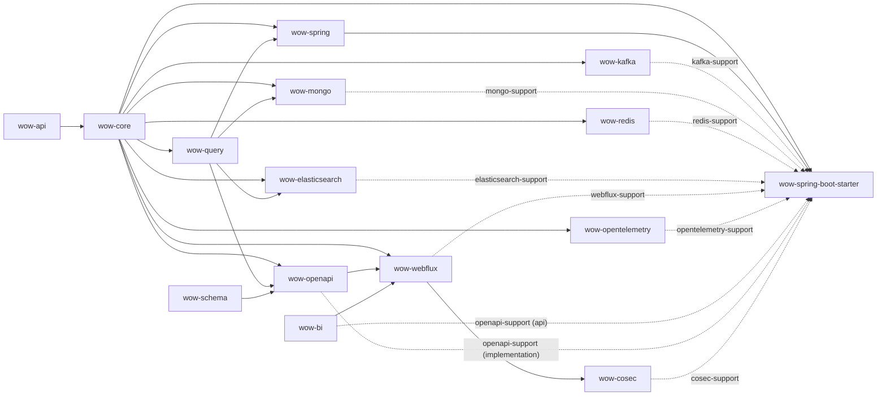

# Module Dependencies

This page answers two questions: which module owns code, and which capability an application should request at runtime. Dependency facts come from `settings.gradle.kts`, module `build.gradle.kts` files, and `wow-spring-boot-starter/build.gradle.kts`. Configuration properties do not replace classpath selection.

## Module Overview Table

| Module | Primary responsibility | When an application depends on it directly |
| --- | --- | --- |
| `wow-api` | Public command, event, naming, header, and AggregateId contracts | API/domain contract modules |
| `wow-core` | CommandGateway, dispatchers, EventStore interfaces, event sourcing, projections, sagas, wait chains | Non-Spring runtime or domain implementation |
| `wow-query` | Query models, schema resolution, snapshot/event query interfaces | Query extensions |
| `wow-models` | Repository shared models and KSP-generated examples | Consumers of those shared models |
| `wow-spring` | Spring container bridge and Query Gateway registration | Custom Spring integration |
| `wow-spring-boot-starter` | Core auto-configuration and optional feature variants | Spring Boot services |
| `wow-kafka` | Kafka Command/DomainEvent/StateEvent buses | Kafka without the Starter |
| `wow-mongo` | Mongo EventStore, SnapshotStore, PrepareKey, and query backends | Mongo without the Starter |
| `wow-redis` | Redis buses, EventStore, SnapshotStore, and PrepareKey | Redis without the Starter |
| `wow-elasticsearch` | Elasticsearch EventStore, SnapshotStore, and query backends | Elasticsearch without the Starter |
| `wow-webflux` | Built-in command, event, state, query, and operation route handlers | WebFlux without the Starter |
| `wow-opentelemetry` | OpenTelemetry instrumenters for Wow flows | Tracing without the Starter |
| `wow-cosec` | CoSec request-context propagation and query-space rewriting | Applications already using CoSec |
| `wow-compiler` | KSP metadata and API-contract generation | Use with `ksp(...)`, never as a runtime dependency |
| `wow-schema` | JSON Schema generation | Schema/OpenAPI tooling extensions |
| `wow-openapi` | Built-in route and OpenAPI contract generation | OpenAPI extensions |
| `wow-bi` | BI/ClickHouse synchronization script generation | BI script generation or deployment |
| `wow-test` | `AggregateSpec` and `SagaSpec` DSL | Domain tests |
| `wow-tck` | Adapter contracts and Testcontainers fixtures | Adapter implementation/verification |
| `wow-mock` | Mock and delayed storage support | Tests, not production |
| `wow-apiclient` | CoApi/Wow REST API client | JVM clients |
| `wow-cocache` | CoCache projection-cache integration | CoCache adopters |
| `wow-bom` / `wow-dependencies` | Published BOM and repository dependency platform | Version alignment; no runtime capability |

`test/wow-it` and `code-coverage-report` are repository verification modules. `compensation/*` and `example/*` are the compensation product and sample applications, not implicit dependencies of the base Starter.

## Dependency Graph

Arrows point from a dependency to its consumer. Dashed edges are Starter feature variants, not base-variant dependencies.


```mermaid
graph LR
    API[wow-api] --> CORE[wow-core]
    CORE --> QUERY[wow-query]
    CORE --> SPRING[wow-spring]
    QUERY --> SPRING
    CORE --> STARTER[wow-spring-boot-starter]
    SPRING --> STARTER

    CORE --> KAFKA[wow-kafka]
    CORE --> MONGO[wow-mongo]
    QUERY --> MONGO
    CORE --> REDIS[wow-redis]
    CORE --> ES[wow-elasticsearch]
    QUERY --> ES

    CORE --> OPENAPI[wow-openapi]
    QUERY --> OPENAPI
    SCHEMA[wow-schema] --> OPENAPI
    CORE --> WEBFLUX[wow-webflux]
    OPENAPI --> WEBFLUX
    BI[wow-bi] --> WEBFLUX
    CORE --> OTEL[wow-opentelemetry]
    WEBFLUX --> COSEC[wow-cosec]

    KAFKA -. kafka-support .-> STARTER
    MONGO -. mongo-support .-> STARTER
    REDIS -. redis-support .-> STARTER
    ES -. elasticsearch-support .-> STARTER
    WEBFLUX -. webflux-support .-> STARTER
    OTEL -. opentelemetry-support .-> STARTER
    BI -. "openapi-support (api)" .-> STARTER
    OPENAPI -. "openapi-support (implementation)" .-> STARTER
    COSEC -. cosec-support .-> STARTER
```

The diagram shows project-module dependencies only. External libraries such as Jackson, Reactor, Spring Data, and Kafka clients remain defined by each module's Gradle file.

## Module Details

### API Layer

#### wow-api

`wow-api` is the public contract layer, but it is not dependency-free: it exposes Jackson Databind through its API and uses Jackson annotations, Swagger annotations, and Spring Context as compile-only dependencies. Runtime dispatchers, storage, and Spring auto-configuration do not belong here.

Representative types include `CommandMessage`, `DomainEvent`, `AggregateId`, `NamedAggregate`, `Header`, and `TopicKind`.

### Core Layer

#### wow-core

`wow-core` exposes `wow-api` and runtime contracts from Reactor, Jackson, Validation, CosId, and Micrometer. It owns command processing, event sourcing, Snapshot/Projection/Saga interfaces, WaitPlan, and runtime lifecycle. It does not own a concrete broker, database, or HTTP server.

#### wow-query

`wow-query` exposes `wow-core`. MongoDB and Elasticsearch query modules reuse it. That dependency does not give Redis EventStore/SnapshotStore a general dynamic-query implementation.

#### wow-models

`wow-models` uses `wow-api` as an implementation dependency and runs `wow-compiler` KSP for its own sources. It is a shared-model module, not a mandatory dependency for every application domain.

### Spring Layer

#### wow-spring

`wow-spring` exposes `wow-core`, uses `wow-query` as an implementation dependency, and owns the Spring `ApplicationContext` bridge and Query Gateway registration. It does not select storage or messaging implementations.

#### wow-spring-boot-starter

The base variant exposes `wow-core` and `wow-spring` and provides core auto-configuration. The base variant itself is not the Kafka, MongoDB, Redis, or Elasticsearch capability.

```kotlin
dependencies {
    implementation(platform("me.ahoo.wow:wow-bom:<aligned-version>"))
    implementation("me.ahoo.wow:wow-spring-boot-starter")

    implementation("me.ahoo.wow:wow-spring-boot-starter") {
        capabilities { requireCapability("me.ahoo.wow:kafka-support") }
    }
    implementation("me.ahoo.wow:wow-spring-boot-starter") {
        capabilities { requireCapability("me.ahoo.wow:mongo-support") }
    }
}
```

Use one dependency declaration per capability. `mongo-support`, `redis-support`, and `elasticsearch-support` already include the matching Spring Boot Data starter. Add it separately only when application code directly requires an additional API, not as a duplicate precaution.

### Infrastructure Modules

| Module | Concrete capability | Does not own |
| --- | --- | --- |
| `wow-kafka` | Three distributed buses, topic converters, receiver policy | Topics, ACLs, retention, offset backups |
| `wow-mongo` | EventStore, SnapshotStore, PrepareKey, event/snapshot queries | Business indexes, sharding, backups |
| `wow-redis` | Three Redis Streams buses, EventStore, SnapshotStore, PrepareKey | General dynamic queries, Redis persistence policy |
| `wow-elasticsearch` | EventStore, SnapshotStore, event/snapshot queries, template initialization | ILM, cluster capacity, snapshot repositories |
| `wow-webflux` | Contract-driven HTTP handlers, query guard, batch routes | Business authorization and management-plane isolation |
| `wow-opentelemetry` | Wow instrumenters | SDK/exporter/sampler deployment |
| `wow-cosec` | CoSec context adaptation | Complete authentication flow or application authorization policy |

Infrastructure modules implement Core interfaces. Production suitability depends on deployment topology, configuration, backup/restore, and real-load evidence—not the module's presence in a dependency graph.

### Tooling Modules

#### wow-compiler

`wow-compiler` is a KSP processor. Domain modules use `ksp("me.ahoo.wow:wow-compiler")` to generate compile-time outputs such as `META-INF/wow-metadata.json`. The service runtime needs the generated result, not the compiler as a runtime dependency.

#### wow-schema

`wow-schema` depends on `wow-api`, `wow-core`, and `wow-query` and combines JSON Schema Generator with Jackson, Validation, and Swagger modules. It also packages the query FilterExpression schema.

#### wow-openapi

`wow-openapi` exposes `wow-core`, `wow-query`, and `wow-schema` to generate built-in HTTP route contracts. `wow-webflux` provides the actual handlers.

#### wow-bi

`wow-bi` exposes `wow-api` and uses `wow-core` and the ClickHouse client as implementation dependencies. It generates/manages BI scripts; it does not deploy Kafka or ClickHouse or provide a recovery process by itself.

### Testing Modules

| Module | Verification scope | Typical consumer |
| --- | --- | --- |
| `wow-test` | Aggregate, saga, event, and state behavior | Application domain modules |
| `wow-tck` | EventStore, SnapshotStore, bus, query, and other adapter contracts | Adapter implementations and framework modules |
| `wow-mock` | Mock/delayed backends | Test services |
| `wow-it` | Real combinations such as Kafka + MongoDB | Repository CI/integration tests |

A passing TCK does not prove capacity, upgrade safety, or disaster recovery for an application's topology. The application still owns that evidence.

### Client &amp; Caching Modules

#### wow-apiclient

`wow-apiclient` exposes `wow-core`, `wow-openapi`, and Reactor and uses CoApi and Spring Web/WebFlux as implementation dependencies. It is a JVM HTTP client and does not start server routes.

#### wow-cocache

`wow-cocache` exposes `wow-apiclient`, `wow-query`, and CoCache Core for projection-cache integration. Do not add it without a CoCache requirement.

## Feature Variant Matrix

| Capability | Direct project modules | Additional external integration |
| --- | --- | --- |
| `mongo-support` | `wow-mongo` | Reactive MongoDB Spring Boot starter |
| `redis-support` | `wow-redis` | Reactive Redis Spring Boot starter |
| `mock-support` | `wow-mock` | Test only |
| `kafka-support` | `wow-kafka` | Reactor Kafka |
| `webflux-support` | `wow-bi` (API), `wow-webflux` | Spring WebFlux is already a base Starter dependency |
| `elasticsearch-support` | `wow-elasticsearch` | Elasticsearch Spring Boot starter |
| `opentelemetry-support` | `wow-opentelemetry` | OpenTelemetry instrumentation API |
| `openapi-support` | `wow-bi` (API), `wow-openapi` (implementation) | springdoc common |
| `cosec-support` | `wow-cosec` | CoSec integration chain |

A capability means **code is available**. `wow.*.enabled` and bus/storage properties decide **whether it is wired**. Backend health, schemas, topics, permissions, and recovery drills decide **whether it is operable**. These layers are not interchangeable.

For `openapi-support`, `openapiSupportApi(project(":wow-bi"))` exposes the BI script API to consumers, while `openapiSupportImplementation(project(":wow-openapi"))` supplies OpenAPI generation internally. Both are direct project dependencies of that feature variant.

## Build Configuration

The root `settings.gradle.kts` registers project modules. Third-party versions are centralized in `gradle/libs.versions.toml` and `wow-dependencies`. Applications should use one aligned Wow BOM; this page does not duplicate a version that can drift.

Changing module ownership, a feature capability, or an API/implementation exposure changes the consumer classpath. Treat it as a build-contract change and inspect the Starter Gradle file, published metadata, and downstream dependency insight together.

## Related Pages

- [Architecture Overview](./architecture.md)
- [Data Flow](./data-flow.md)
- [Spring Boot Starter](../extensions/spring-boot-starter.md)
- [Configuring a Wow Application](../configuration.md)
- [Core Configuration Reference](../../reference/config/core.md)
