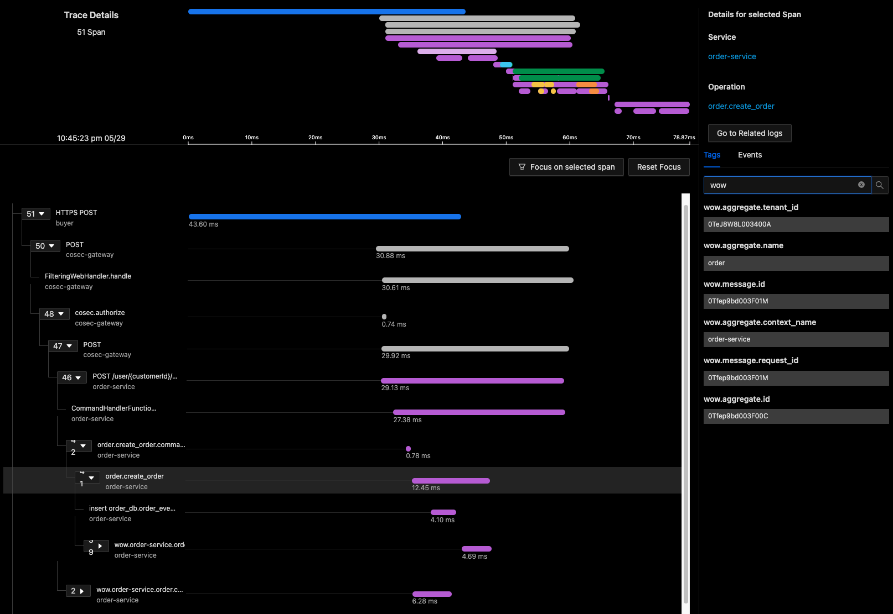

# Observability



## Installation

::: code-group
```kotlin [Gradle(Kotlin)]
implementation("me.ahoo.wow:wow-opentelemetry")
```
```groovy [Gradle(Groovy)]
implementation 'me.ahoo.wow:wow-opentelemetry'
```
```xml [Maven]
<dependency>
    <groupId>me.ahoo.wow</groupId>
    <artifactId>wow-opentelemetry</artifactId>
    <version>${wow.version}</version>
</dependency>
```
:::
