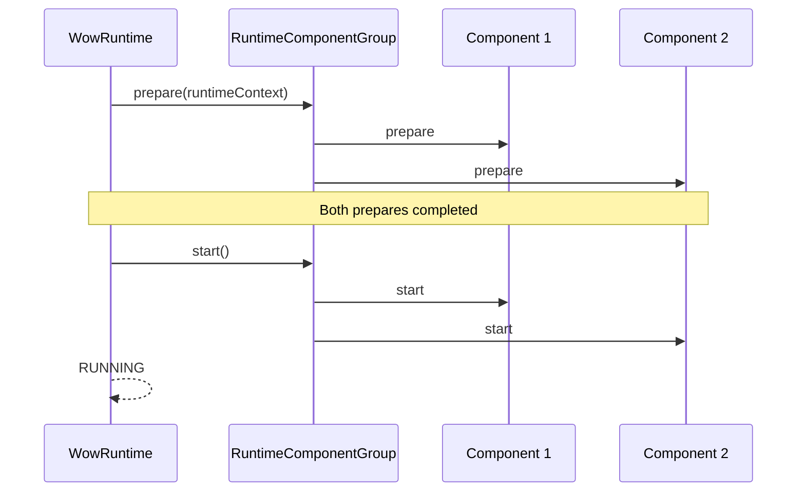
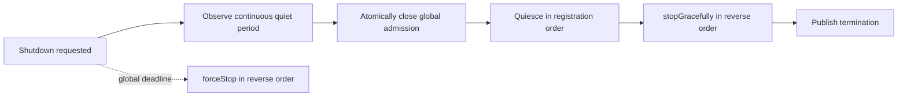

# Runtime Lifecycle

`WowRuntime` is the common owner of all `RuntimeComponent` instances. It decides when the whole runtime may accept work, when admission closes, and how work drains under one deadline. It does not decide whether an individual business message should be retried.

## Component contract

```kotlin
interface RuntimeComponent {
    fun prepare(runtimeContext: RuntimeContext): Mono<Void>
    fun start()
    fun quiesce() = Unit
    fun stopGracefully(): Mono<Void>
    fun forceStop()
}
```

| Method | Contract |
| --- | --- |
| `prepare` | Acquire subscriptions or resources and complete when new work can be retained; processing remains closed |
| `start` | Open processing after every component has prepared |
| `quiesce` | Promptly, non-blockingly, and idempotently close component intake after global admission closes |
| `stopGracefully` | Drain accepted work and asynchronously release resources |
| `forceStop` | Be prompt, non-blocking, repeatable, and safe before prepare |

Component construction must remain inert. `RuntimeComponent` does not extend `AutoCloseable`, so a container must not infer a second cleanup owner.

## Startup: all ready before processing opens



Preparation and startup follow registration order. If any preparation fails, the runtime enters startup rollback and cleans up lifecycle-entered components in reverse order. `start()` returns a cold `Mono`; cancelling its subscription aborts startup and force-stops this one-shot runtime.

The barrier proves only the readiness reported by components. A custom transport must keep `prepare` incomplete until new messages cannot be missed in the startup window, not merely until a client object exists.

## Activity admission

`RuntimeContext.tryAcquire()` requests a `RuntimeActivity` for one complete asynchronous operation:

```text
candidate work arrives
  → tryAcquire()
  → null: reject admission and do not acknowledge the message as handled
  → lease: run the complete asynchronous chain and close on termination
```

Closing a lease is idempotent. The lease must cover the full asynchronous chain, not just enqueueing into a local buffer, or quiescence may observe a false idle state. A terminal component-pipeline failure is reported with `reportFailure(error)`; ordinary business failures remain owned by their filter, compensation, and acknowledgement policies.

## Graceful shutdown



Each new runtime activity restarts the quiet period. After a continuous idle interval reaches `shutdownQuietPeriod`, the runtime closes global admission before component intake. Tail work can therefore acquire a lease during handoff gaps where upstream publication has completed but downstream consumption is only beginning.

`shutdownTimeout` bounds the entire shutdown from creation of the shutdown owner, not one component. Deadline expiry records a `TimeoutException` and transfers ownership to force cleanup. `stop(timeout)` limits only that caller's blocking wait; it does not replace the runtime deadline.

## Failures and races

| Scenario | Current implementation behavior |
| --- | --- |
| `prepare` / `start` fails | Preserve the startup error and roll back entered components in reverse order |
| A component reports a fatal error | Close global admission immediately, skip the normal quiet period, drain admitted work, and terminate the whole runtime |
| Graceful cleanup fails | Continue best-effort cleanup; the first failure remains primary and later failures are suppressed |
| Deadline expires | Cancel the graceful owner and force-stop all components |
| Force overlaps a lifecycle action | Invoke compensating `forceStop` again after the method returns or publisher terminates when required |

`forceStop` must therefore tolerate repeated calls in partially initialized states. Once terminal failure is published, it is sealed; late cleanup errors do not mutate the already published result.

## Component order and resource ownership

`RuntimeComponentGroup` requires distinct component identities in one group and uses these orders:

- `prepare`, `start`, and `quiesce`: registration order;
- `stopGracefully` and `forceStop`: reverse registration order;
- once force wins, a detached graceful chain cannot advance into another component.

A composite can give children a borrowed resource view such as `BorrowedAggregateSchedulerSupplier`. Children complete their lifecycle without closing a Scheduler owned by the parent.

## Spring ownership

The Starter supplies the single `WowRuntimeLifecycle` adapter to Spring `SmartLifecycle`. The default runtime collects singleton `RuntimeComponent` beans from the current application context, orders them with Spring semantics, and rejects competing Spring lifecycle, destroy-method, or cleanup owners.

An application-provided runtime explicitly owns its component topology; the Starter does not append auto-discovered components. [Spring Boot Starter](../extensions/spring-boot-starter.md#bean-wiring-and-overrides) owns bean names, configuration, and replacement rules.

## Custom component checklist

1. Do not open subscriptions or background threads in the constructor.
2. Complete `prepare` at real readiness while processing remains closed.
3. Hold one lease for every admitted asynchronous operation until full termination.
4. Close logical intake synchronously in `quiesce`; do not block for a long operation.
5. Make `forceStop` safe before prepare, idempotent, and non-blocking.
6. Use `reportFailure` only for terminal pipeline failure.
7. Test force races with prepare, start, quiesce, and graceful stop.

## Verification and operations

Defaults and constraints live in the [Core Configuration Reference](../../reference/config/core.md). Narrow implementation evidence is available with:

```bash
./gradlew :wow-core:test --tests "me.ahoo.wow.runtime.WowRuntimeTest"
./gradlew :wow-core:test --tests "me.ahoo.wow.runtime.internal.RuntimeComponentGroupTest"
```

Module tests verify the implementation contract only. Production quiet-period and timeout values still require evidence from real handoff jitter, maximum drain time, and resource cleanup time.

## Source and related pages

- [`WowRuntime`](https://github.com/Ahoo-Wang/Wow/blob/main/wow-core/src/main/kotlin/me/ahoo/wow/runtime/WowRuntime.kt)
- [`RuntimeComponent`](https://github.com/Ahoo-Wang/Wow/blob/main/wow-core/src/main/kotlin/me/ahoo/wow/runtime/RuntimeComponent.kt)
- [`RuntimeContext`](https://github.com/Ahoo-Wang/Wow/blob/main/wow-core/src/main/kotlin/me/ahoo/wow/runtime/RuntimeContext.kt)
- [`RuntimeComponentGroup`](https://github.com/Ahoo-Wang/Wow/blob/main/wow-core/src/main/kotlin/me/ahoo/wow/runtime/internal/RuntimeComponentGroup.kt)
- [Runtime Orchestration Migration](../migration/runtime-orchestration.md): breaking lifecycle migration boundary
- [Aggregate Scheduler](./aggregate-scheduler.md): Scheduler ownership and disposal
