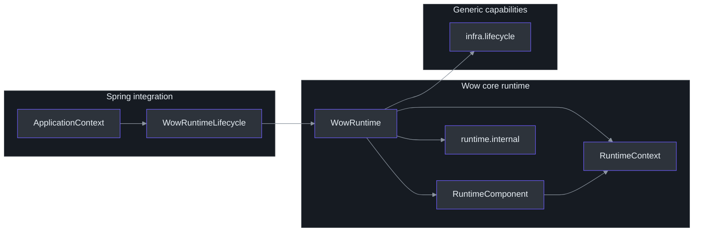
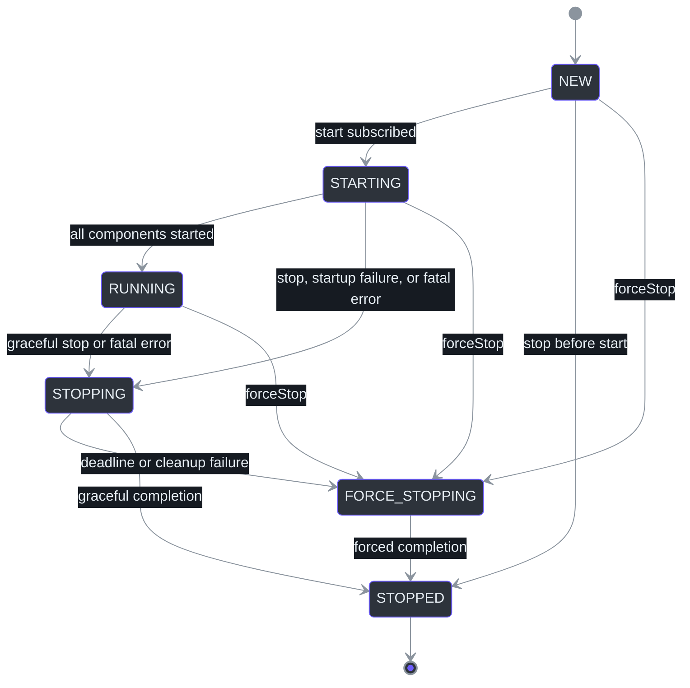
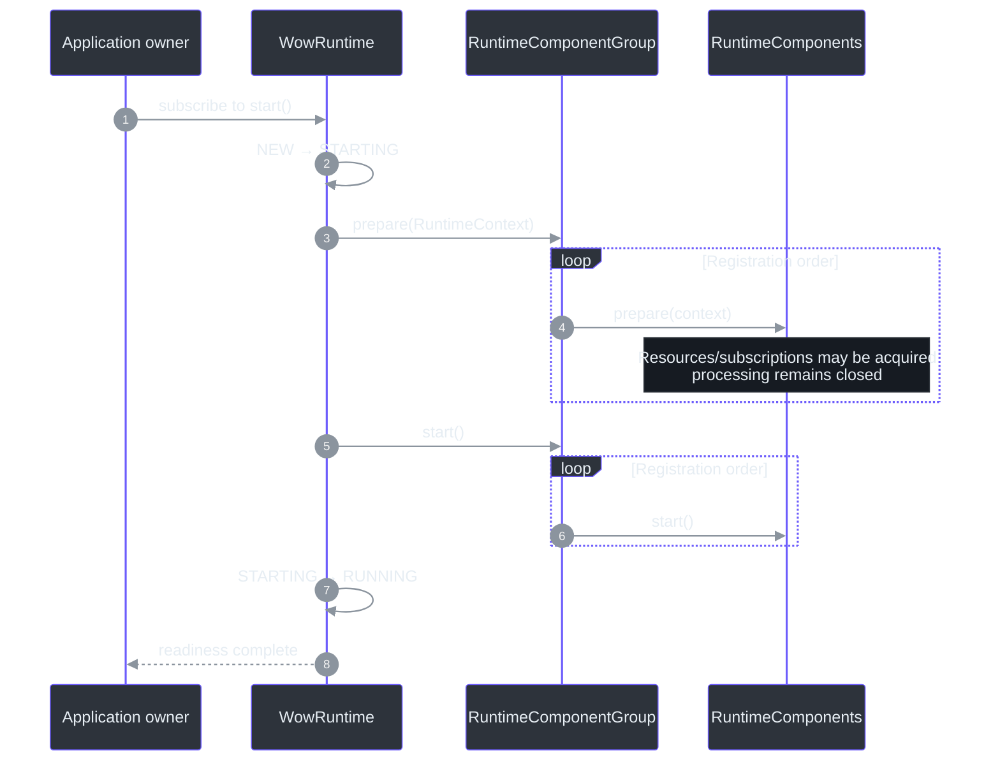
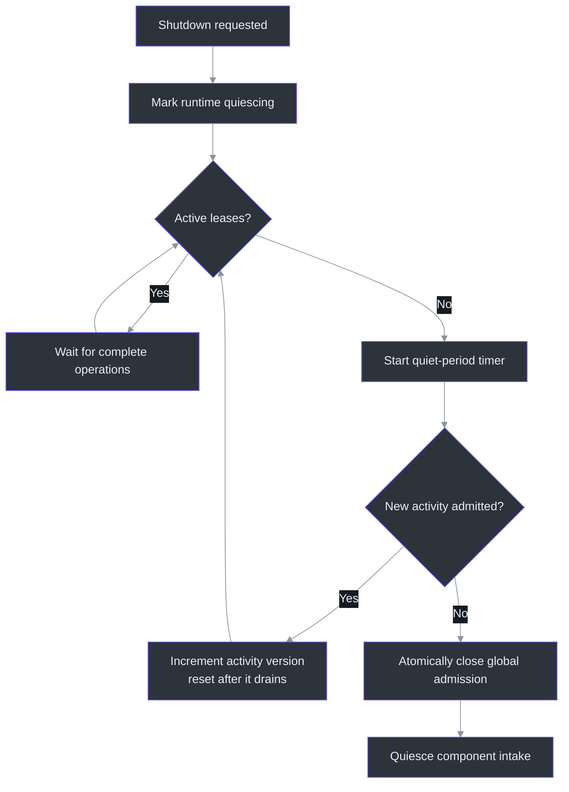
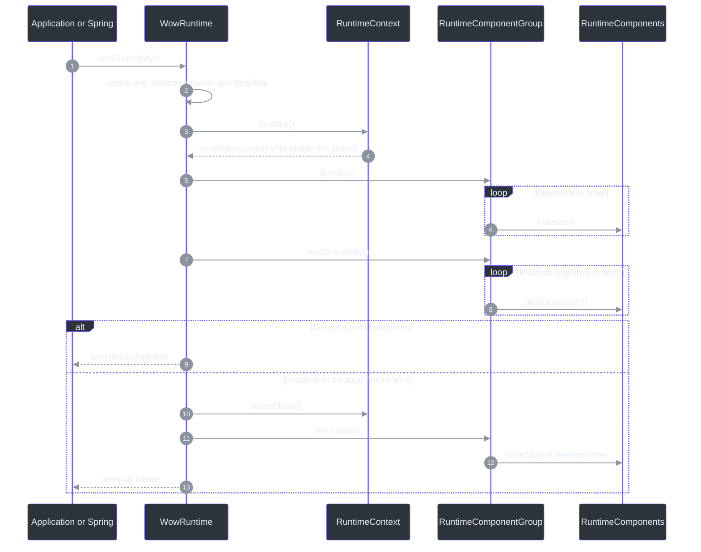

# Runtime Lifecycle

## Overview

A Wow application is not a collection of independently stoppable dispatchers. Commands,
events, projections, snapshots, and sagas form one processing graph: work admitted by one
component can create tail work in another. `WowRuntime` therefore owns the graph as one
one-shot lifecycle, with one readiness barrier, one activity boundary, one shutdown
deadline, and one terminal result.
[`WowRuntime.kt:40-55`](https://github.com/Ahoo-Wang/Wow/blob/main/wow-core/src/main/kotlin/me/ahoo/wow/runtime/WowRuntime.kt#L40-L55)
[`2026-07-28-runtime-orchestration.md:93-121`](https://github.com/Ahoo-Wang/Wow/blob/main/document/design/2026-07-28-runtime-orchestration.md#L93-L121)

| Concern | Runtime guarantee | Source |
|---|---|---|
| Ownership | One `WowRuntime` owns all registered `RuntimeComponent` instances | [`WowRuntime.kt:113-131`](https://github.com/Ahoo-Wang/Wow/blob/main/wow-core/src/main/kotlin/me/ahoo/wow/runtime/WowRuntime.kt#L113-L131) |
| Readiness | Every component completes `prepare` before any component enters `start` | [`WowRuntime.kt:206-233`](https://github.com/Ahoo-Wang/Wow/blob/main/wow-core/src/main/kotlin/me/ahoo/wow/runtime/WowRuntime.kt#L206-L233) |
| In-flight work | A `RuntimeActivity` lease represents one complete asynchronous operation | [`RuntimeContext.kt:16-45`](https://github.com/Ahoo-Wang/Wow/blob/main/wow-core/src/main/kotlin/me/ahoo/wow/runtime/RuntimeContext.kt#L16-L45) |
| Graceful shutdown | Global admission closes after a stable idle period; components then quiesce and stop | [`WowRuntime.kt:496-524`](https://github.com/Ahoo-Wang/Wow/blob/main/wow-core/src/main/kotlin/me/ahoo/wow/runtime/WowRuntime.kt#L496-L524) |
| Deadline | One timeout bounds the complete runtime shutdown and triggers force-stop | [`WowRuntime.kt:400-458`](https://github.com/Ahoo-Wang/Wow/blob/main/wow-core/src/main/kotlin/me/ahoo/wow/runtime/WowRuntime.kt#L400-L458) |
| Failure | A fatal component error enters the same complete-runtime shutdown path | [`WowRuntime.kt:461-494`](https://github.com/Ahoo-Wang/Wow/blob/main/wow-core/src/main/kotlin/me/ahoo/wow/runtime/WowRuntime.kt#L461-L494) |
| Spring | One `WowRuntimeLifecycle` bridges the runtime to Spring `SmartLifecycle` | [`WowRuntimeLifecycle.kt:27-44`](https://github.com/Ahoo-Wang/Wow/blob/main/wow-spring/src/main/kotlin/me/ahoo/wow/spring/WowRuntimeLifecycle.kt#L27-L44) |

## Architecture

### One owner, narrow boundaries

The public orchestration API lives in `me.ahoo.wow.runtime`; concurrency state machines
and cleanup machinery stay in `me.ahoo.wow.runtime.internal`. Generic lifecycle
capabilities remain in `me.ahoo.wow.infra.lifecycle`, while Spring only supplies the
composition root and lifecycle bridge. This keeps policy in the runtime without coupling
generic lifecycle contracts to Wow orchestration.
[`RuntimeComponent.kt:14-35`](https://github.com/Ahoo-Wang/Wow/blob/main/wow-core/src/main/kotlin/me/ahoo/wow/runtime/RuntimeComponent.kt#L14-L35)
[`GracefullyStoppable.kt:14-34`](https://github.com/Ahoo-Wang/Wow/blob/main/wow-core/src/main/kotlin/me/ahoo/wow/infra/lifecycle/GracefullyStoppable.kt#L14-L34)



<!-- Sources: wow-core/src/main/kotlin/me/ahoo/wow/runtime/RuntimeComponent.kt:14-62, wow-core/src/main/kotlin/me/ahoo/wow/runtime/WowRuntime.kt:40-55, wow-spring/src/main/kotlin/me/ahoo/wow/spring/WowRuntimeLifecycle.kt:27-44, wow-core/src/main/kotlin/me/ahoo/wow/infra/lifecycle/GracefullyStoppable.kt:14-34 -->

| Boundary | Responsibility | Must not own | Source |
|---|---|---|---|
| `me.ahoo.wow.runtime` | Public runtime contract and high-level orchestration | Spring container policy or storage/transport details | [`WowRuntime.kt:40-55`](https://github.com/Ahoo-Wang/Wow/blob/main/wow-core/src/main/kotlin/me/ahoo/wow/runtime/WowRuntime.kt#L40-L55) |
| `me.ahoo.wow.runtime.internal` | Ordered composition, admission state, deadlines, cleanup, terminal delivery | Public extension APIs | [`RuntimeComponentGroup.kt:25-40`](https://github.com/Ahoo-Wang/Wow/blob/main/wow-core/src/main/kotlin/me/ahoo/wow/runtime/internal/RuntimeComponentGroup.kt#L25-L40) |
| `me.ahoo.wow.infra.lifecycle` | Reusable start/stop capability contracts | Complete-runtime readiness or failure policy | [`Lifecycle.kt:14-57`](https://github.com/Ahoo-Wang/Wow/blob/main/wow-core/src/main/kotlin/me/ahoo/wow/infra/lifecycle/Lifecycle.kt#L14-L57) |
| `me.ahoo.wow.spring` | Spring `SmartLifecycle` adapter | Component discovery or core runtime state | [`WowRuntimeLifecycle.kt:27-44`](https://github.com/Ahoo-Wang/Wow/blob/main/wow-spring/src/main/kotlin/me/ahoo/wow/spring/WowRuntimeLifecycle.kt#L27-L44) |
| Starter auto-configuration | Discover, validate, order, and compose local component beans | A second lifecycle for each component | [`WowAutoConfiguration.kt:105-168`](https://github.com/Ahoo-Wang/Wow/blob/main/wow-spring-boot-starter/src/main/kotlin/me/ahoo/wow/spring/boot/starter/WowAutoConfiguration.kt#L105-L168) |

## Components

### `RuntimeComponent` contract

`RuntimeComponent` is deliberately small. Construction must remain inert, and all
runtime-owned resource acquisition starts at `prepare` or `start`. It does not extend
`AutoCloseable`, preventing containers from inferring an independent destroy lifecycle.
[`RuntimeComponent.kt:18-35`](https://github.com/Ahoo-Wang/Wow/blob/main/wow-core/src/main/kotlin/me/ahoo/wow/runtime/RuntimeComponent.kt#L18-L35)

```kotlin
interface RuntimeComponent {
    fun prepare(runtimeContext: RuntimeContext)
    fun start()
    fun quiesce() = Unit
    fun stopGracefully(): Mono<Void>
    fun forceStop()
}
```

| Method | Responsibility | Required behavior | Source |
|---|---|---|---|
| `prepare` | Acquire subscriptions/resources without opening processing | Save `RuntimeContext` when activity or fatal-error reporting is needed | [`RuntimeComponent.kt:36-43`](https://github.com/Ahoo-Wang/Wow/blob/main/wow-core/src/main/kotlin/me/ahoo/wow/runtime/RuntimeComponent.kt#L36-L43) |
| `start` | Open processing after the group-wide readiness barrier | Do not depend on a later component still being unprepared | [`RuntimeComponentGroup.kt:79-94`](https://github.com/Ahoo-Wang/Wow/blob/main/wow-core/src/main/kotlin/me/ahoo/wow/runtime/internal/RuntimeComponentGroup.kt#L79-L94) |
| `quiesce` | Close component intake after global admission closes | Prompt, non-blocking, and idempotent | [`RuntimeComponent.kt:47-54`](https://github.com/Ahoo-Wang/Wow/blob/main/wow-core/src/main/kotlin/me/ahoo/wow/runtime/RuntimeComponent.kt#L47-L54) |
| `stopGracefully` | Drain admitted work and release resources | Return completion as `Mono<Void>` | [`RuntimeComponent.kt:56`](https://github.com/Ahoo-Wang/Wow/blob/main/wow-core/src/main/kotlin/me/ahoo/wow/runtime/RuntimeComponent.kt#L56) |
| `forceStop` | Promptly release resources when graceful shutdown loses | Non-blocking, idempotent, safe before `prepare`, and safe when repeated | [`RuntimeComponent.kt:18-29`](https://github.com/Ahoo-Wang/Wow/blob/main/wow-core/src/main/kotlin/me/ahoo/wow/runtime/RuntimeComponent.kt#L18-L29) |

### Runtime state

The runtime is one-shot. `start()` can enter the lifecycle only from `NEW`; once shutdown
begins, the application must create a new runtime (or a new Spring
`ApplicationContext`) instead of restarting the old one.
[`WowRuntime.kt:93-100`](https://github.com/Ahoo-Wang/Wow/blob/main/wow-core/src/main/kotlin/me/ahoo/wow/runtime/WowRuntime.kt#L93-L100)
[`WowRuntime.kt:206-212`](https://github.com/Ahoo-Wang/Wow/blob/main/wow-core/src/main/kotlin/me/ahoo/wow/runtime/WowRuntime.kt#L206-L212)



<!-- Sources: wow-core/src/main/kotlin/me/ahoo/wow/runtime/WowRuntime.kt:93-109, wow-core/src/main/kotlin/me/ahoo/wow/runtime/WowRuntime.kt:188-245, wow-core/src/main/kotlin/me/ahoo/wow/runtime/WowRuntime.kt:316-398, wow-core/src/main/kotlin/me/ahoo/wow/runtime/WowRuntime.kt:461-494 -->

## Data Flow

### Startup readiness barrier

`WowRuntime.start()` is a cold `Mono<Void>`: callers must subscribe or block. On
subscription, the runtime prepares every component in registration order and only then
starts them in the same order. If startup fails, entered components are cleaned up in
reverse order under the runtime deadline.
[`WowRuntime.kt:188-245`](https://github.com/Ahoo-Wang/Wow/blob/main/wow-core/src/main/kotlin/me/ahoo/wow/runtime/WowRuntime.kt#L188-L245)
[`RuntimeComponentGroup.kt:42-115`](https://github.com/Ahoo-Wang/Wow/blob/main/wow-core/src/main/kotlin/me/ahoo/wow/runtime/internal/RuntimeComponentGroup.kt#L42-L115)



<!-- Sources: wow-core/src/main/kotlin/me/ahoo/wow/runtime/WowRuntime.kt:188-233, wow-core/src/main/kotlin/me/ahoo/wow/runtime/internal/RuntimeComponentGroup.kt:42-94, wow-core/src/main/kotlin/me/ahoo/wow/messaging/dispatcher/AggregateDispatcher.kt:206-221, wow-core/src/main/kotlin/me/ahoo/wow/messaging/dispatcher/AggregateDispatcher.kt:278-290 -->

This two-pass barrier matters for in-memory and reactive transports: a dispatcher can
install its subscription during `prepare` while keeping demand closed, and open demand
only during `start`.
[`AggregateDispatcher.kt:206-221`](https://github.com/Ahoo-Wang/Wow/blob/main/wow-core/src/main/kotlin/me/ahoo/wow/messaging/dispatcher/AggregateDispatcher.kt#L206-L221)
[`AggregateDispatcher.kt:278-290`](https://github.com/Ahoo-Wang/Wow/blob/main/wow-core/src/main/kotlin/me/ahoo/wow/messaging/dispatcher/AggregateDispatcher.kt#L278-L290)
[`2026-07-28-runtime-orchestration.md:81-100`](https://github.com/Ahoo-Wang/Wow/blob/main/document/design/2026-07-28-runtime-orchestration.md#L81-L100)

### Activity leases and the quiet boundary

Before accepting a complete asynchronous operation, a component calls
`RuntimeContext.tryAcquire()`. A non-null lease stays open until its operation chain
terminates; downstream tail work is represented by its own leases. Once admission
closes, `tryAcquire()` returns `null`.
[`RuntimeContext.kt:16-45`](https://github.com/Ahoo-Wang/Wow/blob/main/wow-core/src/main/kotlin/me/ahoo/wow/runtime/RuntimeContext.kt#L16-L45)
[`AggregateDispatcher.kt:229-271`](https://github.com/Ahoo-Wang/Wow/blob/main/wow-core/src/main/kotlin/me/ahoo/wow/messaging/dispatcher/AggregateDispatcher.kt#L229-L271)



<!-- Sources: wow-core/src/main/kotlin/me/ahoo/wow/runtime/internal/DefaultRuntimeContext.kt:30-37, wow-core/src/main/kotlin/me/ahoo/wow/runtime/internal/DefaultRuntimeContext.kt:74-151, wow-core/src/main/kotlin/me/ahoo/wow/runtime/internal/DefaultRuntimeContext.kt:171-227 -->

During the quiet window the runtime still admits tail work. Each admitted operation
changes an activity version, so an older timer cannot close admission after newer work
arrives. Admission is closed atomically only after the runtime remains idle for the
complete `shutdown-quiet-period`.
[`DefaultRuntimeContext.kt:74-118`](https://github.com/Ahoo-Wang/Wow/blob/main/wow-core/src/main/kotlin/me/ahoo/wow/runtime/internal/DefaultRuntimeContext.kt#L74-L118)
[`DefaultRuntimeContext.kt:171-227`](https://github.com/Ahoo-Wang/Wow/blob/main/wow-core/src/main/kotlin/me/ahoo/wow/runtime/internal/DefaultRuntimeContext.kt#L171-L227)
[`2026-07-28-runtime-orchestration.md:102-125`](https://github.com/Ahoo-Wang/Wow/blob/main/document/design/2026-07-28-runtime-orchestration.md#L102-L125)

### Graceful and forced shutdown

The runtime creates one shutdown owner and one absolute deadline. Graceful shutdown first
waits for the global quiet boundary, then invokes component `quiesce` in registration
order and `stopGracefully` in reverse order. Deadline expiry cancels the graceful owner,
closes admission immediately, and force-stops every registered component in reverse
order.
[`WowRuntime.kt:400-458`](https://github.com/Ahoo-Wang/Wow/blob/main/wow-core/src/main/kotlin/me/ahoo/wow/runtime/WowRuntime.kt#L400-L458)
[`WowRuntime.kt:496-545`](https://github.com/Ahoo-Wang/Wow/blob/main/wow-core/src/main/kotlin/me/ahoo/wow/runtime/WowRuntime.kt#L496-L545)
[`RuntimeComponentGroup.kt:64-115`](https://github.com/Ahoo-Wang/Wow/blob/main/wow-core/src/main/kotlin/me/ahoo/wow/runtime/internal/RuntimeComponentGroup.kt#L64-L115)



<!-- Sources: wow-core/src/main/kotlin/me/ahoo/wow/runtime/WowRuntime.kt:316-458, wow-core/src/main/kotlin/me/ahoo/wow/runtime/WowRuntime.kt:496-545, wow-core/src/main/kotlin/me/ahoo/wow/runtime/internal/RuntimeComponentGroup.kt:64-187 -->

## Failure and Concurrency Semantics

| Scenario | Result | Source |
|---|---|---|
| Startup action fails | Runtime rolls back prepared components and publishes the startup failure | [`WowRuntime.kt:235-295`](https://github.com/Ahoo-Wang/Wow/blob/main/wow-core/src/main/kotlin/me/ahoo/wow/runtime/WowRuntime.kt#L235-L295) |
| Component reports a fatal pipeline error | The complete runtime enters shutdown; it is not isolated to one dispatcher | [`WowRuntime.kt:461-494`](https://github.com/Ahoo-Wang/Wow/blob/main/wow-core/src/main/kotlin/me/ahoo/wow/runtime/WowRuntime.kt#L461-L494) |
| Deadline expires | A `TimeoutException` becomes failure evidence and force-stop takes ownership | [`WowRuntime.kt:431-458`](https://github.com/Ahoo-Wang/Wow/blob/main/wow-core/src/main/kotlin/me/ahoo/wow/runtime/WowRuntime.kt#L431-L458) |
| Force-stop overlaps a lifecycle action | Runtime performs an initial force pass and one compensation pass after the action leaves | [`RuntimeComponentGroup.kt:248-340`](https://github.com/Ahoo-Wang/Wow/blob/main/wow-core/src/main/kotlin/me/ahoo/wow/runtime/internal/RuntimeComponentGroup.kt#L248-L340) |
| Multiple cleanup failures occur | First failure remains primary; later failures are suppressed until terminal publication seals it | [`SealableFailureAccumulator.kt:18-59`](https://github.com/Ahoo-Wang/Wow/blob/main/wow-core/src/main/kotlin/me/ahoo/wow/runtime/internal/SealableFailureAccumulator.kt#L18-L59) |
| Public termination observers are slow or saturated | Observer delivery is bounded and isolated from runtime completion | [`TerminalSignal.kt:33-70`](https://github.com/Ahoo-Wang/Wow/blob/main/wow-core/src/main/kotlin/me/ahoo/wow/runtime/internal/TerminalSignal.kt#L33-L70) |

`forceStop()` can race with `prepare`, `start`, `quiesce`, or a cold graceful publisher.
That is why a component's force cleanup must be safe before preparation and across
repeated calls. The runtime's second compensation pass covers resources acquired after
the first force call returned.
[`RuntimeComponent.kt:18-29`](https://github.com/Ahoo-Wang/Wow/blob/main/wow-core/src/main/kotlin/me/ahoo/wow/runtime/RuntimeComponent.kt#L18-L29)
[`RuntimeComponentGroup.kt:248-255`](https://github.com/Ahoo-Wang/Wow/blob/main/wow-core/src/main/kotlin/me/ahoo/wow/runtime/internal/RuntimeComponentGroup.kt#L248-L255)

## Spring Integration

The Starter discovers `RuntimeComponent` beans from the current bean factory, requires
them to be singletons, obtains the Spring-exposed instance, rejects any component that
also implements Spring `Lifecycle`, sorts the result using Spring ordering, and passes
one immutable list to `WowRuntime`.
[`WowAutoConfiguration.kt:105-168`](https://github.com/Ahoo-Wang/Wow/blob/main/wow-spring-boot-starter/src/main/kotlin/me/ahoo/wow/spring/boot/starter/WowAutoConfiguration.kt#L105-L168)

| Spring rule | Effect | Source |
|---|---|---|
| `WowRuntime` is the exclusive component owner | A runtime component must not also implement Spring `Lifecycle`; put runtime-owned cleanup in its component hooks | [`WowAutoConfiguration.kt:105-150`](https://github.com/Ahoo-Wang/Wow/blob/main/wow-spring-boot-starter/src/main/kotlin/me/ahoo/wow/spring/boot/starter/WowAutoConfiguration.kt#L105-L150) |
| Runtime phase is `DEFAULT_PHASE - 3072` | Runtime starts before later ingress phases and stops after they drain | [`WowRuntimeLifecycle.kt:27-40`](https://github.com/Ahoo-Wang/Wow/blob/main/wow-spring/src/main/kotlin/me/ahoo/wow/spring/WowRuntimeLifecycle.kt#L27-L40) |
| Unexpected runtime termination closes the context | Fatal data-plane failure cannot leave application ingress running | [`WowAutoConfiguration.kt:129-137`](https://github.com/Ahoo-Wang/Wow/blob/main/wow-spring-boot-starter/src/main/kotlin/me/ahoo/wow/spring/boot/starter/WowAutoConfiguration.kt#L129-L137) |
| A `DefaultLifecycleProcessor` uses runtime timeout plus one second for the runtime phase | Spring gives the runtime deadline a completion margin; another custom processor retains its own timeout policy | [`WowRuntimeSpringLifecycle.kt:24-53`](https://github.com/Ahoo-Wang/Wow/blob/main/wow-spring-boot-starter/src/main/kotlin/me/ahoo/wow/spring/boot/starter/WowRuntimeSpringLifecycle.kt#L24-L53) |
| Lifecycle is one-shot | Recreate `ApplicationContext` after shutdown instead of restarting | [`WowRuntimeLifecycle.kt:77-137`](https://github.com/Ahoo-Wang/Wow/blob/main/wow-spring/src/main/kotlin/me/ahoo/wow/spring/WowRuntimeLifecycle.kt#L77-L137) |

Built-in components use deterministic Spring order values. Preparation and startup use
this order; graceful and forced cleanup reverse it.
[`WowRuntimeComponentOrder.kt:16-29`](https://github.com/Ahoo-Wang/Wow/blob/main/wow-spring-boot-starter/src/main/kotlin/me/ahoo/wow/spring/boot/starter/WowRuntimeComponentOrder.kt#L16-L29)
[`RuntimeComponentGroup.kt:96-115`](https://github.com/Ahoo-Wang/Wow/blob/main/wow-core/src/main/kotlin/me/ahoo/wow/runtime/internal/RuntimeComponentGroup.kt#L96-L115)

| Order | Built-in component | Source |
|---:|---|---|
| 100 | Command dispatcher | [`WowRuntimeComponentOrder.kt:23-24`](https://github.com/Ahoo-Wang/Wow/blob/main/wow-spring-boot-starter/src/main/kotlin/me/ahoo/wow/spring/boot/starter/WowRuntimeComponentOrder.kt#L23-L24) |
| 200 | Event dispatcher | [`WowRuntimeComponentOrder.kt:25`](https://github.com/Ahoo-Wang/Wow/blob/main/wow-spring-boot-starter/src/main/kotlin/me/ahoo/wow/spring/boot/starter/WowRuntimeComponentOrder.kt#L25) |
| 300 | Projection dispatcher | [`WowRuntimeComponentOrder.kt:26`](https://github.com/Ahoo-Wang/Wow/blob/main/wow-spring-boot-starter/src/main/kotlin/me/ahoo/wow/spring/boot/starter/WowRuntimeComponentOrder.kt#L26) |
| 400 | Stateless saga dispatcher | [`WowRuntimeComponentOrder.kt:27`](https://github.com/Ahoo-Wang/Wow/blob/main/wow-spring-boot-starter/src/main/kotlin/me/ahoo/wow/spring/boot/starter/WowRuntimeComponentOrder.kt#L27) |
| 500 | Snapshot dispatcher | [`WowRuntimeComponentOrder.kt:28`](https://github.com/Ahoo-Wang/Wow/blob/main/wow-spring-boot-starter/src/main/kotlin/me/ahoo/wow/spring/boot/starter/WowRuntimeComponentOrder.kt#L28) |

## Configuration and Operations

```yaml
wow:
  shutdown-timeout: 60s
  shutdown-quiet-period: 1s
```

| Property | Default | Meaning | Constraint | Source |
|---|---:|---|---|---|
| `wow.shutdown-timeout` | `60s` | One deadline for quiescing and stopping the complete runtime | Positive | [`WowProperties.kt:23-34`](https://github.com/Ahoo-Wang/Wow/blob/main/wow-spring-boot-starter/src/main/kotlin/me/ahoo/wow/spring/boot/starter/WowProperties.kt#L23-L34) |
| `wow.shutdown-quiet-period` | `1s` | Required stable idle window before global admission closes | Non-negative and strictly shorter than the timeout | [`WowRuntime.kt:102-109`](https://github.com/Ahoo-Wang/Wow/blob/main/wow-core/src/main/kotlin/me/ahoo/wow/runtime/WowRuntime.kt#L102-L109) |

Both values must fit in signed 64-bit nanoseconds.
[`DurationValidation.kt:18-25`](https://github.com/Ahoo-Wang/Wow/blob/main/wow-core/src/main/kotlin/me/ahoo/wow/runtime/internal/DurationValidation.kt#L18-L25)

`WowRuntime.stop(timeout)` changes only how long that caller waits. It does not replace
or extend `wow.shutdown-timeout`; runtime shutdown still has one configured deadline.
[`WowRuntime.kt:297-314`](https://github.com/Ahoo-Wang/Wow/blob/main/wow-core/src/main/kotlin/me/ahoo/wow/runtime/WowRuntime.kt#L297-L314)

Unlike cold `start()`, calling `stopGracefully()` immediately initiates or joins shutdown.
The first call from `STARTING` or `RUNNING` claims the single shutdown owner and deadline;
`NEW` completes without starting, while later calls observe the existing terminal result.
[`WowRuntime.kt:316-352`](https://github.com/Ahoo-Wang/Wow/blob/main/wow-core/src/main/kotlin/me/ahoo/wow/runtime/WowRuntime.kt#L316-L352)

::: tip Operational tuning
Choose the quiet period from observed handoff jitter between connected processing stages,
then size the global timeout to include that quiet window plus worst-case draining and
resource cleanup. This is operational guidance inferred from the implemented shared
deadline and activity-version model, not a second timeout policy.
:::

## Implementing a Custom Component

Use a separate `RuntimeComponent` when an extension participates in runtime readiness,
global activity, fatal-error propagation, and the shared shutdown policy. Keep a generic
resource that only needs start/stop capability under `infra.lifecycle`.

```kotlin
class CustomRuntimeComponent : RuntimeComponent {
    private lateinit var runtimeContext: RuntimeContext

    override fun prepare(runtimeContext: RuntimeContext) {
        this.runtimeContext = runtimeContext
        // Acquire resources or install subscriptions, but keep processing closed.
    }

    override fun start() {
        // Open processing only after every component is prepared.
    }

    override fun quiesce() {
        // Promptly and synchronously close intake.
    }

    override fun stopGracefully(): Mono<Void> {
        // Drain admitted work and release resources.
        return Mono.empty()
    }

    override fun forceStop() {
        // Prompt, non-blocking, idempotent, and safe before prepare.
    }
}
```

The example is a contract template, not a framework implementation. For asynchronous
work, acquire a lease before acceptance and close it at complete-chain termination.
Reserve `reportFailure` for a fatal component pipeline termination, not an ordinary
business-message error:

```text
activity = runtimeContext.tryAcquire()
if activity is null:
    reject the operation without acknowledging it
else:
    run the complete asynchronous chain
    close activity when the complete chain terminates

on fatal pipeline termination:
    runtimeContext.reportFailure(error)
```

The framework's dispatcher follows this same structure: it acquires before emitting a
tracked exchange, rejects work after admission closes, reports terminal pipeline errors,
and closes the lease exactly once when processing completes.
[`AggregateDispatcher.kt:229-271`](https://github.com/Ahoo-Wang/Wow/blob/main/wow-core/src/main/kotlin/me/ahoo/wow/messaging/dispatcher/AggregateDispatcher.kt#L229-L271)
[`AggregateDispatcher.kt:474-485`](https://github.com/Ahoo-Wang/Wow/blob/main/wow-core/src/main/kotlin/me/ahoo/wow/messaging/dispatcher/AggregateDispatcher.kt#L474-L485)

| Extension check | Why | Source |
|---|---|---|
| Constructor and bean initialization are inert | The runtime must establish ownership before resources exist | [`RuntimeComponent.kt:18-23`](https://github.com/Ahoo-Wang/Wow/blob/main/wow-core/src/main/kotlin/me/ahoo/wow/runtime/RuntimeComponent.kt#L18-L23) |
| `prepare` does not open demand | The readiness barrier must cover the complete component graph | [`RuntimeComponent.kt:36-43`](https://github.com/Ahoo-Wang/Wow/blob/main/wow-core/src/main/kotlin/me/ahoo/wow/runtime/RuntimeComponent.kt#L36-L43) |
| `quiesce` closes intake promptly | Global admission is already closed when the method is invoked | [`RuntimeComponent.kt:47-54`](https://github.com/Ahoo-Wang/Wow/blob/main/wow-core/src/main/kotlin/me/ahoo/wow/runtime/RuntimeComponent.kt#L47-L54) |
| Every admitted asynchronous operation owns one lease | Quiet detection must represent complete work, not only source publication | [`RuntimeContext.kt:16-45`](https://github.com/Ahoo-Wang/Wow/blob/main/wow-core/src/main/kotlin/me/ahoo/wow/runtime/RuntimeContext.kt#L16-L45) |
| `forceStop` is repeat-safe | Force can overlap any lifecycle action and trigger compensation | [`RuntimeComponent.kt:18-29`](https://github.com/Ahoo-Wang/Wow/blob/main/wow-core/src/main/kotlin/me/ahoo/wow/runtime/RuntimeComponent.kt#L18-L29) |
| Spring bean is a singleton and not a Spring `Lifecycle` | Two lifecycle owners can race or clean the same resource twice | [`WowAutoConfiguration.kt:140-150`](https://github.com/Ahoo-Wang/Wow/blob/main/wow-spring-boot-starter/src/main/kotlin/me/ahoo/wow/spring/boot/starter/WowAutoConfiguration.kt#L140-L150) |

## References

| Source | Responsibility |
|---|---|
| [`WowRuntime.kt`](https://github.com/Ahoo-Wang/Wow/blob/main/wow-core/src/main/kotlin/me/ahoo/wow/runtime/WowRuntime.kt) | High-level state machine, shared deadline, failure and terminal result |
| [`RuntimeComponent.kt`](https://github.com/Ahoo-Wang/Wow/blob/main/wow-core/src/main/kotlin/me/ahoo/wow/runtime/RuntimeComponent.kt) | Component lifecycle contract |
| [`RuntimeContext.kt`](https://github.com/Ahoo-Wang/Wow/blob/main/wow-core/src/main/kotlin/me/ahoo/wow/runtime/RuntimeContext.kt) | Activity leases and fatal-error reporting |
| [`DefaultRuntimeContext.kt`](https://github.com/Ahoo-Wang/Wow/blob/main/wow-core/src/main/kotlin/me/ahoo/wow/runtime/internal/DefaultRuntimeContext.kt) | Admission and stable-idle algorithm |
| [`RuntimeComponentGroup.kt`](https://github.com/Ahoo-Wang/Wow/blob/main/wow-core/src/main/kotlin/me/ahoo/wow/runtime/internal/RuntimeComponentGroup.kt) | Ordered lifecycle composition and force compensation |
| [`WowRuntimeLifecycle.kt`](https://github.com/Ahoo-Wang/Wow/blob/main/wow-spring/src/main/kotlin/me/ahoo/wow/spring/WowRuntimeLifecycle.kt) | Spring lifecycle bridge |
| [`WowAutoConfiguration.kt`](https://github.com/Ahoo-Wang/Wow/blob/main/wow-spring-boot-starter/src/main/kotlin/me/ahoo/wow/spring/boot/starter/WowAutoConfiguration.kt) | Starter composition root |

## Related Pages

| Page | Relationship |
|---|---|
| [Architecture](architecture.md) | Places runtime ownership inside the wider Wow module and processing architecture |
| [Configuration](../configuration.md) | Complete Spring Boot property reference |
| [Migration Guide](../migration.md#unified-runtime-orchestration) | Breaking lifecycle changes and extension migration |
| [Aggregate Scheduler](aggregate-scheduler.md) | Graceful and forced disposal of per-aggregate schedulers |
| [Event Bus](event-bus.md) | Message transport participating in runtime activity |
| [Spring Boot Starter](../extensions/spring-boot-starter.md) | Auto-configuration and application integration |
