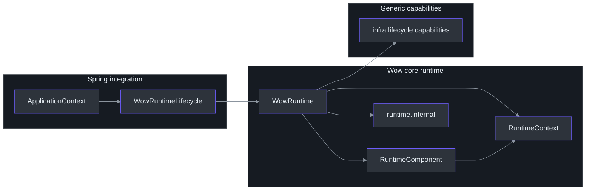
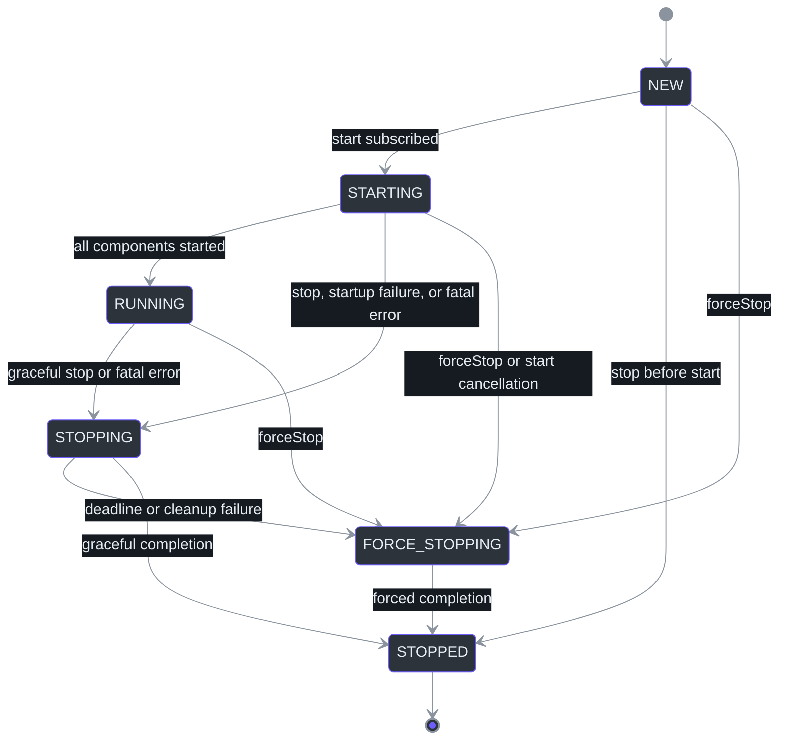
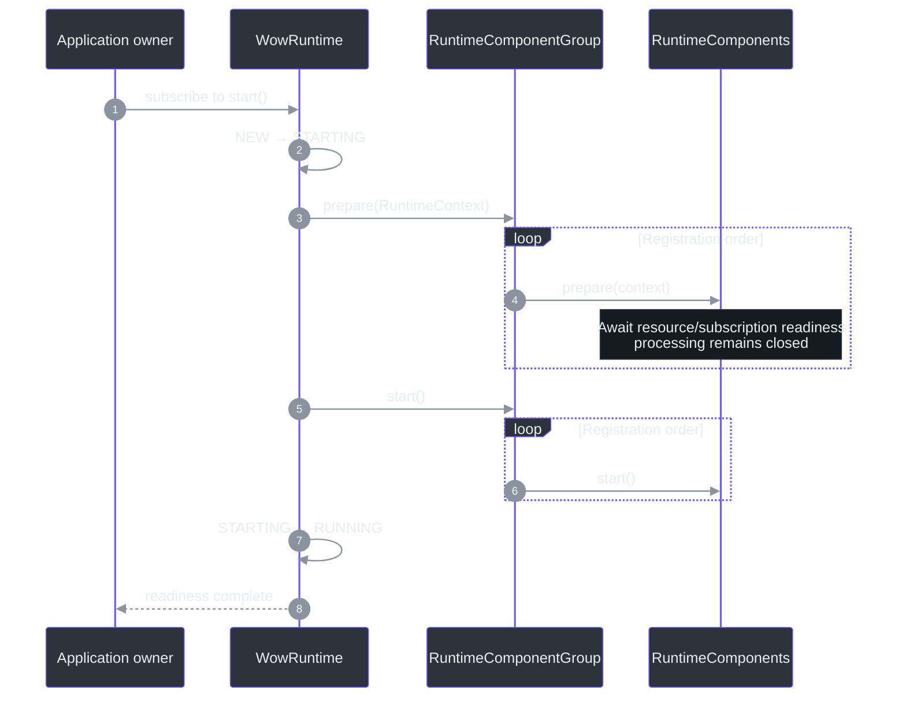
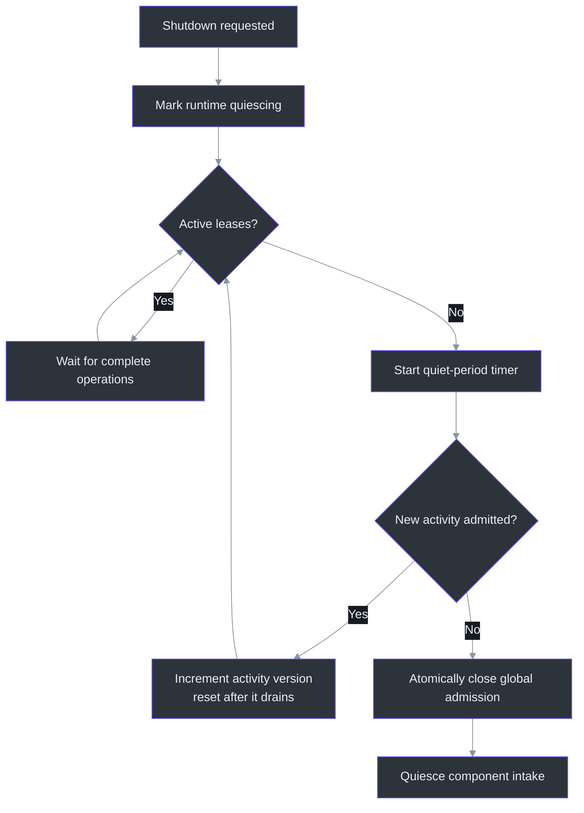
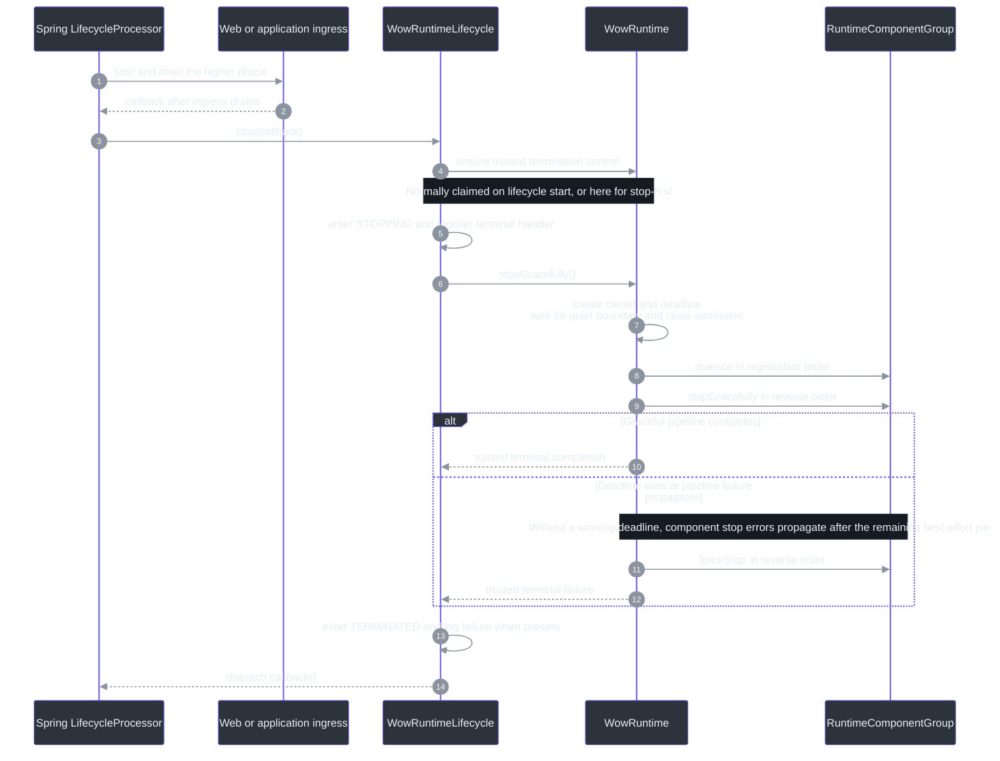

# Runtime Lifecycle

## Overview

A Wow application is not a collection of independently stoppable dispatchers. Commands,
events, projections, snapshots, and sagas form one processing graph: work admitted by one
component can create tail work in another. `WowRuntime` therefore owns the graph as one
one-shot lifecycle, with one readiness barrier, one activity boundary, one shutdown
deadline, and one terminal result.
[`WowRuntime.kt:40-55`](https://github.com/Ahoo-Wang/Wow/blob/main/wow-core/src/main/kotlin/me/ahoo/wow/runtime/WowRuntime.kt#L40-L55)
[`2026-07-28-runtime-orchestration.md:93-121`](https://github.com/Ahoo-Wang/Wow/blob/main/document/design/2026-07-28-runtime-orchestration.md#L93-L121)

| Concern | Runtime guarantee | Source |
|---|---|---|
| Ownership | One `WowRuntime` owns all registered `RuntimeComponent` instances | [`WowRuntime.kt:113-131`](https://github.com/Ahoo-Wang/Wow/blob/main/wow-core/src/main/kotlin/me/ahoo/wow/runtime/WowRuntime.kt#L113-L131) |
| Readiness | Every component completes `prepare` before any component enters `start` | [`WowRuntime.kt:206-233`](https://github.com/Ahoo-Wang/Wow/blob/main/wow-core/src/main/kotlin/me/ahoo/wow/runtime/WowRuntime.kt#L206-L233) |
| In-flight work | A `RuntimeActivity` lease represents one complete asynchronous operation | [`RuntimeContext.kt:16-45`](https://github.com/Ahoo-Wang/Wow/blob/main/wow-core/src/main/kotlin/me/ahoo/wow/runtime/RuntimeContext.kt#L16-L45) |
| Graceful shutdown | Global admission closes after a stable idle period; components then quiesce and stop | [`WowRuntime.kt:496-524`](https://github.com/Ahoo-Wang/Wow/blob/main/wow-core/src/main/kotlin/me/ahoo/wow/runtime/WowRuntime.kt#L496-L524) |
| Deadline | One timeout bounds the complete runtime shutdown and triggers force-stop | [`WowRuntime.kt:400-458`](https://github.com/Ahoo-Wang/Wow/blob/main/wow-core/src/main/kotlin/me/ahoo/wow/runtime/WowRuntime.kt#L400-L458) |
| Failure | A fatal component error enters the same complete-runtime shutdown path | [`WowRuntime.kt:461-494`](https://github.com/Ahoo-Wang/Wow/blob/main/wow-core/src/main/kotlin/me/ahoo/wow/runtime/WowRuntime.kt#L461-L494) |
| Spring | One `WowRuntimeLifecycle` bridges the runtime to Spring `SmartLifecycle` | [`WowRuntimeLifecycle.kt:27-44`](https://github.com/Ahoo-Wang/Wow/blob/main/wow-spring/src/main/kotlin/me/ahoo/wow/spring/WowRuntimeLifecycle.kt#L27-L44) |

## Architecture

### One owner, narrow boundaries

The public orchestration API and `WowRuntime`'s private whole-runtime state and policy
live in `me.ahoo.wow.runtime`. Reusable admission, component-composition,
execution-resource, and terminal-delivery mechanisms stay in
`me.ahoo.wow.runtime.internal`. Generic graceful-shutdown and terminal-observation
capabilities remain in `me.ahoo.wow.infra.lifecycle`, while Spring only supplies the
composition root and lifecycle bridge. This keeps policy in the runtime without turning
low-level resource capabilities into a second lifecycle model.
[`RuntimeComponent.kt:14-35`](https://github.com/Ahoo-Wang/Wow/blob/main/wow-core/src/main/kotlin/me/ahoo/wow/runtime/RuntimeComponent.kt#L14-L35)
[`WowRuntime.kt:93-149`](https://github.com/Ahoo-Wang/Wow/blob/main/wow-core/src/main/kotlin/me/ahoo/wow/runtime/WowRuntime.kt#L93-L149)
[`GracefullyStoppable.kt:14-37`](https://github.com/Ahoo-Wang/Wow/blob/main/wow-core/src/main/kotlin/me/ahoo/wow/infra/lifecycle/GracefullyStoppable.kt#L14-L37)
[`TerminatedSignalCapable.kt:14-26`](https://github.com/Ahoo-Wang/Wow/blob/main/wow-core/src/main/kotlin/me/ahoo/wow/infra/lifecycle/TerminatedSignalCapable.kt#L14-L26)



<!-- Sources: wow-core/src/main/kotlin/me/ahoo/wow/runtime/RuntimeComponent.kt:14-62, wow-core/src/main/kotlin/me/ahoo/wow/runtime/WowRuntime.kt:40-55, wow-core/src/main/kotlin/me/ahoo/wow/runtime/WowRuntime.kt:93-149, wow-spring/src/main/kotlin/me/ahoo/wow/spring/WowRuntimeLifecycle.kt:27-44, wow-core/src/main/kotlin/me/ahoo/wow/infra/lifecycle/GracefullyStoppable.kt:14-37, wow-core/src/main/kotlin/me/ahoo/wow/infra/lifecycle/TerminatedSignalCapable.kt:14-26 -->

| Boundary | Responsibility | Must not own | Source |
|---|---|---|---|
| `me.ahoo.wow.runtime` | Public runtime contracts plus private whole-runtime state and orchestration policy | Spring container policy or storage/transport details | [`WowRuntime.kt:93-149`](https://github.com/Ahoo-Wang/Wow/blob/main/wow-core/src/main/kotlin/me/ahoo/wow/runtime/WowRuntime.kt#L93-L149) [`WowRuntime.kt:316-458`](https://github.com/Ahoo-Wang/Wow/blob/main/wow-core/src/main/kotlin/me/ahoo/wow/runtime/WowRuntime.kt#L316-L458) |
| `me.ahoo.wow.runtime.internal` | Reusable admission, component-composition, execution-resource, terminal-delivery, and failure mechanisms | Public extension APIs or whole-runtime policy | [`DefaultRuntimeContext.kt:30-61`](https://github.com/Ahoo-Wang/Wow/blob/main/wow-core/src/main/kotlin/me/ahoo/wow/runtime/internal/DefaultRuntimeContext.kt#L30-L61) [`RuntimeComponentGroup.kt:25-40`](https://github.com/Ahoo-Wang/Wow/blob/main/wow-core/src/main/kotlin/me/ahoo/wow/runtime/internal/RuntimeComponentGroup.kt#L25-L40) |
| `me.ahoo.wow.infra.lifecycle` | Reusable graceful-shutdown and terminal-observation capabilities | Startup, readiness, ordering, or orchestration ownership | [`GracefullyStoppable.kt:19-37`](https://github.com/Ahoo-Wang/Wow/blob/main/wow-core/src/main/kotlin/me/ahoo/wow/infra/lifecycle/GracefullyStoppable.kt#L19-L37) [`TerminatedSignalCapable.kt:18-26`](https://github.com/Ahoo-Wang/Wow/blob/main/wow-core/src/main/kotlin/me/ahoo/wow/infra/lifecycle/TerminatedSignalCapable.kt#L18-L26) |
| `me.ahoo.wow.spring` | Spring `SmartLifecycle` adapter | Component discovery or core runtime state | [`WowRuntimeLifecycle.kt:27-44`](https://github.com/Ahoo-Wang/Wow/blob/main/wow-spring/src/main/kotlin/me/ahoo/wow/spring/WowRuntimeLifecycle.kt#L27-L44) |
| Starter auto-configuration | Discover, validate, order, and compose local component beans | A second lifecycle for each component | [`WowAutoConfiguration.kt:105-221`](https://github.com/Ahoo-Wang/Wow/blob/main/wow-spring-boot-starter/src/main/kotlin/me/ahoo/wow/spring/boot/starter/WowAutoConfiguration.kt#L105-L221) |

## Components

### `RuntimeComponent` contract

`RuntimeComponent` is deliberately small. Construction must remain inert, and all
runtime-owned resource acquisition starts at `prepare` or `start`. It does not extend
`AutoCloseable`, preventing containers from inferring an independent destroy lifecycle.
[`RuntimeComponent.kt:18-35`](https://github.com/Ahoo-Wang/Wow/blob/main/wow-core/src/main/kotlin/me/ahoo/wow/runtime/RuntimeComponent.kt#L18-L35)

```kotlin
interface RuntimeComponent {
    fun prepare(runtimeContext: RuntimeContext): Mono<Void>
    fun start()
    fun quiesce() = Unit
    fun stopGracefully(): Mono<Void>
    fun forceStop()
}
```

| Method | Responsibility | Required behavior | Source |
|---|---|---|---|
| `prepare` | Acquire subscriptions/resources without opening processing | Return a `Mono` that completes only when admitted work can be retained without loss; terminate promptly after `forceStop` | [`RuntimeComponent.kt:34-43`](https://github.com/Ahoo-Wang/Wow/blob/main/wow-core/src/main/kotlin/me/ahoo/wow/runtime/RuntimeComponent.kt#L34-L43) |
| `start` | Open processing after the group-wide readiness barrier | Do not depend on a later component still being unprepared | [`RuntimeComponentGroup.kt:79-94`](https://github.com/Ahoo-Wang/Wow/blob/main/wow-core/src/main/kotlin/me/ahoo/wow/runtime/internal/RuntimeComponentGroup.kt#L79-L94) |
| `quiesce` | Close component intake after global admission closes | Prompt, non-blocking, and idempotent | [`RuntimeComponent.kt:47-54`](https://github.com/Ahoo-Wang/Wow/blob/main/wow-core/src/main/kotlin/me/ahoo/wow/runtime/RuntimeComponent.kt#L47-L54) |
| `stopGracefully` | Drain admitted work and release resources | Return completion as `Mono<Void>` | [`RuntimeComponent.kt:56`](https://github.com/Ahoo-Wang/Wow/blob/main/wow-core/src/main/kotlin/me/ahoo/wow/runtime/RuntimeComponent.kt#L56) |
| `forceStop` | Promptly release resources when graceful shutdown loses | Non-blocking, idempotent, safe before `prepare`, and safe when repeated | [`RuntimeComponent.kt:18-29`](https://github.com/Ahoo-Wang/Wow/blob/main/wow-core/src/main/kotlin/me/ahoo/wow/runtime/RuntimeComponent.kt#L18-L29) |

### Runtime state

The runtime is one-shot. `start()` can enter the lifecycle only from `NEW`; once shutdown
begins, the application must create a new runtime (or a new Spring
`ApplicationContext`) instead of restarting the old one.
[`WowRuntime.kt:93-100`](https://github.com/Ahoo-Wang/Wow/blob/main/wow-core/src/main/kotlin/me/ahoo/wow/runtime/WowRuntime.kt#L93-L100)
[`WowRuntime.kt:206-212`](https://github.com/Ahoo-Wang/Wow/blob/main/wow-core/src/main/kotlin/me/ahoo/wow/runtime/WowRuntime.kt#L206-L212)



<!-- Sources: wow-core/src/main/kotlin/me/ahoo/wow/runtime/WowRuntime.kt:93-109, wow-core/src/main/kotlin/me/ahoo/wow/runtime/WowRuntime.kt:188-245, wow-core/src/main/kotlin/me/ahoo/wow/runtime/WowRuntime.kt:316-398, wow-core/src/main/kotlin/me/ahoo/wow/runtime/WowRuntime.kt:461-494 -->

## Data Flow

### Startup readiness barrier

`WowRuntime.start()` is a cold `Mono<Void>`: callers must subscribe or block. On
subscription, the runtime sequentially awaits every component's asynchronous `prepare`
completion and only then starts them in registration order. If startup fails, entered
components are cleaned up in reverse order under the runtime deadline. Cancelling the
startup subscription aborts and force-stops the one-shot runtime before propagating
cancellation to the in-flight preparation publisher.
[`WowRuntime.kt:188-245`](https://github.com/Ahoo-Wang/Wow/blob/main/wow-core/src/main/kotlin/me/ahoo/wow/runtime/WowRuntime.kt#L188-L245)
[`RuntimeComponentGroup.kt:42-115`](https://github.com/Ahoo-Wang/Wow/blob/main/wow-core/src/main/kotlin/me/ahoo/wow/runtime/internal/RuntimeComponentGroup.kt#L42-L115)



<!-- Sources: wow-core/src/main/kotlin/me/ahoo/wow/runtime/WowRuntime.kt:188-233, wow-core/src/main/kotlin/me/ahoo/wow/runtime/internal/RuntimeComponentGroup.kt:42-94, wow-core/src/main/kotlin/me/ahoo/wow/messaging/dispatcher/AggregateDispatcher.kt:206-221, wow-core/src/main/kotlin/me/ahoo/wow/messaging/dispatcher/AggregateDispatcher.kt:278-290 -->

`MessageReceiver` makes transport readiness explicit without introducing a second
lifecycle: it carries one single-use message stream plus a hot, replayable readiness
signal. A dispatcher subscribes the message stream first, keeps downstream processing
closed, and then awaits readiness from `prepare`. Only the global `start` pass opens
processing.

| Transport | Readiness boundary |
|---|---|
| Synchronous/in-memory | The message subscription is installed behind the dispatcher demand gate |
| Redis Streams | Every `XGROUP CREATE ... $ MKSTREAM` has succeeded or returned `BUSYGROUP`; stream reads remain closed until processing demand opens, so readiness does not create PEL entries |
| Kafka | Assignment has run after user customizers, every assigned fetch position is resolved, and each position without an existing group offset is synchronously committed; existing offsets are not advanced |

This separates “the transport can retain new work” from “the dispatcher may process
work.” Kafka may poll internally to establish assignment and persist the initial
retention boundary even while the dispatcher gate is closed; the contract does not
require every transport's internal demand to remain zero. Provision Kafka topics before
runtime startup; readiness coordinates consumers, not deployment-time topic creation.
[`MessageReceiver.kt:20-49`](https://github.com/Ahoo-Wang/Wow/blob/main/wow-core/src/main/kotlin/me/ahoo/wow/messaging/MessageReceiver.kt#L20-L49)
[`AggregateDispatcher.kt:206-221`](https://github.com/Ahoo-Wang/Wow/blob/main/wow-core/src/main/kotlin/me/ahoo/wow/messaging/dispatcher/AggregateDispatcher.kt#L206-L221)
[`AggregateDispatcher.kt:278-290`](https://github.com/Ahoo-Wang/Wow/blob/main/wow-core/src/main/kotlin/me/ahoo/wow/messaging/dispatcher/AggregateDispatcher.kt#L278-L290)
[`2026-07-28-runtime-orchestration.md:81-100`](https://github.com/Ahoo-Wang/Wow/blob/main/document/design/2026-07-28-runtime-orchestration.md#L81-L100)

### Activity leases and the quiet boundary

Before accepting a complete asynchronous operation, a component calls
`RuntimeContext.tryAcquire()`. A non-null lease stays open until its operation chain
terminates; downstream tail work is represented by its own leases. Once admission
closes, `tryAcquire()` returns `null`.
[`RuntimeContext.kt:16-45`](https://github.com/Ahoo-Wang/Wow/blob/main/wow-core/src/main/kotlin/me/ahoo/wow/runtime/RuntimeContext.kt#L16-L45)
[`AggregateDispatcher.kt:229-271`](https://github.com/Ahoo-Wang/Wow/blob/main/wow-core/src/main/kotlin/me/ahoo/wow/messaging/dispatcher/AggregateDispatcher.kt#L229-L271)



<!-- Sources: wow-core/src/main/kotlin/me/ahoo/wow/runtime/internal/DefaultRuntimeContext.kt:30-37, wow-core/src/main/kotlin/me/ahoo/wow/runtime/internal/DefaultRuntimeContext.kt:74-151, wow-core/src/main/kotlin/me/ahoo/wow/runtime/internal/DefaultRuntimeContext.kt:171-227 -->

During the quiet window the runtime still admits tail work. Each admitted operation
changes an activity version, so an older timer cannot close admission after newer work
arrives. Admission is closed atomically only after the runtime remains idle for the
complete `shutdown-quiet-period`.
[`DefaultRuntimeContext.kt:74-118`](https://github.com/Ahoo-Wang/Wow/blob/main/wow-core/src/main/kotlin/me/ahoo/wow/runtime/internal/DefaultRuntimeContext.kt#L74-L118)
[`DefaultRuntimeContext.kt:171-227`](https://github.com/Ahoo-Wang/Wow/blob/main/wow-core/src/main/kotlin/me/ahoo/wow/runtime/internal/DefaultRuntimeContext.kt#L171-L227)
[`2026-07-28-runtime-orchestration.md:102-125`](https://github.com/Ahoo-Wang/Wow/blob/main/document/design/2026-07-28-runtime-orchestration.md#L102-L125)

### Graceful and forced shutdown

On the normal Spring path, later ingress phases stop and drain before
`WowRuntimeLifecycle` asks the runtime to stop. The lifecycle bridge claims the trusted
termination-control channel on its first start or stop operation and invokes
`stopGracefully`; its Spring callback runs only after the runtime publishes the sealed
terminal result. Standalone applications enter the same sequence directly at
`WowRuntime.stopGracefully()` or `stop()`.
[`WowRuntimeLifecycle.kt:27-44`](https://github.com/Ahoo-Wang/Wow/blob/main/wow-spring/src/main/kotlin/me/ahoo/wow/spring/WowRuntimeLifecycle.kt#L27-L44)
[`WowRuntimeLifecycle.kt:211-258`](https://github.com/Ahoo-Wang/Wow/blob/main/wow-spring/src/main/kotlin/me/ahoo/wow/spring/WowRuntimeLifecycle.kt#L211-L258)

The first stop request from a running runtime creates one shutdown owner and one absolute
deadline. The graceful pipeline waits for the global quiet boundary, invokes component
`quiesce` in registration order, and subscribes to `stopGracefully` in reverse order.
Deadline expiry immediately takes ownership, closes admission, and cancels the graceful
owner before force cleanup. A component graceful-stop failure is recorded while the
shutdown owner remains active, and the remaining lifecycle-entered components are still
attempted; only after that best-effort pass does the failure propagate to force cleanup.
[`WowRuntime.kt:400-458`](https://github.com/Ahoo-Wang/Wow/blob/main/wow-core/src/main/kotlin/me/ahoo/wow/runtime/WowRuntime.kt#L400-L458)
[`WowRuntime.kt:496-545`](https://github.com/Ahoo-Wang/Wow/blob/main/wow-core/src/main/kotlin/me/ahoo/wow/runtime/WowRuntime.kt#L496-L545)
[`RuntimeComponentGroup.kt:64-115`](https://github.com/Ahoo-Wang/Wow/blob/main/wow-core/src/main/kotlin/me/ahoo/wow/runtime/internal/RuntimeComponentGroup.kt#L64-L115)

| Stage | Ordering and completion boundary | Source |
|---|---|---|
| Spring ingress | Higher lifecycle phases stop and drain before the runtime phase | [`WowRuntimeLifecycle.kt:27-38`](https://github.com/Ahoo-Wang/Wow/blob/main/wow-spring/src/main/kotlin/me/ahoo/wow/spring/WowRuntimeLifecycle.kt#L27-L38) |
| Global quiet boundary | Tail work remains admissible; every new activity invalidates the older quiet-period observation | [`DefaultRuntimeContext.kt:74-151`](https://github.com/Ahoo-Wang/Wow/blob/main/wow-core/src/main/kotlin/me/ahoo/wow/runtime/internal/DefaultRuntimeContext.kt#L74-L151) |
| Component quiescence | `quiesce` closes component intake synchronously in registration order after global admission closes | [`RuntimeComponentGroup.kt:64-76`](https://github.com/Ahoo-Wang/Wow/blob/main/wow-core/src/main/kotlin/me/ahoo/wow/runtime/internal/RuntimeComponentGroup.kt#L64-L76) |
| Graceful cleanup | Lifecycle-entered components stop sequentially in reverse registration order; while the shutdown owner remains active, a component error is retained and the remaining pass continues | [`RuntimeComponentGroup.kt:96-168`](https://github.com/Ahoo-Wang/Wow/blob/main/wow-core/src/main/kotlin/me/ahoo/wow/runtime/internal/RuntimeComponentGroup.kt#L96-L168) |
| Forced cleanup | A deadline immediately takes ownership; another pipeline failure enters force cleanup when it propagates. The force pass visits registered components in reverse order | [`WowRuntime.kt:431-458`](https://github.com/Ahoo-Wang/Wow/blob/main/wow-core/src/main/kotlin/me/ahoo/wow/runtime/WowRuntime.kt#L431-L458) [`WowRuntime.kt:496-545`](https://github.com/Ahoo-Wang/Wow/blob/main/wow-core/src/main/kotlin/me/ahoo/wow/runtime/WowRuntime.kt#L496-L545) [`RuntimeComponentGroup.kt:170-186`](https://github.com/Ahoo-Wang/Wow/blob/main/wow-core/src/main/kotlin/me/ahoo/wow/runtime/internal/RuntimeComponentGroup.kt#L170-L186) |



<!-- Sources: wow-spring/src/main/kotlin/me/ahoo/wow/spring/WowRuntimeLifecycle.kt:27-44, wow-spring/src/main/kotlin/me/ahoo/wow/spring/WowRuntimeLifecycle.kt:211-258, wow-core/src/main/kotlin/me/ahoo/wow/runtime/WowRuntime.kt:316-458, wow-core/src/main/kotlin/me/ahoo/wow/runtime/WowRuntime.kt:496-586, wow-core/src/main/kotlin/me/ahoo/wow/runtime/internal/RuntimeComponentGroup.kt:64-187 -->

Both successful and failed normal Spring shutdowns eventually dispatch the stop
callback. Because the bridge enters `STOPPING` before requesting runtime shutdown, that
completion is not classified as unexpected termination; only termination observed while
the bridge is still `RUNNING` invokes `onUnexpectedTermination`. Spring completion is
driven by the trusted control channel, not by public `terminationSignal` observers.
[`WowRuntimeLifecycle.kt:121-165`](https://github.com/Ahoo-Wang/Wow/blob/main/wow-spring/src/main/kotlin/me/ahoo/wow/spring/WowRuntimeLifecycle.kt#L121-L165)
[`WowRuntimeLifecycle.kt:226-258`](https://github.com/Ahoo-Wang/Wow/blob/main/wow-spring/src/main/kotlin/me/ahoo/wow/spring/WowRuntimeLifecycle.kt#L226-L258)
[`WowRuntime.kt:135-185`](https://github.com/Ahoo-Wang/Wow/blob/main/wow-core/src/main/kotlin/me/ahoo/wow/runtime/WowRuntime.kt#L135-L185)

## Failure and Concurrency Semantics

| Scenario | Result | Source |
|---|---|---|
| Startup action fails | Runtime rolls back lifecycle-entered components and publishes the startup failure | [`WowRuntime.kt:235-295`](https://github.com/Ahoo-Wang/Wow/blob/main/wow-core/src/main/kotlin/me/ahoo/wow/runtime/WowRuntime.kt#L235-L295) |
| Component reports a fatal pipeline error | The complete runtime enters shutdown; it is not isolated to one dispatcher | [`WowRuntime.kt:461-494`](https://github.com/Ahoo-Wang/Wow/blob/main/wow-core/src/main/kotlin/me/ahoo/wow/runtime/WowRuntime.kt#L461-L494) |
| Deadline expires | A `TimeoutException` becomes failure evidence and force-stop takes ownership | [`WowRuntime.kt:431-458`](https://github.com/Ahoo-Wang/Wow/blob/main/wow-core/src/main/kotlin/me/ahoo/wow/runtime/WowRuntime.kt#L431-L458) |
| Force-stop overlaps a lifecycle action | Runtime performs an initial force pass and one compensation pass after the action leaves | [`RuntimeComponentGroup.kt:248-340`](https://github.com/Ahoo-Wang/Wow/blob/main/wow-core/src/main/kotlin/me/ahoo/wow/runtime/internal/RuntimeComponentGroup.kt#L248-L340) |
| Multiple cleanup failures occur | First failure remains primary; later failures are suppressed until terminal publication seals it | [`SealableFailureAccumulator.kt:18-59`](https://github.com/Ahoo-Wang/Wow/blob/main/wow-core/src/main/kotlin/me/ahoo/wow/runtime/internal/SealableFailureAccumulator.kt#L18-L59) |
| Public termination observers are slow or saturated | Observer delivery is bounded and isolated from runtime completion | [`TerminalSignal.kt:33-70`](https://github.com/Ahoo-Wang/Wow/blob/main/wow-core/src/main/kotlin/me/ahoo/wow/runtime/internal/TerminalSignal.kt#L33-L70) |

`forceStop()` can race with `prepare`, `start`, `quiesce`, or a cold graceful publisher.
That is why a component's force cleanup must be safe before preparation and across
repeated calls. The runtime's second compensation pass covers resources acquired after
the first force call returned.
[`RuntimeComponent.kt:18-29`](https://github.com/Ahoo-Wang/Wow/blob/main/wow-core/src/main/kotlin/me/ahoo/wow/runtime/RuntimeComponent.kt#L18-L29)
[`RuntimeComponentGroup.kt:248-255`](https://github.com/Ahoo-Wang/Wow/blob/main/wow-core/src/main/kotlin/me/ahoo/wow/runtime/internal/RuntimeComponentGroup.kt#L248-L255)

## Spring Integration

The Starter discovers `RuntimeComponent` beans from the current bean factory, requires
them to be singletons, obtains the Spring-exposed instance, and rejects competing Spring
`Lifecycle` or standard destruction ownership. It then sorts the result using Spring
ordering and passes one immutable list to `WowRuntime`.
[`WowAutoConfiguration.kt:105-221`](https://github.com/Ahoo-Wang/Wow/blob/main/wow-spring-boot-starter/src/main/kotlin/me/ahoo/wow/spring/boot/starter/WowAutoConfiguration.kt#L105-L221)

| Spring rule | Effect | Source |
|---|---|---|
| `WowRuntime` is the exclusive component owner | A direct runtime component bean must not also use Spring `Lifecycle`, `DisposableBean`, destruction callbacks, or an enabled destroy method; put runtime-owned cleanup in its component hooks | [`WowAutoConfiguration.kt:140-221`](https://github.com/Ahoo-Wang/Wow/blob/main/wow-spring-boot-starter/src/main/kotlin/me/ahoo/wow/spring/boot/starter/WowAutoConfiguration.kt#L140-L221) |
| Runtime phase is `DEFAULT_PHASE - 3072` | Runtime starts before later ingress phases and stops after they drain | [`WowRuntimeLifecycle.kt:27-40`](https://github.com/Ahoo-Wang/Wow/blob/main/wow-spring/src/main/kotlin/me/ahoo/wow/spring/WowRuntimeLifecycle.kt#L27-L40) |
| Unexpected runtime termination closes the context | Fatal data-plane failure cannot leave application ingress running | [`WowAutoConfiguration.kt:129-137`](https://github.com/Ahoo-Wang/Wow/blob/main/wow-spring-boot-starter/src/main/kotlin/me/ahoo/wow/spring/boot/starter/WowAutoConfiguration.kt#L129-L137) |
| A `DefaultLifecycleProcessor` uses the selected `WowRuntime.shutdownTimeout` plus one second for the runtime phase | Spring gives the actual runtime deadline a completion margin; another custom processor retains its own timeout policy | [`WowRuntimeSpringLifecycle.kt:20-27`](https://github.com/Ahoo-Wang/Wow/blob/main/wow-spring-boot-starter/src/main/kotlin/me/ahoo/wow/spring/boot/starter/WowRuntimeSpringLifecycle.kt#L20-L27) [`WowAutoConfiguration.kt:66-80`](https://github.com/Ahoo-Wang/Wow/blob/main/wow-spring-boot-starter/src/main/kotlin/me/ahoo/wow/spring/boot/starter/WowAutoConfiguration.kt#L66-L80) |
| Lifecycle is one-shot | Recreate `ApplicationContext` after shutdown instead of restarting | [`WowRuntimeLifecycle.kt:77-137`](https://github.com/Ahoo-Wang/Wow/blob/main/wow-spring/src/main/kotlin/me/ahoo/wow/spring/WowRuntimeLifecycle.kt#L77-L137) |

Built-in components use deterministic Spring order values. Preparation and startup use
this order; graceful and forced cleanup reverse it.
[`WowRuntimeComponentOrder.kt:16-29`](https://github.com/Ahoo-Wang/Wow/blob/main/wow-spring-boot-starter/src/main/kotlin/me/ahoo/wow/spring/boot/starter/WowRuntimeComponentOrder.kt#L16-L29)
[`RuntimeComponentGroup.kt:96-115`](https://github.com/Ahoo-Wang/Wow/blob/main/wow-core/src/main/kotlin/me/ahoo/wow/runtime/internal/RuntimeComponentGroup.kt#L96-L115)
[`RuntimeComponentGroup.kt:170-186`](https://github.com/Ahoo-Wang/Wow/blob/main/wow-core/src/main/kotlin/me/ahoo/wow/runtime/internal/RuntimeComponentGroup.kt#L170-L186)

| Order | Built-in component | Source |
|---:|---|---|
| 100 | Command dispatcher | [`WowRuntimeComponentOrder.kt:23-24`](https://github.com/Ahoo-Wang/Wow/blob/main/wow-spring-boot-starter/src/main/kotlin/me/ahoo/wow/spring/boot/starter/WowRuntimeComponentOrder.kt#L23-L24) |
| 200 | Event dispatcher | [`WowRuntimeComponentOrder.kt:25`](https://github.com/Ahoo-Wang/Wow/blob/main/wow-spring-boot-starter/src/main/kotlin/me/ahoo/wow/spring/boot/starter/WowRuntimeComponentOrder.kt#L25) |
| 300 | Projection dispatcher | [`WowRuntimeComponentOrder.kt:26`](https://github.com/Ahoo-Wang/Wow/blob/main/wow-spring-boot-starter/src/main/kotlin/me/ahoo/wow/spring/boot/starter/WowRuntimeComponentOrder.kt#L26) |
| 400 | Stateless saga dispatcher | [`WowRuntimeComponentOrder.kt:27`](https://github.com/Ahoo-Wang/Wow/blob/main/wow-spring-boot-starter/src/main/kotlin/me/ahoo/wow/spring/boot/starter/WowRuntimeComponentOrder.kt#L27) |
| 500 | Snapshot dispatcher | [`WowRuntimeComponentOrder.kt:28`](https://github.com/Ahoo-Wang/Wow/blob/main/wow-spring-boot-starter/src/main/kotlin/me/ahoo/wow/spring/boot/starter/WowRuntimeComponentOrder.kt#L28) |

## Configuration and Operations

```yaml
wow:
  shutdown-timeout: 60s
  shutdown-quiet-period: 1s
```

| Property | Default | Meaning | Constraint | Source |
|---|---:|---|---|---|
| `wow.shutdown-timeout` | `60s` | One deadline for quiescing and stopping the complete runtime | Positive | [`WowProperties.kt:23-34`](https://github.com/Ahoo-Wang/Wow/blob/main/wow-spring-boot-starter/src/main/kotlin/me/ahoo/wow/spring/boot/starter/WowProperties.kt#L23-L34) |
| `wow.shutdown-quiet-period` | `1s` | Required stable idle window before global admission closes | Non-negative and strictly shorter than the timeout | [`WowRuntime.kt:102-109`](https://github.com/Ahoo-Wang/Wow/blob/main/wow-core/src/main/kotlin/me/ahoo/wow/runtime/WowRuntime.kt#L102-L109) |

Both values must fit in signed 64-bit nanoseconds.
[`DurationValidation.kt:18-25`](https://github.com/Ahoo-Wang/Wow/blob/main/wow-core/src/main/kotlin/me/ahoo/wow/runtime/internal/DurationValidation.kt#L18-L25)

When an application supplies a custom `WowRuntime`, Spring's runtime-phase timeout is
derived from that selected bean's `shutdownTimeout`, even if it differs from the bound
`wow.shutdown-timeout` property.

`WowRuntime.stop(timeout)` changes only how long that caller waits. It does not replace
or extend `wow.shutdown-timeout`; runtime shutdown still has one configured deadline.
[`WowRuntime.kt:297-314`](https://github.com/Ahoo-Wang/Wow/blob/main/wow-core/src/main/kotlin/me/ahoo/wow/runtime/WowRuntime.kt#L297-L314)

Unlike cold `start()`, calling `stopGracefully()` immediately initiates or joins shutdown.
The first call from `STARTING` or `RUNNING` claims the single shutdown owner and deadline;
`NEW` completes without starting, while later calls observe the existing terminal result.
[`WowRuntime.kt:316-352`](https://github.com/Ahoo-Wang/Wow/blob/main/wow-core/src/main/kotlin/me/ahoo/wow/runtime/WowRuntime.kt#L316-L352)

::: tip Operational tuning
Choose the quiet period from observed handoff jitter between connected processing stages,
then size the global timeout to include that quiet window plus worst-case draining and
resource cleanup. This is operational guidance inferred from the implemented shared
deadline and activity-version model, not a second timeout policy.
:::

## Implementing a Custom Component

Use a separate `RuntimeComponent` when an extension participates in runtime readiness,
global activity, fatal-error propagation, and the shared shutdown policy. Keep a
standalone resource in its owning module and implement only the narrow
`GracefullyStoppable` or `TerminatedSignalCapable` capability when needed.

```kotlin
class CustomRuntimeComponent : RuntimeComponent {
    private lateinit var runtimeContext: RuntimeContext

    override fun prepare(runtimeContext: RuntimeContext): Mono<Void> {
        this.runtimeContext = runtimeContext
        // Complete only after readiness; keep processing closed until start.
        return subscribeAndAwaitReadiness()
    }

    override fun start() {
        // Open processing only after every component is prepared.
    }

    override fun quiesce() {
        // Promptly and synchronously close intake.
    }

    override fun stopGracefully(): Mono<Void> {
        // Drain admitted work and release resources.
        return Mono.empty()
    }

    override fun forceStop() {
        // Prompt, non-blocking, idempotent, and safe before prepare.
    }
}
```

The example is a contract template, not a framework implementation. For asynchronous
work, acquire a lease before acceptance and close it at complete-chain termination.
Reserve `reportFailure` for a fatal component pipeline termination, not an ordinary
business-message error:

```text
activity = runtimeContext.tryAcquire()
if activity is null:
    reject the operation without acknowledging it
else:
    run the complete asynchronous chain
    close activity when the complete chain terminates

on fatal pipeline termination:
    runtimeContext.reportFailure(error)
```

The framework's dispatcher follows this same structure: it acquires before emitting a
tracked exchange, rejects work after admission closes, reports terminal pipeline errors,
and closes the lease exactly once when processing completes.
[`AggregateDispatcher.kt:229-271`](https://github.com/Ahoo-Wang/Wow/blob/main/wow-core/src/main/kotlin/me/ahoo/wow/messaging/dispatcher/AggregateDispatcher.kt#L229-L271)
[`AggregateDispatcher.kt:474-485`](https://github.com/Ahoo-Wang/Wow/blob/main/wow-core/src/main/kotlin/me/ahoo/wow/messaging/dispatcher/AggregateDispatcher.kt#L474-L485)

| Extension check | Why | Source |
|---|---|---|
| Constructor and bean initialization are inert | The runtime must establish ownership before resources exist | [`RuntimeComponent.kt:18-23`](https://github.com/Ahoo-Wang/Wow/blob/main/wow-core/src/main/kotlin/me/ahoo/wow/runtime/RuntimeComponent.kt#L18-L23) |
| `prepare` completes at readiness without opening processing | The barrier must cover the complete component graph and asynchronous transport setup | [`RuntimeComponent.kt:34-43`](https://github.com/Ahoo-Wang/Wow/blob/main/wow-core/src/main/kotlin/me/ahoo/wow/runtime/RuntimeComponent.kt#L34-L43) |
| `quiesce` closes intake promptly | Global admission is already closed when the method is invoked | [`RuntimeComponent.kt:47-54`](https://github.com/Ahoo-Wang/Wow/blob/main/wow-core/src/main/kotlin/me/ahoo/wow/runtime/RuntimeComponent.kt#L47-L54) |
| Every admitted asynchronous operation owns one lease | Quiet detection must represent complete work, not only source publication | [`RuntimeContext.kt:16-45`](https://github.com/Ahoo-Wang/Wow/blob/main/wow-core/src/main/kotlin/me/ahoo/wow/runtime/RuntimeContext.kt#L16-L45) |
| `forceStop` is repeat-safe | Force can overlap any lifecycle action and trigger compensation | [`RuntimeComponent.kt:18-29`](https://github.com/Ahoo-Wang/Wow/blob/main/wow-core/src/main/kotlin/me/ahoo/wow/runtime/RuntimeComponent.kt#L18-L29) |
| Direct Spring bean is a singleton and has no competing Spring lifecycle or destruction owner | Two lifecycle owners can race or clean the same resource twice | [`WowAutoConfiguration.kt:140-221`](https://github.com/Ahoo-Wang/Wow/blob/main/wow-spring-boot-starter/src/main/kotlin/me/ahoo/wow/spring/boot/starter/WowAutoConfiguration.kt#L140-L221) |

## References

| Source | Responsibility |
|---|---|
| [`WowRuntime.kt`](https://github.com/Ahoo-Wang/Wow/blob/main/wow-core/src/main/kotlin/me/ahoo/wow/runtime/WowRuntime.kt) | High-level state machine, shared deadline, failure and terminal result |
| [`RuntimeComponent.kt`](https://github.com/Ahoo-Wang/Wow/blob/main/wow-core/src/main/kotlin/me/ahoo/wow/runtime/RuntimeComponent.kt) | Component lifecycle contract |
| [`RuntimeContext.kt`](https://github.com/Ahoo-Wang/Wow/blob/main/wow-core/src/main/kotlin/me/ahoo/wow/runtime/RuntimeContext.kt) | Activity leases and fatal-error reporting |
| [`DefaultRuntimeContext.kt`](https://github.com/Ahoo-Wang/Wow/blob/main/wow-core/src/main/kotlin/me/ahoo/wow/runtime/internal/DefaultRuntimeContext.kt) | Admission and stable-idle algorithm |
| [`RuntimeComponentGroup.kt`](https://github.com/Ahoo-Wang/Wow/blob/main/wow-core/src/main/kotlin/me/ahoo/wow/runtime/internal/RuntimeComponentGroup.kt) | Ordered lifecycle composition and force compensation |
| [`WowRuntimeLifecycle.kt`](https://github.com/Ahoo-Wang/Wow/blob/main/wow-spring/src/main/kotlin/me/ahoo/wow/spring/WowRuntimeLifecycle.kt) | Spring lifecycle bridge |
| [`WowAutoConfiguration.kt`](https://github.com/Ahoo-Wang/Wow/blob/main/wow-spring-boot-starter/src/main/kotlin/me/ahoo/wow/spring/boot/starter/WowAutoConfiguration.kt) | Starter composition root |

## Related Pages

| Page | Relationship |
|---|---|
| [Architecture](architecture.md) | Places runtime ownership inside the wider Wow module and processing architecture |
| [Configuration](../configuration.md) | Complete Spring Boot property reference |
| [Migration Guide](../migration.md#unified-runtime-orchestration) | Breaking lifecycle changes and extension migration |
| [Aggregate Scheduler](aggregate-scheduler.md) | Graceful and forced disposal of per-aggregate schedulers |
| [Event Bus](event-bus.md) | Message transport participating in runtime activity |
| [Spring Boot Starter](../extensions/spring-boot-starter.md) | Auto-configuration and application integration |
