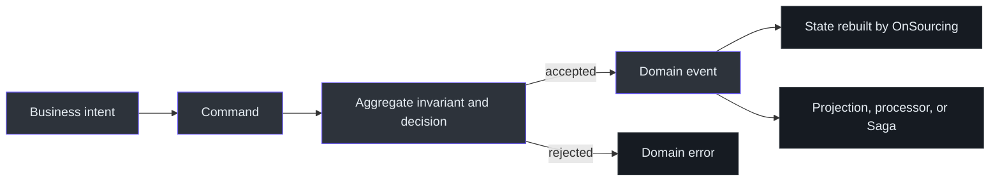
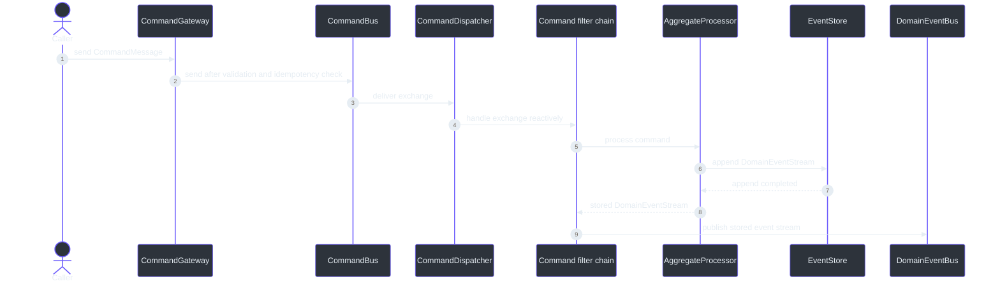
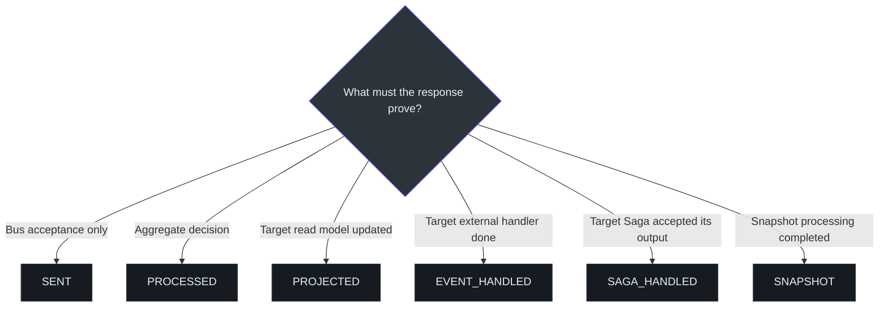
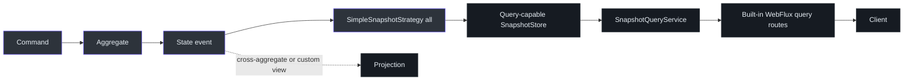
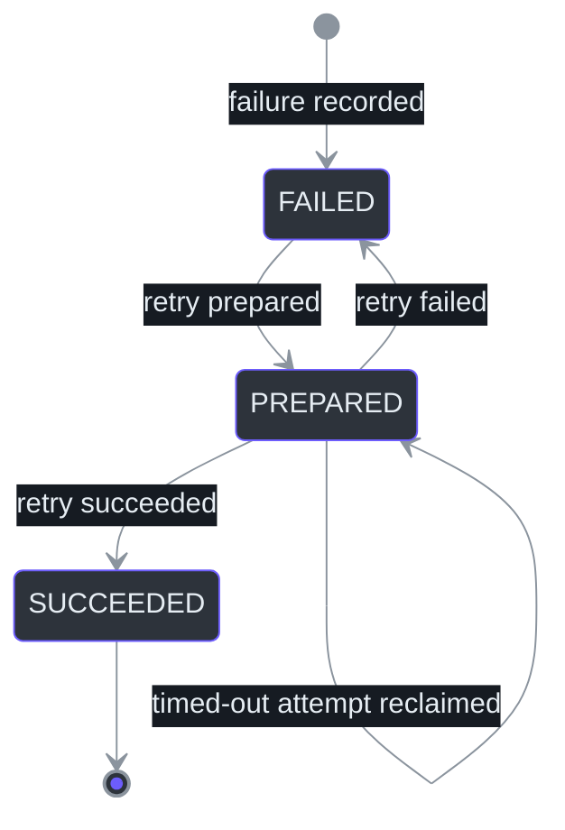

# Production Best Practices

Wow removes much of the infrastructure plumbing around CQRS and event sourcing, but it does not remove the need to choose explicit domain boundaries, consistency targets, and failure policies. This guide turns the framework's current contracts into a production checklist.

## Practice Map

| Concern | Recommended default | Avoid | Source |
|---|---|---|---|
| Domain logic | Validate invariants in command handlers; mutate state only from events | CRUD-style public state mutation | [Cart.kt:38-76](https://github.com/Ahoo-Wang/Wow/blob/main/example/example-domain/src/main/kotlin/me/ahoo/wow/example/domain/cart/Cart.kt#L38-L76), [CartState.kt:23-46](https://github.com/Ahoo-Wang/Wow/blob/main/example/example-domain/src/main/kotlin/me/ahoo/wow/example/domain/cart/CartState.kt#L23-L46) |
| Reactive execution | Keep the full handler and storage path non-blocking | `block()`, blocking I/O, or hidden thread waits in runtime paths | [AggregateProcessorFilter.kt:31-49](https://github.com/Ahoo-Wang/Wow/blob/main/wow-core/src/main/kotlin/me/ahoo/wow/modeling/command/dispatcher/AggregateProcessorFilter.kt#L31-L49) |
| Command results | Wait for the smallest stage that proves the caller's business outcome | Treating `SENT` as successful domain processing | [CommandStage.kt:25-102](https://github.com/Ahoo-Wang/Wow/blob/main/wow-core/src/main/kotlin/me/ahoo/wow/command/wait/CommandStage.kt#L25-L102) |
| Duplicate requests | Reuse a stable `requestId` for the same logical operation | Generating a new request ID for every transport retry | [DefaultCommandGateway.kt:86-118](https://github.com/Ahoo-Wang/Wow/blob/main/wow-core/src/main/kotlin/me/ahoo/wow/command/DefaultCommandGateway.kt#L86-L118) |
| Concurrency | Send `aggregateVersion` when the caller must reject stale writes | Assuming all concurrent business commands are interchangeable | [CommandMessage.kt:85-95](https://github.com/Ahoo-Wang/Wow/blob/main/wow-api/src/main/kotlin/me/ahoo/wow/api/command/CommandMessage.kt#L85-L95) |
| Snapshots | Use `strategy: all` so the latest aggregate state is the default query store | Using `version_offset` while expecting every query to see the latest state | [SnapshotProperties.kt:23-45](https://github.com/Ahoo-Wang/Wow/blob/main/wow-spring-boot-starter/src/main/kotlin/me/ahoo/wow/spring/boot/starter/eventsourcing/snapshot/SnapshotProperties.kt#L23-L45) |
| Query security | Put mandatory conditions in `QueryPolicy`, masking in `ResultPolicy`, and accept authority only from authenticated adapters | Promoting headers/paths to authority or recreating a Filter condition hook | [Query Filter migration](./migration/query-filter-to-query-policy.md) |
| Cross-aggregate work | Use Saga for orchestration and compensation for recoverable failures | Calling Saga completion a distributed transaction commit | [StatelessSagaFunction.kt:57-69](https://github.com/Ahoo-Wang/Wow/blob/main/wow-core/src/main/kotlin/me/ahoo/wow/saga/stateless/StatelessSagaFunction.kt#L57-L69) |

## Model Business Decisions, Not Data Updates

| Element | Responsibility | Rule of thumb | Source |
|---|---|---|---|
| Command | Express intent | Name it after a business action, such as `AddCartItem` | [Cart.kt:40-63](https://github.com/Ahoo-Wang/Wow/blob/main/example/example-domain/src/main/kotlin/me/ahoo/wow/example/domain/cart/Cart.kt#L40-L63) |
| Command aggregate | Enforce invariants and decide facts | Return domain events; do not directly expose mutable state | [Cart.kt:44-60](https://github.com/Ahoo-Wang/Wow/blob/main/example/example-domain/src/main/kotlin/me/ahoo/wow/example/domain/cart/Cart.kt#L44-L60) |
| Domain event | Record an accepted business fact | Use past-tense names such as `CartItemAdded` | [Cart.kt:50-60](https://github.com/Ahoo-Wang/Wow/blob/main/example/example-domain/src/main/kotlin/me/ahoo/wow/example/domain/cart/Cart.kt#L50-L60) |
| State aggregate | Rebuild state deterministically | Apply changes only in `@OnSourcing` functions | [CartState.kt:27-45](https://github.com/Ahoo-Wang/Wow/blob/main/example/example-domain/src/main/kotlin/me/ahoo/wow/example/domain/cart/CartState.kt#L27-L45) |

```mermaid
flowchart LR
    Intent[Business intent] --> Command[Command]
    Command --> Decision[Aggregate invariant and decision]
    Decision -->|accepted| Event[Domain event]
    Decision -->|rejected| Error[Domain error]
    Event --> State[State rebuilt by OnSourcing]
    Event --> Consumers[Projection, processor, or Saga]

    classDef primary fill:#2d333b,stroke:#6d5dfc,color:#e6edf3
    classDef secondary fill:#161b22,stroke:#30363d,color:#e6edf3
    class Intent,Command,Decision,Event primary
    class Error,State,Consumers secondary
```

<!-- Sources: example/example-domain/src/main/kotlin/me/ahoo/wow/example/domain/cart/Cart.kt:38-76, example/example-domain/src/main/kotlin/me/ahoo/wow/example/domain/cart/CartState.kt:23-46 -->

Keep an aggregate as small as the invariant allows. If two concepts do not need one atomic decision, connect them with an event and a Saga instead of growing a shared aggregate. The framework routes each command by `AggregateId`, and the dispatcher creates aggregate-specific processing through the configured scheduler ([CommandDispatcher.kt:37-75](https://github.com/Ahoo-Wang/Wow/blob/main/wow-core/src/main/kotlin/me/ahoo/wow/modeling/command/dispatcher/CommandDispatcher.kt#L37-L75)).

## Preserve the Reactive Boundary

| Layer | Framework contract | Application responsibility | Source |
|---|---|---|---|
| Gateway and bus | `Mono`/`Flux` based dispatch | Compose, do not synchronously wait | [DefaultCommandGateway.kt:129-143](https://github.com/Ahoo-Wang/Wow/blob/main/wow-core/src/main/kotlin/me/ahoo/wow/command/DefaultCommandGateway.kt#L129-L143) |
| Dispatcher | Receives a `Flux` and routes by aggregate | Keep filters non-blocking | [CommandDispatcher.kt:46-75](https://github.com/Ahoo-Wang/Wow/blob/main/wow-core/src/main/kotlin/me/ahoo/wow/modeling/command/dispatcher/CommandDispatcher.kt#L46-L75) |
| Aggregate processing | Chains processing and acknowledgement as `Mono` | Return reactive work instead of hiding I/O | [AggregateProcessorFilter.kt:31-49](https://github.com/Ahoo-Wang/Wow/blob/main/wow-core/src/main/kotlin/me/ahoo/wow/modeling/command/dispatcher/AggregateProcessorFilter.kt#L31-L49) |
| Event store | Appends and loads through `Mono`/`Flux` | Use the provided reactive storage adapters | [EventStore.kt:41-54](https://github.com/Ahoo-Wang/Wow/blob/main/wow-core/src/main/kotlin/me/ahoo/wow/eventsourcing/EventStore.kt#L41-L54) |

```mermaid
%%{init: {"theme":"base","themeVariables":{"primaryColor":"#2d333b","primaryBorderColor":"#6d5dfc","primaryTextColor":"#e6edf3","lineColor":"#8b949e","secondaryColor":"#161b22","tertiaryColor":"#161b22"}}}%%
sequenceDiagram
    autonumber
    actor Caller
    participant Gateway as CommandGateway
    participant Bus as CommandBus
    participant Dispatcher as CommandDispatcher
    participant Handler as Command filter chain
    participant Aggregate as AggregateProcessor
    participant Store as EventStore
    participant EventBus as DomainEventBus

    Caller->>Gateway: send CommandMessage
    Gateway->>Bus: send after validation and idempotency check
    Bus->>Dispatcher: deliver exchange
    Dispatcher->>Handler: handle exchange reactively
    Handler->>Aggregate: process command
    Aggregate->>Store: append DomainEventStream
    Store-->>Aggregate: append completed
    Aggregate-->>Handler: stored DomainEventStream
    Handler->>EventBus: publish stored event stream
```

<!-- Sources: wow-core/src/main/kotlin/me/ahoo/wow/command/DefaultCommandGateway.kt:114-143, wow-core/src/main/kotlin/me/ahoo/wow/modeling/command/dispatcher/CommandDispatcher.kt:37-75, wow-core/src/main/kotlin/me/ahoo/wow/modeling/command/CommandAggregate.kt:65-82, wow-core/src/main/kotlin/me/ahoo/wow/modeling/command/dispatcher/SendDomainEventStreamFilter.kt:25-46 -->

When a legacy SDK or database driver blocks, isolate it behind a bounded adapter and scheduler outside the core command, event-store, projection, and Saga paths. Treat that boundary as a measured exception, not the default programming model.

## Wait for the Business Outcome You Need

| Stage | What it proves | What it does not prove | Typical caller | Source |
|---|---|---|---|---|
| `SENT` | The command bus accepted the command | Aggregate processing | Fire-and-observe workflows | [CommandStage.kt:26-34](https://github.com/Ahoo-Wang/Wow/blob/main/wow-core/src/main/kotlin/me/ahoo/wow/command/wait/CommandStage.kt#L26-L34) |
| `PROCESSED` | The aggregate processed the command | Projection or external handler completion | Write APIs returning domain results | [CommandStage.kt:36-44](https://github.com/Ahoo-Wang/Wow/blob/main/wow-core/src/main/kotlin/me/ahoo/wow/command/wait/CommandStage.kt#L36-L44) |
| `SNAPSHOT` | Snapshot processing completed; with `strategy: all`, the current state was saved | Other projections or external read models; `version_offset` may have skipped the write | Read-after-write snapshot queries using `all` and the same query-capable backend | [CommandStage.kt:46-54](https://github.com/Ahoo-Wang/Wow/blob/main/wow-core/src/main/kotlin/me/ahoo/wow/command/wait/CommandStage.kt#L46-L54) |
| `PROJECTED` | A `PROJECTED` signal matching the optional function target | Every projection in the system | Read-after-write UI/API | [CommandStage.kt:56-65](https://github.com/Ahoo-Wang/Wow/blob/main/wow-core/src/main/kotlin/me/ahoo/wow/command/wait/CommandStage.kt#L56-L65) |
| `EVENT_HANDLED` | An `EVENT_HANDLED` signal matching the optional function target | Saga-generated command processing | A caller depending on one side effect | [CommandStage.kt:67-75](https://github.com/Ahoo-Wang/Wow/blob/main/wow-core/src/main/kotlin/me/ahoo/wow/command/wait/CommandStage.kt#L67-L75) |
| `SAGA_HANDLED` | A matching Saga handled the source event and any generated commands were accepted/sent | Downstream aggregate completion or a distributed transaction commit | Observing orchestration acceptance | [CommandStage.kt:77-86](https://github.com/Ahoo-Wang/Wow/blob/main/wow-core/src/main/kotlin/me/ahoo/wow/command/wait/CommandStage.kt#L77-L86), [StatelessSagaFunction.kt:57-69](https://github.com/Ahoo-Wang/Wow/blob/main/wow-core/src/main/kotlin/me/ahoo/wow/saga/stateless/StatelessSagaFunction.kt#L57-L69) |

For `PROJECTED`, `EVENT_HANDLED`, and `SAGA_HANDLED`, provide a function target when one specific processor must complete. Without one, the wait target accepts a signal at the requested stage without function matching ([WaitPlan.kt:32-57](https://github.com/Ahoo-Wang/Wow/blob/main/wow-core/src/main/kotlin/me/ahoo/wow/command/wait/WaitPlan.kt#L32-L57)).

```mermaid
flowchart TD
    Start{What must the response prove?}
    Start -->|Bus acceptance only| Sent[SENT]
    Start -->|Aggregate decision| Processed[PROCESSED]
    Start -->|Target read model updated| Projected[PROJECTED]
    Start -->|Target external handler done| Handled[EVENT_HANDLED]
    Start -->|Target Saga accepted its output| Saga[SAGA_HANDLED]
    Start -->|Snapshot processing completed| Snapshot[SNAPSHOT]

    classDef primary fill:#2d333b,stroke:#6d5dfc,color:#e6edf3
    classDef secondary fill:#161b22,stroke:#30363d,color:#e6edf3
    class Start primary
    class Sent,Processed,Projected,Handled,Saga,Snapshot secondary
```

<!-- Sources: wow-core/src/main/kotlin/me/ahoo/wow/command/wait/CommandStage.kt:25-102, wow-core/src/main/kotlin/me/ahoo/wow/saga/stateless/StatelessSagaFunction.kt:57-69 -->

Prefer the narrowest sufficient stage: wider waits couple API latency and availability to more asynchronous consumers. The default wait deadline is 30 seconds, and `WaitPlan.withTimeout` changes a caller-side execution deadline rather than a propagated message header ([WaitTimeout.kt:18-53](https://github.com/Ahoo-Wang/Wow/blob/main/wow-core/src/main/kotlin/me/ahoo/wow/command/wait/WaitTimeout.kt#L18-L53)). Set an explicit timeout from the caller's latency budget and handle timeouts as an unknown observation result, not proof that the command was never processed.

## Make Retry, Concurrency, and LocalFirst Semantics Explicit

| Mechanism | Use it for | Boundary | Source |
|---|---|---|---|
| `requestId` | Deduplicating the same logical command | The gateway checks the target aggregate and request ID before send | [DefaultCommandGateway.kt:86-118](https://github.com/Ahoo-Wang/Wow/blob/main/wow-core/src/main/kotlin/me/ahoo/wow/command/DefaultCommandGateway.kt#L86-L118) |
| `aggregateVersion` | Rejecting stale commands with optimistic concurrency | Optional; omit only when stale writes are acceptable to domain rules | [CommandMessage.kt:85-95](https://github.com/Ahoo-Wang/Wow/blob/main/wow-api/src/main/kotlin/me/ahoo/wow/api/command/CommandMessage.kt#L85-L95) |
| LocalFirst | Avoiding broker latency after local runtime admission | It does not provide end-to-end exactly-once delivery | [LocalFirstMessageBus.kt:141-199](https://github.com/Ahoo-Wang/Wow/blob/main/wow-core/src/main/kotlin/me/ahoo/wow/messaging/LocalFirstMessageBus.kt#L141-L199) |
| Aggregate retry | Retrying framework-classified recoverable processing failures | Limited to three backoff retries in the current processor | [RetryableAggregateProcessor.kt:30-70](https://github.com/Ahoo-Wang/Wow/blob/main/wow-core/src/main/kotlin/me/ahoo/wow/modeling/command/RetryableAggregateProcessor.kt#L30-L70) |

For a client retry of the same business request, preserve `requestId`; otherwise the duplicate check sees a new command. Use `aggregateVersion` when the command was prepared from a specific state version—for example, approving an order only if it has not changed since review.

For an eligible local, non-void command, LocalFirst first attempts local runtime admission and sends a distributed copy. The copy is marked locally handled only when every targeted local receiver confirms admission; otherwise it stays eligible for distributed processing. Void commands explicitly disable LocalFirst, and a later Handler failure after successful admission does not retroactively reactivate the distributed copy ([LocalFirstCommandBus.kt:29-46](https://github.com/Ahoo-Wang/Wow/blob/main/wow-core/src/main/kotlin/me/ahoo/wow/command/LocalFirstCommandBus.kt#L29-L46), [LocalFirstMessageBus.kt:141-199](https://github.com/Ahoo-Wang/Wow/blob/main/wow-core/src/main/kotlin/me/ahoo/wow/messaging/LocalFirstMessageBus.kt#L141-L199)). Design Handler retry and adapter acknowledgement policy separately.

## Use Snapshots as the Default Query Store

`strategy: all` is the recommended strategy. It saves the state produced by every state event, so after the `SNAPSHOT` stage completes, the snapshot collection is both an aggregate-loading checkpoint and a real-time current-state query store. For standard queries over one aggregate type, applications do not need to write a projection processor that copies the same state elsewhere.

| Choice | Query semantics | Recommendation | Source |
|---|---|---|---|
| `strategy: all` | Every processed state event updates the latest snapshot | Recommended default for current-state queries | [SnapshotAutoConfiguration.kt:67-92](https://github.com/Ahoo-Wang/Wow/blob/main/wow-spring-boot-starter/src/main/kotlin/me/ahoo/wow/spring/boot/starter/eventsourcing/snapshot/SnapshotAutoConfiguration.kt#L67-L92), [SimpleSnapshotStrategy.kt:19-38](https://github.com/Ahoo-Wang/Wow/blob/main/wow-core/src/main/kotlin/me/ahoo/wow/eventsourcing/snapshot/SimpleSnapshotStrategy.kt#L19-L38) |
| `strategy: version_offset` | The stored snapshot may trail the aggregate by as many events as the configured threshold allows | Use only when stale snapshot queries are acceptable or another read model serves current queries | [VersionOffsetSnapshotStrategy.kt:24-63](https://github.com/Ahoo-Wang/Wow/blob/main/wow-core/src/main/kotlin/me/ahoo/wow/eventsourcing/snapshot/VersionOffsetSnapshotStrategy.kt#L24-L63) |
| Custom projection | Maintains a purpose-built read schema | Reserve for cross-aggregate joins, denormalized views, analytics, or external systems | [ProjectionHandler.kt:23-43](https://github.com/Ahoo-Wang/Wow/blob/main/wow-core/src/main/kotlin/me/ahoo/wow/projection/ProjectionHandler.kt#L23-L43) |

```mermaid
flowchart LR
    Command[Command] --> Aggregate[Aggregate]
    Aggregate --> StateEvent[State event]
    StateEvent --> All[SimpleSnapshotStrategy all]
    All --> Store[Query-capable SnapshotStore]
    Store --> Service[SnapshotQueryService]
    Service --> Routes[Built-in WebFlux query routes]
    Routes --> Client[Client]
    StateEvent -. cross-aggregate or custom view .-> Projection[Projection]

    classDef primary fill:#2d333b,stroke:#6d5dfc,color:#e6edf3
    classDef secondary fill:#161b22,stroke:#30363d,color:#e6edf3
    class Command,Aggregate,StateEvent,All primary
    class Store,Service,Routes,Client,Projection secondary
```

<!-- Sources: wow-core/src/main/kotlin/me/ahoo/wow/eventsourcing/snapshot/SimpleSnapshotStrategy.kt:19-38, wow-query/src/main/kotlin/me/ahoo/wow/query/snapshot/SnapshotQueryService.kt:30-61, wow-openapi/src/main/kotlin/me/ahoo/wow/openapi/contributor/aggregate/snapshot/SnapshotRouteContributor.kt:59-281, wow-spring-boot-starter/src/main/kotlin/me/ahoo/wow/spring/boot/starter/webflux/route/QueryRouteModule.kt:34-79 -->

With WebFlux support enabled, Wow contributes single, list, paged, count, and state-only snapshot endpoints, so applications do not need to hand-write controllers for these standard query shapes ([SnapshotRouteContributor.kt:59-281](https://github.com/Ahoo-Wang/Wow/blob/main/wow-openapi/src/main/kotlin/me/ahoo/wow/openapi/contributor/aggregate/snapshot/SnapshotRouteContributor.kt#L59-L281), [QueryRouteModule.kt:34-79](https://github.com/Ahoo-Wang/Wow/blob/main/wow-spring-boot-starter/src/main/kotlin/me/ahoo/wow/spring/boot/starter/webflux/route/QueryRouteModule.kt#L34-L79)). The same service is registered per aggregate as `<aggregate>.SnapshotQueryService` for in-process queries ([SnapshotQueryServiceRegistrar.kt:28-61](https://github.com/Ahoo-Wang/Wow/blob/main/wow-spring/src/main/kotlin/me/ahoo/wow/spring/query/SnapshotQueryServiceRegistrar.kt#L28-L61)).

This read path requires a query-capable snapshot backend: MongoDB and Elasticsearch provide `SnapshotQueryServiceFactory`; a custom backend must provide the matching factory binding. Redis and in-memory snapshot stores persist/load snapshots but do not by themselves implement dynamic snapshot queries. Keep authorization, tenant/owner filtering, and database indexes explicit. With `strategy: all` and the query service bound to the same backend, read-after-write callers should wait for `SNAPSHOT`; snapshot processing consumes state events asynchronously. The stage only proves processing completed—`version_offset` may complete without writing when its threshold is not met. The event stream remains the source of truth.

## Orchestrate and Compensate Deliberately

| Situation | Mechanism | Required decision | Source |
|---|---|---|---|
| One event triggers commands for another aggregate | Stateless Saga | Define command idempotency and downstream observation | [StatelessSagaFunction.kt:57-69](https://github.com/Ahoo-Wang/Wow/blob/main/wow-core/src/main/kotlin/me/ahoo/wow/saga/stateless/StatelessSagaFunction.kt#L57-L69) |
| A recoverable asynchronous execution fails | Compensation | Define retry threshold, backoff, timeout, and operator path | [CompensationProperties.kt:21-33](https://github.com/Ahoo-Wang/Wow/blob/main/compensation/wow-compensation-server/src/main/kotlin/me/ahoo/wow/compensation/server/configuration/CompensationProperties.kt#L21-L33) |
| Recovery reaches a terminal result | Compensation state | Distinguish `FAILED`, `PREPARED`, and `SUCCEEDED` | [ExecutionFailedState.kt:44-85](https://github.com/Ahoo-Wang/Wow/blob/main/compensation/wow-compensation-domain/src/main/kotlin/me/ahoo/wow/compensation/domain/ExecutionFailedState.kt#L44-L85) |

```mermaid
%%{init: {"theme":"base","themeVariables":{"primaryColor":"#2d333b","primaryBorderColor":"#6d5dfc","primaryTextColor":"#e6edf3","lineColor":"#8b949e","secondaryColor":"#161b22","tertiaryColor":"#161b22"}}}%%
stateDiagram-v2
    [*] --> FAILED: failure recorded
    FAILED --> PREPARED: retry prepared
    PREPARED --> FAILED: retry failed
    PREPARED --> SUCCEEDED: retry succeeded
    PREPARED --> PREPARED: timed-out attempt reclaimed
    SUCCEEDED --> [*]
```

<!-- Sources: compensation/wow-compensation-domain/src/main/kotlin/me/ahoo/wow/compensation/domain/ExecutionFailed.kt:59-106, compensation/wow-compensation-domain/src/main/kotlin/me/ahoo/wow/compensation/domain/ExecutionFailedState.kt:44-85, compensation/wow-compensation-api/src/main/kotlin/me/ahoo/wow/compensation/api/IExecutionFailedState.kt:138-164 -->

Do not describe a Saga as an ACID transaction. Saga completion observes the source-event handler and command-send boundary; downstream aggregate execution may be concurrent or later. For compensation, set finite retry and execution limits, expose exhausted or unrecoverable work to operators, and make the retried side effect idempotent.

## Test Behavior at the Narrowest Useful Layer

| Test layer | What to assert | Framework support | Source |
|---|---|---|---|
| Aggregate specification | Error, emitted event type/body, and resulting state | `AggregateSpec` | [AggregateSpec.kt:32-70](https://github.com/Ahoo-Wang/Wow/blob/main/test/wow-test/src/main/kotlin/me/ahoo/wow/test/AggregateSpec.kt#L32-L70) |
| Saga specification | Commands emitted for a source event | `SagaSpec` | [SagaSpec.kt:28-70](https://github.com/Ahoo-Wang/Wow/blob/main/test/wow-test/src/main/kotlin/me/ahoo/wow/test/SagaSpec.kt#L28-L70) |
| Adapter contract | Message bus, event store, snapshot store, projection, and query behavior | `wow-tck` specifications | [EventStoreSpec.kt:47-80](https://github.com/Ahoo-Wang/Wow/blob/main/test/wow-tck/src/main/kotlin/me/ahoo/wow/tck/eventsourcing/EventStoreSpec.kt#L47-L80) |
| Integration path | Serialization, generated contracts, storage, broker, and Spring wiring | TCK-backed integration tests with real adapters | [KafkaMongoCommandDispatcher.kt:31-72](https://github.com/Ahoo-Wang/Wow/blob/main/test/wow-it/src/integrationTest/kotlin/me/ahoo/wow/it/KafkaMongoCommandDispatcher.kt#L31-L72) |

Every aggregate rule should have a success case, a rejection case, and relevant state-transition forks. The Cart specification demonstrates event and state assertions plus delete/recover branches ([CartSpec.kt:28-86](https://github.com/Ahoo-Wang/Wow/blob/main/example/example-domain/src/test/kotlin/me/ahoo/wow/example/domain/cart/CartSpec.kt#L28-L86)). Add broader integration tests only where infrastructure behavior matters; this keeps failures local and diagnostics precise.

## Production Readiness Checklist

| Gate | Ready when | Evidence to keep | Source |
|---|---|---|---|
| Domain | Invariants and event/state transitions have focused specs | Aggregate and Saga test reports | [CartSpec.kt:28-86](https://github.com/Ahoo-Wang/Wow/blob/main/example/example-domain/src/test/kotlin/me/ahoo/wow/example/domain/cart/CartSpec.kt#L28-L86) |
| Consistency | Every endpoint documents its wait stage and timeout | API contract and latency budget | [WaitTimeout.kt:18-53](https://github.com/Ahoo-Wang/Wow/blob/main/wow-core/src/main/kotlin/me/ahoo/wow/command/wait/WaitTimeout.kt#L18-L53) |
| Delivery | Retry, idempotency, concurrency, and LocalFirst boundaries are explicit | Failure-path tests and adapter settings | [DefaultCommandGateway.kt:86-143](https://github.com/Ahoo-Wang/Wow/blob/main/wow-core/src/main/kotlin/me/ahoo/wow/command/DefaultCommandGateway.kt#L86-L143) |
| Snapshot query | `all` is enabled on a query-capable backend; filters, indexes, routes, and `SNAPSHOT` read-after-write behavior are verified | API tests and query plans with production-like data | [SnapshotQueryService.kt:30-61](https://github.com/Ahoo-Wang/Wow/blob/main/wow-query/src/main/kotlin/me/ahoo/wow/query/snapshot/SnapshotQueryService.kt#L30-L61) |
| Recovery | Retry exhaustion and unrecoverable failures have an operator workflow | Compensation dashboard/runbook | [IExecutionFailedState.kt:138-164](https://github.com/Ahoo-Wang/Wow/blob/main/compensation/wow-compensation-api/src/main/kotlin/me/ahoo/wow/compensation/api/IExecutionFailedState.kt#L138-L164) |
| Observability | Command waits, bus sends, and storage calls are traceable | Trace and metric screenshots from staging | [TracingCommandGateway.kt:31-66](https://github.com/Ahoo-Wang/Wow/blob/main/wow-opentelemetry/src/main/kotlin/me/ahoo/wow/opentelemetry/wait/TracingCommandGateway.kt#L31-L66), [TracingEventStore.kt:28-66](https://github.com/Ahoo-Wang/Wow/blob/main/wow-opentelemetry/src/main/kotlin/me/ahoo/wow/opentelemetry/eventsourcing/TracingEventStore.kt#L28-L66) |
| Lifecycle | Shutdown drains accepted work within an explicit deadline | Deployment termination test | [CommandDispatcher.kt:78-83](https://github.com/Ahoo-Wang/Wow/blob/main/wow-core/src/main/kotlin/me/ahoo/wow/modeling/command/dispatcher/CommandDispatcher.kt#L78-L83) |

Promote only after validating the actual storage adapter, broker, deployment topology, and data distribution. Green unit tests establish domain behavior; they do not by themselves prove capacity, recovery, or shutdown behavior in production.

## Related Pages

| Page | Relationship |
|---|---|
| [Core Concepts](./core-concepts.md) | Defines commands, events, aggregates, and CQRS |
| [Aggregate Modeling](./modeling.md) | Shows how to model command and state aggregates |
| [Command Gateway](./command-gateway.md) | Documents wait plans and command delivery |
| [Snapshot](./snapshot.md) | Explains snapshot stores and strategies |
| [Query Service](./query.md) | Documents snapshot query DSL and built-in endpoints |
| [Distributed Transactions (Saga)](./saga.md) | Covers cross-aggregate orchestration |
| [Event Compensation](./event-compensation.md) | Covers failure recovery and operator workflows |
| [Test Suite](./test-suite.md) | Describes the aggregate and Saga testing DSL |
| [Observability](./advanced/observability.md) | Covers traces and runtime observability |
