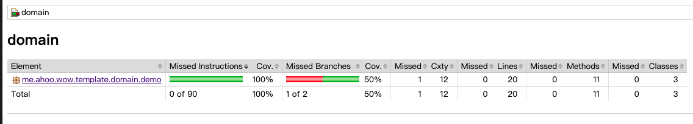

# Best Practices

## Architecture Best Practices

### Recommended Technology Stack

#### Production Environment Recommended Configuration

- **MongoDB**: As event store (EventStore), snapshot repository (SnapshotRepository)
  - **Scalability**: MongoDB's automatic sharding feature greatly reduces system scaling costs
  - **Read Model**: Setting snapshot strategy to `all` allows MongoDB-stored snapshots to be used directly as read models without additional projection processors
  - **Waiting Strategy**: Combined with `SNAPSHOT` waiting strategy to achieve synchronous request waiting
  - **Applicable Scenarios**: Most business scenarios, except for some special query requirements (such as product search engines)

- **Kafka**: As messaging engine, including `CommandBus`, `DomainEventBus`, `StateEventBus`
  - **Reliability**: Guarantees message persistence and ordering
  - **Scalability**: Supports horizontal scaling and partitioning
  - **Ecosystem**: Rich ecosystem and tool support

- **Redis**: As cache layer and session storage (optional)
  - **Performance**: High-speed read/write performance
  - **Data Structures**: Rich data structures support complex caching scenarios

#### Development Environment Simplified Configuration

- **In-Memory**: Suitable for local development and unit testing
- **Single-node Database**: Simplifies deployment and maintenance

#### Aggregate Boundary Identification

- **Business Invariants**: Maintain strong consistency within aggregates
- **Transaction Boundaries**: Aggregate modifications completed in single transactions
- **Concurrency Control**: Control concurrency conflicts through aggregate versioning
- **Dependencies**: Aggregates decoupled through domain events

### Event Modeling Best Practices

#### Event Naming Conventions

```kotlin
// Recommended: Past tense + specific business behavior
data class OrderCreated(val orderId: String, val items: List<OrderItem>)
data class OrderPaid(val orderId: String, val amount: BigDecimal)
data class OrderShipped(val orderId: String, val trackingNumber: String)

// Avoid: Vague naming
data class OrderUpdated(val orderId: String) // ❌ Too broad
data class OrderChange(val orderId: String)  // ❌ Not specific enough
```

#### Event Version Control

```kotlin
@Event(revision = "1.0")
data class OrderCreated(val orderId: String, val items: List<OrderItem>)

@Event(revision = "2.0")
data class OrderCreated(
    val orderId: String,
    val items: List<OrderItem>,
    val customerId: String // New field
)
```

### Projection Design Patterns

#### Group by Query Responsibilities

```kotlin
// Order list projection
@ProjectionProcessor
class OrderListProjection {
    @OnEvent
    fun onOrderCreated(event: OrderCreated) {
        // Update order list query model
    }
}

// Order detail projection
@ProjectionProcessor
class OrderDetailProjection {
    @OnEvent
    fun onOrderPaid(event: OrderPaid) {
        // Update order detail query model
    }
}
```

#### Asynchronous Projection Processing

```kotlin
@ProjectionProcessor
class EmailNotificationProjection {

    @OnEvent
    @Blocking // Marked as blocking operation
    fun onOrderShipped(event: OrderShipped) {
        // Send email notification (IO intensive operation)
        emailService.sendShippingNotification(event.orderId)
    }
}
```

### Saga Pattern Application

#### Orchestration vs Choreography

```kotlin
// Recommended: Orchestration
@StatelessSaga
class OrderProcessingSaga {

    @OnEvent
    fun onOrderCreated(event: OrderCreated): ReserveInventory {
        return ReserveInventory(event.orderId, event.items)
    }

    @OnEvent
    fun onInventoryReserved(event: InventoryReserved): ProcessPayment {
        return ProcessPayment(event.orderId, event.totalAmount)
    }
}

// Avoid: Choreography may lead to complex dependencies
// Services coupled directly through events
```

#### Compensation Mechanism

```kotlin
@StatelessSaga
class OrderCancellationSaga {

    @OnEvent
    @Retry(maxRetries = 3)
    fun onOrderCancelled(event: OrderCancelled): RefundPayment {
        return RefundPayment(event.orderId, event.paymentId)
    }

    @OnEvent
    fun onPaymentRefunded(event: PaymentRefunded): ReleaseInventory {
        return ReleaseInventory(event.orderId)
    }
}
```

## Development Best Practices

### Testing Strategy

#### Unit Test Coverage

```kotlin
// Aggregate test: Verify business logic
class OrderSpec : AggregateSpec<Order, OrderState> {
    // Given-When-Expect pattern
}

// Saga test: Verify orchestration
class OrderSagaSpec : SagaSpec<OrderProcessingSaga> {
    // Verify event-command mapping
}

// Projection test: Verify query model updates
class OrderProjectionSpec : ProjectionSpec<OrderProjection> {
    // Verify event processing results
}
```

#### Test Coverage Targets

- **Aggregate Root**: ≥ 85%
- **Saga**: ≥ 80%
- **Projection**: ≥ 75%
- **Utility Classes**: ≥ 90%

### Error Handling Strategy

#### Domain Exception Design

```kotlin
// Business exception
class InsufficientInventoryException(productId: String, requested: Int, available: Int)
    : DomainException("Product $productId: requested $requested, available $available")

// Technical exception
class EventStoreException(message: String, cause: Throwable?)
    : InfrastructureException(message, cause)
```

### Performance Optimization

#### Snapshot Strategy Selection

```yaml
wow:
  eventsourcing:
    snapshot:
      strategy: VERSION_OFFSET  # Based on version offset
      version-offset: 10        # Create snapshot every 10 versions
      storage: mongodb
```

#### Query Optimization

```kotlin
// Use projections to separate read/write
@ProjectionProcessor
class OrderSummaryProjection {

    @OnEvent
    fun onOrderCreated(event: OrderCreated) {
        // Only store fields needed for queries
        orderSummaryRepository.save(OrderSummary(
            id = event.orderId,
            totalAmount = event.totalAmount,
            status = OrderStatus.CREATED,
            createdAt = event.timestamp
        ))
    }
}
```

## Verify Test Coverage

```shell
./gradlew domain:jacocoTestCoverageVerification
```

> View test coverage report: `domain/build/reports/jacoco/test/html/index.html`



## CI/CD Pipeline


### Test Stage

> Code Style Check

```shell
./gradlew detekt
```

> Domain Model Unit Tests

```shell
./gradlew domain:check
```

> Test Coverage Verification

```shell
./gradlew domain:jacocoTestCoverageVerification
```

### Build Stage

> Generate Deployment Package

```shell
./gradlew server:installDist
```

> Publish Docker Image

### Deploy Stage

> Deploy to Kubernetes

### Pipeline Configuration (Alibaba Cloud Flow)

```yaml
sources:
  wow_project_template_repo:
    type: codeup
    name: Wow Project Template Source
    endpoint: <your-project-repo>
    branch: main
    certificate:
      type: serviceConnection
      serviceConnection: <your-service-connection-id>
stages:
  test:
    name: "Test"
    jobs:
      code_style:
        name: "Check CodeStyle"
        runsOn: public/cn-hongkong
        steps:
          code_style:
            name: "Code Style Check"
            step: "JavaBuild"
            runsOn: public/
            with:
              jdkVersion: "17"
              run: ./gradlew detekt

      test:
        name: "Check Domain"
        runsOn: public/cn-hongkong
        steps:
          test:
            name: "Check Domain"
            step: "GradleUnitTest"
            with:
              jdkVersion: "17"
              run: ./gradlew domain:check
              reportDir: "domain/build/reports/tests/test"
              reportIndex: "index.html"
          coverage:
            name: "Check CodeCoverage"
            step: "JaCoCo"
            with:
              jdkVersion: "17"
              run: ./gradlew domain:jacocoTestCoverageVerification
              reportDir: "domain/build/reports/jacoco/test/html"
  build:
    name: "Build"
    jobs:
      build:
        name: "Build Server And Push Image"
        runsOn: public/cn-hongkong
        steps:
          build:
            name: "Build Server"
            step: "JavaBuild"
            with:
              jdkVersion: "17"
              run: ./gradlew server:installDist
          publish_image:
            name: "Push Image"
            step: "ACRDockerBuild"
            with:
              artifact: "image"
              dockerfilePath: "server/Dockerfile"
              dockerRegistry: "<your-docker-registry—url>"
              dockerTag: ${DATETIME}
              region: "cn-hangzhou"
              serviceConnection: "<your-service-connection-id>"
  deploy:
    name: "Deploy"
    jobs:
      deploy:
        name: "Deploy"
        runsOn: public/cn-hongkong
        steps:
          deploy:
            name: "Deploy"
            step: "KubectlApply"
            with:
              skipTlsVerify: false
              kubernetesCluster: "<your-kubernetes-id>"
              useReplace: false
              namespace: "dev"
              kubectlVersion: "1.22.9"
              yamlPath: "deploy"
              skipVariableVerify: false
              variables:
                - key: IMAGE
                  value: $[stages.build.build.publish_image.artifacts.image]
                - key: REPLICAS
                  value: 2
                - key: SERVICE_NAME
                  value: demo-service
```

## Design Documentation

### Use Case Diagram

<center>


</center>