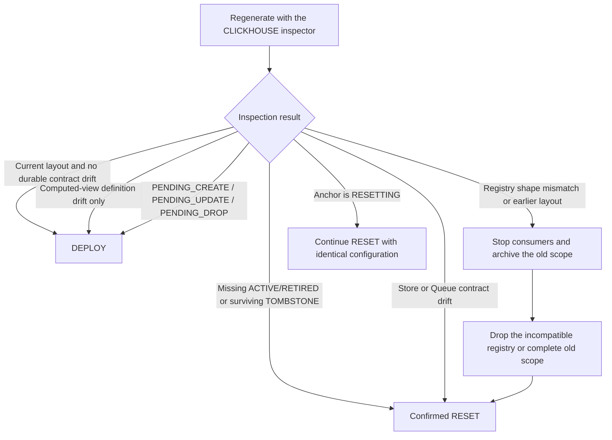

# BI Deployment and Recovery

This runbook applies only to the current BI layout. The BI module does not read earlier layouts, perform in-place
migration, or promise compatibility with earlier clients, registries, or SQL files.

## Operational Boundary

- `DEPLOY` performs non-destructive reconciliation. It installs a clean scope, resumes interrupted create/drop
  work, updates computed views, and restores missing Kafka ingress.
- `RESET` performs a destructive rebuild. It requires both `replayFromEarliestConfirmed=true` and a configured
  `consumerGroupNamespace`.
- The SQL executor must preserve response order and stop on the first error.
- One writer must own the complete physical BI object namespace. The same external lock must cover generation,
  inspection, and execution.
- `wow.bi.script.enabled` is enabled by default on the assumption that `/wow/bi/script` is exposed only through a
  security gateway.

Production must use `wow.bi.script.inspector.type=CLICKHOUSE`. The default NoOp inspector is suitable only for an
initial deployment or offline preview; it cannot safely Reset or clean stale objects.

## Operation Decision

| Observed state | Operation | Meaning |
|---|---|---|
| First deployment with no old BI objects in the target scope | `DEPLOY` | Creates the current layout, registry, and `STABLE` anchor |
| Stable current layout with matching contracts | `DEPLOY` | Produces idempotent reconciliation SQL |
| View or consumer materialized-view definition changed | `DEPLOY` | Registry passes through `PENDING_UPDATE` and returns to `ACTIVE` |
| `PENDING_CREATE`, `PENDING_UPDATE`, or `PENDING_DROP` | `DEPLOY` | Regenerate with identical configuration; do not replay old SQL |
| A registry-referenced `ACTIVE/RETIRED` object is missing, or a `TOMBSTONE` object survives | Confirmed `RESET` | Deploy fails closed; Reset uses the registry ownership scope to clean and rebuild |
| Store, Kafka Queue, or topology contract drift | Confirmed `RESET` | No in-place mutation is attempted |
| Registry Engine, replication path, sorting key, Comment, or column schema differs | Manual archive/drop, then `RESET` | The inspector does not trust an incompatible registry or infer ownership from it |
| Anchor is `RESETTING` | Continue `RESET` with the original configuration | Reuses the recorded consumer identity; Deploy is rejected |
| Anchor is `STABLE` but Kafka ingress is incomplete | `DEPLOY` | Restores Queue and consumer materialized views |

## Preflight

1. Pin the application, `wow-bi`, and OpenAPI client versions; do not let old and new nodes operate the BI scope
   concurrently.
2. Verify that the gateway protects `/wow/bi/script`, or explicitly set `wow.bi.script.enabled=false`.
3. Configure the ClickHouse inspector, a unique `consumerGroupNamespace`, and the correct ClickHouse topology.
4. Verify that `database`, `consumerDatabase`, topology mode, cluster name, installation, and topic configuration
   have not changed unexpectedly.
5. Stop old BI consumers and acquire an external lock covering the full physical object namespace.
6. Back up or archive the old BI databases, Kafka offset evidence, and current application version.
7. Confirm `auto.offset.reset=earliest` for a new consumer generation and Keeper availability when Keeper offsets
   are enabled.
8. Generate and review the script and diagnostics before execution. Do not execute a script with unexplained
   diagnostics.

## Execute Deploy

1. Regenerate `DEPLOY` inside the same locked change window.
2. Retain the request configuration, diagnostics, and SQL summary as audit evidence.
3. Execute statements in strict order and stop immediately at the first failure.
4. After failure, inspect again and generate a new script. Do not guess a resume point or replay the original SQL.
5. After success, verify a `STABLE` anchor, expected latest registry states, and complete Kafka ingress.

A computed-object update records `PENDING_UPDATE`, repairs the View or consumer materialized view, and then confirms
`ACTIVE`. Store and Queue identities do not change merely because a computed view changed.

## Execute Reset

Reset deletes and rebuilds data and ingestion inside the owned scope. Use it only when the business accepts a full
Kafka replay:

1. Stop every old consumer and retain the external lock.
2. Verify backups, Kafka retention, and `auto.offset.reset=earliest`.
3. Regenerate with `operation=RESET` and `replayFromEarliestConfirmed=true`.
4. Confirm `destructive=true` before executing statements in order.
5. If execution stops:
   - when the anchor is `RESETTING`, regenerate `RESET` with the identical physical-scope configuration;
   - when the anchor is already `STABLE`, generate `DEPLOY` to finish ingress;
   - never replay the original Reset SQL.
6. After Reset, run one authoritative `DEPLOY` to establish and confirm the exact current registry.

## Acceptance

- The anchor is `STABLE`, and its registry revision is not ahead of registry HEAD.
- The registry Engine, replication path, sorting key, Comment, and complete column schema pass inspector validation.
- Required objects exist, no `TOMBSTONE` object survives, and no unexplained pending registry state remains.
- View queries and materialized-view `TO` targets match the current renderer definitions.
- Kafka Queue and consumer materialized views consume successfully; sample the earliest and latest offsets and
  business data.
- In cluster mode, every replica agrees on objects, Comments, Engines, and column schemas.

## Rollback

BI has no in-place backward-compatible rollback. An earlier application may not understand current registry states
and must not be introduced while the scope is in `PENDING_UPDATE` or `RESETTING`:

1. Prefer completing `DEPLOY` or interruption recovery with the current version.
2. If the version must be reverted, restore the earlier application, BI database, and matching offset/configuration
   snapshot together.
3. Do not point an old inspector at the current registry or overwrite the current layout with old SQL.
4. Emergency isolation may set `wow.bi.script.enabled=false`, but that only removes the HTTP route, OpenAPI
   operation, and inspector; it does not roll back ClickHouse data.

See the [Migration Guide](./migration) for the cross-module upgrade order and
[BI Script Configuration](./configuration#bi-script-configuration) for properties.
