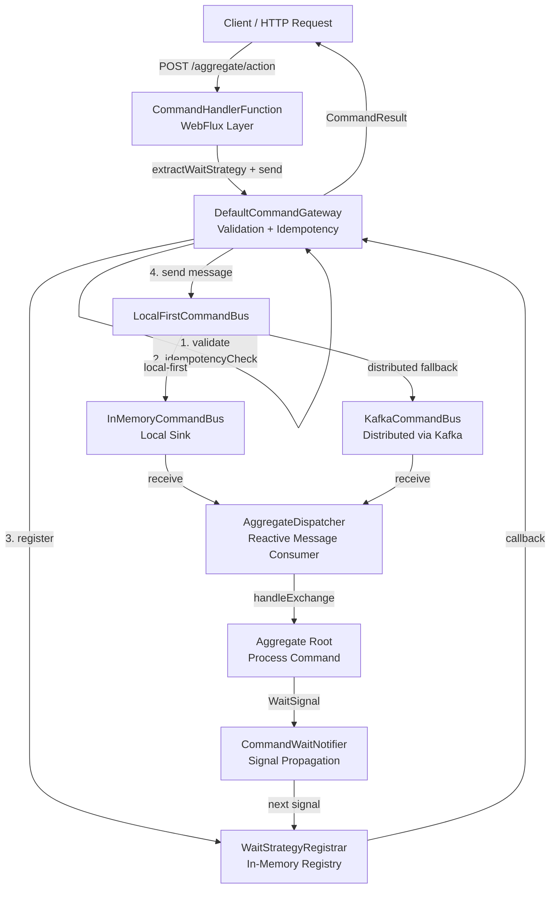
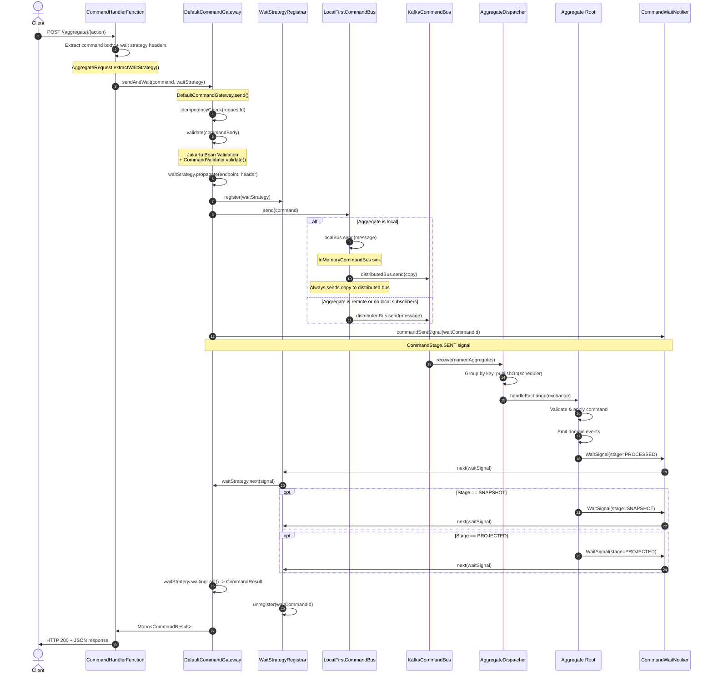
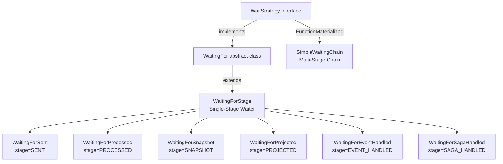

# Command Gateway

The command gateway is the core component in the system for receiving and sending commands, serving as the entry point for commands.
It is an extension of the command bus, not only responsible for command transmission, but also adds a series of important responsibilities, including command idempotency, waiting strategies, and command validation.

## Send Command


## API Usage

The `CommandGateway` interface provides several methods for sending commands and waiting for their results. Below are the main methods and their usage patterns.

### Basic Methods

:::tip
The `toCommandMessage()` extension function converts a command body into a `CommandMessage`. This is provided by the Wow framework and handles setting up the command ID, aggregate ID, and other metadata.
:::

#### send(command, waitStrategy)

The base method that sends a command with a specified wait strategy and returns `Mono<Void>`.
It completes when the command has been sent successfully. Use `sendAndWait` or `sendAndWaitStream`
when you want `CommandResult` values.

```kotlin
val command = CreateAccount(balance = 1000, name = "John").toCommandMessage()
val waitStrategy = WaitingForStage.processed(command.commandId)

commandGateway.send(command, waitStrategy)
    .doOnSuccess {
        println("Command sent: ${command.commandId}")
    }
    .subscribe()
```

#### sendAndWait(command, waitStrategy)

Sends a command and waits for the final result. If the command fails, it throws a `CommandResultException`.

```kotlin
val command = CreateAccount(balance = 1000, name = "John").toCommandMessage()
val waitStrategy = WaitingForStage.processed(command.commandId)

commandGateway.sendAndWait(command, waitStrategy)
    .doOnSuccess { result ->
        println("Command processed: ${result.commandId}")
        println("Aggregate Version: ${result.aggregateVersion}")
    }
    .subscribe()
```

#### sendAndWaitStream(command, waitStrategy)

Returns a `Flux<CommandResult>` for real-time streaming updates as the command progresses through different stages.

```kotlin
val command = CreateAccount(balance = 1000, name = "John").toCommandMessage()
val waitStrategy = WaitingForStage.snapshot(command.commandId)

commandGateway.sendAndWaitStream(command, waitStrategy)
    .doOnNext { result ->
        println("Stage: ${result.stage} - Succeeded: ${result.succeeded}")
        println("Aggregate Version: ${result.aggregateVersion}")
    }
    .subscribe()
```

### Convenience Methods

The `CommandGateway` provides convenience methods that pre-configure common wait strategies:

```kotlin
val command = CreateAccount(balance = 1000, name = "John").toCommandMessage()

// Wait until command is sent to the bus
commandGateway.sendAndWaitForSent(command)
    .doOnSuccess { result ->
        println("Command sent: ${result.commandId}")
    }
    .subscribe()

// Wait until command is processed by the aggregate
commandGateway.sendAndWaitForProcessed(command)
    .doOnSuccess { result ->
        if (result.succeeded) {
            println("Command processed successfully: ${result.commandId}")
            println("New aggregate version: ${result.aggregateVersion}")
        }
    }
    .subscribe()

// Wait until aggregate snapshot is created
commandGateway.sendAndWaitForSnapshot(command)
    .doOnSuccess { result ->
        println("Snapshot created for aggregate: ${result.aggregateId}")
    }
    .subscribe()
```

## Core Concepts

### Low-Level WaitStrategy Usage

Use the same `WaitStrategy` instance when you need low-level custom waiting logic:

```kotlin
commandGateway.send(command, waitStrategy)
    .thenMany(waitStrategy.waiting())
    .filter { signal -> signal.stage == CommandStage.PROCESSED }
    .next()
    .subscribe()
```

### CommandResult

`CommandResult` represents the result of a command execution at a specific processing stage. It contains comprehensive information about the command processing outcome.

| Property | Type | Description | Source |
|----------|------|-------------|--------|
| `id` | `String` | Unique identifier for this result | [CommandResult.kt:69](https://github.com/Ahoo-Wang/Wow/blob/main/wow-core/src/main/kotlin/me/ahoo/wow/command/CommandResult.kt#L69) |
| `waitCommandId` | `String` | The command ID being waited on | [CommandResult.kt:69](https://github.com/Ahoo-Wang/Wow/blob/main/wow-core/src/main/kotlin/me/ahoo/wow/command/CommandResult.kt#L69) |
| `stage` | `CommandStage` | Current processing stage (SENT, PROCESSED, SNAPSHOT, etc.) | [CommandResult.kt:69](https://github.com/Ahoo-Wang/Wow/blob/main/wow-core/src/main/kotlin/me/ahoo/wow/command/CommandResult.kt#L69) |
| `contextName` | `String` | Bounded context name | [CommandResult.kt:69](https://github.com/Ahoo-Wang/Wow/blob/main/wow-core/src/main/kotlin/me/ahoo/wow/command/CommandResult.kt#L69) |
| `aggregateName` | `String` | Aggregate name | [CommandResult.kt:69](https://github.com/Ahoo-Wang/Wow/blob/main/wow-core/src/main/kotlin/me/ahoo/wow/command/CommandResult.kt#L69) |
| `tenantId` | `String` | Tenant identifier | [CommandResult.kt:69](https://github.com/Ahoo-Wang/Wow/blob/main/wow-core/src/main/kotlin/me/ahoo/wow/command/CommandResult.kt#L69) |
| `aggregateId` | `String` | Aggregate instance identifier | [CommandResult.kt:69](https://github.com/Ahoo-Wang/Wow/blob/main/wow-core/src/main/kotlin/me/ahoo/wow/command/CommandResult.kt#L69) |
| `aggregateVersion` | `Int?` | Aggregate version after processing (null on gateway validation failure or before processing) | [CommandResult.kt:69](https://github.com/Ahoo-Wang/Wow/blob/main/wow-core/src/main/kotlin/me/ahoo/wow/command/CommandResult.kt#L69) |
| `requestId` | `String` | Request identifier for idempotency | [CommandResult.kt:69](https://github.com/Ahoo-Wang/Wow/blob/main/wow-core/src/main/kotlin/me/ahoo/wow/command/CommandResult.kt#L69) |
| `commandId` | `String` | Command identifier | [CommandResult.kt:69](https://github.com/Ahoo-Wang/Wow/blob/main/wow-core/src/main/kotlin/me/ahoo/wow/command/CommandResult.kt#L69) |
| `function` | `FunctionInfoData` | Information about the processing function | [CommandResult.kt:69](https://github.com/Ahoo-Wang/Wow/blob/main/wow-core/src/main/kotlin/me/ahoo/wow/command/CommandResult.kt#L69) |
| `errorCode` | `String` | Error code ("Ok" on success) | [CommandResult.kt:69](https://github.com/Ahoo-Wang/Wow/blob/main/wow-core/src/main/kotlin/me/ahoo/wow/command/CommandResult.kt#L69) |
| `errorMsg` | `String` | Error message (empty on success) | [CommandResult.kt:69](https://github.com/Ahoo-Wang/Wow/blob/main/wow-core/src/main/kotlin/me/ahoo/wow/command/CommandResult.kt#L69) |
| `bindingErrors` | `List<BindingError>` | List of validation errors | [CommandResult.kt:69](https://github.com/Ahoo-Wang/Wow/blob/main/wow-core/src/main/kotlin/me/ahoo/wow/command/CommandResult.kt#L69) |
| `result` | `Map<String, Any>` | Additional result data | [CommandResult.kt:69](https://github.com/Ahoo-Wang/Wow/blob/main/wow-core/src/main/kotlin/me/ahoo/wow/command/CommandResult.kt#L69) |
| `signalTime` | `Long` | Timestamp when this result was generated | [CommandResult.kt:69](https://github.com/Ahoo-Wang/Wow/blob/main/wow-core/src/main/kotlin/me/ahoo/wow/command/CommandResult.kt#L69) |
| `succeeded` | `Boolean` | Whether the command processing succeeded | [CommandResult.kt:69](https://github.com/Ahoo-Wang/Wow/blob/main/wow-core/src/main/kotlin/me/ahoo/wow/command/CommandResult.kt#L69) |

A `CommandResult` is created from a `WaitSignal` via the `toResult()` extension function, which maps signal fields to result fields and adds the `requestId` from the original command message.

### WaitSignal vs CommandResult

- **WaitSignal**: Internal interface used within the wait strategy infrastructure. Contains processing stage information and is used for signaling between components.
- **CommandResult**: Public API for command results. Created from `WaitSignal` and includes additional context like `requestId` and formatted aggregate information.

### CommandGateway vs CommandBus

`CommandGateway` extends `CommandBus` with additional high-level features:

| Feature | CommandBus | CommandGateway |
|---------|------------|----------------|
| Send commands | Yes | Yes |
| Wait strategies | No | Yes |
| Command validation | No | Yes |
| Idempotency checking | No | Yes |
| Real-time result streaming | No | Yes |
| Convenience methods | No | Yes |

Use `CommandBus` when you only need basic command routing. Use `CommandGateway` for full-featured command handling with wait strategies and validation.

```kotlin
// CommandBus - basic routing only
interface CommandBus : MessageBus<CommandMessage<*>, ServerCommandExchange<*>>

// CommandGateway - extends CommandBus with additional features
interface CommandGateway : CommandBus {
    fun <C : Any> send(command: CommandMessage<C>, waitStrategy: WaitStrategy): Mono<Void>
    fun <C : Any> sendAndWait(command: CommandMessage<C>, waitStrategy: WaitStrategy): Mono<CommandResult>
    fun <C : Any> sendAndWaitStream(command: CommandMessage<C>, waitStrategy: WaitStrategy): Flux<CommandResult>
    // ... convenience methods
}
```

## Architecture

The command infrastructure is built on a layered architecture that separates concerns between the API contract, the gateway (validation/idempotency), the message bus (transport), and the aggregate dispatcher (processing).

### Component Architecture



<!-- Sources:
- CommandHandlerFunction: wow-webflux/src/main/kotlin/me/ahoo/wow/webflux/route/command/CommandHandlerFunction.kt:39-63
- DefaultCommandGateway: wow-core/src/main/kotlin/me/ahoo/wow/command/DefaultCommandGateway.kt:45-246
- LocalFirstCommandBus: wow-core/src/main/kotlin/me/ahoo/wow/command/LocalFirstCommandBus.kt:29-47
- InMemoryCommandBus: wow-core/src/main/kotlin/me/ahoo/wow/command/InMemoryCommandBus.kt:31-50
- KafkaCommandBus: wow-kafka/src/main/kotlin/me/ahoo/wow/kafka/KafkaCommandBus.kt:27-45
- AggregateDispatcher: wow-core/src/main/kotlin/me/ahoo/wow/messaging/dispatcher/AggregateDispatcher.kt:80-275
- WaitStrategyRegistrar: wow-core/src/main/kotlin/me/ahoo/wow/command/wait/WaitStrategyRegistrar.kt:24-101
-->

### Message Bus Hierarchy

The `MessageBus` interface defines the fundamental contract: `send` a message and `receive` messages for a set of named aggregates. It is specialized into three tiers:

| Bus Type | Interface | Used For | Source |
|---|---|---|---|
| **Local** | `LocalMessageBus` | Single-JVM, in-memory message passing via Reactor `Sinks` | [MessageBus.kt:64](https://github.com/Ahoo-Wang/Wow/blob/main/wow-core/src/main/kotlin/me/ahoo/wow/messaging/MessageBus.kt#L64) |
| **Distributed** | `DistributedMessageBus` | Cross-instance message passing (Kafka) | [MessageBus.kt:83](https://github.com/Ahoo-Wang/Wow/blob/main/wow-core/src/main/kotlin/me/ahoo/wow/messaging/MessageBus.kt#L83) |
| **Local-First** | `LocalFirstMessageBus` | Hybrid: local bus first, distributed fallback | [LocalFirstMessageBus.kt:99](https://github.com/Ahoo-Wang/Wow/blob/main/wow-core/src/main/kotlin/me/ahoo/wow/messaging/LocalFirstMessageBus.kt#L99) |

For the command domain specifically, `CommandBus` extends `MessageBus` with a fixed `TopicKind.COMMAND` and narrows the generic types:

- `LocalCommandBus` extends both `CommandBus` and `LocalMessageBus`.
- `DistributedCommandBus` extends both `CommandBus` and `DistributedMessageBus`.
- `LocalFirstCommandBus` extends `CommandBus` and uses `LocalFirstMessageBus` delegation, automatically disabling local-first for void commands.

### At-a-Glance Reference

| Component | Responsibility | Key File | Source |
|---|---|---|---|
| `CommandMessage` | Encapsulates command body, aggregate ID, version, idempotency metadata | `wow-api/.../command/CommandMessage.kt` | [Source](https://github.com/Ahoo-Wang/Wow/blob/main/wow-api/src/main/kotlin/me/ahoo/wow/api/command/CommandMessage.kt#L53) |
| `CommandGateway` | High-level send API with validation, idempotency, wait strategies | `wow-core/.../command/CommandGateway.kt` | [Source](https://github.com/Ahoo-Wang/Wow/blob/main/wow-core/src/main/kotlin/me/ahoo/wow/command/CommandGateway.kt#L75) |
| `DefaultCommandGateway` | Concrete implementation of `CommandGateway` | `wow-core/.../command/DefaultCommandGateway.kt` | [Source](https://github.com/Ahoo-Wang/Wow/blob/main/wow-core/src/main/kotlin/me/ahoo/wow/command/DefaultCommandGateway.kt#L45) |
| `CommandBus` | Core message bus abstraction for routing commands | `wow-core/.../command/CommandBus.kt` | [Source](https://github.com/Ahoo-Wang/Wow/blob/main/wow-core/src/main/kotlin/me/ahoo/wow/command/CommandBus.kt#L36) |
| `InMemoryCommandBus` | Local in-memory bus using Reactor sinks (unicast) | `wow-core/.../command/InMemoryCommandBus.kt` | [Source](https://github.com/Ahoo-Wang/Wow/blob/main/wow-core/src/main/kotlin/me/ahoo/wow/command/InMemoryCommandBus.kt#L31) |
| `LocalFirstCommandBus` | Tries local bus first, falls back to distributed | `wow-core/.../command/LocalFirstCommandBus.kt` | [Source](https://github.com/Ahoo-Wang/Wow/blob/main/wow-core/src/main/kotlin/me/ahoo/wow/command/LocalFirstCommandBus.kt#L29) |
| `KafkaCommandBus` | Distributed command bus over Apache Kafka | `wow-kafka/.../KafkaCommandBus.kt` | [Source](https://github.com/Ahoo-Wang/Wow/blob/main/wow-kafka/src/main/kotlin/me/ahoo/wow/kafka/KafkaCommandBus.kt#L27) |
| `WaitStrategy` | Defines how long and what stage to wait for command results | `wow-core/.../command/wait/WaitStrategy.kt` | [Source](https://github.com/Ahoo-Wang/Wow/blob/main/wow-core/src/main/kotlin/me/ahoo/wow/command/wait/WaitStrategy.kt#L60) |
| `WaitingForStage` | Single-stage wait strategy (SENT, PROCESSED, SNAPSHOT, etc.) | `wow-core/.../command/wait/stage/WaitingForStage.kt` | [Source](https://github.com/Ahoo-Wang/Wow/blob/main/wow-core/src/main/kotlin/me/ahoo/wow/command/wait/stage/WaitingForStage.kt#L33) |
| `SimpleWaitingChain` | Multi-stage chain (e.g., SAGA_HANDLED then SNAPSHOT) | `wow-core/.../command/wait/chain/SimpleWaitingChain.kt` | [Source](https://github.com/Ahoo-Wang/Wow/blob/main/wow-core/src/main/kotlin/me/ahoo/wow/command/wait/chain/SimpleWaitingChain.kt#L36) |
| `CommandHandlerFunction` | Spring WebFlux handler that bridges HTTP to `CommandGateway` | `wow-webflux/.../command/CommandHandlerFunction.kt` | [Source](https://github.com/Ahoo-Wang/Wow/blob/main/wow-webflux/src/main/kotlin/me/ahoo/wow/webflux/route/command/CommandHandlerFunction.kt#L39) |
| `AggregateDispatcher` | Reactive dispatcher that consumes messages from the bus per-aggregate | `wow-core/.../messaging/dispatcher/AggregateDispatcher.kt` | [Source](https://github.com/Ahoo-Wang/Wow/blob/main/wow-core/src/main/kotlin/me/ahoo/wow/messaging/dispatcher/AggregateDispatcher.kt#L80) |

## Command Processing Chain

The following sequence diagram traces a command from its arrival as an HTTP request through every processing stage to the final `CommandResult`. Each step is annotated with the file and method responsible.



<!-- Sources:
- CommandHandler.handle(): wow-webflux/src/main/kotlin/me/ahoo/wow/webflux/route/command/CommandHandler.kt:26-60
- DefaultCommandGateway.send(): wow-core/src/main/kotlin/me/ahoo/wow/command/DefaultCommandGateway.kt:114-126
- DefaultCommandGateway.send(with waitStrategy): wow-core/src/main/kotlin/me/ahoo/wow/command/DefaultCommandGateway.kt:205-245
- LocalFirstCommandBus.send(): wow-core/src/main/kotlin/me/ahoo/wow/command/LocalFirstCommandBus.kt:41-46
- LocalFirstMessageBus.send(): wow-core/src/main/kotlin/me/ahoo/wow/messaging/LocalFirstMessageBus.kt:130-149
- AbstractKafkaBus.receive(): wow-kafka/src/main/kotlin/me/ahoo/wow/kafka/AbstractKafkaBus.kt:78-95
- AggregateDispatcher.start(): wow-core/src/main/kotlin/me/ahoo/wow/messaging/dispatcher/AggregateDispatcher.kt:163-173
-->

### DefaultCommandGateway: Pre-Send Pipeline

The `DefaultCommandGateway` enforces a strict pre-send pipeline before the command reaches the bus:

1. **Idempotency check** -- Retrieves an `IdempotencyChecker` for the aggregate type and checks if the `requestId` has already been processed. If it has, a `DuplicateRequestIdException` is thrown immediately.

2. **Validation** -- Two-phase validation:
   - **Self-validation**: If the command body implements `CommandValidator`, its `validate()` method is called first. This allows domain-specific, programmatic validation.
   - **Jakarta Bean Validation**: The command body is validated against `@NotBlank`, `@Min`, `@Max`, and other Jakarta annotations via the configured `jakarta.validation.Validator`.

Both checks are implemented in the `check()` method at [DefaultCommandGateway.kt:99](https://github.com/Ahoo-Wang/Wow/blob/main/wow-core/src/main/kotlin/me/ahoo/wow/command/DefaultCommandGateway.kt#L99).

### DefaultCommandGateway: Post-Send Signal

After the command is accepted by the command bus, the gateway publishes a `CommandStage.SENT` wait signal via the `CommandWaitNotifier`. This signal is published regardless of success or failure -- if an error occurs during sending, the signal carries the error information.

For the overloaded `send(message)` (without explicit `WaitStrategy`), the gateway extracts a wait strategy from the message header (if one was propagated) and publishes the SENT signal. See [DefaultCommandGateway.kt:114-126](https://github.com/Ahoo-Wang/Wow/blob/main/wow-core/src/main/kotlin/me/ahoo/wow/command/DefaultCommandGateway.kt#L114).

## Error Handling

### CommandResultException

When command processing fails, `sendAndWait` throws a `CommandResultException` containing the full `CommandResult` with error details.

```kotlin
commandGateway.sendAndWait(command, waitStrategy)
    .doOnError { error ->
        if (error is CommandResultException) {
            val result = error.commandResult
            println("Command failed at stage: ${result.stage}")
            println("Error code: ${result.errorCode}")
            println("Error message: ${result.errorMsg}")
            
            // Check for validation errors
            if (result.bindingErrors.isNotEmpty()) {
                result.bindingErrors.forEach { bindingError ->
                    println("Field '${bindingError.name}': ${bindingError.msg}")
                }
            }
        }
    }
    .onErrorResume { error ->
        // Handle the error gracefully
        when (error) {
            is CommandResultException -> {
                // Log and return a fallback value
                Mono.empty()
            }
            else -> Mono.error(error)
        }
    }
    .subscribe()
```

### CommandValidationException

Thrown when command validation fails before sending. Contains validation constraint violations.

```kotlin
// Command with validation annotations
data class CreateAccount(
    @field:NotBlank(message = "Name is required")
    val name: String,
    @field:Min(value = 0, message = "Balance must be non-negative")
    val balance: Int
)

commandGateway.sendAndWaitForProcessed(command)
    .doOnError { error ->
        if (error is CommandValidationException) {
            println("Validation failed for command: ${error.command}")
            error.bindingErrors.forEach { bindingError ->
                println("Field '${bindingError.name}': ${bindingError.msg}")
            }
        }
    }
    .subscribe()
```

### DuplicateRequestIdException

Thrown when attempting to process a command with a request ID that has already been processed.

```kotlin
commandGateway.sendAndWaitForProcessed(command)
    .doOnError { error ->
        if (error is DuplicateRequestIdException) {
            println("Duplicate request: ${error.requestId}")
            println("Aggregate: ${error.aggregateId}")
        }
    }
    .onErrorResume(DuplicateRequestIdException::class.java) { error ->
        // Return cached result or ignore duplicate
        Mono.empty()
    }
    .subscribe()
```

### Exception Reference

| Exception | Thrown When | Contains | Source |
|---|---|---|---|
| `DuplicateRequestIdException` | A command with the same `requestId` was already processed | `aggregateId`, `requestId` | [CommandExceptions.kt:39](https://github.com/Ahoo-Wang/Wow/blob/main/wow-core/src/main/kotlin/me/ahoo/wow/command/CommandExceptions.kt#L39) |
| `CommandValidationException` | Jakarta Bean Validation or `CommandValidator.validate()` fails | `command` object, `bindingErrors` | [CommandExceptions.kt:90](https://github.com/Ahoo-Wang/Wow/blob/main/wow-core/src/main/kotlin/me/ahoo/wow/command/CommandExceptions.kt#L90) |
| `CommandResultException` | Command fails during aggregate processing | Full `CommandResult` with `errorCode`, `errorMsg`, `bindingErrors` | [CommandExceptions.kt:63](https://github.com/Ahoo-Wang/Wow/blob/main/wow-core/src/main/kotlin/me/ahoo/wow/command/CommandExceptions.kt#L63) |

### Error Handling Best Practices

1. **Use specific exception handlers**: Handle `CommandResultException`, `CommandValidationException`, and `DuplicateRequestIdException` separately for appropriate responses.

2. **Log error details**: Always log the `errorCode`, `errorMsg`, and `bindingErrors` for debugging.

3. **Implement retry logic for transient failures**:

```kotlin
commandGateway.sendAndWaitForProcessed(command)
    .retryWhen(Retry.backoff(3, Duration.ofSeconds(1))
        .filter { error -> isTransientError(error) })
    .subscribe()

// Transient errors are typically network or temporary infrastructure issues
// Do NOT retry validation errors or duplicate request errors
fun isTransientError(error: Throwable): Boolean {
    return when (error) {
        is CommandValidationException -> false  // Validation errors won't succeed on retry
        is DuplicateRequestIdException -> false // Duplicate requests should not be retried
        is CommandResultException -> false      // Business logic errors from aggregate
        else -> true                            // Network/infrastructure errors may be transient
    }
}
```

4. **Handle timeout scenarios**: Configure appropriate timeouts for wait strategies.

```kotlin
commandGateway.sendAndWaitForProcessed(command)
    .timeout(Duration.ofSeconds(30))
    .doOnError(TimeoutException::class.java) { error ->
        println("Command processing timed out")
    }
    .subscribe()
```

## Idempotency

Command idempotency is the principle of ensuring that the same command is executed at most once in the system.

The command gateway uses `IdempotencyChecker` to check the `RequestId` of the command for idempotency.
If the command has already been executed, it will throw a `DuplicateRequestIdException` exception to prevent duplicate execution of the same command.

The following is an example HTTP request showing how to use `Command-Request-Id` in the request to ensure command idempotency:

:::tip
Developers can also customize the `RequestId` through the `requestId` property of `CommandMessage`.
:::

::: code-group
```shell {6} [Http Request]
curl -X 'POST' \
  'http://localhost:8080/account/create_account' \
  -H 'accept: application/json' \
  -H 'Command-Wait-Stage: SNAPSHOT' \
  -H 'Command-Aggregate-Id: sourceId' \
  -H 'Command-Request-Id: {{$uuid}}' \
  -H 'Content-Type: application/json' \
  -d '{
  "balance": 1000,
  "name": "source"
}'
```

```json [Response]
{
  "id": "0V3oAWI60001003",
  "waitCommandId": "0V3oAWGt0001001",
  "stage": "SNAPSHOT",
  "contextName": "transfer-service",
  "aggregateName": "account",
  "tenantId": "(0)",
  "aggregateId": "sourceId",
  "aggregateVersion": 1,
  "requestId": "0V3oAWGt0001001",
  "commandId": "0V3oAWGt0001001",
  "function": {
    "functionKind": "STATE_EVENT",
    "contextName": "wow",
    "processorName": "SnapshotDispatcher",
    "name": "save"
  },
  "errorCode": "Ok",
  "errorMsg": "",
  "result": {},
  "signalTime": 1764297025846,
  "succeeded": true
}
```
:::

### Configuration

```yaml {5-10}
wow:
  command:
    bus:
      type: kafka
    idempotency:
      enabled: true
      bloom-filter:
        expected-insertions: 1000000
        ttl: PT60S
        fpp: 0.00001
```

## Waiting Strategies

*Command waiting strategy* refers to a strategy where the command gateway waits for the command execution result after sending the command.

*Command waiting strategy* is an important feature in the _Wow_ framework, aiming to solve the data synchronization delay problem in _CQRS_ and read-write separation modes.

Currently supported command waiting strategies include:

### WaitingForStage

<p align="center" style="text-align:center;">
  
</p>

The waiting signals supported by `WaitingForStage` are as follows:

- `SENT`: Generates a completion signal when the command is published to the command bus/queue
- `PROCESSED`: Generates a completion signal when the command is processed by the aggregate root
- `SNAPSHOT`: Generates a completion signal when the snapshot is generated
- `PROJECTED`: Generates a completion signal when the *projection* of the event produced by the command is completed
- `EVENT_HANDLED`: Generates a completion signal when the event produced by the command is processed by the *event processor*
- `SAGA_HANDLED`: Generates a completion signal when the event produced by the command is processed by *Saga*

::: code-group
```shell {4} [Http Request]
curl -X 'POST' \
  'http://localhost:8080/account/create_account' \
  -H 'accept: application/json' \
  -H 'Command-Wait-Stage: SNAPSHOT' \
  -H 'Command-Aggregate-Id: targetId' \
  -H 'Content-Type: application/json' \
  -d '{
  "balance": 1000,
  "name": "target"
}'
```

```json [Response]
{
  "id": "0V3oAdHd0001007",
  "waitCommandId": "0V3oAdHV0001005",
  "stage": "SNAPSHOT",
  "contextName": "transfer-service",
  "aggregateName": "account",
  "tenantId": "(0)",
  "aggregateId": "targetId",
  "aggregateVersion": 1,
  "requestId": "0V3oAdHV0001005",
  "commandId": "0V3oAdHV0001005",
  "function": {
    "functionKind": "STATE_EVENT",
    "contextName": "wow",
    "processorName": "SnapshotDispatcher",
    "name": "save"
  },
  "errorCode": "Ok",
  "errorMsg": "",
  "result": {},
  "signalTime": 1764297052692,
  "succeeded": true
}
```
```text [SSE Response]
id:0V3oCwcv0001002
event:SENT
data:{"id":"0V3oCwcv0001002","waitCommandId":"0V3oCwbn0001001","stage":"SENT","contextName":"transfer-service","aggregateName":"account","tenantId":"(0)","aggregateId":"targetId","aggregateVersion":0,"requestId":"0V3oCwbn0001001","commandId":"0V3oCwbn0001001","function":{"functionKind":"COMMAND","contextName":"wow","processorName":"CommandGateway","name":"send"},"errorCode":"Ok","errorMsg":"","result":{},"signalTime":1764297603701,"succeeded":true}

id:0V3oCwbn0001001
event:PROCESSED
data:{"id":"0V3oCwbn0001001","waitCommandId":"0V3oCwbn0001001","stage":"PROCESSED","contextName":"transfer-service","aggregateName":"account","tenantId":"(0)","aggregateId":"targetId","aggregateVersion":1,"requestId":"0V3oCwbn0001001","commandId":"0V3oCwbn0001001","function":{"functionKind":"COMMAND","contextName":"transfer-service","processorName":"Account","name":"onCommand"},"errorCode":"Ok","errorMsg":"","result":{},"signalTime":1764297603737,"succeeded":true}

id:0V3oCwdB0001003
event:SNAPSHOT
data:{"id":"0V3oCwdB0001003","waitCommandId":"0V3oCwbn0001001","stage":"SNAPSHOT","contextName":"transfer-service","aggregateName":"account","tenantId":"(0)","aggregateId":"targetId","aggregateVersion":1,"requestId":"0V3oCwbn0001001","commandId":"0V3oCwbn0001001","function":{"functionKind":"STATE_EVENT","contextName":"wow","processorName":"SnapshotDispatcher","name":"save"},"errorCode":"Ok","errorMsg":"","result":{},"signalTime":1764297603754,"succeeded":true}
```
```kotlin {1}
commamdGateway.sendAndWaitForProcessed(message)
```
:::

#### Wait Stage Comparison

| Stage | Prerequisites | Returns When | Supports Void Commands | `shouldWaitFunction` | Typical Use Case | Source |
|---|---|---|---|---|---|---|
| `SENT` | none | Command accepted by bus/queue | Yes | No | Fire-and-forget; fastest response | [CommandStage.kt:32](https://github.com/Ahoo-Wang/Wow/blob/main/wow-core/src/main/kotlin/me/ahoo/wow/command/wait/CommandStage.kt#L32) |
| `PROCESSED` | `[SENT]` | Aggregate finished executing | No | No | Default; balance of speed and consistency | [CommandStage.kt:40](https://github.com/Ahoo-Wang/Wow/blob/main/wow-core/src/main/kotlin/me/ahoo/wow/command/wait/CommandStage.kt#L40) |
| `SNAPSHOT` | `[SENT, PROCESSED]` | Snapshot persisted | No | No | Cold-start performance; read-after-write | [CommandStage.kt:53](https://github.com/Ahoo-Wang/Wow/blob/main/wow-core/src/main/kotlin/me/ahoo/wow/command/wait/CommandStage.kt#L53) |
| `PROJECTED` | `[SENT, PROCESSED]` | Projection (read model) updated | No | Yes | Read-model consistency; UI refresh | [CommandStage.kt:62](https://github.com/Ahoo-Wang/Wow/blob/main/wow-core/src/main/kotlin/me/ahoo/wow/command/wait/CommandStage.kt#L62) |
| `EVENT_HANDLED` | `[SENT, PROCESSED]` | External event handlers complete | No | Yes | Side-effect processing; notifications | [CommandStage.kt:72](https://github.com/Ahoo-Wang/Wow/blob/main/wow-core/src/main/kotlin/me/ahoo/wow/command/wait/CommandStage.kt#L72) |
| `SAGA_HANDLED` | `[SENT, PROCESSED]` | Saga finished processing events | No | Yes | Distributed transaction completion | [CommandStage.kt:83](https://github.com/Ahoo-Wang/Wow/blob/main/wow-core/src/main/kotlin/me/ahoo/wow/command/wait/CommandStage.kt#L83) |

Stages with `shouldWaitFunction = true` (`PROJECTED`, `EVENT_HANDLED`, `SAGA_HANDLED`) apply additional filtering: the `WaitStrategy.FunctionMaterialized.shouldNotify(signal)` method checks that the signal's function metadata matches the expected function name, context name, and processor name. This is critical when multiple projectors or event handlers operate on the same aggregate -- the wait strategy only completes when the _specific_ function has finished, not any arbitrary one.

#### Wait Strategy Hierarchy



<!-- Sources:
- WaitStrategy interface: wow-core/src/main/kotlin/me/ahoo/wow/command/wait/WaitStrategy.kt:60-176
- WaitingFor abstract class: wow-core/src/main/kotlin/me/ahoo/wow/command/wait/WaitingFor.kt:33-132
- WaitingForStage: wow-core/src/main/kotlin/me/ahoo/wow/command/wait/stage/WaitingForStage.kt:33-155
- SimpleWaitingChain: wow-core/src/main/kotlin/me/ahoo/wow/command/wait/chain/SimpleWaitingChain.kt:36-107
- WaitingForSent: wow-core/src/main/kotlin/me/ahoo/wow/command/wait/stage/WaitingForSent.kt:25-32
- WaitingForProcessed: wow-core/src/main/kotlin/me/ahoo/wow/command/wait/stage/WaitingForProcessed.kt:25-30
-->

### WaitingForChain

<p align="center" style="text-align:center;">
  
</p>


::: code-group
```shell {4-6} [Http Request]
curl -X 'POST' \
  'http://localhost:8080/account/sourceId/prepare' \
  -H 'accept: application/json' \
  -H 'Command-Wait-Stage: SAGA_HANDLED' \
  -H 'Command-Wait-Tail-Stage: SNAPSHOT' \
  -H 'Command-Wait-Tail-Processor: TransferSaga' \
  -H 'Content-Type: application/json' \
  -d '{
  "amount": 100,
  "to": "targetId"
}'
```
```json [Response]
{
  "id": "0V3oAkw6000100G",
  "waitCommandId": "0V3oAkvW0001009",
  "stage": "SNAPSHOT",
  "contextName": "transfer-service",
  "aggregateName": "account",
  "tenantId": "(0)",
  "aggregateId": "targetId",
  "aggregateVersion": 2,
  "requestId": "0V3oAkvW0001009",
  "commandId": "0V3oAkw2000100E",
  "function": {
    "functionKind": "STATE_EVENT",
    "contextName": "wow",
    "processorName": "SnapshotDispatcher",
    "name": "save"
  },
  "errorCode": "Ok",
  "errorMsg": "",
  "result": {},
  "signalTime": 1764297082107,
  "succeeded": true
}
```
```text [SSE Response]
id:0V3oCVz9000100M
event:SENT
data:{"id":"0V3oCVz9000100M","waitCommandId":"0V3oCVyv000100L","stage":"SENT","contextName":"transfer-service","aggregateName":"account","tenantId":"(0)","aggregateId":"sourceId","aggregateVersion":null,"requestId":"0V3oCVyv000100L","commandId":"0V3oCVyv000100L","function":{"functionKind":"COMMAND","contextName":"wow","processorName":"CommandGateway","name":"send"},"errorCode":"Ok","errorMsg":"","result":{},"signalTime":1764297501291,"succeeded":true}

id:0V3oCVyv000100L
event:PROCESSED
data:{"id":"0V3oCVyv000100L","waitCommandId":"0V3oCVyv000100L","stage":"PROCESSED","contextName":"transfer-service","aggregateName":"account","tenantId":"(0)","aggregateId":"sourceId","aggregateVersion":4,"requestId":"0V3oCVyv000100L","commandId":"0V3oCVyv000100L","function":{"functionKind":"COMMAND","contextName":"transfer-service","processorName":"Account","name":"onCommand"},"errorCode":"Ok","errorMsg":"","result":{},"signalTime":1764297501299,"succeeded":true}

id:0V3oCVzW000100R
event:SENT
data:{"id":"0V3oCVzW000100R","waitCommandId":"0V3oCVyv000100L","stage":"SENT","contextName":"transfer-service","aggregateName":"account","tenantId":"(0)","aggregateId":"targetId","aggregateVersion":null,"requestId":"0V3oCVyv000100L","commandId":"0V3oCVzI000100Q","function":{"functionKind":"COMMAND","contextName":"wow","processorName":"CommandGateway","name":"send"},"errorCode":"Ok","errorMsg":"","result":{},"signalTime":1764297501314,"succeeded":true}

id:0V3oCVzG000100P
event:SAGA_HANDLED
data:{"id":"0V3oCVzG000100P","waitCommandId":"0V3oCVyv000100L","stage":"SAGA_HANDLED","contextName":"transfer-service","aggregateName":"account","tenantId":"(0)","aggregateId":"sourceId","aggregateVersion":4,"requestId":"0V3oCVyv000100L","commandId":"0V3oCVyv000100L","function":{"functionKind":"EVENT","contextName":"transfer-service","processorName":"TransferSaga","name":"onEvent"},"errorCode":"Ok","errorMsg":"","result":{},"signalTime":1764297501314,"succeeded":true}

id:0V3oCVzI000100Q
event:PROCESSED
data:{"id":"0V3oCVzI000100Q","waitCommandId":"0V3oCVyv000100L","stage":"PROCESSED","contextName":"transfer-service","aggregateName":"account","tenantId":"(0)","aggregateId":"targetId","aggregateVersion":3,"requestId":"0V3oCVyv000100L","commandId":"0V3oCVzI000100Q","function":{"functionKind":"COMMAND","contextName":"transfer-service","processorName":"Account","name":"onCommand"},"errorCode":"Ok","errorMsg":"","result":{},"signalTime":1764297501316,"succeeded":true}

id:0V3oCVzX000100S
event:SNAPSHOT
data:{"id":"0V3oCVzX000100S","waitCommandId":"0V3oCVyv000100L","stage":"SNAPSHOT","contextName":"transfer-service","aggregateName":"account","tenantId":"(0)","aggregateId":"targetId","aggregateVersion":3,"requestId":"0V3oCVyv000100L","commandId":"0V3oCVzI000100Q","function":{"functionKind":"STATE_EVENT","contextName":"wow","processorName":"SnapshotDispatcher","name":"save"},"errorCode":"Ok","errorMsg":"","result":{},"signalTime":1764297501317,"succeeded":true}

```
```kotlin {1}
val waitStrategy = SimpleWaitingForChain.chain(
    tailStage = CommandStage.SNAPSHOT,
    //...
)
commamdGateway.sendAndWait(message,waitStrategy)
```
:::

## Validation

The command gateway uses `jakarta.validation.Validator` to validate the command before sending it. If validation fails, it will throw a CommandValidationException exception.

By utilizing `jakarta.validation.Validator`, developers can use various validation annotations provided by `jakarta.validation` to ensure that commands meet the specified specifications and conditions.

## LocalFirst Mode: Reducing the Impact of Network IO

Normally, the process from sending a command to the aggregate root completing command processing is as follows:

1. The aggregate root processor subscribes to distributed command bus messages.
2. The client sends the command to the distributed command bus through the command gateway.
3. The aggregate root processor receives and processes the command.
4. The aggregate root processor sends a completion signal to the client.

In the above process, steps 2 and 3 involve network IO. The goal of LocalFirst mode is to minimize the impact of this network IO. The specific process is as follows:

1. The aggregate root processor subscribes to local command bus and distributed command bus messages.
2. The client sends the command through the command gateway.
   1. If the command gateway determines that the command cannot be processed on the local service instance, it sends the command to the distributed command bus.
   2. If it can be processed locally, it sends the command to both the local command bus and the distributed command bus.
3. The aggregate root processor receives the command and processes it.
4. The aggregate root processor sends a completion signal to the client.

Through _LocalFirst mode_, sending commands to the local bus and completion signal notifications do not require network IO.

The `LocalFirstCommandBus` wraps a `LocalCommandBus` (typically `InMemoryCommandBus`) and a `DistributedCommandBus` (typically `KafkaCommandBus`) with a **local-first routing strategy**:

1. If the aggregate is local **and** there are local subscribers, the command is first sent to the local bus, and a copy is always forwarded to the distributed bus.
2. If the local send fails, the local-first flag is cleared on the distributed copy so remote instances will process it.
3. If the aggregate is not local or has no local subscribers, the command goes only to the distributed bus.
4. Void commands automatically skip local-first routing since they require no response.

This design ensures at-most-once processing within the local JVM and exactly-once processing across the cluster -- a core concern in CQRS systems where losing a command means losing a state transition.

### Configuration

```yaml {5-6}
wow:
  command:
    bus:
      type: kafka
      local-first:
        enabled: true # Enabled by default
```

## Command Bus Implementations

### InMemoryCommandBus

The simplest bus -- uses Reactor `Sinks.Many` (unicast, backpressure-buffered) to deliver commands within a single JVM. Each named aggregate gets its own sink, ensuring exactly-one consumer semantics.

```kotlin
// Source: wow-core/src/main/kotlin/me/ahoo/wow/command/InMemoryCommandBus.kt:31-50
class InMemoryCommandBus(
    override val sinkSupplier: (NamedAggregate) -> Many<CommandMessage<*>> = {
        Sinks.unsafe().many().unicast().onBackpressureBuffer<CommandMessage<*>>().concurrent()
    }
) : InMemoryMessageBus<CommandMessage<*>, ServerCommandExchange<*>>(),
    LocalCommandBus
```

### KafkaCommandBus

The distributed command bus uses Apache Kafka as the transport layer. It extends `AbstractKafkaBus`, which handles serialization (JSON via `toJsonString`/`toObject`), topic routing, and consumer group management.

```kotlin
// Source: wow-kafka/src/main/kotlin/me/ahoo/wow/kafka/KafkaCommandBus.kt:27-45
class KafkaCommandBus(
    topicConverter: CommandTopicConverter = DefaultCommandTopicConverter(),
    senderOptions: SenderOptions<String, String>,
    receiverOptions: ReceiverOptions<String, String>,
    receiverOptionsCustomizer: ReceiverOptionsCustomizer = NoOpReceiverOptionsCustomizer
) : DistributedCommandBus, AbstractKafkaBus<CommandMessage<*>, ServerCommandExchange<*>>(...)
```

Key implementation details:
- Messages are serialized as JSON strings with the aggregate ID as the Kafka message key for partition ordering.
- Consumer groups are assigned per bounded context to isolate message streams.
- A default retry specification (`Retry.backoff(3, Duration.ofSeconds(10))`) is applied on receive errors.
- The `KafkaServerCommandExchange` wraps the Kafka `ReceiverOffset` for acknowledgment control.

## HTTP Integration (WebFlux)

### Request Processing Flow

The `CommandHandlerFunction` is a Spring WebFlux `HandlerFunction` that bridges HTTP requests to the `CommandGateway`:

1. **Body extraction**: Depending on whether the command has path variables or header variables, the body is extracted via `request.bodyToMono()` or a custom `CommandBodyExtractor`.

2. **Command message construction**: The `CommandMessageExtractor` builds a `CommandMessage` from the aggregate route metadata, the request headers, and the command body.

3. **Wait strategy extraction**: The `ServerRequest.extractWaitStrategy()` extension function reads the following HTTP headers:

| Header | Purpose | Default | Source |
|---|---|---|---|
| `Command-Wait-Stage` | The `CommandStage` to wait for | `PROCESSED` | [AggregateRequest.kt:112](https://github.com/Ahoo-Wang/Wow/blob/main/wow-webflux/src/main/kotlin/me/ahoo/wow/webflux/route/command/AggregateRequest.kt#L112) |
| `Command-Wait-Context` | Bounded context name for function filtering | current context | [AggregateRequest.kt:117](https://github.com/Ahoo-Wang/Wow/blob/main/wow-webflux/src/main/kotlin/me/ahoo/wow/webflux/route/command/AggregateRequest.kt#L117) |
| `Command-Wait-Processor` | Processor name for function filtering | (empty) | [AggregateRequest.kt:121](https://github.com/Ahoo-Wang/Wow/blob/main/wow-webflux/src/main/kotlin/me/ahoo/wow/webflux/route/command/AggregateRequest.kt#L121) |
| `Command-Wait-Function` | Function name for function filtering | (empty) | [AggregateRequest.kt:125](https://github.com/Ahoo-Wang/Wow/blob/main/wow-webflux/src/main/kotlin/me/ahoo/wow/webflux/route/command/AggregateRequest.kt#L125) |
| `Command-Wait-Tail-Stage` | Tail stage for `SimpleWaitingChain` | `null` | [AggregateRequest.kt:131](https://github.com/Ahoo-Wang/Wow/blob/main/wow-webflux/src/main/kotlin/me/ahoo/wow/webflux/route/command/AggregateRequest.kt#L131) |
| `Command-Wait-Tail-Context` | Tail context for chain | current context | [AggregateRequest.kt:137](https://github.com/Ahoo-Wang/Wow/blob/main/wow-webflux/src/main/kotlin/me/ahoo/wow/webflux/route/command/AggregateRequest.kt#L137) |
| `Command-Wait-Tail-Processor` | Tail processor for chain | (empty) | [AggregateRequest.kt:141](https://github.com/Ahoo-Wang/Wow/blob/main/wow-webflux/src/main/kotlin/me/ahoo/wow/webflux/route/command/AggregateRequest.kt#L141) |
| `Command-Wait-Tail-Function` | Tail function for chain | (empty) | [AggregateRequest.kt:145](https://github.com/Ahoo-Wang/Wow/blob/main/wow-webflux/src/main/kotlin/me/ahoo/wow/webflux/route/command/AggregateRequest.kt#L145) |
| `Command-Wait-Timeout` | Timeout in milliseconds | `30000` (30s) | [AggregateRequest.kt:104](https://github.com/Ahoo-Wang/Wow/blob/main/wow-webflux/src/main/kotlin/me/ahoo/wow/webflux/route/command/AggregateRequest.kt#L104) |
| `Command-Request-Id` | Request ID for idempotency | (generated) | [AggregateRequest.kt:48](https://github.com/Ahoo-Wang/Wow/blob/main/wow-webflux/src/main/kotlin/me/ahoo/wow/webflux/route/command/AggregateRequest.kt#L48) |
| `Command-Aggregate-Id` | Target aggregate instance ID | (from command body or path) | [AggregateRequest.kt:69](https://github.com/Ahoo-Wang/Wow/blob/main/wow-webflux/src/main/kotlin/me/ahoo/wow/webflux/route/command/AggregateRequest.kt#L69) |
| `Accept` | Response format (`text/event-stream` triggers SSE) | `application/json` | [AggregateRequest.kt:100](https://github.com/Ahoo-Wang/Wow/blob/main/wow-webflux/src/main/kotlin/me/ahoo/wow/webflux/route/command/AggregateRequest.kt#L100) |

4. **Dispatch**: If the `Accept` header is `text/event-stream`, `sendAndWaitStream` is used (SSE streaming); otherwise `sendAndWait` (single JSON response). A configurable timeout (default 30 seconds) is applied to the reactive stream.

### Command Route Generation

The `@CommandRoute` annotation on command classes instructs the KSP compiler (`wow-compiler`) to generate REST endpoint metadata at compile time:

```kotlin
// Source: wow-api/src/main/kotlin/me/ahoo/wow/api/annotation/CommandRoute.kt:59-155
@CommandRoute(
    action = "create",
    method = CommandRoute.Method.POST,
    appendIdPath = CommandRoute.AppendPath.NEVER,
    appendTenantPath = CommandRoute.AppendPath.ALWAYS
)
data class CreateOrderCommand(...)
// Generates: POST /orders/tenant/{tenantId}/create
```

The `@PathVariable` and `@HeaderVariable` sub-annotations map HTTP path segments and headers directly to command fields, enabling rich REST endpoint generation without boilerplate.

## Command Rewriter

The command rewriter (`CommandBuilderRewriter`) is used to rewrite the command's message metadata (`aggregateId`/`tenantId`, etc.) and command body (`body`).

The following is an example of a password reset command rewriter:

::: tip
Before a user resets their password (recovers password), they cannot obtain the aggregate root ID, so this rewriter is needed to obtain the `User` aggregate root ID
:::

```kotlin
/**
 * Password recovery (`ResetPwd`) command rewriter.
 *
 * This command needs to query the user aggregate root ID based on the phone number in the command body to meet the requirement that the command message aggregate root ID is mandatory.
 *
 */
@Service
class ResetPwdCommandBuilderRewriter(private val queryService: SnapshotQueryService<UserState>) :
   CommandBuilderRewriter {
   override val supportedCommandType: Class<ResetPwd>
      get() = ResetPwd::class.java

   override fun rewrite(commandBuilder: CommandBuilder): Mono<CommandBuilder> {
      return singleQuery {
         projection { include(Documents.ID_FIELD) }
         condition {
            nestedState()
            PHONE_VERIFIED eq true
            PHONE eq commandBuilder.bodyAs<ResetPwd>().phone
         }
      }.dynamicQuery(queryService)
         .switchIfEmpty {
            IllegalArgumentException("Phone number not bound.").toMono()
         }.map {
            commandBuilder.aggregateId(it.getValue(MessageRecords.AGGREGATE_ID))
         }
   }
}
```

Developers can register the rewriter by using Spring's `@Service` annotation to register it in the Spring container.

## Configuration Reference

```yaml
wow:
  command:
    bus:
      type: kafka                    # "in_memory" | "kafka"
      local-first:
        enabled: true                # Enable LocalFirst routing (default: true)
    idempotency:
      enabled: true                  # Enable request-id idempotency checking (default: true)
      bloom-filter:
        expected-insertions: 1000000 # Expected insertions for the Bloom filter
        ttl: PT60S                   # Time-to-live for idempotency entries (ISO-8601 duration)
        fpp: 0.00001                 # False positive probability for the Bloom filter
```

| Config Path | Type | Default | Description | Source Module |
|---|---|---|---|---|
| `wow.command.bus.type` | `String` | `kafka` | Command bus implementation: `in_memory` or `kafka` | `wow-spring-boot-starter` |
| `wow.command.bus.local-first.enabled` | `Boolean` | `true` | Whether to use `LocalFirstCommandBus` for local fallback | `wow-spring-boot-starter` |
| `wow.command.idempotency.enabled` | `Boolean` | `true` | Whether to check `requestId` for duplicates before sending | `wow-spring-boot-starter` |
| `wow.command.idempotency.bloom-filter.expected-insertions` | `Long` | `1000000` | Capacity planning for the Bloom filter used in idempotency checking | `wow-spring-boot-starter` |
| `wow.command.idempotency.bloom-filter.ttl` | `Duration` | `PT60S` | How long a `requestId` is remembered by the idempotency checker | `wow-spring-boot-starter` |
| `wow.command.idempotency.bloom-filter.fpp` | `Double` | `0.00001` | Acceptable false-positive probability (lower = more memory) | `wow-spring-boot-starter` |
