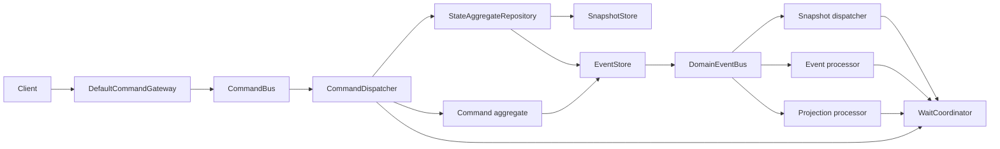
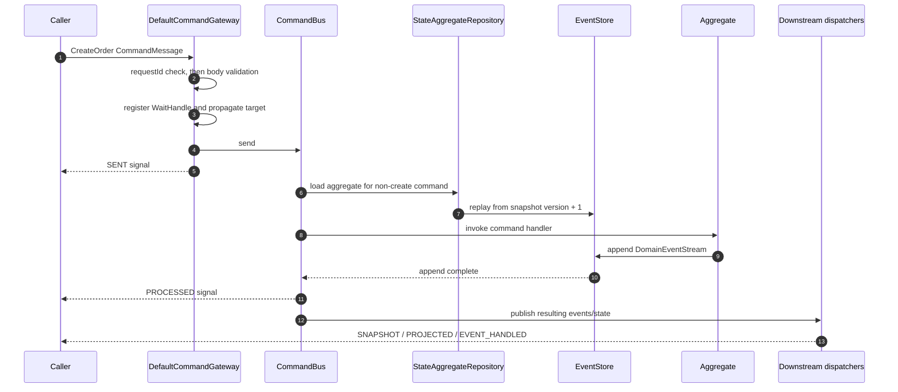

# Command Gateway

`CommandGateway` is the application-facing command entry point. It adds command-body validation, a request-ID precheck, and stage waiting to `CommandBus`; it does not move aggregate rules into the transport layer.

This guide follows one `CreateOrder` command. The same command can produce different successful responses depending on whether the caller waits for `SENT`, `PROCESSED`, `SNAPSHOT`, or `PROJECTED`.

## Send Command


The durable path is:

```text
validate + requestId check -> command bus -> restore aggregate -> handle command
-> append DomainEventStream -> publish state/domain events -> snapshot/process/project
```

The wait stage selects an observation point in that path. It does not change the command's business behavior.

## API Usage

Create one `CommandMessage` and reuse its `commandId` when constructing a wait plan:

```kotlin
val command = createOrder.toCommandMessage(
    aggregateId = "order-1",
    requestId = "create-order-1",
)
```

### Basic Methods

`sendAndWait` returns one final result. `sendAndWaitStream` exposes accepted intermediate signals and is appropriate for SSE or progress displays.

#### sendAndWait(command, waitPlan)

```kotlin
val result = commandGateway.sendAndWait(
    command,
    CommandWait.processed(command.commandId),
)
```

A successful `PROCESSED` result proves aggregate processing completed, including event append when the handler emitted events. It does not prove that a snapshot, projection, event processor, or Saga has completed.

#### sendAndWaitStream(command, waitPlan)

```kotlin
commandGateway.sendAndWaitStream(
    command,
    CommandWait.snapshot(command.commandId),
).doOnNext { result ->
    println("${result.stage}: ${result.succeeded}")
}
```

For a successful snapshot wait, the stream can expose `SENT`, `PROCESSED`, and `SNAPSHOT`. A failed prerequisite terminates the wait with that earlier-stage failure.

#### Wait Timeout

The default gateway deadline is 30 seconds. `withTimeout` changes the caller-side lifetime for this invocation; it is not propagated as a distributed message header.

```kotlin
val plan = CommandWait.projected(
    waitCommandId = command.commandId,
    contextName = command.contextName,
    processorName = "OrderSummaryProjection",
).withTimeout(Duration.ofSeconds(10))
```

A timeout means only that this caller stopped waiting. It does not cancel an already accepted command or prove that later processing failed. The gateway cancels its local `WaitHandle` when the wait terminates.

### Convenience Methods

```kotlin
commandGateway.sendAndWaitForSent(command)       // SENT
commandGateway.sendAndWaitForProcessed(command)  // PROCESSED
commandGateway.sendAndWaitForSnapshot(command)   // SNAPSHOT
```

Use the earliest stage that satisfies the response contract. Use `CommandWait.projected`, `eventHandled`, or `sagaHandled` when the caller needs a named downstream function.

## Core Concepts

### CommandResult

`CommandResult` is the public observation of one `WaitSignal`. Its most useful fields are:

| Field | Meaning |
|---|---|
| `stage` | Observed stage such as `SENT`, `PROCESSED`, `SNAPSHOT`, or `PROJECTED` |
| `succeeded` | Derived from `errorCode` |
| `aggregateVersion` | Version known at that stage; it can be `null` before aggregate processing |
| `commandId` / `waitCommandId` | Current command and the command whose plan owns the wait |
| `requestId` | Caller-controlled idempotency key carried by the original command |
| `function` | Function that emitted the signal; used by function-scoped stages |
| `errorCode`, `errorMsg`, `bindingErrors` | Observable failure details |
| `result` | Values accumulated from accepted signals |

Do not infer an unobserved stage from a successful result. In particular, `PROCESSED` is not an alias for `SNAPSHOT` or `PROJECTED`.

### WaitSignal vs CommandResult

`WaitSignal` is the internal stage notification. `DefaultCommandGateway` combines it with the original command's `requestId` and aggregate identity to create `CommandResult`. Local and remote notifiers transport signals; the result remains the public gateway contract.

### CommandGateway vs CommandBus

| Capability | `CommandBus` | `CommandGateway` |
|---|---:|---:|
| Route a `CommandMessage` | yes | yes |
| Validate command body | no contract | default implementation does |
| Precheck `requestId` | no contract | default implementation does |
| Register and await stages | no | yes |
| Return `CommandResult` | no | yes |

Code that needs only transport can use `CommandBus`. Request boundaries normally use `CommandGateway` so validation, idempotency, and wait semantics remain consistent.

## Architecture

### Component Architecture


```mermaid
flowchart LR
    Client --> Gateway[DefaultCommandGateway]
    Gateway --> Bus[CommandBus]
    Bus --> Dispatcher[CommandDispatcher]
    Dispatcher --> Repository[StateAggregateRepository]
    Repository --> SnapshotStore
    Repository --> EventStore
    Dispatcher --> Aggregate[Command aggregate]
    Aggregate --> EventStore
    EventStore --> EventBus[DomainEventBus]
    EventBus --> Snapshot[Snapshot dispatcher]
    EventBus --> Processor[Event processor]
    EventBus --> Projection[Projection processor]
    Snapshot --> Wait[WaitCoordinator]
    Processor --> Wait
    Projection --> Wait
    Dispatcher --> Wait
```

The event store is the authoritative history. Snapshot and processor stores are downstream state derived from that history.

### Message Bus Hierarchy

`CommandBus` specializes `MessageBus` for command exchanges. The concrete bus can be in-memory, distributed, or local-first. The bus acceptance represented by `SENT` is a transport boundary, not aggregate execution.

### At-a-Glance Reference

| Component | Responsibility |
|---|---|
| `DefaultCommandGateway` | pre-send checks, wait registration, sending, result mapping, deadline |
| `RequestIdChecker` | fast precheck plus authoritative existence lookup when needed |
| `WaitCoordinator` | owns in-process wait handles keyed by `waitCommandId` |
| `RetryableAggregateProcessor` | restores aggregate state and retries recoverable aggregate processing failures |
| `SimpleCommandAggregate` | checks aggregate invariants, invokes handler, sources and appends emitted events |
| `EventSourcingStateAggregateRepository` | loads a current snapshot when applicable and replays later events |
| notifier filters | emit `PROCESSED`, `SNAPSHOT`, `PROJECTED`, `EVENT_HANDLED`, and `SAGA_HANDLED` signals |

## Command Processing Chain


```mermaid
sequenceDiagram
    autonumber
    participant C as Caller
    participant G as DefaultCommandGateway
    participant B as CommandBus
    participant R as StateAggregateRepository
    participant E as EventStore
    participant A as Aggregate
    participant D as Downstream dispatchers

    C->>G: CreateOrder CommandMessage
    G->>G: requestId check, then body validation
    G->>G: register WaitHandle and propagate target
    G->>B: send
    G-->>C: SENT signal
    B->>R: load aggregate for non-create command
    R->>E: replay from snapshot version + 1
    B->>A: invoke command handler
    A->>E: append DomainEventStream
    E-->>B: append complete
    B-->>C: PROCESSED signal
    B->>D: publish resulting events/state
    D-->>C: SNAPSHOT / PROJECTED / EVENT_HANDLED
```

For a creation command, `RetryableAggregateProcessor` creates a fresh state aggregate rather than restoring existing history. For later commands it delegates restoration to `StateAggregateRepository`.

### DefaultCommandGateway: Pre-Send Pipeline

The default order is intentional:

1. `RequestIdChecker.check(aggregateId, requestId)` runs.
2. If the fast checker rejects the ID, the configured `RequestIdExistenceChecker` confirms whether it already exists. `EventStore` provides a default history scan, while backends may provide an indexed implementation.
3. A `CommandValidator` body runs its own `validate()` method.
4. Jakarta Validation checks the body.
5. Only after all checks pass does the gateway call `CommandBus.send`.

No guide-level claim can replace backend evidence. Duplicate protection ultimately depends on the selected event store's atomic append/version/request-ID behavior.

### DefaultCommandGateway: Post-Send Signal

`SENT` is synthesized after `CommandBus.send` completes. The optimized `sendAndWaitForSent` path does not allocate a wait handle or propagate downstream wait headers. A bus error is represented as a failed `SENT` result wrapped by `CommandResultException`.

## Error Handling

Failures are observable at the stage where they occur:

| Boundary | Typical result | What is still unproven |
|---|---|---|
| idempotency or validation | failed `SENT` result | command was not sent |
| command bus send | failed `SENT` result | aggregate did not acknowledge processing |
| restore, business rule, or append | failed `PROCESSED` result | no later stage is proven |
| snapshot strategy/store | failed `SNAPSHOT` result | projection and event processor are independent |
| projection function/store | failed `PROJECTED` result | event history can still be authoritative |
| event processor | failed `EVENT_HANDLED` result | retry/compensation depends on that processor policy |

### CommandResultException

`sendAndWait` converts unsuccessful final results into `CommandResultException`. Inspect `commandResult.stage`, `errorCode`, `bindingErrors`, and `aggregateVersion`; do not branch on message text.

```kotlin
commandGateway.sendAndWaitForProcessed(command)
    .onErrorResume(CommandResultException::class.java) { error ->
        audit(error.commandResult)
        Mono.error(error)
    }
```

### CommandValidationException

Self-validation and Jakarta constraints are gateway checks. They run before bus send in `DefaultCommandGateway`, so their mapped result is at `SENT` with no processed aggregate version.

### DuplicateRequestIdException

`requestId` is scoped to an aggregate. Reusing it for the same aggregate is rejected when the configured checker confirms prior use. Treat it as a stable operation ID and reuse it only when retrying the same intent.

### Exception Reference

| Exception | Meaning |
|---|---|
| `CommandValidationException` | body validation failed before sending |
| `DuplicateRequestIdException` | the request ID was confirmed as already used for the aggregate |
| `CommandResultException` | the final observed command result failed |
| `TimeoutException` | caller deadline elapsed; command outcome can still be unknown |
| `EventVersionConflictException` | event append raced with another aggregate version |

### Error Handling Best Practices

1. Log `commandId`, `requestId`, aggregate identity, and `stage` together.
2. Retry the same business intent with the same `requestId`; do not generate a new key merely because the response was lost.
3. After a timeout, query an authoritative result or retry idempotently instead of assuming failure.
4. Keep downstream side effects idempotent because event delivery and recoverable retries can invoke them again.

## Idempotency

The gateway uses a fast per-aggregate checker. A fast rejection is confirmed through `RequestIdExistenceChecker`; `NoopRequestIdExistenceChecker` fails closed. The event stream also records `requestId`, allowing history-backed confirmation.

This is a defense in depth, not a blanket exactly-once guarantee. The durable guarantee is backend-specific: an event-store implementation must atomically enforce the invariants it claims during append. Downstream processors own their own idempotency because their side effects are outside event-store append.

### Configuration

```yaml
wow:
  command:
    idempotency:
      enabled: true
      bloom-filter:
        expected-insertions: 1000000
        ttl: PT60S
        fpp: 0.00001
```

Tune the fast checker for capacity and false positives. Do not use Bloom-filter settings as evidence of durable duplicate prevention.

## Wait Plans

A `WaitPlan` contains a `waitCommandId`, a target, void-command support, and an optional caller-side timeout decorator. The gateway propagates the endpoint and target in command headers only after registering the local wait handle, avoiding a signal-before-registration race.

### CommandWait

```kotlin
CommandWait.sent(command.commandId)
CommandWait.processed(command.commandId)
CommandWait.snapshot(command.commandId)
CommandWait.projected(
    command.commandId,
    contextName = "example",
    processorName = "OrderSummaryProjection",
)
CommandWait.eventHandled(
    command.commandId,
    contextName = "example",
    processorName = "OrderEventProcessor",
)
```

Function matching applies to `PROJECTED`, `EVENT_HANDLED`, and `SAGA_HANDLED`. Empty processor/function fields broaden matching; use explicit names when one particular consumer defines completion.

#### Wait Stage Comparison

| Stage | Proves | Does not prove |
|---|---|---|
| `SENT` | command bus accepted the message | aggregate loaded or event appended |
| `PROCESSED` | aggregate path completed, including emitted event append | snapshot or downstream consumer completion |
| `SNAPSHOT` | snapshot dispatcher completed its strategy | a snapshot was written under `version_offset`; projection completion |
| `PROJECTED` | matching projection function completed; final projection marker observed | unrelated projections/processors completed |
| `EVENT_HANDLED` | matching event processor function completed | side effect is globally exactly-once |
| `SAGA_HANDLED` | matching Saga handled the source event | commands emitted by the Saga reached their final stages |

#### Wait Plan Hierarchy

`StageWaitTarget` represents one stage and optional function. `ChainWaitTarget` starts with a Saga function and follows the command emitted from that Saga to a tail stage. Stage ordering is not a single linear chain: `SNAPSHOT`, `PROJECTED`, `EVENT_HANDLED`, and `SAGA_HANDLED` all depend on `PROCESSED` but are otherwise independent branches.

### Chain Wait Plan

Use a chain only when the response contract crosses from a source command, through one Saga function, to the command emitted by that Saga:

```kotlin
val plan = CommandWait.chain(
    waitCommandId = command.commandId,
    function = NamedFunctionInfoData(
        contextName = "example",
        processorName = "CartSaga",
        name = "onEvent",
    ),
    tailStage = CommandStage.PROCESSED,
    tailFunction = NamedFunctionInfoData("example"),
)
```

This is correlation, not a distributed transaction. Each command still has its own idempotency and failure boundary.

## Validation

Use Jakarta annotations for structural input and `CommandValidator` for body-local cross-field checks. Keep state-dependent business rules in aggregate command handlers, after restoration. `CreateOrder` demonstrates both: annotations validate items/address, while `validate()` checks the supported country. Inventory, price, ownership, current version, and lifecycle checks remain aggregate/application concerns.

## LocalFirst Mode: Reducing the Impact of Network IO

`LocalFirstCommandBus` can admit a command locally when a matching local dispatcher is ready and still send the marked distributed copy as defined by the bus implementation. It does not change the meaning of `SENT` or later stages, and void commands do not use local-first routing.

### Configuration

```yaml
wow:
  command:
    bus:
      local-first:
        enabled: true
```

Use the same wait and idempotency contracts regardless of routing choice.

## Command Bus Implementations

### InMemoryCommandBus

Useful for a single runtime and tests. Its `SENT` result means the in-process bus accepted the message; it is not durable across process failure.

### KafkaCommandBus

Provides distributed transport. Broker acknowledgement, consumer retry, and ordering behavior depend on Kafka/module configuration; the gateway does not turn those settings into an exactly-once business guarantee.

## HTTP Integration (WebFlux)

Generated command routes bridge HTTP requests to the same gateway contract. JSON responses return the final result; `Accept: text/event-stream` selects the result stream.

### Request Processing Flow

The example order route can explicitly request `SNAPSHOT`:

```shell
curl -X POST \
  'http://localhost:8080/tenant/tenant-1/owner/customer-1/sales-order' \
  -H 'Content-Type: application/json' \
  -H 'Wow-Space-Id: store-1' \
  -H 'Command-Aggregate-Id: order-1' \
  -H 'Command-Request-Id: create-order-1' \
  -H 'Command-Wait-Stage: SNAPSHOT' \
  -d '{"items":[{"productId":"product-1","price":10,"quantity":2}],"address":{"country":"China","province":"Shanghai","city":"Shanghai","district":"Pudong","detail":"Road 1"},"fromCart":true}'
```

The returned `stage: SNAPSHOT` proves the snapshot dispatcher completed. With the `all` strategy it includes a save; with `version_offset`, the strategy may legitimately complete without writing at that version.

### Command Route Generation

The route metadata supplies command type, aggregate identity, path/header variables, and request-body decoding. The default HTTP wait stage is `PROCESSED`. Important headers include `Command-Request-Id`, `Command-Aggregate-Id`, `Command-Wait-Stage`, function selectors, tail selectors, and `Command-Wait-Timeout` in milliseconds.

## Command Rewriter

A `CommandRewriter` may enrich or redirect a command before dispatch, for example resolving an aggregate ID from a verified query. Keep authorization and ambiguity handling explicit; a rewriter does not replace aggregate validation or event-store concurrency checks.

## Configuration Reference

```yaml
wow:
  command:
    bus:
      type: kafka
      local-first:
        enabled: true
    idempotency:
      enabled: true
      bloom-filter:
        expected-insertions: 1000000
        ttl: PT60S
        fpp: 0.00001
```

Choose configuration from the selected runtime modules and verify it against that module's tests. The public stage meanings above remain the application contract.
