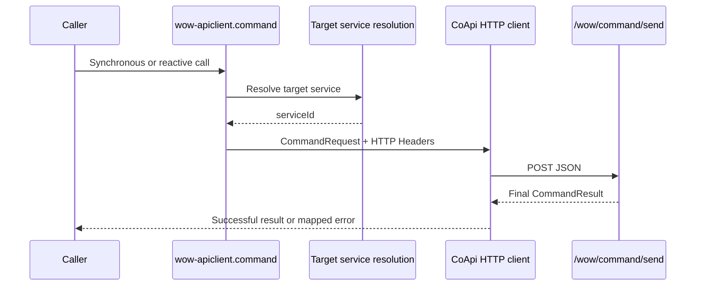

# API Client

`wow-apiclient` provides hand-maintained CoApi command interfaces for Kotlin services calling a remote Wow application. The current implementation calls only global `POST /wow/command/send` and returns one final `CommandResult`.

The API Client is a remote final-result client for the global JSON facade, not an equivalent of the local Gateway or SSE.



## Capability Boundary

`ReactiveRestCommandGateway` and `SyncRestCommandGateway` are HTTP transport adapters, not equivalents of the local `CommandGateway`:

- they call only `/wow/command/send`, not a generated aggregate-specific command route;
- they unwrap only the final result and expose no stage stream;
- they map `CommandRequest` fields to the global facade's request headers and body;
- before the exchange, they run only a command body's own `CommandValidator`; the server still owns the complete Gateway checks and aggregate processing.

Callers must design failure handling around remote HTTP, service discovery, authorization, timeout, and idempotency boundaries.

## Installation and CoApi Registration

```kotlin [Gradle(Kotlin)]
implementation("me.ahoo.wow:wow-apiclient")
implementation("me.ahoo.coapi:coapi-spring-boot-starter")
```

Register only the interface the application uses:

```kotlin
@EnableCoApi(clients = [ReactiveRestCommandGateway::class])
@SpringBootApplication
class ClientApplication
```

Register `SyncRestCommandGateway::class` instead for a synchronous application. Both interfaces already declare `@CoApi` and `@LoadBalanced`; one call does not need another factory or wrapper layer.

## CommandRequest

`CommandRequest` requires `body` and maps its other values to the destination or HTTP headers:

```kotlin
val request = CommandRequest(
    body = createOrder,
    aggregateId = "order-1",
    requestId = "create-order-1",
    serviceUri = "http://order-service:8080",
    waitPlan = CommandRequest.WaitPlan(
        waitStage = CommandStage.PROCESSED,
        waitTimeout = 5_000,
    ),
)
```

`type` defaults to `body::class.java.name`. `WaitPlan` defaults to `PROCESSED` and contains only `waitStage`, `waitContext`, `waitProcessor`, and millisecond `waitTimeout`. `aggregateId`, `aggregateVersion`, `tenantId`, `ownerId`, `spaceId`, `requestId`, `localFirst`, `context`, and `aggregate` are sent as routing or message headers for the global facade.

## Target Service Resolution

The current `CommandRequest.sendUri` rule is:

```text
(serviceUri ?: "http://" + serviceId) + "/wow/command/send"
```

`serviceId` uses explicit `context` first; otherwise `MetadataSearcher` resolves the context from `commandType`. Set `serviceUri` for a fixed remote address. Without it, the `@LoadBalanced` client must resolve the service host derived from the context.

`send(CommandRequest)` passes an absolute URI, so `@CoApi(baseUrl)` does not choose the command destination. Do not use a false `context` to bypass missing metadata; it participates in both the command target and default service discovery.

## Reactive Invocation

```kotlin
@Service
class OrderService(
    private val commands: ReactiveRestCommandGateway,
) {
    fun create(request: CommandRequest): Mono<CommandResult> =
        commands.send(request)
}
```

The reactive gateway returns `Mono<CommandResult>`. It waits for the server's final JSON result for the selected stage and provides no `Flux` or SSE progress stream.

## Synchronous Invocation

```kotlin
@EnableCoApi(clients = [SyncRestCommandGateway::class])
class ClientConfiguration

val result: CommandResult = syncGateway.send(request)
```

The synchronous gateway blocks the calling thread and returns `CommandResult`. Use it only on an application path that deliberately uses synchronous I/O; do not invoke it from a Reactor event loop or Wow's core reactive processing chain.

## Error Mapping

The reactive gateway maps `WebClientResponseException` to `RestCommandGatewayException`; the synchronous gateway applies the same mapping in `send(CommandRequest)`. If the response body decodes as `CommandResult` or `DefaultErrorInfo`, the exception retains the request, error code, message, and binding errors:

```kotlin
commands.send(request)
    .doOnError(RestCommandGatewayException::class.java) { error ->
        log.warn("Command failed: {}", error.errorCode)
    }
```

A blank or unknown error body still becomes `RestCommandGatewayException` with the original HTTP exception as its cause. Do not branch on error-message text or blindly retry a command without a stable `requestId`.

## Currently Unsupported Protocol Capabilities

The current API Client does not expose every command header already present in the global OpenAPI, and it does not provide aggregate-route streaming:

- **SSE:** both gateways request and unwrap only a final JSON `CommandResult`; there is no counterpart to `sendAndWaitStream`.
- **Function-name matching:** `CommandRequest.WaitPlan` has `waitContext` and `waitProcessor`, but no field for `Command-Wait-Function`, so it cannot narrow the wait by a concrete function name.
- **Saga chain-tail fields:** it has no fields for `Command-Wait-Tail-Stage`, `Context`, `Processor`, or `Function`, so it cannot express the tail target of a Saga wait chain.

When one of these capabilities is required, use an HTTP route whose generated contract declares it, or use the local `CommandGateway` inside the application. Do not claim that the current REST client is equivalent to the local Gateway.
