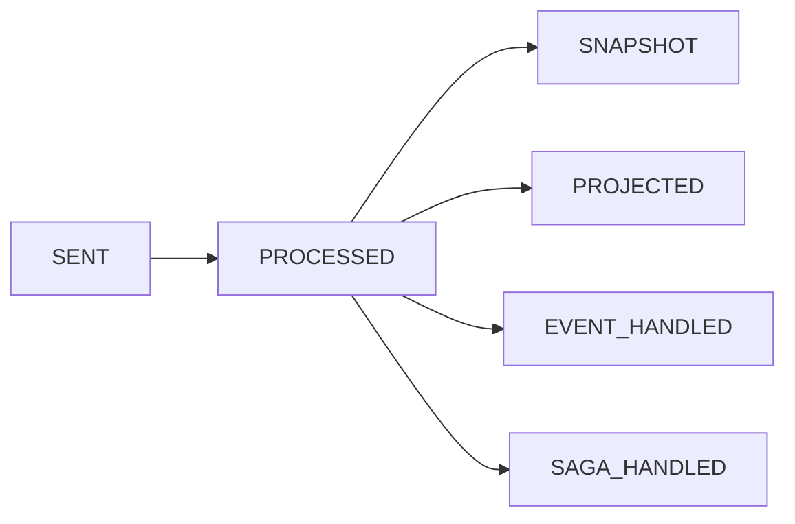

# Completion Semantics

Command “completion” is not one universal instant. It is an observation point selected by the caller. First define the facts that must hold after the response, then wait for the earliest stage that satisfies that contract. A later stage adds latency without automatically providing guarantees the caller does not need.

## Choose the Earliest Stage That Satisfies the Contract

| Stage | A successful result confirms | It does not confirm |
| --- | --- | --- |
| `SENT` | The `CommandBus` accepted the command | The aggregate processed it or events were appended |
| `PROCESSED` | The command-processing pipeline produced its result | A snapshot, projection, event processor, or Saga completed |
| `SNAPSHOT` | The aggregate-state snapshot branch completed | Any projection, event processor, or Saga completed |
| `PROJECTED` | The matching projection function processed the last event | Other projections or downstream branches completed |
| `EVENT_HANDLED` | The matching event-processing function completed | A projection, Saga, or external system is finally consistent |
| `SAGA_HANDLED` | The matching Saga function completed | Commands emitted by that Saga also completed |

For example, choose `SENT` when a write endpoint only needs bus acceptance, at least `PROCESSED` when the response must expose the aggregate-processing result, and the matching `PROJECTED` only when the response contract requires a particular read model to be visible.

## Stage Dependency Graph

`SNAPSHOT`, `PROJECTED`, `EVENT_HANDLED`, and `SAGA_HANDLED` all depend on `PROCESSED`, but they are independent branches rather than one global linear chain:



Observing `PROJECTED` therefore does not mean `SNAPSHOT` or `SAGA_HANDLED` has completed. Stage signals arrive in observed order. Distributed notification, scheduling, and concurrent processing can make a downstream signal visible to the waiter before `PROCESSED`.

## SENT and PROCESSED

`SENT` is the sending boundary. `CommandGateway.sendAndWaitForSent` creates its result after `CommandBus.send` succeeds. It is a low-latency acceptance acknowledgement, not a promise that business rules have run.

`PROCESSED` comes from the command-processing pipeline. It is the common prerequisite of every later stage and the observation point for command-processing success or failure. Do not infer persistence semantics from the stage name alone when it fails; see [Failures and Idempotency](./reliability.md).

## SNAPSHOT and Downstream Branches

`SNAPSHOT` means the snapshot branch completed. A snapshot is a replaceable loading checkpoint, not authoritative event history; see [Event Sourcing](../domain/event-sourcing.md) for that boundary.

The three function-oriented downstream stages observe different dispatchers:

- `PROJECTED`: a projection function. The wait state completes this stage only after a matching signal has `isLastProjection == true`.
- `EVENT_HANDLED`: an event-processing function.
- `SAGA_HANDLED`: a stateless Saga function. Its signal can also carry the downstream `commandId` values emitted by that function.

Waiting for one branch does not implicitly wait for either of the others. If a response must satisfy several independent branches, the application must compose those contracts explicitly instead of treating one stage as a global “latest” stage.

## Function Matching

`PROJECTED`, `EVENT_HANDLED`, and `SAGA_HANDLED` can identify a function by `contextName`, `processorName`, and `functionName`:

```kotlin
val waitPlan = CommandWait.projected(
    waitCommandId = message.commandId,
    contextName = "order",
    processorName = "OrderProjection",
    functionName = "onOrderCreated",
)
```

An empty matching field is a wildcard; every non-empty field must match. Use the most specific function identity available so another function at the same stage cannot satisfy the wait early. `SENT`, `PROCESSED`, and `SNAPSHOT` do not filter by function.

## Chained Waiting

`CommandWait.chain` first waits for a matching main `SAGA_HANDLED` function, reads the downstream `commandId` values that the Saga emitted from its signal, and then waits for the configured tail stage and function on every downstream command. It means “this Saga invocation and the commands it actually emitted,” not every command of the same type in the system.

A downstream command signal can arrive before the main Saga signal. The chain wait stores such signals temporarily. After the main signal confirms the actual downstream `commandId` values, it creates the tail states and replays matching signals in their original observed order. An unconfirmed pending signal cannot complete the chain.

## Final Result and Result Stream

The two Gateway APIs described in [Send Commands](./sending.md) use the same wait state but expose it differently:

- `sendAndWait` returns the final `CommandResult` that completes the wait plan. The wait state accumulates `result` values from prerequisite and target stages.
- `sendAndWaitStream` emits a `CommandResult` for every accepted signal in observed order. The same stage can produce multiple elements.

For `SNAPSHOT` and the three downstream stages, an early target signal does not complete the wait immediately. The state retains it until `PROCESSED` has also been observed. If a prerequisite stage fails, the wait ends early with that failure instead of continuing to the target branch.

## Timeout, Cancellation, and Unknown Outcomes

A wait plan has a default 30-second caller-side end-to-end deadline. `withTimeout` can set a positive duration. The deadline covers prechecks, sending, and stage waiting. A timeout or subscriber cancellation releases the local wait handle, but it does not undo a command already accepted by the bus or already executed.

A timeout therefore means “this call did not observe the contracted result before its deadline.” It does not mean the command failed or that no event was appended. Treat it as an unknown outcome: retain the original `requestId`, query authoritative state first, and then follow [Failures and Idempotency](./reliability.md) to decide whether to retry.
