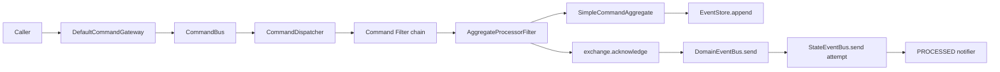

# Command Processing Pipeline

This page explains how a non-`Void` command crosses the Wow runtime. See [Send Commands](../sending.md) for application APIs and [Completion Semantics](../completion.md) for choosing a wait stage; this page covers implementation order and failure boundaries only.

## Component map



`CommandBus` transports envelopes; `CommandDispatcher` creates processors by named aggregate and maps the same aggregate ID to a stable scheduling group; the `CommandFilter` chain defines processing boundaries. Aggregate execution, event persistence, transport acknowledgement, domain-event publication, and state-event publication are separate operations.

## Pre-send pipeline

Every `DefaultCommandGateway` send path first runs the same `check`:

1. `RequestIdChecker.check(aggregateId, requestId)` performs the request-ID precheck; `false` terminates with `DuplicateRequestIdException`.
2. A body implementing `CommandValidator` validates itself before the Jakarta `Validator` runs.
3. `CommandBus.send` is invoked only after both checks complete.

`sendAndWait` and `sendAndWaitStream` also verify that the wait plan supports a `Void` command, register a wait handle, propagate the wait plan into the Header, and then send. `sendAndWaitForSent` is a separate fast path: it allocates no handle and propagates no wait Header, but synthesizes a `SENT` result after `CommandBus.send` succeeds.

The precheck is not the durable concurrency decision. Atomic request-ID and version conflicts remain the responsibility of `EventStore.append`; see [Failures and Idempotency](../reliability.md).

## Bus to Dispatcher

`CommandBus.receive`, or the runtime-owned `runtimeReceiver`, produces `ServerCommandExchange` instances. `CommandDispatcher` first filters `isVoid` messages: it acknowledges them without entering the aggregate command chain. Ordinary commands are dispatched by `NamedAggregate`.

Each `AggregateCommandDispatcher` resolves aggregate metadata and calculates a group key from the aggregate ID. Commands for one ID retain scheduler affinity while multiple IDs can share a worker. This prevents concurrent execution for one aggregate inside this process; it does not replace the EventStore's durable version constraint.

`DefaultCommandHandler` executes the Filter chain sorted by `@Order`. Its core order is:

```text
ProcessedNotifierFilter
  -> AggregateProcessorFilter
    -> SendDomainEventStreamFilter
      -> SendStateEventFilter
```

The first Filter is the outermost wrapper, so it observes completion or failure of the entire inner pipeline, not just the aggregate function return.

## Aggregate recovery and invocation

`AggregateProcessorFilter` puts the `ServiceProvider` and aggregate metadata into the exchange, then creates an `AggregateProcessor` for the aggregate identity. The default `RetryableAggregateProcessor`:

- constructs an empty StateAggregate for a create command;
- restores other commands through `StateAggregateRepository`;
- creates a `SimpleCommandAggregate` from that state; the aggregation pattern constructs a command root with the state, while the non-aggregation pattern reuses the state object;
- rebuilds state and retries only failures marked recoverable, using the built-in backoff policy.

`SimpleCommandAggregate.process` then checks expected version, create permission, owner, space, deleted/recovery state, and command-function availability. `CommandFunctionResolver` invokes the matching function and ordered after-command functions, flattens their returns into one `DomainEventStream`, and stores it on the exchange.

## In-memory sourcing and append

After the function produces an event stream, `SimpleCommandAggregate` first calls `state.onSourcing(eventStream)` on the current working instance and then calls `EventStore.append(eventStream)`. The order makes the new state available during the same processing attempt, but append success remains the authoritative commit point:

```text
invoke command
  -> build DomainEventStream
  -> source events into in-memory state
  -> EventStore.append
  -> mark command state STORED
```

Before append, the exchange aggregate version is set to the event-stream version; the command state returns to `STORED` only after append succeeds. An append failure moves this command aggregate to `EXPIRED`, so the working instance cannot continue. See [Event Sourcing](../../domain/event-sourcing.md) for the history and recovery contract.

## Ack/event-send order

`AggregateProcessorFilter` applies `finallyAck` to aggregate processing. The exchange transport acknowledgement therefore runs whether aggregate processing completes or fails; only the successful path enters the next Filter. `SendDomainEventStreamFilter` obtains the stream from the exchange and waits for `DomainEventBus.send` before continuing. The following `SendStateEventFilter`, when state is initialized, copies the event stream and current state into a `StateEvent` and attempts `StateEventBus.send`.

The effective order is:

```text
EventStore.append
  -> command exchange ack
  -> DomainEventBus.send
  -> StateEventBus.send attempt
  -> PROCESSED signal
```

When the aggregate fails before producing a stream, the exchange is still acknowledged but the event-send Filter is not entered. If events were appended and `DomainEventBus.send` then fails, the transport acknowledgement has already happened, the error propagates outward, `StateEventBus.send` is not attempted, and `PROCESSED` observes failure. Domain-event publication failure cannot be read as “events were not stored,” and the command transport cannot be assumed to redeliver it.

`StateEventBus.send` has a different failure boundary: `SendStateEventFilter` uses `logErrorResume()` to log the error and resume with empty completion before continuing the Filter chain. A successful `PROCESSED` therefore proves only that state-event publication was attempted and returned, not that the StateEvent was published; snapshots and projections that depend on that input may not receive it. A future `event/dispatch` page will cover event-side consumption; no active link is created here yet.

## `PROCESSED` error boundary

`ProcessedNotifierFilter` wraps the inner chain with `MonoCommandWaitNotifier`:

- normal inner completion creates a `PROCESSED` signal from exchange function, version, result, and any business error;
- an inner error creates a failed signal and then propagates the original error to the outer error handler; a retry-exhausted wrapper is reduced to its cause first;
- no signal is produced when there is no wait Header or the target does not require `PROCESSED`;
- notification is fire-and-forget, so notification failure is logged without replacing the command result.

Successful `PROCESSED` therefore means aggregate execution, event append, command acknowledgement, and `DomainEventBus.send` completed, and `SendStateEventFilter` also completed; when state is initialized, the `StateEventBus.send` attempt returned. It does not guarantee successful StateEvent publication or mean snapshot, projection, event handler, or Saga completion. A failed signal alone also cannot prove that no event was appended; inspect authoritative history as described in [Failures and Idempotency](../reliability.md).

## Source entry points

- [`DefaultCommandGateway`](https://github.com/Ahoo-Wang/Wow/blob/main/wow-core/src/main/kotlin/me/ahoo/wow/command/DefaultCommandGateway.kt)
- [`CommandDispatcher`](https://github.com/Ahoo-Wang/Wow/blob/main/wow-core/src/main/kotlin/me/ahoo/wow/modeling/command/dispatcher/CommandDispatcher.kt) and [`AggregateCommandDispatcher`](https://github.com/Ahoo-Wang/Wow/blob/main/wow-core/src/main/kotlin/me/ahoo/wow/modeling/command/dispatcher/AggregateCommandDispatcher.kt)
- [`AggregateProcessorFilter`](https://github.com/Ahoo-Wang/Wow/blob/main/wow-core/src/main/kotlin/me/ahoo/wow/modeling/command/dispatcher/AggregateProcessorFilter.kt) and [`SendDomainEventStreamFilter`](https://github.com/Ahoo-Wang/Wow/blob/main/wow-core/src/main/kotlin/me/ahoo/wow/modeling/command/dispatcher/SendDomainEventStreamFilter.kt)
- [`RetryableAggregateProcessor`](https://github.com/Ahoo-Wang/Wow/blob/main/wow-core/src/main/kotlin/me/ahoo/wow/modeling/command/RetryableAggregateProcessor.kt) and [`SimpleCommandAggregate`](https://github.com/Ahoo-Wang/Wow/blob/main/wow-core/src/main/kotlin/me/ahoo/wow/modeling/command/SimpleCommandAggregate.kt)
- [`EventStore`](https://github.com/Ahoo-Wang/Wow/blob/main/wow-core/src/main/kotlin/me/ahoo/wow/eventsourcing/EventStore.kt), [`SendStateEventFilter`](https://github.com/Ahoo-Wang/Wow/blob/main/wow-core/src/main/kotlin/me/ahoo/wow/eventsourcing/state/SendStateEventFilter.kt), and [`NotifierFilters`](https://github.com/Ahoo-Wang/Wow/blob/main/wow-core/src/main/kotlin/me/ahoo/wow/command/wait/NotifierFilters.kt)
