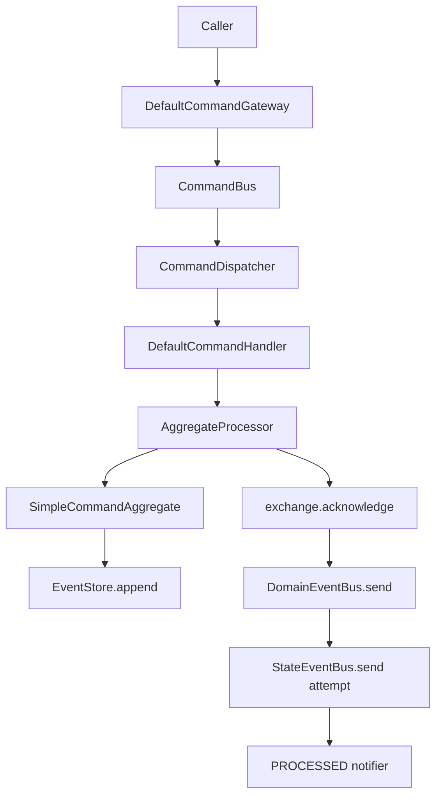

# Command Processing Pipeline

This page explains how a non-`Void` command crosses the Wow runtime. See [Send Commands](../sending.md) for application APIs and [Completion Semantics](../completion.md) for choosing a wait stage; this page covers implementation order and failure boundaries only.

## Component map


```mermaid
flowchart TB
    Caller --> Gateway[DefaultCommandGateway]
    Gateway --> Bus[CommandBus]
    Bus --> Dispatcher[CommandDispatcher]
    Dispatcher --> Handler[DefaultCommandHandler]
    Handler --> Processor[AggregateProcessor]
    Processor --> Aggregate[SimpleCommandAggregate]
    Aggregate --> Store[EventStore.append]
    Processor --> Ack[exchange.acknowledge]
    Ack --> EventBus[DomainEventBus.send]
    EventBus --> StateBus[StateEventBus.send attempt]
    StateBus --> Processed[PROCESSED notifier]
```

`CommandBus` transports envelopes; `CommandDispatcher` creates processors by named aggregate and maps the same aggregate ID to a stable scheduling group; `DefaultCommandHandler` runs the command pipeline in a fixed order. Aggregate execution, event persistence, transport acknowledgement, domain-event publication, and state-event publication are separate operations.

## Pre-send pipeline

`DefaultCommandGateway` is a facade: it puts one admission chain in front of a `CommandBus` it does not own. Every send path runs the same chain, in this order:

1. A body implementing `CommandValidator` validates itself before the Jakarta `Validator` runs.
2. `RequestIdChecker.check(aggregateId, requestId)` performs the request-ID precheck; `false` terminates with `DuplicateRequestIdException`. Validation runs first, so a command that fails it does not consume its request ID (since 9.2.3).
3. For `sendAndWait` and `sendAndWaitStream` only: the wait plan must support a `Void` command, the wait handle is registered, and the message to send is built as a copy of the caller's message whose Header also carries the wait keys. The caller's message is not modified (since 9.3.0; before it, the gateway wrote the wait keys into the caller's Header just before sending).
4. `CommandBus.send`; when it fails, `RequestIdChecker.release` gives the reservation back.

The `SENT` signal is produced in one place, after `CommandBus.send` succeeded or failed, and handed to whoever waits: the registered handle, the upstream wait of a command a saga sends for a waiting chain, or the result of `sendAndWaitForSent`. `sendAndWaitForSent` registers no handle and writes no wait Header. Every wait is bounded by one end-to-end deadline, armed once when the call is subscribed, on the gateway's own timer (since 9.3.0; a stream used to re-arm its timeout per element on a shared scheduler). Closing the gateway releases only that timer; it does not close the `CommandBus`, which belongs to whoever created it (since 9.3.0).

The precheck is not the durable concurrency decision. The processing node checks the request ID again before the aggregate runs (below), and atomic request-ID and version conflicts remain the responsibility of `EventStore.append`; see [Failures and Idempotency](../reliability.md).

## Bus to Dispatcher

`CommandBus.receiver`, with a runtime-owned subscription for the runtime's `CommandDispatcher`, produces `ServerCommandExchange` instances. `CommandDispatcher` first filters `isVoid` messages: it acknowledges them without entering the command pipeline. Ordinary commands are dispatched by `NamedAggregate`.

Each `AggregateCommandDispatcher` holds its aggregate's metadata, passes it to the `CommandHandler` with each command, and calculates a group key from the aggregate ID. Commands for one ID retain scheduler affinity while multiple IDs can share a worker. This prevents concurrent execution for one aggregate inside this process; it does not replace the EventStore's durable version constraint.

`DefaultCommandHandler` runs a fixed pipeline; there is no command filter chain (since 9.3.0; before it, `CommandFilter` beans sorted by `@Order`):

```text
CommandInstrumentation (each, the first outermost)
  -> PROCESSED report
    -> request-ID check, aggregate processing, then acknowledgement
      -> DomainEventBus.send
        -> StateEventBus.send attempt
```

The request-ID check runs on the node that processes the command, before the aggregate's handler (since 9.3.0). It uses its own Bloom filter, not the gateway's, and asks the `EventStore` only when that filter has seen the request ID; a request ID the aggregate already committed fails the command with `DuplicateRequestIdException` without running the handler. `wow.command.idempotency.enabled=false` turns it off together with the gateway's check.

The outer steps wrap the inner ones, so they observe completion or failure of the entire inner pipeline, not just the aggregate function return. What used to need a command filter maps to a typed extension point:

| Need | Since 9.3.0 |
| --- | --- |
| Tracing, metrics, logging around each command | A `CommandInstrumentation` bean: `around(exchange, handling)` wraps the whole pipeline and must not change its outcome. The OpenTelemetry module's `TraceCommandInstrumentation` replaces `TraceAggregateFilter`. Several of them wrap each other in `@Order` order. |
| Checking or rejecting a command before it runs | Validate the command (`CommandValidator`, Jakarta validation) at the gateway, or check in the command function; an error it throws fails the command. |
| Reacting to committed events | An event processor, saga or projection on the published events. |
| Changing what a command handler receives | An injected parameter (a Spring bean, or a value the exchange provides). |

## Aggregate recovery and invocation

`DefaultCommandHandler` puts the `ServiceProvider` into the exchange, then creates an `AggregateProcessor` for the aggregate identity and metadata. The default `RetryableAggregateProcessor`:

- constructs an empty StateAggregate for a create command;
- restores other commands through `StateAggregateRepository`;
- creates a `SimpleCommandAggregate` from that state; the aggregation pattern constructs a command root with the state, while the non-aggregation pattern reuses the state object;
- rebuilds state and retries only failures marked recoverable, using the built-in backoff policy;
- starts every attempt from the exchange as it was before the first one: the error, event stream, aggregate version, command-invoke result, command results and command aggregate of a failed attempt are not carried over, so a wait signal never reports a version that was not stored (since 9.2.3);
- runs the `@OnError` function once, after the final failure (unwrapped from a retry exhaustion), on the most recently loaded aggregate: the last attempt's, or an earlier attempt's when the last one failed before loading; not when no attempt loaded one, and not for a custom `CommandAggregate` that is not a `SimpleCommandAggregate`, whose own `process` handles its errors (since 9.2.3).

`SimpleCommandAggregate.process` then checks expected version, create permission, owner, space, deleted/recovery state, and command-function availability. It looks the command up in the aggregate's `AggregateModel`, which is compiled once when the aggregate metadata is parsed: the command entries (with the matching after-command functions and the built-in delete, recover and resource-tag handlers), the error functions and the sourcing table that every state aggregate of the type shares. Handlers take the command root or state root as an argument, so nothing is bound per aggregate instance or per command (since 9.3.0). The entry invokes the matching function and ordered after-command functions, flattens their returns into one `DomainEventStream`, and stores it on the exchange. One result adapter, chosen per function when the model compiles, turns every return shape (a value, `Mono`, `Flux`, another `Publisher`, `Flow` or a `suspend` result) into that stream with one exception rule: what the function throws arrives unwrapped, also when a function returning `Flow` throws before returning it (since 9.3.0).

## Decide, apply, then append

The command function only reads the state. Its event stream is applied to the state, then appended, as one atomic unit (since 9.3.0): persisted events are always loadable, and in-memory state never diverges from the store.

```text
invoke command (reads state)
  -> build DomainEventStream
  -> source the events into the state
  -> EventStore.append
```

- **A failure before the apply** (a guard, the command function) changes nothing.
- **A sourcing failure** fails the command: nothing is stored or published, so an event that cannot be loaded is never persisted. The failure is logged at ERROR.
- **An append failure** (a version conflict, a duplicate request ID, a store error) fails the command: nothing is published and no `StateEvent` is sent.
- After either failure the state instance may hold events the store does not, so it is discarded: it never takes another command. Each attempt, retries included, loads its own aggregate, and the test DSL reloads the state from its stores after every step, so no later command or reader sees it.
- `@OnError` always sees committed state. When the failed attempt applied events that were not stored, `@OnError` runs on the aggregate loaded again (only then, and only when the command has an `@OnError` function; a create gets a new aggregate from the state factory instead of a store load). The exchange never keeps the discarded aggregate, so the command error handler, a `CommandInstrumentation` and the test DSL do not see its state either. When that load fails too, `@OnError` is skipped, the original error is reported with the load failure attached as suppressed, and the skip is logged at ERROR. A hand-built processor that calls `CommandAggregate.process` directly runs `@OnError` on the discarded instance instead.
- The exchange's aggregate version, and so the wait signal and `CommandResult`, become the stream's version only once the append succeeded; a failed command reports the version it was decided on (N). `@OnError` sees the committed state as loaded again, which after a version conflict is the store's newer version, not N.
- `StateAggregate.onSourcing` advances the version, event ID, operator, event time and the system metadata (owner, space, deleted, tags) only after every sourcing function of the stream ran; a `VersionAware` state gets the new version at that point too. When a sourcing function throws, all of them stay at the previous version.

See [Event Sourcing](../../domain/event-sourcing.md) for the history and recovery contract.

## Ack/event-send order

`DefaultCommandHandler` applies `finallyAck` to aggregate processing. The exchange transport acknowledgement therefore runs whether aggregate processing completes or fails; only the successful path publishes. It sends the stream the processor returned and waits for `DomainEventBus.send` before continuing. Then, when the state is initialized and has applied this stream (its version is the stream's; a defensive check, as a stored stream is always applied), it copies the event stream and current state into a `StateEvent` and attempts `StateEventBus.send`.

The effective order is:

```text
EventStore.append
  -> command exchange ack
  -> DomainEventBus.send
  -> StateEventBus.send attempt
  -> PROCESSED signal
```

When the aggregate fails before producing a stream, the exchange is still acknowledged but nothing is published. If events were appended and `DomainEventBus.send` then fails, the transport acknowledgement has already happened, the error propagates outward, `StateEventBus.send` is not attempted, and `PROCESSED` observes failure. Domain-event publication failure cannot be read as “events were not stored,” and the command transport cannot be assumed to redeliver it.

`StateEventBus.send` has a different failure boundary: its error is logged and resumed with empty completion. A successful `PROCESSED` therefore proves only that state-event publication was attempted and returned, not that the StateEvent was published; snapshots and projections that depend on that input may not receive it. See [Event Dispatch Pipeline](../../event/dispatch.md) for event-side consumption.

## `PROCESSED` error boundary

The `PROCESSED` report wraps the inner pipeline with `MonoCommandWaitNotifier`:

- normal inner completion creates a `PROCESSED` signal from exchange function, version, result, and any business error;
- an inner error creates a failed signal and then propagates the original error to the handler's error handler, which records it on the exchange and logs it; a retry-exhausted wrapper is reduced to its cause first;
- no signal is produced when there is no wait Header or the target does not require `PROCESSED`;
- notification is fire-and-forget, so notification failure is logged without replacing the command result.

Successful `PROCESSED` therefore means aggregate execution, event append, command acknowledgement, and `DomainEventBus.send` completed; when the state applied the stream, the `StateEventBus.send` attempt returned. It does not guarantee successful StateEvent publication or mean snapshot, projection, event handler, or Saga completion. A failed signal alone also cannot prove that no event was appended; inspect authoritative history as described in [Failures and Idempotency](../reliability.md).

## API tiers

The types on this page are implementation, not application API. Since 9.3.0 wow-core says so in code:

- `CommandAggregate`, its supertype `AggregateProcessor`, `CommandAggregateFactory` and `SimpleCommandAggregateFactory` are marked `@WowSpi`. Code that supplies its own command aggregate opts in with `@OptIn(WowSpi::class)`; without it the compiler warns. They keep their binary signatures within a minor line, and a minor release may change them in its release notes.
- `AggregateProcessorFactory`, `RetryableAggregateProcessorFactory`, `DefaultCommandHandler`, `SimpleStateAggregate`, the function-metadata types (`FunctionAccessorMetadata`, `InjectParameter`, `FirstParameterKind`, `AfterCommandFunctionMetadata`, `MessageFunctionRegistrar`, `SimpleMessageFunctionRegistrar`), the event-dispatcher bases (`CompositeEventDispatcher`, `AbstractEventFunctionRegistrar`, `EventHandler`), `COMMAND_GATEWAY_FUNCTION`, and the exchange accessors for the invoke result, the event stream setter and the version setter are `@InternalWowApi`: Wow's own modules wire them and they may change in any release.
- `RetryableAggregateProcessor`, `SimpleCommandAggregate`, the compiled aggregate model (`AggregateModel`, its command entries and compiled functions), the exchange attribute keys, the function accessors and the aggregate and state event dispatchers are `internal`.

Applications send commands through `CommandGateway`, handle them with `@OnCommand` functions and read `ServerCommandExchange.getEventStream()`; none of that needs an opt-in. A command function that needs the current state takes a `ReadOnlyStateAggregate<S>` parameter (for example to read `initialized`), not a `CommandAggregate`.

## Source entry points

- [`DefaultCommandGateway`](https://github.com/Ahoo-Wang/Wow/blob/main/wow-core/src/main/kotlin/me/ahoo/wow/command/DefaultCommandGateway.kt)
- [`CommandDispatcher`](https://github.com/Ahoo-Wang/Wow/blob/main/wow-core/src/main/kotlin/me/ahoo/wow/modeling/command/dispatcher/CommandDispatcher.kt) and [`AggregateCommandDispatcher`](https://github.com/Ahoo-Wang/Wow/blob/main/wow-core/src/main/kotlin/me/ahoo/wow/modeling/command/dispatcher/AggregateCommandDispatcher.kt)
- [`DefaultCommandHandler`](https://github.com/Ahoo-Wang/Wow/blob/main/wow-core/src/main/kotlin/me/ahoo/wow/modeling/command/dispatcher/CommandHandler.kt) and [`CommandInstrumentation`](https://github.com/Ahoo-Wang/Wow/blob/main/wow-core/src/main/kotlin/me/ahoo/wow/modeling/command/dispatcher/CommandInstrumentation.kt)
- [`RetryableAggregateProcessor`](https://github.com/Ahoo-Wang/Wow/blob/main/wow-core/src/main/kotlin/me/ahoo/wow/modeling/command/RetryableAggregateProcessor.kt) and [`SimpleCommandAggregate`](https://github.com/Ahoo-Wang/Wow/blob/main/wow-core/src/main/kotlin/me/ahoo/wow/modeling/command/SimpleCommandAggregate.kt)
- [`EventStore`](https://github.com/Ahoo-Wang/Wow/blob/main/wow-core/src/main/kotlin/me/ahoo/wow/eventsourcing/EventStore.kt) and [`MonoCommandWaitNotifier`](https://github.com/Ahoo-Wang/Wow/blob/main/wow-core/src/main/kotlin/me/ahoo/wow/command/wait/MonoCommandWaitNotifier.kt)
