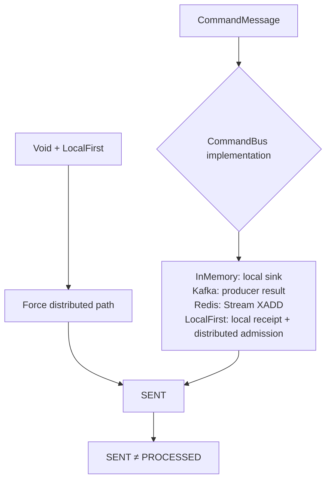

# Command Transport and Routing

Command transport routes a `CommandMessage` into a `ServerCommandExchange`; it does not execute aggregate business rules. Use each extension's documentation and the [Core Configuration Reference](../../../reference/config/core.md) to select and install a transport. This page does not duplicate dependency or configuration tables.

Each transport anchors SENT to different evidence, but none means the command has finished processing.

## CommandBus contract

`CommandBus` is a `MessageBus<CommandMessage<*>, ServerCommandExchange<*>>` with `TopicKind.COMMAND`. Its two core operations expose different boundaries:

- `send`: its `Mono<Void>` completes when the concrete transport accepts the send;
- `receiver`: the one receive entry. It returns a `MessageReceiver` for a `MessageSubscription`: the exchanges, the transport readiness, and processing admission and quiescence. A subscription with `runtimeOwned = true` is a WowRuntime dispatcher's; local buses let only such receivers take part in local-first delivery receipts.

Since 9.3.0 `receiver` is the only entry and every bus implements it; 9.2's `receive` and `runtimeReceiver` are removed. A consumer that wants a plain exchange stream with processing open from subscription reads `receiver(subscription).openedMessages()`; a runtime-owned receiver is `receiver(subscription.copy(runtimeOwned = true))`.

## Transport SPI

Since 9.3.0 every distributed bus is a `TransportMessageBus` over a `Transport` (`me.ahoo.wow.messaging.transport`, a `@WowSpi`). A transport only moves strings: `send(TransportMessage)` publishes a topic, key, payload and timestamp, and `open(group, topics)` returns a `TransportReceiver` with the records, readiness, processing admission and close. `TransportMessageBus` does the rest once for every backend: topic names (memoised per aggregate), JSON encoding, decoding, the key and topic checks, the decode-failure policy (`TransportDecodeFailureHandler`) and one exchange type per message kind (`TransportServerCommandExchange`, `TransportEventStreamExchange`, `TransportStateEventExchange`). `TransportCommandBus`, `TransportDomainEventBus` and `TransportStateEventBus` are the three buses; `KafkaTransport`, `RedisStreamTransport` and `InMemoryTransport` are the built-in transports. The Kafka and Redis buses are these buses over their transport, so topics, keys, JSON and consumer groups are the 9.2 ones.

`LocalCommandBus` additionally exposes subscriber count and `handOff`. A hand-off is accepted when the message entered the local sink of every routed processing-open receiver; its admission result is `true` only when those receivers have obtained processing admission for this delivery; sink acceptance or subscriber count alone does not suppress the distributed copy. `DistributedCommandBus` keeps the same send/receive contract, with persistence, consumer groups, and acknowledgement supplied by its backend.

## InMemory

`InMemoryCommandBus` creates an MPSC unicast sink per `NamedAggregate`: concurrent senders can write while one consuming chain owns commands for each named aggregate. A message becomes read-only before emission and is converted to `SimpleServerCommandExchange`.

Ordinary `send` logs at debug and completes when there is no subscriber, so it proves only that the in-process sink send ended, not that a processor exists. The runtime-owned receiver tracks connection and processing-open state. `handOff` allocates a receipt per delivery; its admission reports success only after all target receivers accept runtime admission.

This implementation is suitable for single-process execution and tests; it provides no cross-process durability.

## Kafka

`KafkaCommandBus` is a `TransportCommandBus` over `KafkaTransport`:

- the command's named aggregate is converted to a topic;
- record key is aggregate ID and value is read-only command JSON;
- `send` waits for the Reactor Kafka sender result and reports producer failure as a Reactor error;
- `receiver` assigns the subscribed topics to a consumer group and converts records into exchanges holding the received record;
- exchange acknowledgement calls the record's `ReceiverOffset.acknowledge()`.

`receiver.readiness` completes only after partition assignment and a conservative initial offset boundary are anchored, avoiding a startup window that could miss messages. Decode failure follows an explicit failure handler; acknowledgement of successfully processed records remains the exchange ack boundary.

## Redis

`RedisCommandBus` uses Redis Streams. `send` writes read-only command JSON to the topic stream under the `msg` field. `receiver` creates or reuses a consumer group for each topic, reads from `lastConsumed`, and puts the `XACK` publisher into the exchange.

`receiver.readiness` fires after consumer groups are prepared, while actual reads remain blocked by processing admission. Optional recovery scans and claims eligible pending records. Undecodable records are reported through `RedisMessageBusObserver` and remain pending instead of being presented as successful consumption.

Redis and Kafka have different send-completion conditions; neither means the aggregate was processed. Backend operations, retention, retry, and recovery parameters belong to extension configuration and are not repeated here.

## LocalFirst dual-copy admission

`LocalFirstCommandBus` combines one local and one distributed bus. For a local aggregate whose Header does not explicitly disable local-first, it does not merely choose one route; it creates a marked dual-copy flow:

1. Copy the command, mark it `local_first=true`, and hand it to the local bus (`localBus.handOff`). The hand-off is accepted when the message enters the local sink of every routed runtime-owned receiver, all of them subscribed and processing-open; it never waits for a receiver to pull the message.
2. Each routed receiver confirms admission when its dispatcher pulls the message, or rejects it (for example when it closes); the hand-off's admission completes when they all decided.
3. Copy the original command again for the distributed bus; its `local_first` value is the admission result.
4. The merged receiver filters and acknowledges a distributed copy marked “handled locally.” If local admission closes or fails, the distributed copy remains eligible for processing.

When `send` completes (since 9.3.0):

| Case | `send` completes | Distributed copy |
| --- | --- | --- |
| Handed off | at once, when the message entered the local sink | sent asynchronously once the receivers decided: `local_first=true` if all admitted it, `false` if it was rejected first |
| Refused: no routable receiver, a full or closed local sink | when the distributed bus accepted the copy, or fails with it | `local_first=false`, sent before `send` completes |
| Local hand-off error | as for refused (the error is logged) | `local_first=false` |
| Rejected after the hand-off (a receiver closed) | already completed | `local_first=false`, sent asynchronously |

A sender never waits for a local receiver's demand, so handlers that send (a command handler publishing its events, a saga sending commands) cannot block one another however full the dispatchers are. A failed asynchronous copy is logged and counted by the distributed bus's send metrics; on shutdown the runtime waits for the copies in flight after the dispatchers stop and before the transports close, within `shutdownTimeout` (`LocalFirstDistributedCopies`).

**Local-first trades crash durability for latency.** A message handed off but not yet processed exists only in this process: if the process crashes, the message is lost — the copy is not sent yet, or it is marked `local_first=true` and skipped by every other member. This was already true after admission before 9.3.0; the hand-off only widens the window to the time the message waits in the local sink. Disable local-first (`wow.command.bus.local-first.enabled=false`, and likewise for events and state events) where a message must survive a process crash (at-least-once across crashes).

Each aggregate's local route decides a delivery under its own monitor; closing the bus closes every route first, so local-first sends to different aggregates never contend on a bus-wide lock. The distributed copy therefore provides fallback and an observable record. `local_first=true` is an admission-confirmed suppression marker, not a guess based on subscriber count. The original and both copies have independent mutable Headers so the routes cannot rewrite one another.

## Void

`LocalFirstCommandBus.send` forces `local_first=false` on an `isVoid` command, skips the local-first attempt, and uses distributed send only. `CommandDispatcher` then acknowledges and filters `Void` commands with `filterThenAck`, so they never enter the command pipeline and cannot produce `PROCESSED` or later stages.

The Gateway accordingly accepts only a wait plan with `supportVoidCommand=true`. The built-in `CommandWait.sent` provides that contract; later-stage plans fail before send. The observable boundary for a Void route is transport acceptance, not aggregate execution.

## `SENT` comparison

`SENT` means that the current `CommandBus.send` publisher completed successfully. The concrete fact depends on the implementation:

| Implementation | Already happened before `SENT` | Still not proven by `SENT` |
| --- | --- | --- |
| InMemory | Sink emission ended; it may also complete without subscribers | Processor presence, aggregate execution, persistence |
| Kafka | Producer send result succeeded | Consumer receive or ack, aggregate execution |
| Redis | Stream add completed | Consumer-group processing or XACK |
| LocalFirst | Local delivery attempt ended and distributed send completed | Aggregate processing by either copy |
| Void + LocalFirst | Distributed send completed | Aggregate processing; Dispatcher filters this route |

`sendAndWaitForSent` synthesizes its result directly from this publisher and does not depend on callback Headers. For a stronger guarantee, choose a stage through [Completion Semantics](../completion.md) instead of redefining `SENT`.

## Metrics and tracing entry points

`MetricCommandBus` records `command_bus` `send`, `send_if_subscribed`, and receive-stream operations at the decorator layer while preserving receiver readiness and runtime admission. Tags come from context, aggregate, message, and receiver group; multiple aggregates collapse to a bounded value rather than exposing business IDs as metric dimensions.

OpenTelemetry's `TracingLocalCommandBus` / `TracingDistributedCommandBus` create a producer span at the send boundary and inject trace context into the message Header. `TracingCommandGateway` additionally wraps `sendAndWait` and streaming waits with an end-to-end waiting span. The processing path also has separate decorators for `CommandHandler`, `EventStore`, and `DomainEventBus`; one bus span alone is not proof of end-to-end completion.

See [Observability](../../advanced/observability.md) for runtime activation and exporter configuration. Source entry points: [`CommandBus`](https://github.com/Ahoo-Wang/Wow/blob/main/wow-core/src/main/kotlin/me/ahoo/wow/command/CommandBus.kt), [`InMemoryCommandBus`](https://github.com/Ahoo-Wang/Wow/blob/main/wow-core/src/main/kotlin/me/ahoo/wow/command/InMemoryCommandBus.kt), [`LocalFirstCommandBus`](https://github.com/Ahoo-Wang/Wow/blob/main/wow-core/src/main/kotlin/me/ahoo/wow/command/LocalFirstCommandBus.kt), [`KafkaCommandBus`](https://github.com/Ahoo-Wang/Wow/blob/main/wow-kafka/src/main/kotlin/me/ahoo/wow/kafka/KafkaCommandBus.kt), and [`RedisCommandBus`](https://github.com/Ahoo-Wang/Wow/blob/main/wow-redis/src/main/kotlin/me/ahoo/wow/redis/bus/RedisCommandBus.kt).
