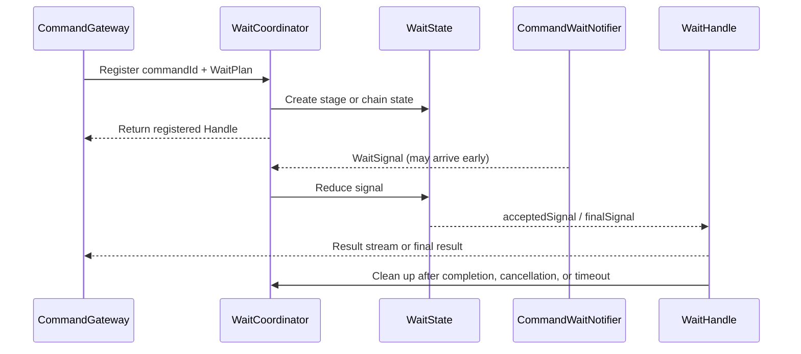

# Command Wait Runtime

The wait runtime models “how far processing got” as routable `WaitSignal` instances instead of blocking a command thread. See [Completion Semantics](../completion.md) for choosing a stage and [Send Commands](../sending.md) for Gateway APIs; this page explains signal production, transport, and reduction.

The wait runtime registers a Handle first, then uses the Coordinator to reduce out-of-order WaitSignals into stage or chain state.



## WaitPlan Header

A `WaitPlan` contains a `waitCommandId`, a `WaitTarget`, and `supportVoidCommand`. `DefaultCommandGateway` registers the local handle first and then uses `WaitPlan.propagate` to put three categories into the command Header:

- correlation: `command_wait_id`;
- callback address: `command_wait_endpoint`;
- target: a stage and optional function identity, or a chain and its tail description.

Registering before send prevents fast local processing from returning a signal before the handle is visible. `WaitPlanMessagePropagator` carries the Header across related messages. An ordinary stage target propagates only after a command; a chain target also crosses events and Saga commands, retaining tail information on non-command messages.

Processors reconstruct an `ExtractedWaitPlan` with `Header.extractWaitPlan`. Notification remains a no-op when correlation ID, endpoint, or a parseable target is absent. The Header is transport metadata, not a remote reference to the caller's local object.

## Notifier Filter

Each stage is observed by an outer Filter on its Dispatcher: `PROCESSED`, `SNAPSHOT`, `PROJECTED`, `EVENT_HANDLED`, and `SAGA_HANDLED` attach to their respective pipelines. The Filter runs `next.filter(exchange)` first; `MonoCommandWaitNotifier` then builds a `WaitSignal` on completion or error.

Two checks suppress irrelevant notifications: the processing stage must belong to the target's required stage set, and the concrete signal must match the target stage and optional function. `PROJECTED` carries `isLastProjection`; `SAGA_HANDLED` also carries the IDs of commands actually sent by that Saga.

`SENT` does not come from these Dispatcher Filters. Ordinary `send` with a wait Header notifies when `CommandBus.send` completes or fails. `sendAndWait` and `sendAndWaitStream` deliver `SENT` directly to the registered handle; `sendAndWaitForSent` is the no-handle fast path. A last-result handle may skip a successful `SENT` when waiting for a later stage; a stream handle retains it.

## WaitSignal

`WaitSignal` represents one observed stage. Its central fields are:

| Field | Runtime purpose |
| --- | --- |
| `waitCommandId` | Locate the handle in `WaitCoordinator` |
| `commandId` | Distinguish the main command from chain tail commands |
| `stage` / `function` | Select a stage and function |
| `aggregateId` / `aggregateVersion` | Correlate the aggregate and known version |
| `errorCode` / `errorMsg` / `bindingErrors` | Represent success or failure at this stage |
| `result` | Accumulate command or handler results |
| `isLastProjection` | Mark the last event in a projection stream |
| `commands` | Carry command IDs produced at `SAGA_HANDLED` |

A signal is an observation record, not a global transaction commit. Independent branches can arrive concurrently; the wait state decides when the selected contract is satisfied.

## StageWaitState

`StageWaitState` reduces a single-stage target. It ignores unneeded signals, accepts predecessor and target signals, and accumulates non-empty `result` values.

- A failed predecessor completes immediately with that failure.
- A `PROJECTED` signal can become final only when it matches and has `isLastProjection == true`.
- A target `SNAPSHOT`, `PROJECTED`, `EVENT_HANDLED`, or `SAGA_HANDLED` signal that arrives first is retained until `PROCESSED` is also observed.
- `SENT` and `PROCESSED` need no additional processed gate.

This lets the state machine tolerate distributed reordering without pretending that parallel branches form one linear sequence.

## ChainWaitState

`ChainWaitState` represents “the main Saga function plus the commands it actually sent.” It waits for the matching main `SAGA_HANDLED` signal, creates a tail `StageWaitState` for every ID in `commands`, and then waits for all tail states.

A tail signal may arrive before the main Saga signal. The state records candidate signals with arrival sequence; after the main signal confirms actual command IDs, it replays only matching candidates. Unconfirmed candidates cannot complete the chain. Result fields are also merged in observed sequence, with a later signal replacing the same key.

A main-chain failure or a completed failing tail can finish early. A successful chain finishes only after the main signal, `PROCESSED`, and every tail state are satisfied. See [Completion Semantics](../completion.md#chained-waiting) for the application contract.

## Handle/Coordinator

`DefaultWaitCoordinator` routes signals through a `ConcurrentHashMap<waitCommandId, WaitHandle>`. Only one handle may be registered for a `waitCommandId`; an unknown ID or a signal ignored by the state machine returns `false`.

`DefaultWaitLastHandle` uses `Sinks.one` and retains only the final signal. `DefaultWaitStreamHandle` uses a single-subscriber unicast sink and buffers concurrently arriving accepted signals. Both reduce state under a lock and unregister idempotently on completion, error, or cancellation.

Handles do not apply timeout themselves. `DefaultCommandGateway` applies `WaitPlan.timeout` as an end-to-end deadline spanning precheck, send, and wait. `Mono.using` / `Flux.using` release the handle after timeout, cancellation, or normal termination. Releasing the observation resource does not cancel an already sent command.

## Remote callback

The originating node's endpoint travels in the Header to the processing node. `WebClientCommandWaitNotifier` first uses the machine ID encoded in `waitCommandId` to decide whether the wait belongs to this JVM:

```text
local waitCommandId  -> WaitCoordinator.signal
remote waitCommandId -> HTTP POST endpoint -> CommandWaitHandlerFunction -> WaitCoordinator.signal
```

The remote POST sends a JSON `WaitSignal` and is wrapped by the retry/scheduler in `RemoteWaitNotifyPolicy`. The receiver deserializes `SimpleWaitSignal`, passes it to the local coordinator, and returns an empty success response. The endpoint is a runtime callback address, not a business API.

## Fire-and-forget error boundary

Stage Filters call `notifyAndForget` and do not wait for notification delivery. The default implementation subscribes to `notify` and logs endpoint, wait/command ID, and stage on failure. The local notifier invokes the coordinator synchronously and catches and logs failures. Notification errors never replace the original pipeline outcome.

Two outcomes must therefore remain distinct:

- the processing pipeline succeeds but notification fails: the command may be complete while the caller times out or misses a stage;
- the processing pipeline fails: the notifier attempts a failed signal while the original error still propagates through the pipeline.

A wait timeout consequently means “the result was not observed,” not “the command rolled back.” Follow [Failures and Idempotency](../reliability.md#query-and-retry-after-timeout) before retrying.
