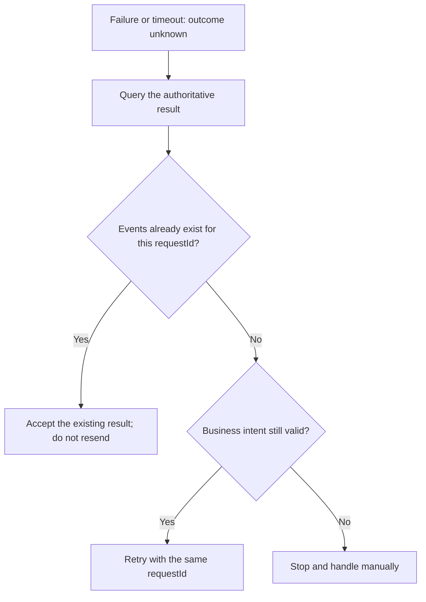

# Failures and Idempotency

A reliable command call does not depend on “sending only once.” It makes the same business intent safe to identify, confirm, and retry. Preserve the aggregate identity, `commandId`, `requestId`, wait `stage`, error code, and caller timeout details when diagnosing an outcome.

Do not resend an unknown outcome immediately; confirm authoritative history before retrying with the stable requestId.

## Where Failure Occurs

| Layer | Typical result | Known boundary |
| --- | --- | --- |
| Before sending | Command validation or request-ID precheck fails | The command was not handed to the `CommandBus` |
| `SENT` | Bus rejection, connection error, or send timeout | Acceptance was not observed; whether a remote transport received it depends on that transport |
| `PROCESSED` | Business rule, event append, or command-processing pipeline fails | The failed stage alone cannot determine whether events were appended |
| `SNAPSHOT` / `PROJECTED` / `EVENT_HANDLED` / `SAGA_HANDLED` | The corresponding branch fails | It does not automatically undo authoritative event history that was already appended |
| Caller wait | Timeout, cancellation, or disconnect | It ends this observation only; it does not cancel the command |

In particular, a failed `PROCESSED` result does not prove that no event was appended. Publication or notification later in the command-processing pipeline can still fail after a successful append. Query authoritative history before choosing compensation or retry; do not guess commit status from an HTTP status, exception type, or stage name.

## commandId and requestId

`commandId` identifies one concrete command message and execution chain. Stage signals use it for correlation. Reconstructing a command normally creates a new `commandId`, so it must not carry business idempotency across attempts.

`requestId` identifies one caller-owned business intent and is retained in the `DomainEventStream`. The same `requestId` within one aggregate means a duplicate request; separate aggregates may use the same value.

The rules are direct:

- reuse a stable `requestId` when retrying the same business intent;
- use a new `requestId` for a new business intent;
- do not generate a new `requestId` after a timeout merely to bypass duplicate detection.

Derive the stable value from a business-operation identity or create and persist it at the caller. Do not regenerate it for every process invocation.

## Fast Precheck and Authoritative Confirmation

`DefaultRequestIdChecker` first asks the aggregate-specific `IdempotencyChecker`. It proceeds directly when the fast check allows the request. When that check reports a possible duplicate, it asks `RequestIdExistenceChecker` to inspect persisted history. Without an authoritative checker, the default rejects the request instead of risking a duplicate.

This precheck rejects obvious duplicates early and resolves false positives from a probabilistic checker, but it is not the final arbiter for concurrent commits. A race remains between the precheck and persistence; two concurrent requests can both pass a read check.

## EventStore Persistence Constraints

`EventStore.append` is the persistence boundary at which an event stream can become authoritative history. Its contract handles three conflict classes during append:

- `DuplicateRequestIdException`: the same aggregate already used that `requestId`;
- `EventVersionConflictException`: the event version being appended conflicts with existing history;
- `DuplicateAggregateIdException`: an initial-version create conflicts with an existing aggregate identity.

A production store must therefore enforce version and request-ID uniqueness within its own atomic write boundary and map failures correctly. Application-level “read, then write” logic cannot replace this constraint. Run the relevant backend module and TCK for the concrete store; [Event Sourcing](../domain/event-sourcing.md) does not treat the in-memory implementation as proof of production durability.

## Version and Create Conflicts

A version conflict usually means that a decision used a stale aggregate version or that the aggregate has concurrent writers. Retry with the same `requestId` only after reloading current state and proving that the original business intent remains valid. Do not silently increment the expected version or overwrite history.

A create conflict means the target aggregate identity already exists. It is not equivalent to proof that the same request succeeded. Use the aggregate identity and `requestId` to distinguish a replay of the original create request from a different business intent competing for the same ID. The latter is a business conflict, not a reason to replay the create with another request ID.

## CommandResultException

`sendAndWait` maps pre-send and sending failures to `CommandResultException` and also throws it when the final wait signal failed. The exception preserves the complete `commandResult`, including `stage`, `commandId`, `requestId`, aggregate identity, `errorCode`, `errorMsg`, `bindingErrors`, and accumulated `result`. Diagnostics and API error mapping should inspect those fields instead of parsing exception text.

Consumers of `sendAndWaitStream` must also inspect every `CommandResult.succeeded`: a failed accepted signal can appear as a stream element, so business failures are not guaranteed to appear only as a Reactor terminal error. A caller deadline normally raises `TimeoutException`, which likewise says nothing about the server's final outcome.

## Query and Retry After a Timeout

Use this safe sequence after a timeout:

1. Retain the original aggregate identity, `requestId`, and `commandId`, and mark the outcome unknown.
2. Through an application query or controlled operational path, confirm authoritative event history by aggregate and `requestId`; also query any downstream state required by the response contract.
3. If appended, do not resend a new business intent. Wait for, repair, or compensate the incomplete downstream branch.
4. If confirmed not appended, retry the same intent with the original `requestId`.
5. If confirmation is unavailable, keep the outcome unknown and escalate instead of blindly resending with a new `requestId`.

A Wow wait timeout releases the local handle; it does not provide distributed cancellation. A business system should expose enough query or operational capability to resolve outcomes by stable identity.

## Idempotent Downstream Side Effects

`requestId` protects event append within one aggregate. It does not automatically make projections, event processors, Sagas, or external APIs idempotent. Downstream messages can be redelivered, and processing can stop after a side effect succeeds but before its success is acknowledged.

Every side-effecting consumer should record a stable input identity—such as a domain-event ID, message ID, or explicit business idempotency key—inside its own durable boundary, and make “check + side effect write + completion record” atomic or recoverable. When an external system does not accept an idempotency key, use a queryable outcome, durable deduplication record, or compensation strategy. An in-memory set, a `commandId` log, or an upstream success response alone is not sufficient duplicate-side-effect protection.
