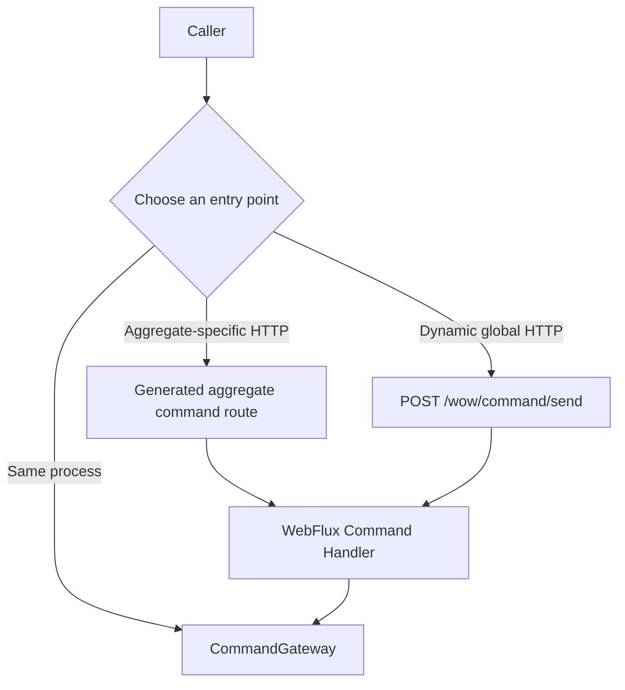

# Send Commands

The same command can enter Wow through an in-process or HTTP boundary. The entry point does not change aggregate business rules, but it does change route metadata, response shape, and whether the caller can observe intermediate stages.

All three entry points reach the same CommandGateway, but route discovery, protocol capabilities, and response forms differ.



## Choose an Invocation Entry Point

| Scenario | Entry point | Return |
| --- | --- | --- |
| Same application process | `CommandGateway` | `Mono<CommandResult>` or `Flux<CommandResult>` |
| Aggregate-facing public HTTP API | Generated aggregate command route | Final JSON result or SSE stage stream |
| Generic HTTP facade | `POST /wow/command/send` | Final JSON result |
| Kotlin service-to-service call | [API Client](./api-client.md) | Reactive or synchronous final result |

Prefer the entry point that preserves the required semantics with the smallest exposed surface. An in-process application does not need to turn a command into HTTP first, and a remote call should not pretend to be an in-process Gateway.

## Construct a CommandMessage

See [Define Commands](./definition.md) for command payloads and target metadata. For an in-process call, use `toCommandMessage()` to create the runtime envelope:

```kotlin
val message = createOrder.toCommandMessage(
    aggregateId = "order-1",
    requestId = "create-order-1",
)
```

`toCommandMessage()` combines command metadata and explicit arguments to resolve the bounded context, aggregate, tenant, owner, space, expected version, and creation flag. Reuse a stable `requestId` when retrying the same business intent; do not turn a lost response into a new business operation.

## In-Process CommandGateway

`CommandGateway` adds command-body validation, a request-ID precheck, and stage waiting to `CommandBus`. The API remains reactive: `sendAndWait` returns one final result, while `sendAndWaitStream` returns a stream of accepted stage signals.

```kotlin
val result: Mono<CommandResult> = commandGateway.sendAndWait(
    message,
    CommandWait.processed(message.commandId),
)
```

Convenience methods cover `SENT`, `PROCESSED`, and `SNAPSHOT`:

```kotlin
commandGateway.sendAndWaitForSent(message)
commandGateway.sendAndWaitForProcessed(message)
commandGateway.sendAndWaitForSnapshot(message)
```

These methods select an observation point; they do not change command processing. Do not call `block()` on a Reactor event loop or inside Wow's core processing chain.

## Aggregate HTTP Routes

Aggregate-specific routes are generated from command and aggregate metadata. They carry a concrete request-body schema and may place tenant, owner, aggregate ID, or command properties in paths and headers. Treat the target service's current generated OpenAPI as the authority for HTTP methods, paths, and scope.

Examples in the current generated `example-domain` contract are:

```text
POST /owner/{ownerId}/cart/add_cart_item
PUT  /owner/{ownerId}/cart/change_quantity
```

These facts do not mean another service has the same paths. Do not infer a bounded-context prefix: annotations, the aggregate owner mode, and route metadata can all change the final contract. The generated contract declares both `application/json` and `text/event-stream` for aggregate command routes.

## Global Command Facade

The global facade is the fixed `POST /wow/command/send` route. Its body is the command payload, while `Command-*` request headers supply command type, aggregate target, wait plan, and routing data:

```bash
curl -X POST http://order-service:8080/wow/command/send \
  -H 'Content-Type: application/json' \
  -H 'Accept: application/json' \
  -H 'Command-Type: me.example.CreateOrder' \
  -H 'Command-Aggregate-Id: order-1' \
  -H 'Command-Request-Id: create-order-1' \
  -H 'Command-Wait-Stage: PROCESSED' \
  -d '{"items":[],"address":{},"fromCart":false}'
```

The current generated OpenAPI declares only `application/json` for this global route. It serves generic clients and callers that cannot bind an aggregate-specific schema. The security layer must still authenticate the caller and authorize the target aggregate.

The facade accepts only the commands that have an aggregate command route here: a command registered on an aggregate in this service's metadata (or the default delete, recover and apply-resource-tags commands the aggregate does not override), whose `@AggregateRoute` and `@CommandRoute` are enabled. Any other `Command-Type` answers `404` with error code `NotFound`, as a disabled route does; the type name is matched against the registered classes and never loaded by name.

### Extension Headers

Each `Command-Header-<key>` request header is copied into the command message header as `<key>`, on aggregate command routes and on the facade. The prefix matches in any case (HTTP/2 sends header names in lower case). A key the framework reserves answers `400` with error code `IllegalArgument`, and nothing is copied: `command_operator`, `local_first`, `trace_id`, `upstream_id`, `upstream_name`, `user_agent`, `remote_ip`, `traceparent`, `tracestate`, `baggage`, CoSec's `app_id` and `device_id`, and every key starting with `command_wait_` or `compensate.` (compared ignoring case). Use the documented headers instead (`Command-Wait-*`, `Command-Local-First`). The operator is always the authenticated principal, set after every header appender.

### Client Address

The command routes also stamp `user_agent` and `remote_ip` into the command message header. `remote_ip` is the first non-blank entry of the first `X-Forwarded-For` request header, as sent; without one it is the remote address of the connection, written as its IP literal. The address is never resolved by a reverse DNS lookup, which would block the event loop (since 9.2.3; earlier versions wrote the reverse-resolved host name, so stored commands and events can hold either form). `X-Forwarded-For` is client-controlled: rely on it only behind a proxy that sets it.

## JSON and SSE Responses

Aggregate command routes support two response modes:

- `Accept: application/json` uses `sendAndWait` and returns only the final `CommandResult` for the selected wait plan;
- `Accept: text/event-stream` uses `sendAndWaitStream` and emits one SSE event for each accepted signal; the same `CommandStage` can produce multiple events, whose event name is the stage name and whose data is that signal's `CommandResult`.

Stage signals arrive in observed order; callers must not assume a fixed sequence. A disconnect or timeout ends only this HTTP wait. It does not cancel a command already accepted by the command bus.

The current route contract for global `/wow/command/send` accepts JSON only. Use a generated aggregate command route that declares the media type when SSE is required. The current [API Client](./api-client.md) does not provide SSE either.

## CommandResult Core Fields

| Field | Meaning |
| --- | --- |
| `stage` | Observed stage such as `SENT`, `PROCESSED`, or `SNAPSHOT` |
| `commandId` / `waitCommandId` | Current command ID and the command ID that owns the wait plan |
| `contextName` / `aggregateName` / `tenantId` / `aggregateId` | Target aggregate identity |
| `aggregateVersion` | Aggregate version known at this stage; it can be `null` before processing |
| `requestId` | Caller-provided idempotency key |
| `function` | Function information for the stage signal |
| `errorCode` / `errorMsg` / `bindingErrors` | Success state and failure details; `succeeded` is derived from the error code |
| `result` | An SSE stream element carries the current accepted signal's data; a non-streaming final result can contain values accumulated by the wait state |
| `signalTime` | Time when the signal was generated |

A successful result proves only the observation point named by `stage`. Do not infer snapshot, projection, event-processor, or Saga completion from `PROCESSED`.

## Next: Choose Completion Semantics

Based on read-after-write visibility, side effects, and latency goals, read [Completion Semantics](./completion.md) and choose the earliest stage that satisfies the response contract. See [Failures and Idempotency](./reliability.md) for timeouts, duplicate requests, and downstream failures.
