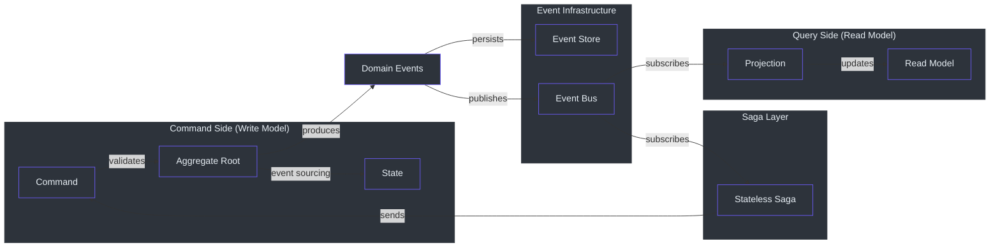
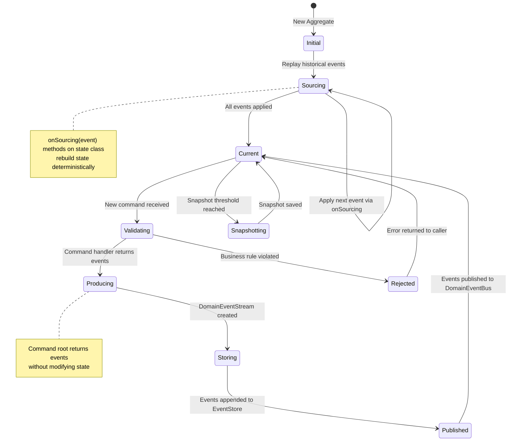
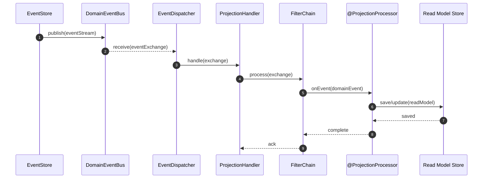
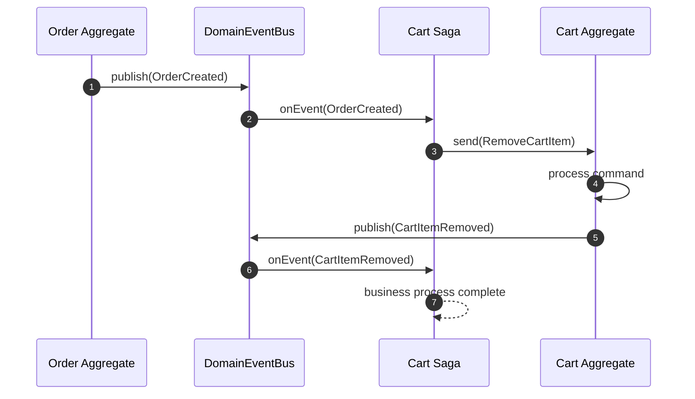
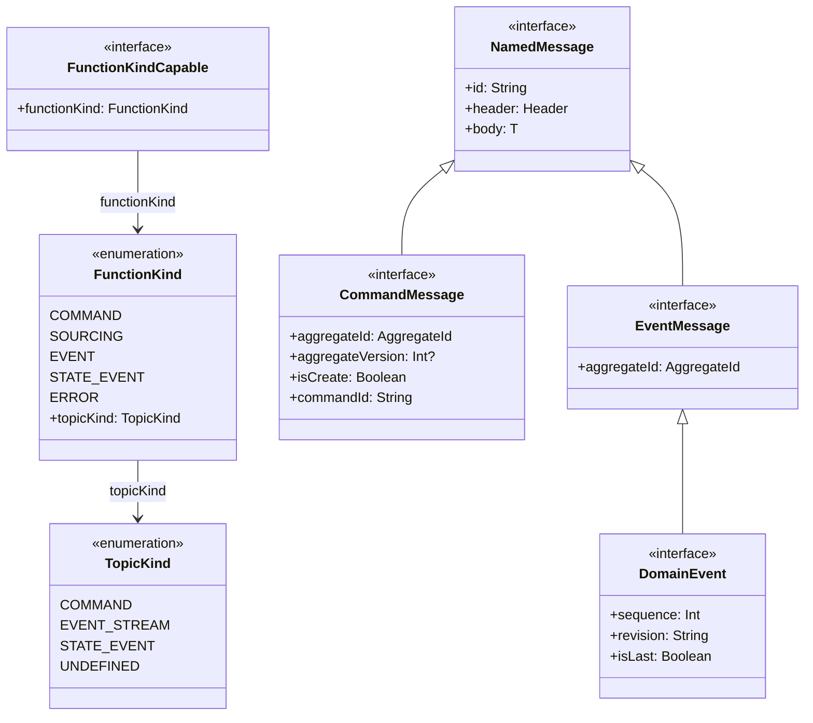

# Core Concepts

Wow implements the core building blocks of Domain-Driven Design as first-class framework constructs. This page explains each concept, how it maps to Wow's API and runtime, and why the framework makes the design choices it does.

## Concept Map

The following diagram shows how the main concepts relate to each other. Commands flow into aggregates, aggregates produce events, events are stored and published, and downstream processors (projections and sagas) react to those events.



<!-- Sources: wow-api/src/main/kotlin/me/ahoo/wow/api/command/CommandMessage.kt:53-126, wow-api/src/main/kotlin/me/ahoo/wow/api/event/DomainEvent.kt:52-95, wow-core/src/main/kotlin/me/ahoo/wow/eventsourcing/EventStore.kt:27-98 -->

## Aggregate Root

An **Aggregate Root** is the central consistency boundary in DDD. In Wow, it is a class annotated with `@AggregateRoot` that receives commands and produces domain events. The aggregate root is the only entry point for modifying the aggregate's state.

### How Wow Implements Aggregate Roots

A Wow aggregate is split into two cooperating objects:

| Component | Responsibility | Lifetime |
|---|---|---|
| **Command Root** (e.g. `Order`) | Receives commands, validates business rules, returns events | Recreated per command |
| **State Object** (e.g. `OrderState`) | Holds current state, contains `onSourcing` methods | Rebuilt from event history |

The command root is constructed with the current state injected. It reads state to validate rules but never directly mutates it. Instead, it returns domain events that, when sourced, mutate the state.

```kotlin
@AggregateRoot
class Order(private val state: OrderState) {

    fun onCommand(shipOrder: ShipOrder): OrderShipped {
        // Read current state to validate
        check(state.status == OrderStatus.PAID) {
            "Cannot ship unpaid order"
        }
        // Return event -- never mutate state directly
        return OrderShipped
    }
}
```

This split prevents a common DDD anti-pattern: accidentally modifying state in command handlers before validation is complete. The command root and state object are defined in [CommandAggregate.kt:41-53](https://github.com/Ahoo-Wang/Wow/blob/main/wow-core/src/main/kotlin/me/ahoo/wow/modeling/command/CommandAggregate.kt#L41-L53) and [StateAggregate.kt:26-32](https://github.com/Ahoo-Wang/Wow/blob/main/wow-core/src/main/kotlin/me/ahoo/wow/modeling/state/StateAggregate.kt#L26-L32).

## Commands

A **Command** is an imperative request to change the state of an aggregate. In Wow, commands are represented by the `CommandMessage<C>` interface, which carries:

- **aggregateId** -- which aggregate instance to target
- **aggregateVersion** -- for optimistic concurrency control
- **isCreate** -- whether this initializes a new aggregate
- **allowCreate** -- whether creation is permitted if the aggregate does not exist
- **isVoid** -- whether the command expects a response

| Property | Type | Purpose | Source |
|---|---|---|---|
| `commandId` | `String` | Unique ID for idempotency and deduplication | [CommandMessage.kt:70-71](https://github.com/Ahoo-Wang/Wow/blob/main/wow-api/src/main/kotlin/me/ahoo/wow/api/command/CommandMessage.kt#L70-L71) |
| `aggregateId` | `AggregateId` | Target aggregate instance | [CommandMessage.kt:83](https://github.com/Ahoo-Wang/Wow/blob/main/wow-api/src/main/kotlin/me/ahoo/wow/api/command/CommandMessage.kt#L83) |
| `aggregateVersion` | `Int?` | Expected version for optimistic locking | [CommandMessage.kt:95](https://github.com/Ahoo-Wang/Wow/blob/main/wow-api/src/main/kotlin/me/ahoo/wow/api/command/CommandMessage.kt#L95) |
| `isCreate` | `Boolean` | Creates a new aggregate | [CommandMessage.kt:105](https://github.com/Ahoo-Wang/Wow/blob/main/wow-api/src/main/kotlin/me/ahoo/wow/api/command/CommandMessage.kt#L105) |
| `body` | `C` | The actual command payload | Inherited from `NamedMessage` |

### Command Annotations

Wow provides annotations to declare intent at the command level:

| Annotation | Purpose | Source |
|---|---|---|
| `@CreateAggregate` | Marks a command as aggregate initializer | [CreateAggregate.kt:54-57](https://github.com/Ahoo-Wang/Wow/blob/main/wow-api/src/main/kotlin/me/ahoo/wow/api/annotation/CreateAggregate.kt#L54-L57) |
| `@AllowCreate` | Permits command to create aggregate if it does not exist | `AllowCreate.kt` |
| `@VoidCommand` | Marks command as fire-and-forget (no response expected) | `VoidCommand.kt` |
| `@OnCommand` | Marks a method as command handler with optional `returns` types | [OnCommand.kt:69-87](https://github.com/Ahoo-Wang/Wow/blob/main/wow-api/src/main/kotlin/me/ahoo/wow/api/annotation/OnCommand.kt#L69-L87) |
| `@AggregateVersion` | Parameter-level annotation for optimistic concurrency | `AggregateVersion.kt` |
| `@CommandRoute` | Configures REST route for the command | `CommandRoute.kt` |

## Domain Events

A **Domain Event** is an immutable fact that something happened in the domain. In Wow, events implement the `DomainEvent<T>` interface.

Key characteristics of `DomainEvent` as defined in [DomainEvent.kt:52-95](https://github.com/Ahoo-Wang/Wow/blob/main/wow-api/src/main/kotlin/me/ahoo/wow/api/event/DomainEvent.kt#L52-L95):

| Property | Default | Purpose |
|---|---|---|
| `aggregateId` | (required) | Links event to its originating aggregate |
| `sequence` | `1` | Order within the event stream |
| `revision` | `DEFAULT_REVISION` | Schema versioning for backward compatibility |
| `isLast` | `true` | Signals if this is the final event in the batch |

### Event Sourcing Handlers

State is rebuilt from events through `@OnSourcing` methods on the state class. The default function name is `onSourcing` ([OnSourcing.kt:18](https://github.com/Ahoo-Wang/Wow/blob/main/wow-api/src/main/kotlin/me/ahoo/wow/api/annotation/OnSourcing.kt#L18)).

```kotlin
class OrderState(val id: String) {
    var status: OrderStatus = OrderStatus.CREATED
        private set

    // Convention: method name matches event type (onSourcing)
    fun onSourcing(event: OrderCreated) {
        status = OrderStatus.CREATED
    }

    fun onSourcing(event: OrderShipped) {
        status = OrderStatus.SHIPPED
    }
}
```

Sourcing handlers must be deterministic -- given the same events, they must always produce the same state. They should not have side effects (no external service calls, no writes).

### Event Reaction Handlers

`@OnEvent` methods react to events for cross-cutting concerns (projections, saga orchestration, notifications). They differ from `@OnSourcing` in that they may have side effects.

```kotlin
@ProjectionProcessor
class OrderSummaryProjection {

    @OnEvent
    fun onOrderCreated(event: OrderCreated) {
        orderSummaryRepository.save(OrderSummary.from(event))
    }
}
```

See [OnEvent.kt:62-79](https://github.com/Ahoo-Wang/Wow/blob/main/wow-api/src/main/kotlin/me/ahoo/wow/api/annotation/OnEvent.kt#L62-L79).

## Event Sourcing

**Event Sourcing** is the pattern of storing state changes as a sequence of events rather than storing the current state directly. In Wow, this is the default persistence model.

### How Event Sourcing Works in Wow

The following state diagram shows the lifecycle of an aggregate's state as it transitions through event sourcing.



<!-- Sources: wow-core/src/main/kotlin/me/ahoo/wow/modeling/command/CommandAggregate.kt:65-118, wow-core/src/main/kotlin/me/ahoo/wow/eventsourcing/EventStore.kt:27-98, wow-core/src/main/kotlin/me/ahoo/wow/modeling/state/StateAggregate.kt:26-32 -->

### Event Store

The `EventStore` interface defines the contract for persisting and loading event streams. Events are stored per aggregate, versioned, and loaded by aggregate ID and version range.

| Method | Signature | Purpose |
|---|---|---|
| `append` | `append(eventStream: DomainEventStream): Mono<Void>` | Persist new events |
| `load` | `load(aggregateId, headVersion, tailVersion): Flux<DomainEventStream>` | Load events by version range |
| `load` | `load(aggregateId, headEventTime, tailEventTime): Flux<DomainEventStream>` | Load events by time range |
| `last` | `last(aggregateId): Mono<DomainEventStream>` | Load most recent event stream |

See [EventStore.kt:27-98](https://github.com/Ahoo-Wang/Wow/blob/main/wow-core/src/main/kotlin/me/ahoo/wow/eventsourcing/EventStore.kt#L27-L98). Wow provides implementations for MongoDB (`wow-mongo`), Redis (`wow-redis`), R2DBC (`wow-r2dbc`), and an in-memory store for testing.

## Projections

A **Projection** transforms domain events into optimized read models. Projections are the CQRS "read side" -- they maintain denormalized views of domain data tailored for specific query requirements.

Projections are declared with `@ProjectionProcessor` and use `@OnEvent` methods to handle events.



<!-- Sources: wow-core/src/main/kotlin/me/ahoo/wow/event/DomainEventBus.kt:39-44, wow-core/src/main/kotlin/me/ahoo/wow/projection/ProjectionHandler.kt:27-43, wow-api/src/main/kotlin/me/ahoo/wow/api/annotation/ProjectionProcessor.kt:64-68 -->

### Key Projection Characteristics

| Characteristic | Description |
|---|---|
| Eventual Consistency | Projections are updated asynchronously after events are stored |
| Idempotent | Replaying the same event should produce the same result |
| Per-Processor Offset | Each projection tracks its own processing position |
| Replayable | Projections can be rebuilt from the event store |

## Sagas

A **Saga** coordinates multi-aggregate business processes by reacting to events and issuing commands. In Wow, sagas are stateless processors that subscribe to domain events and dispatch new commands.

The `@StatelessSaga` annotation declares a saga class. See [StatelessSaga.kt:65-69](https://github.com/Ahoo-Wang/Wow/blob/main/wow-api/src/main/kotlin/me/ahoo/wow/api/annotation/StatelessSaga.kt#L65-L69).



<!-- Sources: wow-api/src/main/kotlin/me/ahoo/wow/api/annotation/StatelessSaga.kt:65-69, wow-api/src/main/kotlin/me/ahoo/wow/api/annotation/OnEvent.kt:62-79 -->

### Saga vs Projection

| Aspect | Saga | Projection |
|---|---|---|
| Purpose | Orchestrate cross-aggregate workflows | Maintain read models |
| Side Effects | Sends commands to other aggregates | Updates database records |
| State | Stateless (no persistent state) | Stateless (state is the read model) |
| Annotation | `@StatelessSaga` | `@ProjectionProcessor` |
| Reaction | `@OnEvent` that dispatches commands | `@OnEvent` that updates stores |

## Bounded Contexts

A **Bounded Context** defines a coherent area of the business domain with its own ubiquitous language and rules. In Wow, the `@BoundedContext` annotation declares a context boundary.

```kotlin
@BoundedContext(
    name = "example",
    alias = "ex",
    aggregates = [
        BoundedContext.Aggregate(name = "order"),
        BoundedContext.Aggregate(name = "cart")
    ]
)
object ExampleBoundedContext
```

The `@BoundedContext` annotation (see [BoundedContext.kt:59-119](https://github.com/Ahoo-Wang/Wow/blob/main/wow-api/src/main/kotlin/me/ahoo/wow/api/annotation/BoundedContext.kt#L59-L119)) accepts:

| Parameter | Purpose |
|---|---|
| `name` | Unique context identifier used for routing |
| `alias` | Shorter reference name |
| `description` | Human-readable purpose |
| `scopes` | Boundary scope identifiers |
| `packageScopes` | Package classes defining the context boundary |
| `aggregates` | Array of `@Aggregate` definitions within the context |

Every `AggregateId` in Wow includes a `contextName`, ensuring that commands and events are always routed within the correct bounded context.

## Message Type Hierarchy

Wow defines a rich type hierarchy for messages. The `FunctionKind` enum categorizes functions by their role in the system.



<!-- Sources: wow-api/src/main/kotlin/me/ahoo/wow/api/messaging/function/FunctionKind.kt:27-71, wow-api/src/main/kotlin/me/ahoo/wow/api/command/CommandMessage.kt:53-126, wow-api/src/main/kotlin/me/ahoo/wow/api/event/DomainEvent.kt:52-95 -->

### FunctionKind to TopicKind Mapping

| FunctionKind | TopicKind | Description |
|---|---|---|
| `COMMAND` | `COMMAND` | Command handlers on aggregates |
| `SOURCING` | `EVENT_STREAM` | Event sourcing handlers on state objects |
| `EVENT` | `EVENT_STREAM` | Event reaction handlers on projections and sagas |
| `STATE_EVENT` | `STATE_EVENT` | State change notifications |
| `ERROR` | `UNDEFINED` | Error handling functions |

This mapping (see [FunctionKind.kt:27-71](https://github.com/Ahoo-Wang/Wow/blob/main/wow-api/src/main/kotlin/me/ahoo/wow/api/messaging/function/FunctionKind.kt#L27-L71)) ensures that messages are routed to the correct handler type via their topic kind.

## Multi-Tenancy

Wow supports multi-tenancy at the aggregate level. Every `AggregateId` includes a `tenantId` property. Commands are scoped to a tenant, and the event store partitions events by tenant.

Tenancy can be configured at the annotation level:

- `@TenantId` on a command parameter to extract tenant from the command body
- `@StaticTenantId` on an aggregate class to assign a fixed tenant
- `BoundedContext.Aggregate(tenantId = "...")` for static tenant assignment

## Putting It All Together

The following table summarizes how each concept maps to a Wow artifact:

| DDD Concept | Wow Artifact | Annotation/Interface |
|---|---|---|
| Aggregate Root | Command root class | `@AggregateRoot` |
| Entity State | State class | Convention: `*State` |
| Command | Data class | `CommandMessage<C>`, `@OnCommand` |
| Domain Event | Data class/object | `DomainEvent<T>`, `@Event` |
| Event Sourcing | State rebuild methods | `@OnSourcing` |
| Read Model | Projection processor | `@ProjectionProcessor`, `@OnEvent` |
| Saga | Stateless saga class | `@StatelessSaga`, `@OnEvent` |
| Bounded Context | Context declaration | `@BoundedContext` |
| Repository | Event store | `EventStore` |
| Command Bus | Message bus | `CommandBus`, `CommandGateway` |
| Event Bus | Message bus | `DomainEventBus` |

## Related Pages

| Page | Description |
|---|---|
| [Overview](./overview.md) | Framework philosophy and module overview |
| [Getting Started](./getting-started.md) | Project setup and first aggregate |
| [Architecture](./architecture.md) | Filter chain, dispatchers, data flow |
| [Aggregate Modeling](./aggregate-modeling.md) | Aggregate design patterns and state management |
