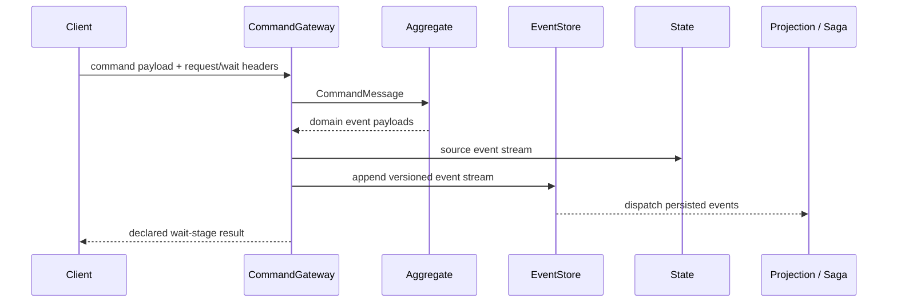

# Core Concepts

This page defines the terms used throughout Wow documentation, source, and runtime responses. The shortest useful model is:

```text
command payload
  → CommandMessage envelope
  → aggregate decision
  → domain event payloads in a DomainEventStream
  → sourced aggregate state
  → projections / sagas / other processors
```

Do not use “command,” “event,” “state,” and “projection” interchangeably. They have different owners, lifetimes, and consistency guarantees.

## Vocabulary at a Glance

| Term | Stable meaning in Wow | Main artifact |
| --- | --- | --- |
| Bounded context | A named business-language boundary containing aggregate definitions | `@BoundedContext` |
| Aggregate | One consistency boundary identified by context, aggregate name, tenant, and ID | `NamedAggregate`, `AggregateId` |
| Command | An imperative payload requesting a state change | data class/object, `@CreateAggregate`, `@CommandRoute` |
| Command message | Runtime envelope carrying the command plus identity, request, version, headers, and routing metadata | `CommandMessage<C>` |
| Command aggregate root | Domain object that checks invariants and returns events | `@AggregateRoot`, `@OnCommand` |
| State aggregate root | State object rebuilt only by sourcing events | `@OnSourcing` |
| Domain event | Immutable business fact payload | data class/object, `@Event` when explicit metadata is needed |
| Domain event envelope | Runtime event plus aggregate, command, sequence, revision, and time metadata | `DomainEvent<T>` |
| Event stream | Ordered batch of events produced by one aggregate command | `DomainEventStream` |
| Event store | Append/load contract for aggregate event streams | `EventStore` |
| Snapshot | Derived checkpoint used to accelerate aggregate restoration | `SnapshotStore` |
| Wait stage | A caller-selected definition of command completion | `SENT`, `PROCESSED`, `SNAPSHOT`, `PROJECTED` |
| Projection | Event processor that maintains a read model | `@ProjectionProcessor`, `@OnEvent` |
| Saga | Event processor that coordinates work by sending another command | `@StatelessSaga`, `@OnEvent` |
| Compensation | Observable retry/recovery of failed event-processing work | compensation records and `RetrySpec` |

## Bounded Context and Aggregate Identity

A **bounded context** owns a coherent language and its aggregate names. `@BoundedContext` supplies the context name, optional alias, package scopes, and aggregate declarations.

```kotlin
@BoundedContext(
    name = "example",
    alias = "ex",
    aggregates = [
        BoundedContext.Aggregate(name = "order"),
        BoundedContext.Aggregate(name = "cart"),
    ],
)
object ExampleBoundedContext
```

An **aggregate** is the consistency boundary for one event stream. Runtime identity includes `contextName`, `aggregateName`, `tenantId`, and `id`; routing and storage must preserve the complete `AggregateId`.

::: warning Aggregate ID uniqueness
`tenantId` is routing and isolation context, not a second ID namespace. Within the same `NamedAggregate` (`contextName` + `aggregateName`), keep `id` unique across tenants.
:::

See [`BoundedContext`](https://github.com/Ahoo-Wang/Wow/blob/main/wow-api/src/main/kotlin/me/ahoo/wow/api/annotation/BoundedContext.kt) and [Aggregate Modeling](./modeling.md).

## Aggregate Root

A Wow aggregate separates **decision** from **state mutation**:

| Part | May do | Must not do |
| --- | --- | --- |
| Command aggregate root | Read current state, check invariants, return event payloads | Directly mutate sourced state |
| State aggregate root | Deterministically apply persisted events | Call external services or perform writes |

```kotlin
@AggregateRoot
class Order(private val state: OrderState) {
    @OnCommand
    fun onShip(command: ShipOrder): OrderShipped {
        check(state.paid) { "Cannot ship an unpaid order." }
        return OrderShipped
    }
}

class OrderState(val id: String) {
    var shipped: Boolean = false
        private set

    @OnSourcing
    fun onShipped(event: OrderShipped) {
        shipped = true
    }
}
```

The handler decides; the event records the decision; the sourcing handler changes state. Replaying the same ordered events must rebuild the same state. The complete patterns are in [Aggregate Modeling](./modeling.md).

## Command Payload and Command Message

A **command payload** is the application type such as `CreateOrder`. A **command message** is Wow's runtime envelope around that payload. `CommandMessage<C>` carries fields such as:

- `commandId`: runtime message identity;
- `requestId`: idempotency identity supplied or derived for the request;
- `aggregateId`: target aggregate identity;
- `aggregateVersion`: optional expected version for optimistic concurrency;
- `isCreate`, `allowCreate`, and `isVoid`: execution semantics;
- headers: wait, operator, tracing, and propagated request data.

Use “command” for the business request and “command message” when discussing transport or runtime metadata. See [`CommandMessage`](https://github.com/Ahoo-Wang/Wow/blob/main/wow-api/src/main/kotlin/me/ahoo/wow/api/command/CommandMessage.kt) and [Command Gateway](./command-gateway.md).

## Event Payload, Envelope, and Stream

A **domain event payload** is an immutable fact such as `OrderShipped`. Wow wraps it in `DomainEvent<T>`, which adds aggregate identity, version, sequence, revision, originating command ID, and timestamps. One command may return several event payloads; their ordered runtime envelopes form a `DomainEventStream` appended atomically for that aggregate version.

`@OnSourcing` consumes events to rebuild aggregate state. `@OnEvent` reacts after persistence for projections, sagas, notifications, and other side effects. This distinction is the key safety rule:

- sourcing is deterministic and side-effect free;
- event reaction may perform side effects and therefore must handle retry and idempotency.

See [`DomainEvent`](https://github.com/Ahoo-Wang/Wow/blob/main/wow-api/src/main/kotlin/me/ahoo/wow/api/event/DomainEvent.kt), [`EventStore`](https://github.com/Ahoo-Wang/Wow/blob/main/wow-core/src/main/kotlin/me/ahoo/wow/eventsourcing/EventStore.kt), and [Event Store](./eventstore.md).

## Event Store and Snapshot

The **event store** is the source of aggregate history. It appends new versioned event streams and loads streams by aggregate identity and range. A **snapshot** is a derived checkpoint; it can accelerate restoration but does not replace the event history.

When a snapshot is missing, stale, or intentionally regenerated, the runtime can restore state by replaying the required event streams. Persisted-event compatibility therefore matters longer than an individual deployment. See [Snapshot](./snapshot.md) and [Event Evolution](./advanced/event-evolution.md).

## Command Completion and Wait Stages

“The HTTP request returned” is not one universal completion point.

| Stage | What has completed |
| --- | --- |
| `SENT` | The command bus accepted the command |
| `PROCESSED` | Aggregate handling and event-store append completed |
| `SNAPSHOT` | Snapshot handling for the command completed |
| `PROJECTED` | The selected projection handling completed |

Choose the weakest stage that satisfies the user-visible contract. A later stage costs more time and may depend on more infrastructure. See [Command Wait Plans](./command-gateway.md#wait-plans).

## Projection, Saga, and Compensation

A **projection** consumes events to maintain a query-oriented read model. It is the read side of CQRS and is normally eventually consistent with the write side.

A **saga** consumes an event and issues another command to coordinate work across aggregates. In Wow, `@StatelessSaga` does not persist private saga state; durable facts remain in aggregates and messages.

**Compensation** records failed event-processing work and supports controlled retry. It does not erase a committed domain event or provide database rollback across services. Recovery logic must remain idempotent and business-safe. See [Projection](./projection.md), [Saga](./saga.md), and [Event Compensation](./event-compensation.md).

## End-to-End Flow


```mermaid
sequenceDiagram
    participant Client
    participant Gateway as CommandGateway
    participant Aggregate
    participant Store as EventStore
    participant State
    participant Processor as Projection / Saga

    Client->>Gateway: command payload + request/wait headers
    Gateway->>Aggregate: CommandMessage
    Aggregate-->>Gateway: domain event payloads
    Gateway->>State: source event stream
    Gateway->>Store: append versioned event stream
    Store-->>Processor: dispatch persisted events
    Gateway-->>Client: declared wait-stage result
```

For component scheduling and failure behavior, continue with [Data Flow](./advanced/data-flow.md) and [Runtime Lifecycle](./advanced/runtime-lifecycle.md).

<details>
<summary>Direct source references retained from the previous concept guide</summary>

- Aggregate and context contracts: [`BoundedContext`](https://github.com/Ahoo-Wang/Wow/blob/main/wow-api/src/main/kotlin/me/ahoo/wow/api/annotation/BoundedContext.kt#L59-L119), [`CommandAggregate`](https://github.com/Ahoo-Wang/Wow/blob/main/wow-core/src/main/kotlin/me/ahoo/wow/modeling/command/CommandAggregate.kt#L41-L53), [`StateAggregate`](https://github.com/Ahoo-Wang/Wow/blob/main/wow-core/src/main/kotlin/me/ahoo/wow/modeling/state/StateAggregate.kt#L26-L32)
- Command annotations: [`CreateAggregate`](https://github.com/Ahoo-Wang/Wow/blob/main/wow-api/src/main/kotlin/me/ahoo/wow/api/annotation/CreateAggregate.kt#L54-L57), [`OnCommand`](https://github.com/Ahoo-Wang/Wow/blob/main/wow-api/src/main/kotlin/me/ahoo/wow/api/annotation/OnCommand.kt#L69-L87)
- Sourcing and event handlers: [`OnSourcing`](https://github.com/Ahoo-Wang/Wow/blob/main/wow-api/src/main/kotlin/me/ahoo/wow/api/annotation/OnSourcing.kt#L18), [`OnEvent`](https://github.com/Ahoo-Wang/Wow/blob/main/wow-api/src/main/kotlin/me/ahoo/wow/api/annotation/OnEvent.kt#L62-L79), [`StatelessSaga`](https://github.com/Ahoo-Wang/Wow/blob/main/wow-api/src/main/kotlin/me/ahoo/wow/api/annotation/StatelessSaga.kt#L65-L69)
- Command envelope fields: [`commandId`](https://github.com/Ahoo-Wang/Wow/blob/main/wow-api/src/main/kotlin/me/ahoo/wow/api/command/CommandMessage.kt#L70-L71), [`aggregateId`](https://github.com/Ahoo-Wang/Wow/blob/main/wow-api/src/main/kotlin/me/ahoo/wow/api/command/CommandMessage.kt#L83), [`aggregateVersion`](https://github.com/Ahoo-Wang/Wow/blob/main/wow-api/src/main/kotlin/me/ahoo/wow/api/command/CommandMessage.kt#L95), [`isCreate`](https://github.com/Ahoo-Wang/Wow/blob/main/wow-api/src/main/kotlin/me/ahoo/wow/api/command/CommandMessage.kt#L105)
- Event and function metadata: [`DomainEvent`](https://github.com/Ahoo-Wang/Wow/blob/main/wow-api/src/main/kotlin/me/ahoo/wow/api/event/DomainEvent.kt#L52-L90), [`FunctionKind`](https://github.com/Ahoo-Wang/Wow/blob/main/wow-api/src/main/kotlin/me/ahoo/wow/api/messaging/function/FunctionKind.kt#L27-L71)

</details>

## Related Pages

- [Introduction](./introduction.md): value, fit, and adoption costs
- [Getting Started](./getting-started.md): verified template flow
- [Aggregate Modeling](./modeling.md): modeling patterns and state rules
- [Architecture](./advanced/architecture.md): dispatchers, filters, and module boundaries
