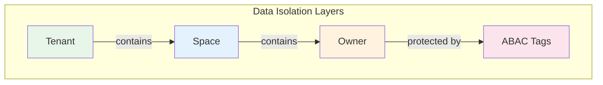
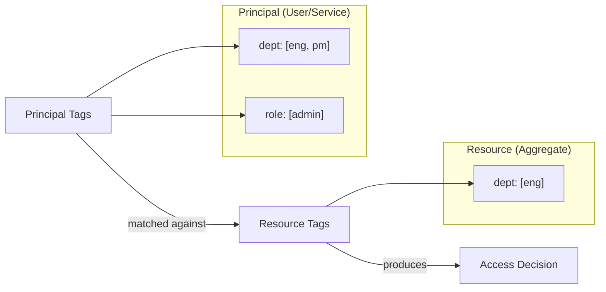

# Data Access Control

Wow provides a layered data access control model that covers the most common multi-tenancy and permission scenarios:

1. **Tenant** — isolates data by organization/customer
2. **Owner** — isolates data by user identity within a tenant
3. **Space** — provides namespace-based partitioning within a tenant
4. **ABAC** — fine-grained attribute-based access control using tags

These layers work independently and can be combined freely. You can use only tenant isolation, or combine all four for maximum security.



<!-- Sources: wow-api/src/main/kotlin/me/ahoo/wow/api/modeling/TenantId.kt, wow-api/src/main/kotlin/me/ahoo/wow/api/modeling/OwnerId.kt, wow-api/src/main/kotlin/me/ahoo/wow/api/modeling/SpaceIdCapable.kt, wow-api/src/main/kotlin/me/ahoo/wow/api/abac/Taggable.kt -->

## Tenant

Tenant is the top-level isolation boundary. In a SaaS application, each customer (organization) is typically a separate tenant. Wow automatically propagates tenant context through commands and events, ensuring data is isolated at the storage level.

### Annotation-based Tenant ID

Use the `@TenantId` annotation on a command or aggregate state property to tell the framework that this field carries the tenant identifier:

```kotlin
@AggregateRoot
class OrderAggregate(
    @AggregateId
    val orderId: String,

    @TenantId
    val tenantId: String  // Which organization this order belongs to
)
```

```kotlin
data class CreateOrder(
    @AggregateId
    val orderId: String,

    @TenantId
    val tenantId: String, // Automatically populated from request context

    val items: List<OrderItem>
)
```

The framework uses this annotation to:
- Automatically set tenant context from incoming requests
- Isolate event store and snapshot storage by tenant
- Enforce tenant boundaries in query operations

### Static Tenant ID

For aggregates that always belong to a fixed tenant (e.g., system configuration), use `@StaticTenantId`:

```kotlin
@AggregateRoot
@StaticTenantId("system-tenant")
class SystemConfigurationAggregate {
    // Always belongs to system tenant
}
```

### Default Tenant

When no tenant is specified, Wow uses a default tenant ID `(0)`. This is transparent — single-tenant applications don't need to deal with tenant IDs at all.

<!-- Sources: wow-api/src/main/kotlin/me/ahoo/wow/api/annotation/TenantId.kt:57-94, wow-api/src/main/kotlin/me/ahoo/wow/api/modeling/TenantId.kt:20-43 -->

## Owner

Within a tenant, the **Owner** layer isolates data by individual user identity. This ensures that users can only access their own data (e.g., "my orders", "my shopping cart").

### Annotation-based Owner ID

Use the `@OwnerId` annotation to mark the owner identifier:

```kotlin
data class AddToCart(
    @AggregateId
    val cartId: String,

    @OwnerId
    val userId: String,  // The user who owns this cart

    val productId: String,
    val quantity: Int
)
```

### Ownership Routing Policy

The `@AggregateRoute` annotation controls how ownership is enforced via the `owner` parameter:

```kotlin
@AggregateRoot
@AggregateRoute(
    resourceName = "orders",
    owner = AggregateRoute.Owner.ALWAYS
)
class OrderAggregate(
    @AggregateId
    val orderId: String,

    @OwnerId
    val customerId: String
)
```

Available policies:

| Policy | Description | Use Case |
|--------|-------------|----------|
| `NEVER` | No ownership required | Public resources, system aggregates |
| `ALWAYS` | Ownership always required | User-specific data (orders, profiles) |
| `AGGREGATE_ID` | Aggregate ID doubles as owner ID | Per-user aggregates (user profile, settings) |

### Ownership Transfer

When ownership needs to change (e.g., transferring a task to another user), implement the `OwnerTransferred` event interface:

```kotlin
data class TaskTransferred(
    override val toOwnerId: String
) : OwnerTransferred
```

The framework recognizes this event and automatically updates the aggregate's owner context.

<!-- Sources: wow-api/src/main/kotlin/me/ahoo/wow/api/annotation/OwnerId.kt, wow-api/src/main/kotlin/me/ahoo/wow/api/annotation/AggregateRoute.kt:59-91, wow-api/src/main/kotlin/me/ahoo/wow/api/event/OwnerTransferred.kt -->

## Space

**Space** provides namespace-based data partitioning within a tenant. It adds a third isolation dimension for scenarios like:

- Environment separation (dev / staging / prod)
- Business domain partitioning (primary / archive)
- Organizational unit boundaries

```kotlin
// Aggregates can belong to different spaces within the same tenant
data class ArchivedOrder(
    @AggregateId
    val orderId: String,

    @TenantId
    val tenantId: String,

    val spaceId: SpaceId  // "archive" space
)
```

Space transfer follows the same pattern as ownership transfer — implement `SpaceTransferred`:

```kotlin
data class OrderArchived(
    override val toSpaceId: SpaceId
) : SpaceTransferred
```

Default space ID is an empty string `""`, meaning all aggregates without explicit space assignment live in the default space.

<!-- Sources: wow-api/src/main/kotlin/me/ahoo/wow/api/modeling/SpaceIdCapable.kt, wow-api/src/main/kotlin/me/ahoo/wow/api/event/SpaceTransferred.kt -->

## ABAC (Attribute-Based Access Control)

While Tenant, Owner, and Space provide structural isolation, **ABAC** provides fine-grained, attribute-based access control. It works by attaching tags to both **principals** (users/services) and **resources** (aggregates), then matching them at query time.

### Core Concepts



<!-- Sources: wow-api/src/main/kotlin/me/ahoo/wow/api/abac/Taggable.kt:63-98 -->

**AbacTags** — A map of key-value pairs where each key maps to a list of values:

```kotlin
// User tags: belongs to engineering and product departments, admin role
val userTags: AbacTags = mapOf(
    "dept" to listOf("eng", "pm"),
    "role" to listOf("admin")
)

// Resource tags: only accessible by engineering department
val resourceTags: AbacTags = mapOf(
    "dept" to listOf("eng")
)

// Public resource: no tags = accessible by everyone
val publicResource: AbacTags = emptyMap()
```

**Wildcard** — The value `["*"]` matches all values for that key:

```kotlin
// Can access resources from any department
val adminTags: AbacTags = mapOf(
    "dept" to listOf("*")
)
```

### Applying Resource Tags

Use the `ApplyAbacTags` command interface to set tags on an aggregate:

```kotlin
@AggregateRoot
class DocumentAggregate(
    @AggregateId
    val docId: String,
    var tags: AbacTags = emptyMap()
) {
    @OnCommand
    fun onCommand(command: ApplyAbacTags): AbacTagsApplied {
        // Validate and merge tags
        return DefaultResourceTagsApplied(command.tags)
    }
}
```

Or use the built-in `DefaultApplyResourceTags` command which provides a ready-to-use tags management endpoint:

```kotlin
// The framework automatically handles DefaultApplyResourceTags
// generating a PUT endpoint: PUT /{resourceName}/{id}/tags
```

### Tag Merging

Tags can be merged using the `merge` extension function. For the same key, values from both sides are combined (union):

```kotlin
val tags1 = mapOf("dept" to listOf("eng"), "role" to listOf("admin"))
val tags2 = mapOf("dept" to listOf("pm"), "team" to listOf("backend"))

tags1.merge(tags2)
// Result: { "dept": ["eng", "pm"], "role": ["admin"], "team": ["backend"] }
```

<!-- Sources: wow-api/src/main/kotlin/me/ahoo/wow/api/abac/ApplyAbacTags.kt, wow-api/src/main/kotlin/me/ahoo/wow/api/abac/ApplyResourceTags.kt, wow-api/src/main/kotlin/me/ahoo/wow/api/abac/AbacTagsMerger.kt -->

### ABAC Query Filter

When querying snapshots, the `AbacQueryFilter` automatically injects permission conditions based on the principal's tags. The matching rules are:

| Principal Tags | Resource Tags | Result |
|---------------|---------------|--------|
| `["*"]` (wildcard) | Any | ✅ Match |
| `["a", "b"]` | `["a"]` | ✅ Match |
| `["a", "b"]` | `["c"]` | ❌ No match |
| Any | Key absent | ✅ Match (resource is public for this key) |

The filter converts principal tags into query conditions:
- For wildcard tags: checks that the key exists on the resource
- For regular tags: matches resources where the key is absent, empty, or has a value in the principal's list

To implement custom principal tag resolution, extend `AbacQueryFilter`:

```kotlin
@Component
class MyAbacQueryFilter : AbacQueryFilter() {
    override fun getPrincipalTags(
        contextView: ContextView,
        context: QueryContext<*, *>
    ): Mono<AbacTags> {
        // Resolve principal tags from security context, JWT, etc.
        return SecurityContext.fromContext(contextView)
            .map { it.abacTags }
    }
}
```

<!-- Sources: wow-query/src/main/kotlin/me/ahoo/wow/query/snapshot/filter/AbacQueryFilter.kt -->

## Layered Isolation Summary

| Layer | Scope | Mechanism | Typical Use Case |
|-------|-------|-----------|-----------------|
| Tenant | Organization | `@TenantId` annotation + storage isolation | SaaS multi-tenancy |
| Space | Namespace within tenant | `SpaceId` field + storage partitioning | Environment, domain separation |
| Owner | Individual user | `@OwnerId` annotation + route policy | "My data" isolation |
| ABAC | Attribute-based | Tags on principal + resource + query filter | Fine-grained permission (department, role, level) |

These layers are **additive** — enabling more layers adds more restrictions. A query without any layer applied returns all data; enabling tenant + owner + ABAC restricts to only the data the authenticated user is allowed to see.
