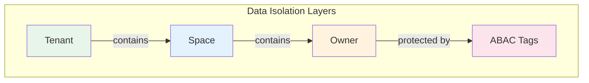
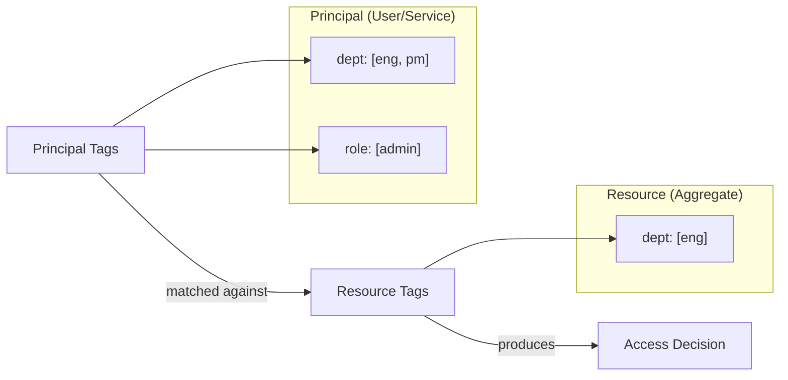

# Data Access Control

Wow provides three optional data isolation layers and an attribute-based access control layer:

1. **Tenant** — isolates data by organization/customer (optional)
2. **Owner** — isolates data by user identity within a tenant (optional)
3. **Space** — provides namespace-based partitioning within a tenant (optional)
4. **ABAC** — fine-grained attribute-based access control using tags

All three isolation layers are **optional** and can be enabled independently or combined freely. Single-tenant applications don't need any isolation layer; SaaS applications can combine tenant, owner, space, and ABAC as needed.



## RESTful URL Pattern

The data isolation layers are reflected in the automatically generated RESTful API paths:

```
[tenant/{tenantId}]/[owner/{ownerId}]/resource/[{resourceId}]/action
```

| Layer | Path / Header | When Applied |
|-------|---------------|--------------|
| Tenant | `tenant/{tenantId}` path prefix | Aggregate is **not** marked with `@StaticTenantId` |
| Owner | `owner/{ownerId}` path prefix | `@AggregateRoute(owner ≠ NEVER)` |
| Space | `Wow-Space-Id` request header | `@AggregateRoute(spaced = true)` |

The framework generates **multiple route variants** for each aggregate — a default route without prefixes, a tenant-only route, and an owner-only route — so callers can use the minimal scope they need.

## Tenant

Tenant is the top-level isolation boundary. In a SaaS application, each customer (organization) is typically a separate tenant. Wow automatically propagates tenant context through commands and events, ensuring data is isolated at the storage level.

### Annotation-based Tenant ID

Use the `@TenantId` annotation on a command or aggregate state property to tell the framework that this field carries the tenant identifier:

```kotlin
@AggregateRoot
class OrderAggregate(
    @AggregateId
    val orderId: String,

    @TenantId
    val tenantId: String  // Which organization this order belongs to
)
```

```kotlin
data class CreateOrder(
    @AggregateId
    val orderId: String,

    @TenantId
    val tenantId: String, // Automatically populated from request context

    val items: List<OrderItem>
)
```

The framework uses this annotation to:
- Automatically set tenant context from incoming requests
- Isolate event store and snapshot storage by tenant
- Enforce tenant boundaries in query operations
- Generate the `tenant/{tenantId}` path prefix in RESTful APIs

### Static Tenant ID

For aggregates that always belong to a fixed tenant (e.g., system configuration), use `@StaticTenantId`:

```kotlin
@AggregateRoot
@StaticTenantId("system-tenant")
class SystemConfigurationAggregate {
    // Always belongs to system tenant
    // No tenant/{tenantId} path prefix in generated APIs
}
```

### Default Tenant

When no tenant is specified, Wow uses a default tenant ID `(0)`. This is transparent — single-tenant applications don't need to deal with tenant IDs at all.

## Owner

Within a tenant, the **Owner** layer isolates data by individual user identity. This ensures that users can only access their own data (e.g., "my orders", "my shopping cart").

### Annotation-based Owner ID

Use the `@OwnerId` annotation to mark the owner identifier:

```kotlin
data class AddToCart(
    @AggregateId
    val cartId: String,

    @OwnerId
    val userId: String,  // The user who owns this cart

    val productId: String,
    val quantity: Int
)
```

### Ownership Routing Policy

The `@AggregateRoute` annotation controls how ownership is enforced via the `owner` parameter:

```kotlin
@AggregateRoot
@AggregateRoute(
    resourceName = "orders",
    owner = AggregateRoute.Owner.ALWAYS
)
class OrderAggregate(
    @AggregateId
    val orderId: String,

    @OwnerId
    val customerId: String
)
```

Available policies:

| Policy | `owned` | Description | API Path | Use Case |
|--------|---------|-------------|----------|----------|
| `NEVER` | `false` | No ownership required | `/orders/{id}` | Public resources, system aggregates |
| `ALWAYS` | `true` | Ownership always required | `/owner/{ownerId}/orders/{id}` | User-specific data (orders, profiles) |
| `AGGREGATE_ID` | `true` | Aggregate ID doubles as owner ID | `/owner/{ownerId}/orders` (no `{id}`) | Per-user aggregates (user profile, settings) |

When `AGGREGATE_ID` is used, the `{resourceId}` path parameter is removed since the owner ID already identifies the aggregate.

### Ownership Transfer

When ownership needs to change (e.g., transferring a task to another user), implement the `OwnerTransferred` event interface:

```kotlin
data class TaskTransferred(
    override val toOwnerId: String
) : OwnerTransferred
```

The framework recognizes this event and automatically updates the aggregate's owner context.

## Space

**Space** provides namespace-based data partitioning within a tenant. It adds a third isolation dimension for scenarios like:

- Environment separation (dev / staging / prod)
- Business domain partitioning (primary / archive)
- Organizational unit boundaries

### Enabling Space

Set `spaced = true` on `@AggregateRoute`:

```kotlin
@AggregateRoot
@AggregateRoute(
    resourceName = "sales-order",
    spaced = true,
    owner = AggregateRoute.Owner.ALWAYS
)
class Order(private val state: OrderState)
```

When `spaced = true`, the generated API adds a `Wow-Space-Id` request header parameter. The default space ID is an empty string `""`, meaning all aggregates without explicit space assignment live in the default space.

### Space Transfer

Space transfer follows the same pattern as ownership transfer — implement `SpaceTransferred`:

```kotlin
data class OrderArchived(
    override val toSpaceId: SpaceId
) : SpaceTransferred
```

The framework recognizes this event and automatically updates the aggregate's space context.

## ABAC (Attribute-Based Access Control)

While Tenant, Owner, and Space provide structural isolation, **ABAC** provides fine-grained, attribute-based access control. It works by attaching tags to both **principals** (users/services) and **resources** (aggregates), then matching them at query time.

### Core Concepts



**AbacTags** — A map of key-value pairs where each key maps to a list of values:

```kotlin
// User tags: belongs to engineering and product departments, admin role
val userTags: AbacTags = mapOf(
    "dept" to listOf("eng", "pm"),
    "role" to listOf("admin")
)

// Resource tags: only accessible by engineering department
val resourceTags: AbacTags = mapOf(
    "dept" to listOf("eng")
)

// Public resource: no tags = accessible by everyone
val publicResource: AbacTags = emptyMap()
```

**Wildcard** — The value `["*"]` matches all values for that key:

```kotlin
// Can access resources from any department
val adminTags: AbacTags = mapOf(
    "dept" to listOf("*")
)
```

### Applying Resource Tags

Use the `ApplyAbacTags` command interface to set tags on an aggregate:

```kotlin
@AggregateRoot
class DocumentAggregate(
    @AggregateId
    val docId: String,
    var tags: AbacTags = emptyMap()
) {
    @OnCommand
    fun onCommand(command: ApplyAbacTags): AbacTagsApplied {
        return DefaultResourceTagsApplied(command.tags)
    }
}
```

Or use the built-in `DefaultApplyResourceTags` command which generates a ready-to-use endpoint:

```kotlin
// PUT /{resourceName}/{id}/tags
// Body: { "tags": { "dept": ["eng"], "role": ["admin"] } }
```

### Tag Merging

Tags can be merged using the `merge` extension function. For the same key, values from both sides are combined (union):

```kotlin
val tags1 = mapOf("dept" to listOf("eng"), "role" to listOf("admin"))
val tags2 = mapOf("dept" to listOf("pm"), "team" to listOf("backend"))

tags1.merge(tags2)
// Result: { "dept": ["eng", "pm"], "role": ["admin"], "team": ["backend"] }
```

### Dynamic Tag Extraction with StateAggregateTagsExtractor

Tags can be extracted dynamically from aggregate state at query time, rather than being stored statically. Implement `StateAggregateTagsExtractor` on the state class:

```kotlin
class OrderState(
    val id: String
) : StateAggregateTagsExtractor<OrderState> {

    lateinit var address: ShippingAddress
    // ... other fields ...

    override fun extract(source: ReadOnlyStateAggregate<OrderState>): AbacTags {
        val staticTags = mapOf(
            "address-country" to listOf(address.country),
            "address-province" to listOf(address.province),
        )
        // Merge with tags stored on the aggregate
        return staticTags.merge(source.tags)
    }
}
```

This pattern allows ABAC rules to be based on aggregate state fields (like address) combined with explicitly assigned tags.

### ABAC Query Filter

When querying snapshots, the `AbacQueryFilter` automatically injects permission conditions based on the principal's tags. The matching rules are:

| Principal Tags | Resource Tags | Result |
|---------------|---------------|--------|
| `["*"]` (wildcard) | Any | ✅ Match |
| `["a", "b"]` | `["a"]` | ✅ Match |
| `["a", "b"]` | `["c"]` | ❌ No match |
| Any | Key absent | ✅ Match (resource is public for this key) |

The filter converts principal tags into query conditions using AND logic across all keys:
- **Wildcard** tags: checks that the key exists on the resource (`EXISTS`)
- **Regular** tags: matches resources where the key is absent, empty, or has a value in the principal's list

To implement custom principal tag resolution, extend `AbacQueryFilter`:

```kotlin
@Component
class MemberAbacQueryFilter(
    private val memberCache: MemberCache
) : AbacQueryFilter() {

    override fun getPrincipalTags(
        contextView: ContextView,
        context: QueryContext<*, *>
    ): Mono<AbacTags> {
        val securityContext = contextView.getSecurityContextOrEmpty()
            ?: return Mono.empty()
        val principal = securityContext.principal

        // Look up member tags from cache based on user + tenant + app
        return Mono.fromCallable {
            val memberId = memberId(userId = principal.id, tenantId = principal.tenantId)
            memberCache[memberId]?.tags?.get(appId)
        }
    }
}
```

## Layered Isolation Summary

| Layer | Scope | Mechanism | API Representation | Typical Use Case |
|-------|-------|-----------|-------------------|-----------------|
| Tenant | Organization | `@TenantId` / `@StaticTenantId` + storage isolation | `tenant/{tenantId}` path prefix | SaaS multi-tenancy |
| Space | Namespace within tenant | `@AggregateRoute(spaced = true)` + storage partitioning | `Wow-Space-Id` request header | Environment, domain separation |
| Owner | Individual user | `@OwnerId` + `@AggregateRoute(owner)` | `owner/{ownerId}` path prefix | "My data" isolation |
| ABAC | Attribute-based | Tags on principal + resource + query filter | Internal filter (no API surface) | Fine-grained permission (department, role, level) |

These layers are **additive** — enabling more layers adds more restrictions. A query without any layer applied returns all data; enabling tenant + owner + ABAC restricts to only the data the authenticated user is allowed to see.
