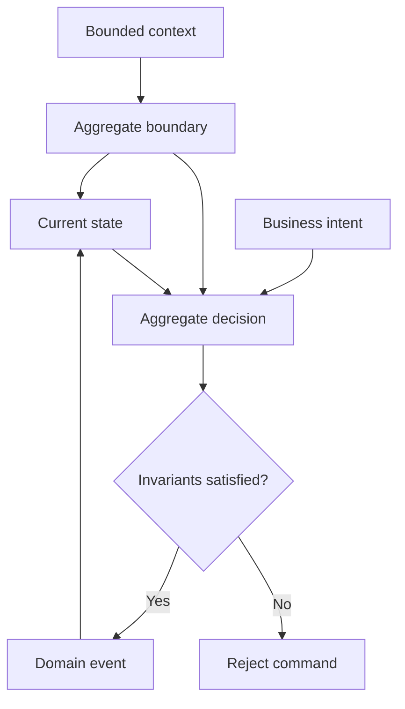

# Aggregate and Invariants

An aggregate is the consistency boundary for one event stream. It separates a business change into two clear responsibilities: the command side decides from current state, while the state side reconstructs the result only from domain events that already happened. Every state change should be explainable by an event.

An aggregate encloses state, business decisions, and invariants within one consistency boundary.



## Start With Business Boundaries

Write invariants before code. For a cart, the business rules can first be expressed as a decision table:

| Current state and intent | Decision result | State after sourcing |
| --- | --- | --- |
| Product is absent; add it | `CartItemAdded` | Add the product to `items` |
| Product already exists; add it again | `CartQuantityChanged` | Replace that product's quantity |
| Item count has reached `MAX_CART_ITEM_SIZE` | Reject the operation | State is unchanged and no business event is emitted |
| Remove a set of products | `CartItemRemoved` | Filter the matching `productId` values |

This table determines three kinds of model: commands express intent, events express facts, and the state object changes only while sourcing events. Modeling is complete when every invariant has an explicit success event, rejection result, and deterministic sourcing result.

## Bounded Context and Aggregate Identity

A bounded context owns a coherent business language and its aggregate names. An aggregate's runtime identity contains `contextName`, `aggregateName`, `tenantId`, and `id`; routing and storage must preserve the complete `AggregateId`.

`tenantId` is routing and isolation context, not a second ID namespace. Within one `NamedAggregate` (`contextName` + `aggregateName`), an `id` must be unique across tenants. See [Core Concepts](../core-concepts.md) for terminology and identity details.

## State, Domain Events, and Invariants

`Cart` reads `CartState` and returns events; `CartState` keeps setters private and updates only in sourcing functions:

```kotlin
class CartState(val id: String) {
    var items: List<CartItem> = listOf()
        private set

    @OnSourcing
    fun onCartItemAdded(event: CartItemAdded) {
        items = items + event.added
    }

    @OnSourcing
    fun onCartQuantityChanged(event: CartQuantityChanged) {
        items = items.map {
            if (it.productId == event.changed.productId) event.changed else it
        }
    }
}
```

A state object must expose one of `ctor()`, `ctor(id)`, or `ctor(id, tenantId)`; it may have at most two parameters and each must be a `String`. `onSourcing` is the conventional name; another name needs `@OnSourcing`. A sourcing function returns no event, calls no external service, and reads neither current time nor randomness.

## Recommended Aggregate Organization

Use a command object composed with a state object by default:

```text
Command -> Command aggregate -> Domain event -> State aggregate
                   reads state                 mutates state
```

`Cart` and `Order` both use this structure, so the decision maker and state mutator are immediately visible. A command object may instead inherit a state object, or commands and state may share one very small class; in all cases, command paths must not mutate state directly and state setters must remain private.

Do not add inheritance layers for hypothetical reuse. Wow supports both Kotlin and Java; see the [Bank Transfer example](../../reference/example/transfer) for a complete Java organization.

## Deterministic State Evolution

The same initial state and event sequence must produce the same result. Otherwise, history replay, snapshot verification, and recovery cannot be trusted.

When one handling result contains multiple events, their order is also a contract. State consumes only events that change this aggregate; notification events for other components may leave it unchanged. This makes the same history replayable without new results caused by environment or execution time.

## Lifecycle Invariants

The order example makes allowed state transitions explicit on the command side:

| Command | Allowed state | Event and next state |
| --- | --- | --- |
| `ChangeAddress` | `CREATED` | `AddressChanged`; state remains `CREATED` |
| `PayOrder` | `CREATED` | `OrderPaid`; fully paid moves to `PAID` |
| `ShipOrder` | `PAID` | `OrderShipped`; moves to `SHIPPED` |
| `ReceiptOrder` | `SHIPPED` | `OrderReceived`; moves to `RECEIVED` |

Reject invalid transitions on the command side; the state side does not infer command intent. Delete and recover are aggregate lifecycle operations too: test access rejection after deletion, successful recovery, and repeated recovery failure.

## Continue to Command Definition

With aggregate boundaries and invariants clear, continue to [Define Commands](../command/definition.md): give an intent its payload, target-aggregate metadata, and handling function.
