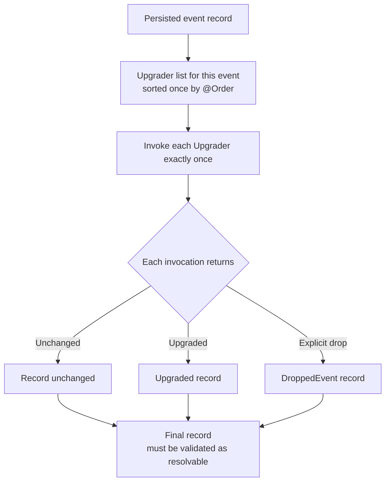

# Event Evolution

When historical events are read, `EventUpgraderFactory` invokes every Upgrader registered for that event once in `@Order` order. Each invocation may return the record unchanged, upgraded, or as a `DroppedEvent` record; the application must verify that the final record is resolvable.



## Why Persisted Events Need Long-Term Compatibility

A persisted domain event is a long-lived wire contract. Changing a Kotlin type affects new code only; old EventStore records retain their event name, `bodyType`, `revision`, and body. On reads, Wow upgrades each `DomainEventRecord` before resolving it to the current event type and passing it to state sourcing.

An upgrader changes only the record used for this read; it does not write the result back to EventStore. Event history remains authoritative fact. Incorrect business facts require an auditable repair or compensation and must not be disguised as harmless schema upgrades.

## Revision and Upgrader

`revision` describes the event-body schema and is declared by `@Event(revision = ...)`; aggregate `version` describes an event stream's order within one aggregate history. Their responsibilities differ and neither replaces the other.

An `EventUpgrader` selects historical events by `contextName + aggregateName + eventName` and explicitly transforms an old record into the target shape:

```kotlin
@Order(100)
class OrderCreatedV2Upgrader : EventUpgrader {
    override val eventNamedAggregate =
        "sales.order".toNamedAggregate()
            .toEventNamedAggregate("order_created")

    override fun upgrade(record: DomainEventRecord): DomainEventRecord {
        if (record.revision != "0.0.1") return record

        return record.toMutableDomainEventRecord().apply {
            body.put("currency", "CNY")
            revision = "2.0.0"
        }
    }
}
```

Every step must recognize its source revision and write an explicit target revision; the framework does not infer a transformation from revision values.

## Upgrade Chain Order

`EventUpgraderFactory` discovers implementations through ServiceLoader, groups them by event identity, and sorts them by Wow `@Order`. When reading a record, it sequentially executes **every** upgrader registered for that event:

```text
0.0.1 --order 100--> 1.0.0 --order 200--> 2.0.0
```

Each step should therefore return a non-matching revision unchanged. The framework guarantees only function order; the application must verify chain continuity, missing revisions, and whether the final output deserializes. Keep a step while its source revision may remain in history.

The runtime artifact must contain:

```text
META-INF/services/me.ahoo.wow.event.upgrader.EventUpgrader
```

List one implementation class per line. Registering an implementation directly in test code does not prove that the production artifact's ServiceLoader configuration works.

## Field Evolution

| Change | Compatibility strategy |
| --- | --- |
| Add an optional field or safe default | Prove the current mapper reads real old records and replay preserves state; omit an upgrader when no transformation is needed |
| Add a required field, change a type, or reshape nesting | Use an upgrader to convert the old body to an explicit target revision |
| Rename an event or JVM type | Update and verify `name`, `bodyType`, `revision`, body, and event-type registration together |
| Change only aggregate version | This cannot express an event-schema change; aggregate version controls ordering and concurrency only |

`MutableDomainEventRecord` can change `name`, `bodyType`, `revision`, and body while preserving historical-position data such as aggregate identity, event-stream version, sequence, commandId, and time. After a rename, the target event identity and revision must resolve to the intended type.

## Deletion, Replacement, and DroppedEvent

Deleting or replacing an event type does not delete history. When the current state model genuinely no longer needs an event, an upgrader may convert it to `DroppedEvent`: `toDroppedEventRecord()` replaces name, bodyType, and body with the framework's dropped record while retaining the event's version and order in the stream.

::: danger
Do not drop an event merely to bypass deserialization failure. Use `DroppedEvent` only after historical replay proves that later state, business invariants, and downstream processing do not depend on that fact.
:::

If an old fact still affects current state, upgrade it or replace it with a semantically equivalent current event. If the fact itself is wrong, use an auditable data-repair or compensation process.

## Historical Replay Verification

Verification should cover the complete read chain, not just the upgrader function:

1. For every source revision present in real history, verify the target name, type, revision, and body.
2. Load the chain from the final artifact through ServiceLoader and assert its `@Order` sequence.
3. Pass upgraded output through current event-type registration and deserialization.
4. Replay sanitized real samples or complete fixtures from empty state, comparing versions, critical state, and business invariants.
5. Verify projection, Saga, and other consumer outcomes for old and new events.

The narrow repository entry points are:

```bash
./gradlew :wow-core:test --tests "me.ahoo.wow.event.upgrader.EventUpgraderFactoryTest"
./gradlew :wow-core:test --tests "me.ahoo.wow.serialization.JsonSerializerEventTest"
```

Implementation entry points: [`EventUpgrader`](https://github.com/Ahoo-Wang/Wow/blob/main/wow-core/src/main/kotlin/me/ahoo/wow/event/upgrader/EventUpgrader.kt), [`EventUpgraderFactory`](https://github.com/Ahoo-Wang/Wow/blob/main/wow-core/src/main/kotlin/me/ahoo/wow/event/upgrader/EventUpgraderFactory.kt), and [`DroppedEvent`](https://github.com/Ahoo-Wang/Wow/blob/main/wow-core/src/main/kotlin/me/ahoo/wow/event/upgrader/DroppedEvent.kt).

## Release and Rollback Boundaries

Before release, count real revision distribution, replay representative and longest event streams, and verify backup restoration. When old and new instances coexist during a rolling release, old instances must be able to read revisions written by new instances; if bidirectional reading is impossible, suspend writes or stage compatibility.

An application rollback must also retain the upgrader chain required by that application version. Passing local tests proves candidate code only; it does not prove production data distribution, instance-coexistence windows, backup recoverability, or full-replay duration.
