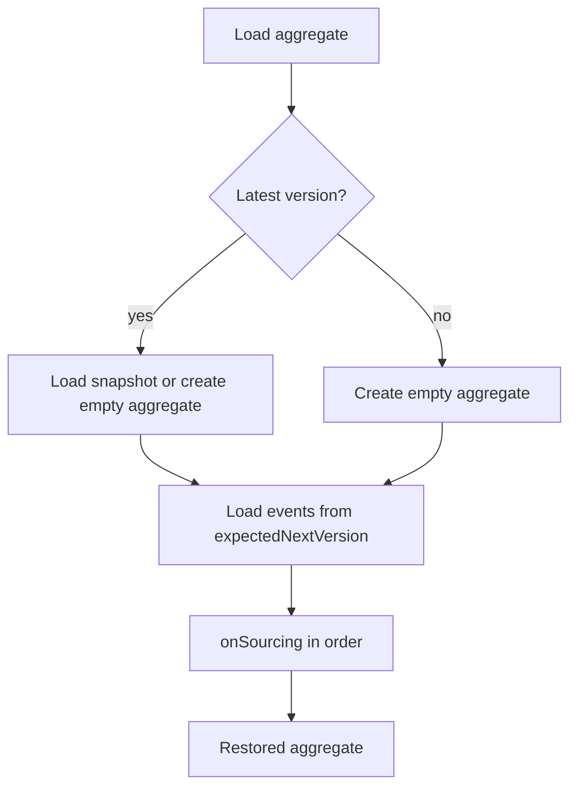

# Event Sourcing

Event sourcing keeps an aggregate's facts that have already happened as ordered `DomainEventStream` values and restores state from those facts. Commands make decisions; an event becomes recoverable authoritative history only after `EventStore` appends it successfully.

## Authoritative History Model

An event stream is the aggregate's consistency history. Snapshots, projections, and event-processor results cannot replace it. The complete command-execution phases are documented in the [Command Processing Pipeline](../command/internals/pipeline.md); this page defines only when history becomes authoritative and the boundaries used for recovery.

| Data | Role | Can replace authoritative history? |
| --- | --- | --- |
| `DomainEventStream` | Facts that happened to the aggregate | Yes; it is the authoritative history |
| snapshot in `SnapshotStore` | Replaceable loading checkpoint | No; it can be rebuilt from event history |
| projection | Query-specific derived read model | No; rebuild under its own recovery strategy |
| event-processor side effect | Integration or application outcome | No; owned by the processor's idempotency, retry, or compensation boundary |

Working state in memory is not authoritative before `EventStore.append` succeeds. A later failure while sending messages, taking a snapshot, or projecting does not undo event history that was already appended.

## DomainEvent and DomainEventStream

`DomainEvent<T>` represents an immutable domain fact. One command execution produces one non-empty event stream; its events belong to one aggregate, are ordered by increasing version, and the stream has a one-to-one relationship with `commandId`.

```kotlin
interface DomainEventStream :
    EventMessage<DomainEventStream, List<DomainEvent<*>>>,
    RequestId,
    Iterable<DomainEvent<*>>,
    Copyable<DomainEventStream> {
    override val aggregateId: AggregateId
    val size: Int
}
```

`SimpleDomainEventStream` derives `aggregateId`, `commandId`, `version`, owner, space, and creation time from its first event, while retaining `requestId` and headers. Construction rejects an empty event list; replay must preserve event order instead of creating new facts.

## EventStore Contract

`EventStore` appends history and loads it by aggregate. Version and time ranges both include their endpoints; `single` loads one specified version and `last` is implemented by the store.

```kotlin
interface EventStore :
    RequestIdExistenceChecker,
    AggregateIdScanner,
    AutoCloseable {
    fun append(eventStream: DomainEventStream): Mono<Void>

    fun load(
        aggregateId: AggregateId,
        headVersion: Int = DEFAULT_HEAD_VERSION,
        tailVersion: Int = DEFAULT_TAIL_VERSION,
    ): Flux<DomainEventStream>

    fun load(
        aggregateId: AggregateId,
        headEventTime: Long,
        tailEventTime: Long,
    ): Flux<DomainEventStream>

    fun single(aggregateId: AggregateId, version: Int): Mono<DomainEventStream>
    fun last(aggregateId: AggregateId): Mono<DomainEventStream>
}
```

The interface declares that append can raise `EventVersionConflictException`, `DuplicateAggregateIdException`, or `DuplicateRequestIdException`. Callers must use completion or error from the Reactor stream to determine the append result; a `Mono` before subscription is not persisted history.

## Deterministic State Sourcing

The same initial state and the same ordered event streams must produce the same state. `SimpleStateAggregate.onSourcing` first checks an initial error stream marked `IgnoreSourcing` and returns directly; only for a non-ignored stream does it validate aggregate identity and `expectedNextVersion`, then update version, operator, time, owner, space, and other metadata before invoking registered sourcing functions in order.

| Condition | Recovery behavior |
| --- | --- |
| Initial-version stream whose events are all `IgnoreSourcing` with `ErrorInfo` | Ignores the whole stream without advancing state |
| A non-ignored stream's aggregate identity differs | Throws `IllegalArgumentException` |
| A non-ignored stream version is not `expectedNextVersion` | Throws `SourcingVersionConflictException` |
| No sourcing function exists for an event body | The stream still advances the version; business state does not change |

Sourcing functions update state only from events; do not read the current time, randomness, or external services. That gives replay, snapshot validation, and failure recovery the same result.

## Aggregate State Recovery

Applications restore aggregates through `StateAggregateRepository`. For a request for the latest version, `EventSourcingStateAggregateRepository` loads a snapshot first; when none exists, it creates an empty aggregate, loads streams from `expectedNextVersion`, and invokes `onSourcing` for each stream.



Recovery for a historical version or event time starts with an empty aggregate and must not use the latest snapshot; a future checkpoint would contaminate the requested point in time. Time recovery loads from the current `eventTime + 1` through the requested tail time.

## Append, Version, and Request Identity

An event-stream version is the ordering boundary within one aggregate. A store must reject conflicting versions at append; an initial-version conflict maps to a duplicate aggregate identity. The same `requestId` within an aggregate represents a duplicate request, and the default `existsRequestId` checks it by scanning that aggregate's streams; different aggregates may use the same `requestId`.

Reuse a stable `requestId` when retrying the same business intent. When append is uncertain or a later phase fails, check authoritative history by aggregate and `requestId` before deciding whether to retry; do not treat uncommitted in-memory state as saved.

## Storage Implementation Boundaries

`wow-core` defines stream append, loading, and conflict types. It does not prescribe a storage engine, table or collection schema, transaction technology, indexes, durability level, or retry policy. `InMemoryEventStore` is suitable for tests and local verification; it is not evidence of production durability.

| Implementation responsibility | Verify with the selected backend |
| --- | --- |
| Version conflicts and duplicate requests | Atomicity, exception mapping, and concurrent behavior |
| Event sequence | Aggregate ordering and range-load semantics |
| Event data | Serialization compatibility, revision, backup, and restore |
| Runtime configuration | Capability, connection, storage routing, and snapshot strategy |

See the [Core Configuration Reference](../../reference/config/core.md) for exact properties, defaults, and wiring boundaries.

## Recovery and Verification

Focus verification on repeatable recovery rather than only a successful append:

1. Replay from empty state to version and time limits, then assert the target version and state.
2. Verify that loading after a snapshot continues at `expectedNextVersion` without skipping or replaying an event twice.
3. Verify that mismatched aggregate identities and discontinuous versions fail.
4. Verify the backend contract for duplicate initial versions, version conflicts, and duplicate `requestId` values within an aggregate.

The `wow-core` recovery and sourcing tests cover version/time recovery, metadata updates, unknown event bodies, ignored initial error streams, and identity/version conflicts. Run the relevant module and TCK tests for a concrete storage implementation before treating these boundaries as proven for production.
