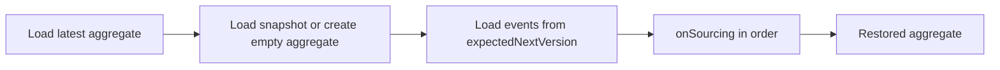

# Snapshots

A snapshot is a versioned aggregate-state checkpoint derived from event history. It shortens latest-state restoration; the event stream remains the aggregate's authoritative history.

## Snapshots Are Not Authoritative History

`SnapshotStore` holds a replaceable copy, not business facts. When a snapshot is missing, stale, or corrupt, rebuild it from the ordered event stream in `EventStore`; do not edit event history to repair a snapshot. Recovery at a historical version or time starts from an empty aggregate and must not use a latest snapshot from after the target.

## Latest-State Loading Flow

`EventSourcingStateAggregateRepository` reads a snapshot first only when loading the latest version: it materializes that snapshot into the aggregate and replays remaining events from `expectedNextVersion`; without one, it creates an empty aggregate and replays from the initial version.

Application code should depend on `StateAggregateRepository`, rather than composing snapshot and event loading itself.

## Snapshot Strategies

`SnapshotStrategy.onEvent(StateEventExchange<*>)` decides whether a state event writes a snapshot. `all` and `version_offset` are Spring Boot configuration values; `NoOp` is the strategy implementation that creates none.

| Strategy | Implementation | Write behavior |
| --- | --- | --- |
| `all` | `SimpleSnapshotStrategy` | Creates and saves a `SimpleSnapshot` for every state event |
| `version_offset` | `VersionOffsetSnapshotStrategy` | Saves only when `stateEvent.version - storedSnapshotVersion >= versionOffset`; the default `versionOffset` is `5` |
| `NoOp` / no-op | `SnapshotStrategy.NoOp` | Returns an empty `Mono` and writes nothing |

Below the `version_offset` threshold, the strategy completes normally without calling `SnapshotStore.save`. Completing a strategy therefore does not mean every command produced a new snapshot.

## SnapshotStore and Monotonic Saves

`SnapshotStore.load` reads an aggregate's latest snapshot, `getVersion` returns the uninitialized version when none exists, and `save` must atomically compare and write per aggregate. A higher or equal candidate replaces the stored value; a lower version completes normally and is ignored, so the stored version never moves backward.

This contract protects against out-of-order state events. It does not promise a particular backend's transactions, indexes, durability, or query consistency. `InMemorySnapshotStore` is appropriate for tests and single-process development, not as proof of production durability or concurrency.

## SNAPSHOT Stage Boundary

After a state event enters `SnapshotDispatcher`, `SnapshotFunctionFilter` invokes the configured strategy; `SnapshotNotifierFilter` notifies command waiters only after the snapshot filter chain completes.

With `all`, a successful `SNAPSHOT` means the save for that state event completed. With `version_offset`, it means only that the strategy completed and there may have been no new write; `NoOp` creates none. This stage does not prove replica visibility, client-cache refresh, authorization results, or projection completion.

## Restoration Optimization and Cost

Snapshots reduce the events replayed during a latest load, while adding serialization, write, index, and storage costs. `all` suits a single aggregate's current state as a routine read model; `version_offset` trades fewer writes for more restoration replay and potentially stale reads. Measure with real aggregate history and the selected backend.

A snapshot can be the default current-state read model; routes, schemas, and backend capabilities belong to the current [Query Service](../query) entry. Use a projection for a read model that joins aggregates, has a different lifecycle or schema, supports analytics, or synchronizes an external system.

## When Snapshots Are Unnecessary

Snapshots can be disabled or `NoOp` can be used when event streams are short, latest state is rarely loaded, or the selected backend and runtime do not need them. Do not retain extra storage for an unmeasured restoration optimization; choose a strategy when restoration latency or replay cost becomes evidence.

## Verification and Next Steps

Run the contract tests for the selected `SnapshotStore`, at least covering an empty load, the uninitialized version, load after save, and retaining the highest version after out-of-order or concurrent saves. Then validate restoration latency, write volume, and query visibility with a realistic workload.

Next, use [Query Service](../query) to determine queryable backends, query models, and HTTP contracts; choose a projection only when its read model materially differs from current aggregate state.
