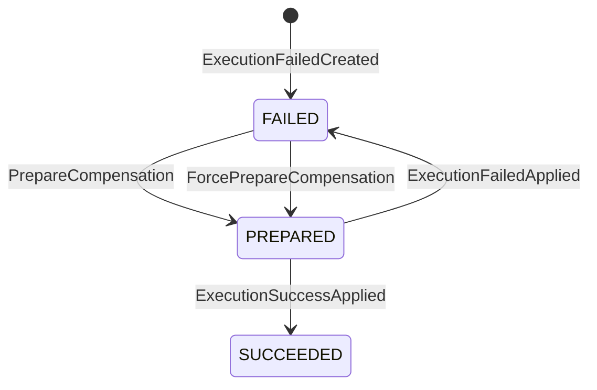
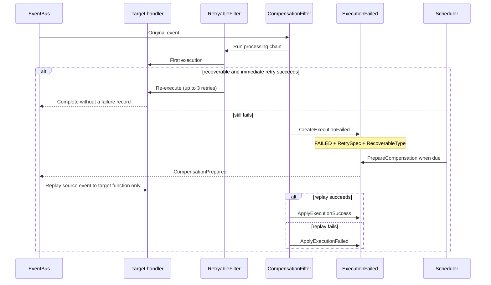

# Event Compensation

Wow event compensation records a **target handler failure** for a domain or state event and re-delivers the original event later. It supports eventual-consistency recovery for event processors, projections, stateless sagas, snapshots, and other event-processing paths.

:::warning Compensation is not rollback
Event compensation does not roll back a database, undo the original command, delete committed events, or automatically generate a business reverse action. It re-executes one event handler. If that handler writes to an external system, the application must make repeated execution safe.
:::

## Use Case Scenarios

First separate four adjacent mechanisms:

| Mechanism | When it runs | What it does | What it does not do |
| --- | --- | --- | --- |
| Saga orchestration | After a business event arrives | Generates the next command or a business-compensation command | Does not persist `ExecutionFailed` |
| Immediate retry | While one event execution remains in memory | Re-subscribes the processing chain for runtime-classified `RECOVERABLE` errors | Does not cross process boundaries or leave a durable schedule record |
| Durable event compensation | After immediate retry still fails | Creates `ExecutionFailed` and later replays only the target function | Does not roll back the original transaction |
| Operator action | When automatic recovery is unsuitable or exhausted | Inspects, reclassifies, changes policy, and prepares retry | Does not replace review of business side effects |

### Five paths every application must design

| Path | Current runtime behavior | Application responsibility |
| --- | --- | --- |
| Normal | A successful execution without a compensation ID completes without a failure record | Define business completion |
| Retryable | A recoverable error uses immediate retry first; a still-failing execution enters the durable queue as `RECOVERABLE` or `UNKNOWN` | Choose safe retry policy and monitor exhaustion |
| Unrecoverable | Automatic scheduler queries exclude `UNRECOVERABLE` records | Repair code/data or reclassify through an authorized process |
| Idempotent | A compensated event retains source identity and target-function metadata, so only that function matches | Protect side effects with unique keys, request IDs, or an external idempotency key |
| Operator-driven | Recoverability, retry spec, target function, prepare, and force prepare are mutable | Verify the error, existing effects, permission, and audit requirements first |

`UNKNOWN` is eligible for automatic scheduling, so exception classification is operational behavior rather than decorative metadata. A handler that might double-charge, duplicate a notification, or repeat an external write must not rely on “normally runs once.”


## State Diagram

Each failed execution is an `ExecutionFailed` aggregate:


```mermaid
stateDiagram-v2
    [*] --> FAILED: ExecutionFailedCreated
    FAILED --> PREPARED: PrepareCompensation
    FAILED --> PREPARED: ForcePrepareCompensation
    PREPARED --> FAILED: ExecutionFailedApplied
    PREPARED --> SUCCEEDED: ExecutionSuccessApplied
```

| Field | Meaning |
| --- | --- |
| `status` | `FAILED`, `PREPARED`, or `SUCCEEDED` |
| `recoverable` | `RECOVERABLE`, `UNKNOWN`, or `UNRECOVERABLE` |
| `retryState.retries` | Number of prepared compensation attempts |
| `retryState.nextRetryAt` | Earliest time automatic scheduling may prepare the next attempt |
| `retryState.timeoutAt` | Time when the current `PREPARED` attempt becomes timed out |
| `isRetryable` | The status is not succeeded and the retry limit has not been reached; this flag alone does not include `recoverable` |

Automatic scheduling adds recoverability, time, and status conditions: it selects only `RECOVERABLE` / `UNKNOWN` records below the retry limit with `nextRetryAt <= now`, whose status is `FAILED` or whose `PREPARED` attempt has timed out.


## Execution Sequence Diagram


```mermaid
sequenceDiagram
    participant EventBus
    participant Handler as Target handler
    participant Immediate as RetryableFilter
    participant Filter as CompensationFilter
    participant Failed as ExecutionFailed
    participant Scheduler

    EventBus->>Filter: Original event
    Filter->>Immediate: Run processing chain
    Immediate->>Handler: First execution
    alt recoverable and immediate retry succeeds
        Immediate->>Handler: Re-execute (up to 3 retries)
        Handler-->>EventBus: Complete without a failure record
    else still fails
        Filter->>Failed: CreateExecutionFailed
        Note over Failed: FAILED + RetrySpec + RecoverableType
        Scheduler->>Failed: PrepareCompensation when due
        Failed-->>EventBus: CompensationPrepared
        EventBus->>Handler: Replay source event to target function only
        alt replay succeeds
            Filter->>Failed: ApplyExecutionSuccess
        else replay fails
            Filter->>Failed: ApplyExecutionFailed
        end
    end
```

`CompensationEventProcessor` replays only when the source event's aggregate exists in local metadata. `EVENT` uses the domain event bus; `STATE_EVENT` reconstructs state before sending a state event. Context, processor, and function names in compensation headers make only the recorded target function match the replay.


## Subscriber Service

A subscriber needs the compensation core module. When Spring Boot Starter detects it, the starter registers domain- and state-event compensation filters plus `CompensationEventProcessor` by default:

::: code-group
```kotlin [Gradle(Kotlin)]
implementation("me.ahoo.wow:wow-compensation-core")
```
```groovy [Gradle(Groovy)]
implementation 'me.ahoo.wow:wow-compensation-core'
```
```xml [Maven]
<dependency>
    <groupId>me.ahoo.wow</groupId>
    <artifactId>wow-compensation-core</artifactId>
</dependency>
```
:::

The default is `wow.compensation.enabled=true`. Disable it only when the application intentionally accepts that event-function failures are neither persisted nor replayable:

```yaml
wow:
  compensation:
    enabled: false
```

Disabling compensation does not disable sagas and does not change immediate retries by `RetryableFilter`; it removes only durable event compensation.

### Custom Retry Mechanism

`@Retry` is the function-level durable-compensation policy:

```kotlin
@Retry(
    maxRetries = 5,
    minBackoff = 60,
    executionTimeout = 10,
    recoverable = [TimeoutException::class],
    unrecoverable = [IllegalArgumentException::class],
)
@OnEvent
fun onOrderCreated(event: DomainEvent<OrderCreated>): CommandBuilder? =
    if (event.body.fromCart) {
        RemoveCartItem(
            productIds = event.body.items.map { it.productId }.toSet(),
        ).commandBuilder().aggregateId(event.ownerId)
    } else {
        null
    }
```

| Parameter | Default | Effect |
| --- | --- | --- |
| `enabled` | `true` | When `false`, a function error does not create or update a compensation record |
| `maxRetries` | `10` | Maximum number of normal prepare attempts |
| `minBackoff` | `180` seconds | Base value for exponential backoff |
| `executionTimeout` | `120` seconds | Timeout threshold for a `PREPARED` attempt |
| `recoverable` | Empty | Classifies matching exceptions as `RECOVERABLE` |
| `unrecoverable` | Empty | Classifies matching exceptions as `UNRECOVERABLE` |

Durable backoff is `retryAt + minBackoff * 2^retries`. Exception arrays match assignable types. Without a function-level match, the runtime global classification applies; for example, `RecoverableException` and `TimeoutException` are recoverable by default.

:::tip Two retry layers
The default `RetryableFilter` retries a recoverable error in the current process 3 times with a 2-second minimum backoff. `@Retry`'s `maxRetries/minBackoff/executionTimeout` configure the later durable failure record. Never infer one layer's policy from the other.
:::

## Console

The compensation service is itself a Wow application:

| Module | Responsibility |
| --- | --- |
| `wow-compensation-api` | Commands, events, state, and query contracts |
| `wow-compensation-domain` | `ExecutionFailed` aggregate constraints and backoff calculation |
| `wow-compensation-core` | Failure capture, result updates, and event replay |
| `wow-compensation-server` | Snapshot queries, distributed scheduling, OpenAPI, notifications, and static dashboard hosting |
| `dashboard` | React operator interface |

The scheduler is enabled by default, runs every 60 seconds with a batch size of 100, and uses mutex contention so several instances do not schedule the same batch concurrently. Production should tune period and batch size from backlog and handling time instead of using unbounded polling.

### UI

The current UI provides these queues:

- **To Retry**: active records classified `RECOVERABLE/UNKNOWN` and still retryable;
- **Executing**: `PREPARED` records that have not timed out;
- **Next Retry**: automatic-scheduling candidates whose `nextRetryAt` is due;
- **Non Retryable**: active records at the normal retry limit;
- **Succeeded**: history whose replay succeeded;
- **Unrecoverable**: active records classified unrecoverable.

The list supports exact filters for execution ID, event ID, aggregate ID, aggregate context/name, and processor context/name. Details show the error and stack trace, event and aggregate identity, tenant, function, recoverability, retry spec, timing, state, and paginated event-stream history.

Action boundaries:

- **Prepare compensation** sends normal prepare; the server still validates state and retry limit.
- **Force prepare** requires confirmation and may bypass the retry limit; it still rejects `SUCCEEDED` or a non-timed-out `PREPARED` attempt.
- **Apply retry spec** changes non-negative `maxRetries`, `minBackoff`, and `executionTimeout`.
- **Mark recoverable** changes recoverability after confirmation and directly affects automatic scheduling eligibility.
- **Change function** edits context, processor, function name, and `EVENT/STATE_EVENT` kind; use it only after confirming that handler identity moved.

The current UI has no delete or deleted-aggregate recovery button. The repository also supplies no operator role model, approval workflow, or audit-retention policy. A deployment must provide those controls through its network, authentication, authorization, and audit layers.


### Notifications (WeChat Work)

Configure a WeChat Work group-bot webhook to subscribe to compensation events. The default events are `execution_failed_created`, `execution_failed_applied`, and `execution_success_applied`:

```yaml
wow:
  compensation:
    host: https://compensation.example.com # Quick navigation from a notification
    webhook:
      weixin:
        url: ${WEIXIN_WEBHOOK_URL}
        events:
          - execution_failed_created
          - execution_failed_applied
          - execution_success_applied
```

The webhook URL is a credential and should come from an environment secret. A notification reports a state change; it does not prove that business consistency has been restored.

| Failed | Succeeded |
| --- | --- |
|  |  |

### OpenAPI

The dashboard uses the generated `ExecutionFailedCommandClient`. Common operator command routes are:

| Action | Route |
| --- | --- |
| Normal prepare | `PUT /compensation/execution_failed/{id}/prepare_compensation` |
| Force prepare | `PUT /compensation/execution_failed/{id}/force_prepare_compensation` |
| Change retry spec | `PUT /compensation/execution_failed/{id}/apply_retry_spec` |
| Change recoverability | `PUT /compensation/execution_failed/{id}/mark_recoverable` |
| Change target function | `PUT /compensation/execution_failed/{id}/change_function` |

The generated contract also contains default aggregate delete and recover routes, but the current dashboard does not call them. API availability is not an authorized operator process; these mutations require deployment-owned authentication, fine-grained authorization, audit, and change approval. Treat the running instance's OpenAPI document as authoritative.


### Deployment (Kubernetes)

The repository provides the `wow-compensation-server` host and dashboard build, not a production-ready cluster policy. A deployment should at minimum:

1. build from a selected Wow tag and pin an immutable image digest;
2. inject MongoDB, Kafka, Redis, notification, and authentication values through secrets;
3. define backup, capacity, and index policies for event and snapshot stores;
4. expose `/actuator/health` to probes and monitor scheduler backlog, failures, and pod restarts;
5. keep management endpoints on a protected operator network instead of the public Internet;
6. verify normal, retryable, unrecoverable, idempotent, and operator paths in a test environment before promoting the same image.

```yaml
apiVersion: apps/v1
kind: Deployment
metadata:
  name: compensation-service
spec:
  replicas: 2
  selector:
    matchLabels:
      app: compensation-service
  template:
    metadata:
      labels:
        app: compensation-service
    spec:
      containers:
        - name: compensation-service
          image: <registry>/wow-compensation-server@sha256:<digest>
          envFrom:
            - secretRef:
                name: wow-compensation-secrets
          ports:
            - name: http
              containerPort: 8080
          readinessProbe:
            httpGet:
              path: /actuator/health
              port: http
          livenessProbe:
            httpGet:
              path: /actuator/health
              port: http
```

Replica and resource values must come from capacity tests. Multiple replicas rely on scheduling mutexes and the messaging/storage infrastructure; `replicas: 2` alone does not prove high availability.
