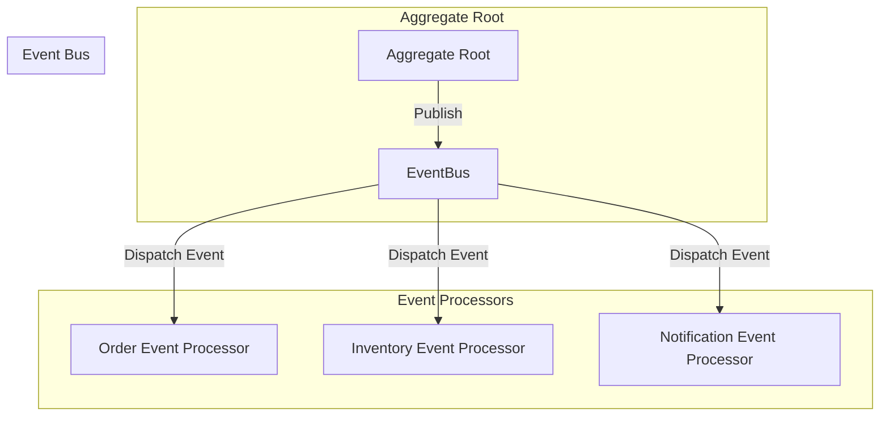
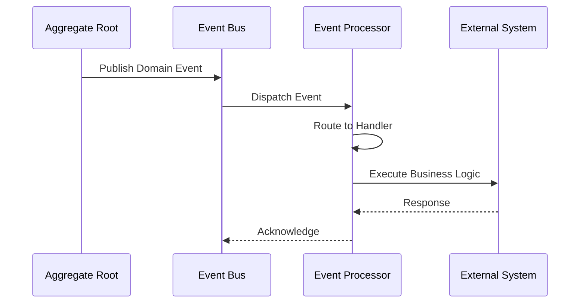

# Event Processor

The *event processor* is a core component in the Wow framework for handling domain events published by aggregates. It enables cross-aggregate operations, read model updates, notifications, and external system integrations.

## Overview

Event processors subscribe to domain events and execute business logic in response. They are a key part of the event-driven architecture, enabling loose coupling between aggregates and supporting complex business workflows.



## Event Processor vs Projection Processor

| Aspect | Event Processor | Projection Processor |
|--------|----------------|---------------------|
| Primary Purpose | Handle events, execute business logic | Update read models |
| Return Type | `Mono<Void>` or domain events | `Mono<Void>` |
| Ordering | Preserved within processor | Preserved within processor |
| Side Effects | Can publish new commands/events | Typically read-only updates |
| Use Cases | Notifications, external integrations | Query model updates |

## Creating an Event Processor

### Basic Structure

Event processors are annotated with `@EventProcessor` and contain methods annotated with `@OnEvent`:

```kotlin
@EventProcessor
class OrderEventProcessor(
    private val inventoryService: InventoryService,
    private val notificationService: NotificationService
) {

    @OnEvent
    fun onOrderCreated(event: OrderCreated): Mono<Void> {
        return inventoryService.reserveItems(event.items)
            .flatMap { reservedItems ->
                notificationService.sendOrderConfirmation(
                    customerId = event.customerId,
                    orderId = event.orderId,
                    items = reservedItems
                )
            }
    }

    @OnEvent
    fun onOrderShipped(event: OrderShipped): Mono<Void> {
        return notificationService.sendShippingNotification(
            customerId = event.customerId,
            orderId = event.orderId,
            trackingNumber = event.trackingNumber
        )
    }
}
```

### Event Handler Methods

Event handler methods can accept different parameter types:

```kotlin
@EventProcessor
class OrderEventProcessor {

    // Accept specific event type
    @OnEvent
    fun onOrderCreated(event: OrderCreated): Mono<Void> {
        // Handle event
    }

    // Accept generic domain event wrapper
    @OnEvent
    fun onEvent(event: DomainEvent<OrderCreated>): Mono<Void> {
        val aggregateId = event.aggregateId
        val eventBody = event.body
        // Handle event
    }

    // Multiple event types with same handler
    @OnEvent
    fun onStatusChanged(event: OrderStatusChanged) {
        // Handle status change
    }
}
```

### Filtering by Aggregate Name

You can filter events by aggregate name:

```kotlin
@EventProcessor
class CartEventProcessor {

    @OnEvent("order")  // Only process events from 'order' aggregate
    fun onOrderCreated(event: OrderCreated): Mono<Void> {
        // Handle only OrderCreated events from order aggregate
    }
}
```

## Event Processing Flow



## Reactive Event Processing

Event processors support reactive programming patterns:

```kotlin
@EventProcessor
class OrderEventProcessor(
    private val inventoryService: InventoryService
) {

    @OnEvent
    fun onOrderCreated(event: OrderCreated): Mono<Void> {
        return inventoryService.reserveItems(event.items)
            .doOnSuccess { reserved ->
                log.info("Reserved ${reserved.size} items for order ${event.orderId}")
            }
            .doOnError { error ->
                log.error("Failed to reserve items for order ${event.orderId}", error)
            }
    }

    @OnEvent
    fun onOrderCancelled(event: OrderCancelled): Mono<Void> {
        return inventoryService.releaseItems(event.items)
            .then()
    }
}
```

## Multiple Handlers per Processor

A single event processor can handle multiple event types:

```kotlin
@EventProcessor
class OrderEventProcessor(
    private val inventoryService: InventoryService,
    private val paymentService: PaymentService,
    private val shippingService: ShippingService
) {

    @OnEvent
    fun onOrderCreated(event: OrderCreated): Mono<Void> {
        return inventoryService.reserveItems(event.items)
    }

    @OnEvent
    fun onOrderPaid(event: OrderPaid): Mono<Void> {
        return shippingService.prepareShipment(event.orderId)
    }

    @OnEvent
    fun onOrderShipped(event: OrderShipped): Mono<Void> {
        return notificationService.notifyCustomerShipped(event)
    }

    @OnEvent
    fun onOrderCancelled(event: OrderCancelled): Mono<Void> {
        return inventoryService.releaseItems(event.items)
            .then(paymentService.refund(event.paymentId))
    }
}
```

## Error Handling

### With Compensation

For critical event processing, combine with event compensation:

```kotlin
@EventProcessor
class InventoryEventProcessor(
    private val compensationService: CompensationService
) {

    @Retry(maxRetries = 3, minBackoff = 60)
    @OnEvent
    fun onOrderCreated(event: OrderCreated): Mono<Void> {
        return inventoryService.reserveItems(event.items)
            .doOnError { error ->
                compensationService.recordFailure(event, error)
            }
    }
}
```

### Error Propagation

Events that fail processing can trigger error events:

```kotlin
@EventProcessor
class OrderEventProcessor {

    @OnEvent
    fun onOrderCreated(event: OrderCreated): Mono<ReserveInventoryFailed> {
        return inventoryService.reserveItems(event.items)
            .switchIfEmpty {
                Mono.error(InventoryUnavailableException(event.items))
            }
    }
}
```

## Best Practices

### 1. Idempotency

Design event handlers to be idempotent:

```kotlin
@EventProcessor
class InventoryEventProcessor {

    @OnEvent
    fun onOrderCreated(event: OrderCreated): Mono<Void> {
        // Use idempotent operations
        return inventoryService.upsertReservation(
            orderId = event.orderId,
            items = event.items
        )
    }
}
```

### 2. Order Preservation

For events that must be processed in order:

```kotlin
@EventProcessor
class OrderWorkflowProcessor {

    @OnEvent("order")  // Filter to single aggregate type
    fun onOrderCreated(event: OrderCreated): Mono<Void> {
        // Processing
    }

    @OnEvent("order")
    fun onOrderPaid(event: OrderPaid): Mono<Void> {
        // This will only be called after OrderCreated
    }
}
```

### 3. Performance Considerations

- Use reactive types for non-blocking operations
- Batch operations when possible
- Monitor event processing latency

```kotlin
@EventProcessor
class AnalyticsEventProcessor(
    private val batchProcessor: BatchAnalyticsProcessor
) {

    private val buffer = mutableListOf<OrderCreated>()

    @OnEvent
    fun onOrderCreated(event: OrderCreated): Mono<Void> {
        synchronized(buffer) {
            buffer.add(event)
            if (buffer.size >= 100) {
                val batch = buffer.toList()
                buffer.clear()
                return batchProcessor.processBatch(batch)
            }
        }
        return Mono.empty()
    }
}
```

### 4. Testing

```kotlin
class OrderEventProcessorSpec : EventProcessorSpec<OrderEventProcessor>({
    on {
        val event = mockk<OrderCreated> {
            every { orderId } returns "order-001"
            every { customerId } returns "customer-001"
            every { items } returns listOf(
                OrderItem(productId = "prod-001", quantity = 2)
            )
        }
        whenEvent(event) {
            expectNoError()
            expectNext Void::class.java
        }
    }
})
```

## Configuration

Event processors are automatically discovered and registered via Spring component scanning. No additional configuration is required.

## Related Topics

- [Projection Processor](./projection) - For read model updates
- [Saga](./saga) - For distributed transaction coordination
- [Event Bus](./eventstore#event-bus) - For event publishing and routing
- [Event Compensation](./event-compensation) - For error handling and recovery
