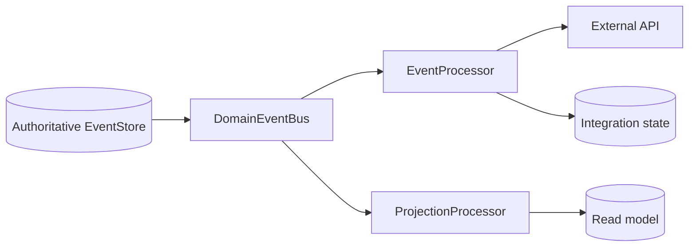
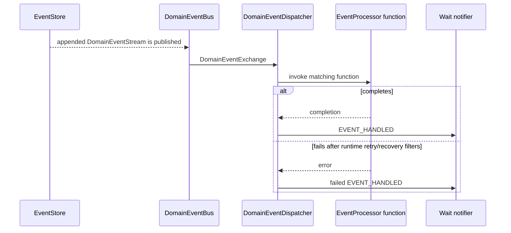

# Event Processor

An event processor reacts to domain events after the command has produced and appended its authoritative event stream. It is appropriate for notifications, integrations, and application side effects that do not belong inside the source aggregate transaction.

An event processor is derived processing. Its database or external effect is not the event history and must have its own replay, idempotency, and recovery rules.

## Overview

For the running `CreateOrder` example:

```text
CreateOrder -> append OrderCreated -> send domain/state messages
                                      |-> command chain completes -> PROCESSED
                                      |-> snapshot strategy -> SNAPSHOT
                                      |-> projection -> PROJECTED
                                      |-> event processor -> EVENT_HANDLED
```

The downstream branches are independent. `EVENT_HANDLED` means a matching event-processor function completed; it does not imply that snapshot or projection processing completed. A fast downstream function can signal before `PROCESSED`; the wait state retains that target and waits for the `PROCESSED` prerequisite rather than imposing signal arrival order.


```mermaid
flowchart LR
    Store[(Authoritative EventStore)] --> Bus[DomainEventBus]
    Bus --> EP[EventProcessor]
    EP --> API[External API]
    EP --> DB[(Integration state)]
    Bus --> PP[ProjectionProcessor]
    PP --> Read[(Read model)]
```

## Event Processor vs Projection Processor

| Concern | `@EventProcessor` | `@ProjectionProcessor` |
|---|---|---|
| Primary purpose | application/integration reaction | maintain a query model |
| Wait stage | `EVENT_HANDLED` | `PROJECTED` |
| Typical effect | send notification, call service, explicitly send command | upsert/delete a read-model row/document |
| Return value | completion/error of function invocation | completion/error of projection update |
| Recovery owner | processor retry/idempotency/compensation | projection replay/checkpoint/idempotency design |

Use a Saga when the event must coordinate commands across aggregates. Returning a command or event body from an event processor does not implicitly publish it.

## Creating an Event Processor

`@EventProcessor` is a Spring component stereotype. The framework parses `onEvent` methods or methods explicitly annotated with `@OnEvent` and registers matching message functions.

### Basic Structure

```kotlin
@EventProcessor
class OrderEventProcessor(
    private val notificationPort: NotificationPort,
) {
    @OnEvent
    fun onOrderCreated(event: OrderCreated): Mono<Void> =
        notificationPort.sendOrderCreated(
            operationId = event.orderId,
            event = event,
        )
}
```

The returned `Mono` must represent completion of the side effect. Starting an untracked subscription inside the method would make `EVENT_HANDLED` complete too early and detach failures from the dispatcher.

### Event Handler Methods

The first parameter determines the supported event type and can be the body, `DomainEvent<T>`, or `DomainEventExchange<T>`. Additional parameters can be injected by Wow's function-accessor infrastructure.

```kotlin
@EventProcessor
class OrderAuditProcessor {
    fun onEvent(event: OrderCreated): Mono<Void> = record(event)

    @OnEvent
    fun onPaid(event: DomainEvent<OrderPaid>): Mono<Void> =
        record(event.aggregateId, event.body)
}
```

The conventional method name `onEvent` works without `@OnEvent`. Use the annotation when the method has another name or needs topic/retry metadata.

### Filtering by Aggregate Name

`@OnEvent` accepts aggregate names:

```kotlin
@OnEvent("order")
fun onOrderCreated(event: OrderCreated): Mono<Void> = record(event)
```

When names are omitted, topic resolution uses the event body's metadata. Use explicit aggregate names when one event type can appear on multiple aggregate topics and the processor should handle only a subset.

## Event Processing Flow


```mermaid
sequenceDiagram
    participant E as EventStore
    participant B as DomainEventBus
    participant D as DomainEventDispatcher
    participant P as EventProcessor function
    participant W as Wait notifier

    E-->>B: appended DomainEventStream is published
    B->>D: DomainEventExchange
    D->>P: invoke matching function
    alt completes
        P-->>D: completion
        D->>W: EVENT_HANDLED
    else fails after runtime retry/recovery filters
        P-->>D: error
        D->>W: failed EVENT_HANDLED
    end
```

The append happened before this flow. A processor failure must not be described as an event-store rollback.

## Reactive Event Processing

Compose the whole operation and return it:

```kotlin
@OnEvent
fun onOrderCreated(event: DomainEvent<OrderCreated>): Mono<Void> =
    reservationPort.upsert(
        operationId = event.id,
        orderId = event.aggregateId.id,
        items = event.body.items,
    ).then()
```

Avoid `block()` and nested `subscribe()`. The dispatcher can observe success, error, timeout, retry, and acknowledgement only through the returned publisher.

## Multiple Handlers per Processor

One processor class may contain multiple event functions:

```kotlin
@EventProcessor
class OrderNotificationProcessor(private val port: NotificationPort) {
    fun onEvent(event: OrderCreated) = port.created(event)

    @OnEvent
    fun onPaid(event: OrderPaid) = port.paid(event)

    @OnEvent
    fun onShipped(event: OrderShipped) = port.shipped(event)
}
```

Each function has its own metadata and can be selected by an `EVENT_HANDLED` wait target. Do not use an empty function selector when the response requires one specific side effect.

## Error Handling

Processor failures occur after authoritative append. Choose recovery from the business consequence:

- transient, repeat-safe operation: retry with a bounded policy;
- durable work that must eventually complete: record/checkpoint and compensate or replay;
- non-repeat-safe external operation: introduce an idempotency key at that external boundary before enabling retry;
- permanent input/domain mismatch: fail visibly and repair code/data rather than retry forever.

### With Compensation

Two mechanisms must not be conflated:

- the runtime `RetryableFilter` retries errors already classified as recoverable using its configured Reactor retry policy;
- when compensation is enabled, the compensation filter reads `@Retry` from the selected function to classify errors and persist the durable retry specification. `@Retry(enabled = false)` opts that function out of compensation recording.

Keep the side effect idempotent for both paths:

```kotlin
@Retry(
    maxRetries = 3,
    minBackoff = 2,
    recoverable = [TimeoutException::class],
)
@OnEvent
fun onOrderCreated(event: DomainEvent<OrderCreated>): Mono<Void> =
    reservationPort.upsert(operationId = event.id, order = event.body)
```

Immediate retry is not durable compensation. `@Retry.maxRetries`, `minBackoff`, and `executionTimeout` describe the compensation record when that module is enabled; they are not a promise that the event dispatcher itself will synchronously perform that many attempts. When a partial external effect requires a reversing or follow-up business action, model and observe that action explicitly using compensation or a command/Saga workflow.

### Error Propagation

Return errors through the reactive publisher. The dispatcher retry/filter/error handling can then classify them and a waiting caller can observe a failed `EVENT_HANDLED` result.

Do not swallow an error merely to produce a successful wait signal unless the processor has durably transferred recovery responsibility somewhere else. Conversely, throwing from a processor cannot roll back the already appended source event.

To trigger aggregate behavior, send a command explicitly:

```kotlin
@OnEvent
fun onOrderCreated(event: DomainEvent<OrderCreated>): Mono<Void> =
    commandGateway.sendAndWaitForSent(
        ReserveInventory(event.aggregateId.id).toCommandMessage(
            requestId = event.id,
        ),
    ).then()
```

`SENT` here proves only that the new command was accepted. Use a Saga/chain wait when the caller truly needs to follow that command to a later stage.

## Best Practices

### 1. Idempotency

Use a stable event-derived operation key such as event ID, stream ID, or an explicitly versioned aggregate key supported by the target system. An in-memory “seen” set is not durable idempotency.

```kotlin
integrationRepository.upsert(
    operationId = event.id,
    value = map(event.body),
)
```

The event store's `requestId` check protects command append; it does not deduplicate an event processor's external call.

### 2. Order Preservation

Wow dispatchers use aggregate identity for scheduling/affinity, but application code must not infer a global order across aggregate IDs, processor functions, instances, or external systems. If the target requires order, persist the source aggregate/version and reject or defer gaps explicitly.

### 3. Performance Considerations

- keep the publisher non-blocking;
- bound remote-call concurrency and timeouts at the integration boundary;
- avoid loading the source aggregate when the event already contains required facts;
- batch only when the business and wait semantics allow it;
- measure processor lag separately from command `PROCESSED` latency.

Do not move a slow side effect into the aggregate transaction merely to make it synchronous; wait for the correct downstream stage instead.

### 4. Testing

Test the function as a reactive unit and assert the idempotency key:

```kotlin
@Test
fun `uses event id as notification operation id`() {
    val event = orderCreatedDomainEvent(id = "event-1")

    StepVerifier.create(processor.onOrderCreated(event))
        .verifyComplete()

    verify { notificationPort.sendOrderCreated("event-1", event.body) }
}
```

Add dispatcher/integration coverage when relying on topic filtering, `@Retry`, function-scoped `EVENT_HANDLED`, compensation, or real external persistence.

## Configuration

Event processors are discovered as Spring components and registered with the domain-event function registrar. Runtime bus, dispatcher, retry classification, and compensation settings determine operational behavior; component discovery alone is not a delivery guarantee.

## Related Topics

- [Event Store](./eventstore) — authoritative append and replay boundary
- [Command Gateway](./command-gateway) — function-scoped `EVENT_HANDLED` waits
- [Projection Processor](./projection) — derived query models and `PROJECTED`
- [Saga](./saga) — explicit cross-aggregate command coordination
- [Event Compensation](./event-compensation) — durable failure recovery
